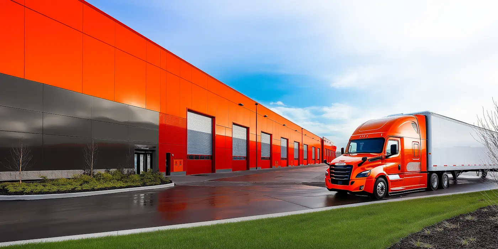

At container terminals in China, [yard management](https://datadocks.com/datadocks-features/yard-management) is a fine art.

Interestingly, that doesn’t always mean they have higher throughput than ports in the West. But they have so much capacity that moving a little slower is a fair price to pay. Their priorities are consistency and scalability. The elimination of jobs is not such a concern.

We’re talking about a level of automation where an algorithm controls cranes and vehicles, sending instructions to each part of the system to keep these massive operations flowing. 

Time will tell if this is a glimpse into the future of logistics, or completely different technology will come along and challenge that model.

For now, the vast majority of facilities have to be more circumspect about what level of automation is suitable for their needs. Warehouse yards that deal with more trailers than containers are probably going to be relying on human jockeys for a while yet, or else [forego drop-and-hook operations entirely in favour of live loads](/posts/automated-yard-operations). So the question is: how can you use technology to enhance human performance?

‍

‍

## **Degrees of Yard Automation**

Starting from the most automated kinds of facilities, we have:

### **1\. Global Trade Hubs (e.g. Shanghai, Singapore, Rotterdam)**

These mega-ports represent the pinnacle of yard automation technology, incorporating multiple integrated systems:

*   **Terminal Operating Systems (TOS)** serve as the central nervous system, coordinating all yard movements through sophisticated algorithms that optimize container placement and retrieval patterns. These systems process thousands of real-time variables to maintain efficient operations 24/7.
*   **Automated Guided Vehicles (AGVs)** function as a choreographed fleet, moving containers between ships and storage areas with precision. Modern AGVs use AI to navigate, avoid obstacles and update their routes based on changing yard conditions.
*   **Advanced crane automation** employs machine learning algorithms to move containers. These systems can compensate for wind conditions, vessel movement, and even slight misalignments in container positioning.
*   **OCR gates** utilize multiple high-speed cameras and deep learning models to identify containers, detect damage, and verify documentation - all with minimal human intervention. The accuracy rate can exceed 98% under optimal conditions.

These ports typically see strong returns on automation due to high labor costs, competitive pressures, and the sheer scale of their operations. In the United States, however, maritime ports have been slower to adopt such technologies, mostly due to the influence of longshoremen’s unions, which are opposed to labor-reducing processes.

### **2\. Major Intermodal Terminals and Rail Yards (e.g. Chicago, EWG Hungary)**

These facilities use sophisticated technology to handle the complexities of transferring cargo between rail and road transport:

*   **Semi-automated Rail-Mounted Gantry (RMG)** cranes work in dedicated blocks, using precise positioning systems to load and unload containers from railcars and trucks. These cranes operate on fixed paths but require human oversight for final positioning and safety verification.
*   **Automated straddle carriers** move containers between the rail operation area and storage blocks. Modern carriers use a combination of GPS and ground-based sensors to navigate, with automation systems handling routine transfers while human operators manage exceptional cases.
*   A **Digital Twin** maintains a real-time 3D model of the entire facility, tracking the position of every container, railcar, and piece of equipment. This allows operators to optimize space utilization and predict potential congestion points before they occur.
*   **Machine vision systems** mounted on gantries perform automated inspections of incoming containers and railcars, detecting structural damage, missing seals, or incorrect placarding. These systems integrate with the terminal operating system to flag units requiring additional inspection.

‍

### **3\. Massive e-commerce Fulfillment Centers (e.g. Amazon, Walmart)**

These facilities operate on a colossal scale compared to other warehouses, and prioritize rapid trailer turnover, driven by massive outbound volumes and tight delivery commitments:

*   **Integration with the WMS** automatically prioritizes trailer movements based on constantly changing order fulfillment needs, ensuring that inbound trailers with key SKUs get immediate attention.
*   **Mobile devices** or in-cab terminals provide yard jockeys with optimized move sequences and real-time updates, often incorporating geofencing to track trailer location and dwell times.
*   **Comprehensive sensor networks** monitor everything from temperature (in food or pharmaceutical segments) to weight (for high-value or bulky items), allowing quick adjustments to meet service-level agreements.

Large scale online retailers have to balance capital expenditures for automation against the need for agile, high-volume operations. Their ROI drivers usually include faster order processing, reduced labor overhead, and minimized shipping delays — all of which are crucial for competing on delivery speed.

‍**‍**

### **4\. Specialized, 3PL and Cross Docking facilities**

While they might not match Amazon-scale volumes, these facilities can be just as advanced in key areas—especially inbound/outbound synchronization and instantaneous re-routing of freight:

*   **Partial gate automation** and **RF/barcode scanning** streamline rapid inbound and outbound flows, essential for high turnover.
*   **Digital move orders** integrate with WMS or TMS, ensuring seamless pallet or parcel transitions from truck to dock, sometimes with minimal or zero storage time.
*   **In-cab or handheld devices** provide live instructions and confirmations, helping supervisors pivot quickly when carriers show up early, late, or without complete documentation.
*   **Sensors for temperature, weight, or door status** can be deployed based on specific commodities—particularly in cold chain or hazardous materials, where compliance and traceability are paramount.

3PLs in particular usually deal with multiple clients, diverse SKUs, and unpredictable shipping schedules. As a result, they rely on **real-time visibility** and flexible workflows to keep throughput high. Despite operating on tighter margins than e-commerce giants, these facilities frequently adopt **very advanced scanning, labeling, and routing solutions** to reduce dwell times, minimize handling errors, and maintain their reputation for speed and precision.

‍

### **5\. Most Manufacturing and Retail Warehouses**

These operations tend to rely on manual or semi-manual processes due to smaller scale or the nature of their product lines. However, incremental automation can still bring substantial benefits.

*   **Basic yard management** often revolves around whiteboards or spreadsheets for tracking trailer assignments, move orders, and timing.
*   **Manual identification of trailers** remains common, but can be gradually improved with handheld barcode or RFID scanners.
*   **Data collection** is often the first step toward better oversight—moving from paper-based forms to centralized digital records can reveal key areas for improvement.

For most warehouses, the biggest ROI typically comes from lowering labor hours, reducing errors, and improving turnaround times at the dock. Many facilities gradually evolve their processes, adding automation when volume, labor constraints, or competitive pressures make it a clear win.

‍

## **The Low-risk Approach to Yard Optimization**

Digital transformation projects only succeed when your people buy-in. If the yard jockeys and coordinators don’t trust or can’t easily use the system, the rest doesn’t matter. 

Trying to jump from fully manual processes to using sensors for everything is going to create more problems than it solves. A hurried transition can leave you with vendor lock-in and staff confusion. It’s common to see operations invest in expensive tech, only to abandon half of the new features within weeks. Incremental adoption keeps you in control.

The first step towards yard automation is simply starting to collect data in a more rigorous and organised way. Getting from whiteboards to spreadsheets, then from spreadsheets to a shared digital system is a natural progression, and you’ll quickly find out who needs extra training or support.

You’ll also start to see patterns, like peak dwell times, frequent yard bottlenecks, or underutilized dock doors. With a single source of truth, yard supervisors and security guards can coordinate more effectively and reduce errors in gate check-ins.

The next step is to start analyzing that data - e.g. tracking how many labor hours are used on trailer moves per month, which can help guide strategy as you become aware of the business impacts of certain processes. For example, you might discover that 20% of jockey moves are unnecessary repositioning. A few workflow tweaks can save you hundreds of hours a month.

Once you’ve got a basic data-driven workflow for yard management, you can start thinking about connecting systems together and making use of sensors. 

At this stage, you know exactly where sensors could help. Because you’ve already established trust in your data, adding more technology isn’t disruptive, but a natural expansion of the improvements you’ve already seen.

‍

## **When To Use Dedicated Yard Management Software**

When is the right time to start using specialized software for yard management? As soon as you have at least one member of the team assigned to clerical or desktop work. If you’re ready for an excel spreadsheet, you’re probably ready for software.

Beyond automating manual record-keeping, a proper yard management system (YMS) can free up staff from tedious data entry, letting them focus on exception handling and real-time problem-solving. Even a small team using a dedicated system often experiences noticeable gains in trailer visibility and communication — benefits you can’t replicate with spreadsheets.

A lot of yard management software is designed more for container terminals, with GPS-based features rather than a timeline or calendar-centric layout. That’s one reason why many warehouses end up overpaying for functionality that doesn’t address daily bottlenecks like dock scheduling, gate congestion, or jockey task coordination. 

If your operation revolves around trailers rather than containers, look for software that prioritizes time-based planning and clear scheduling workflows. For most warehouses and facilities early in their digital transformation journey, the best fit is an integrated dock scheduling and yard management system. This ensures you start collecting data and immediately see value from intuitive visibility — knowing exactly where each trailer is and what it contains. 

Once the system is in place, you can connect it to your WMS or TMS to share data on things like inventory availability or carrier performance. That way, when your operation grows in scale or complexity, you won’t have to abandon your existing setup - you’ll simply build on it.

‍