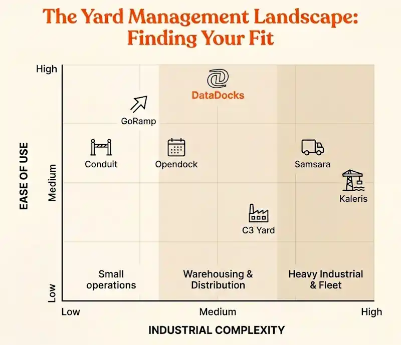
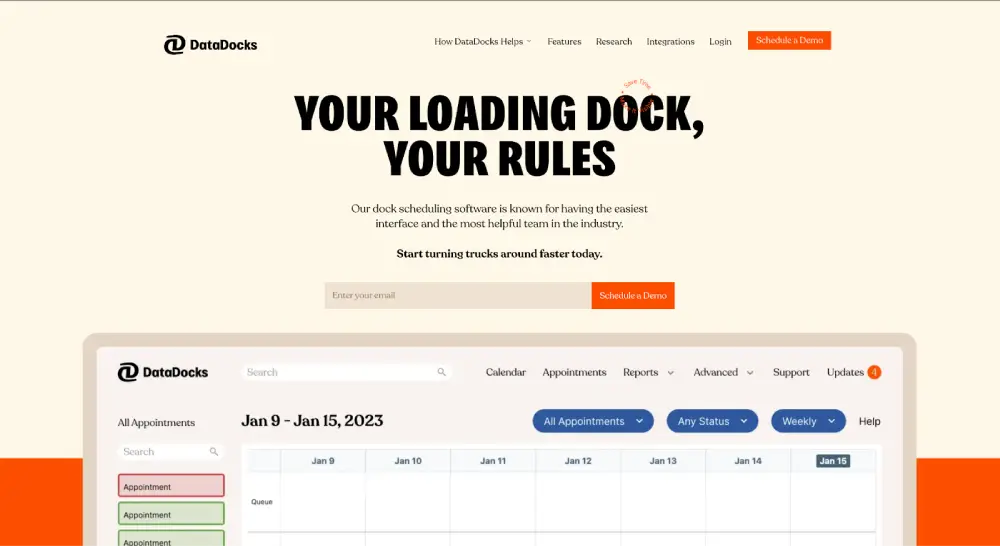
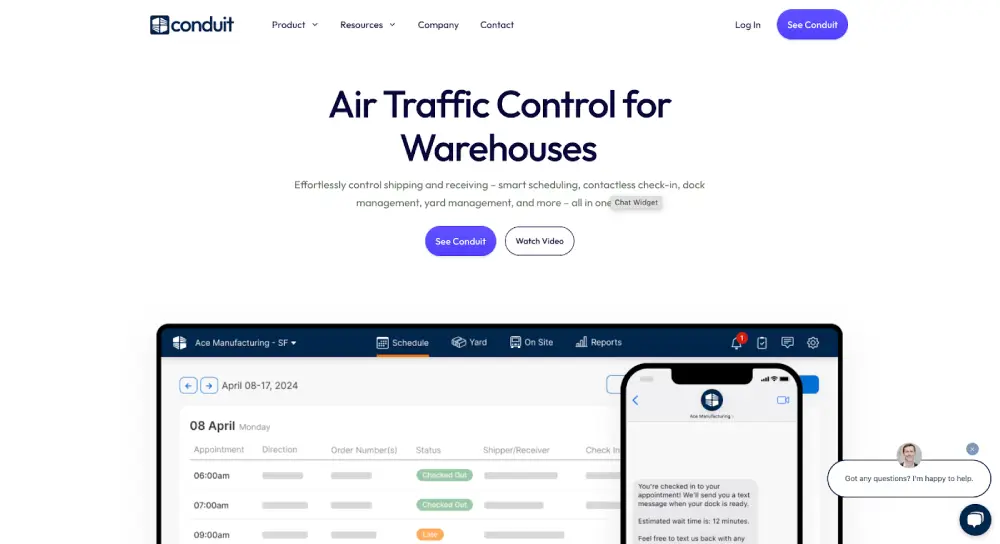
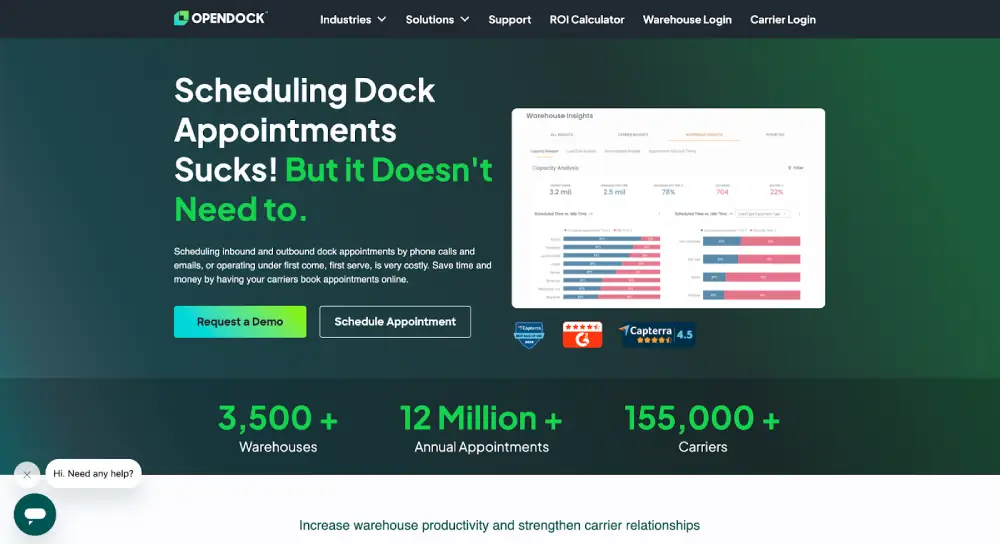
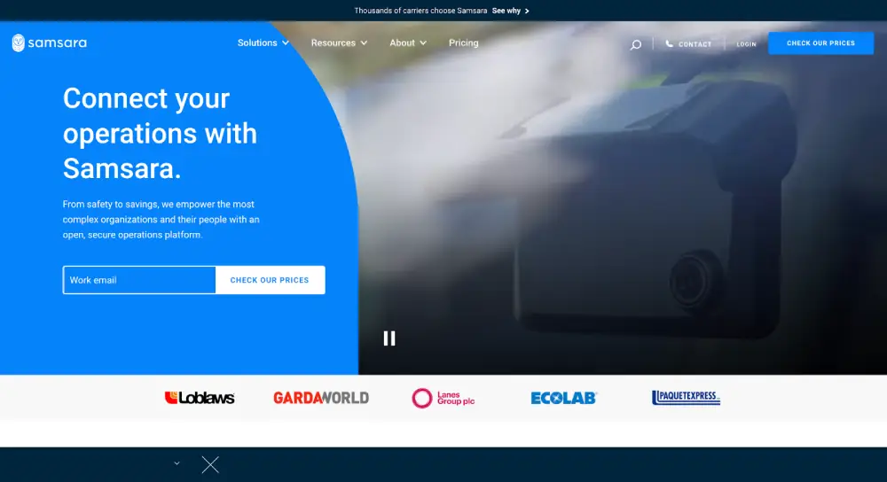
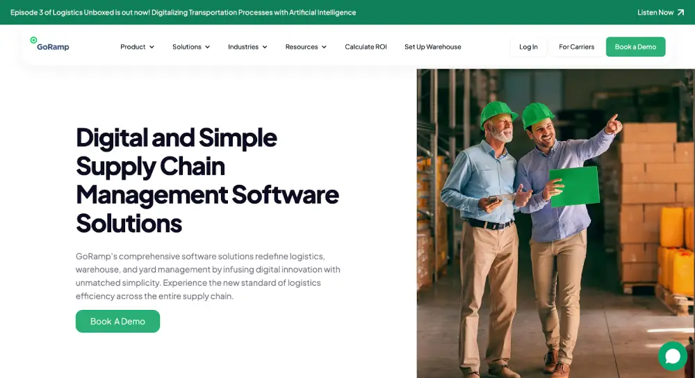
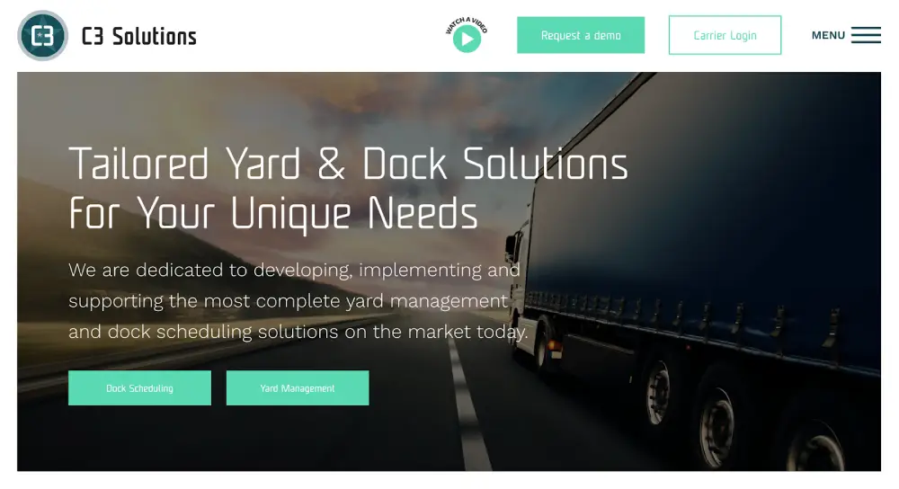
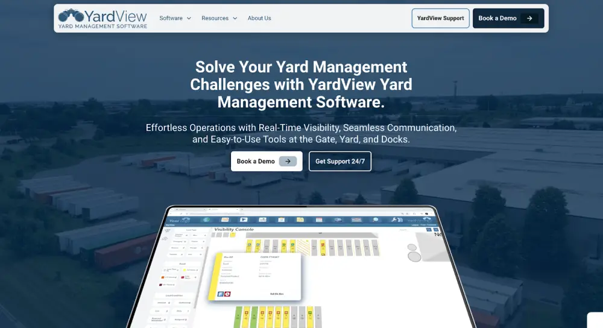
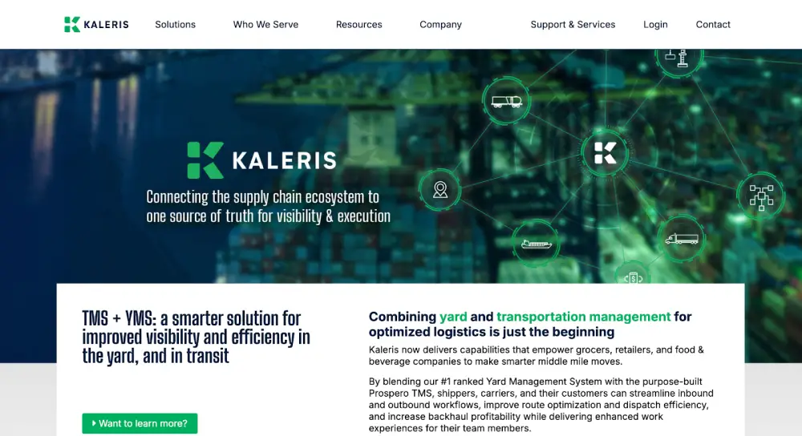

## **Why Choosing the Best Yard Management Software Matters**

Before comparing platforms, consider the stakes. According to the U.S. Department of Transportation Office of Inspector General:

* A 15-minute increase in average dwell time increases expected crash rates by 6.2%
* Detention reduces truckload driver annual earnings by $1.1–$1.3 billion
* Carriers lose $250–$303 million in net income annually due to detention

The right YMS directly addresses these costs. The wrong one just adds another screen to ignore.

Why does one Yard Management System cost $7k a year while another costs $100k? Because they solve completely different problems.

"Yard Management" is a broad umbrella term; the software required for a complex industrial port is radically different from what is needed for a fast-paced distribution center.

We built DataDocks to be the premier choice for modern warehousing and distribution, and we have a strong opinion on how those operations should run. However, if you are managing a rail yard, a port terminal, or a tiny single-site drop lot, DataDocks might not be the right tool for you.

We talk to operations managers every day, and we know that finding the right fit is difficult. We’d rather help you navigate the market now than waste your time on a demo that isn't relevant to your needs. This guide maps out the landscape to help you identify which platform actually fits your specific operation and decide who belongs on your shortlist.

| Vendor | Best For | Deployment Style | Strengths | Limitations |
| :--- | :--- | :--- | :--- | :--- |
| **DataDocks** | High-throughput DCs / 3PLs | Cloud | Real-time yard map, carrier portal, automation | API depth still expanding |
| **Conduit** | Small single-site ops | Cloud | Fast rollout, great driver UX | Limited customization |
| **Opendock** | Shippers w/ national carriers | Cloud | Pre-connected carrier network | Weak yard visibility |
| **Samsara** | Sites w/ private fleets | Cloud + Hardware | Deep telematics | Requires add-on modules |
| **YardView** | Drop trailer operations | Client + Web | Simple, proven | Legacy UX |
| **Kaleris** | Ports / terminals / industrial | Heavy software + RTLS | Extremely deep asset tracking | Complex + $$$$ |
| **FourKites** | Multi-site enterprise visibility | Cloud + AI | Predictive ETAs, AI scheduling | Enterprise pricing, complex setup |
| **project44** | End-to-end supply chain | Cloud | Massive carrier network | Broader than pure YMS |
| **GoRamp** | EU cross-border ops | Cloud | Multi-language, budget-friendly | Limited drop-and-hook tools |
| **C3 Yard** | Industrial / compliance-heavy | Cloud | Granular safety logic | Steep learning curve, premium pricing |

## 10 Best Yard Management Software Options in 2026

### DataDocks

Launched in 2013, **DataDocks** focuses on one goal: make day-to-day yard and dock control effortless for high-throughput facilities. The platform is 100% cloud-native, so supervisors, planners, and carriers see the same live calendar, whether they’re at the guard shack, in the warehouse office, or off-site.
**Strengths:**
*   **Self-serve carrier portal.** Carriers book, reschedule, or cancel slots online, cutting gate phone calls to near-zero.  
    
*   **Real-time yard map.** Drag-and-drop trailer moves update instantly for every logged-in user; colour timers flag aging loads before they clog doors.  
    
*   **Rule-based automation.** Allocate food-grade freight to sealed doors, block high-value loads after 22:00, or auto-approve trusted carriers—no coding needed.  
    
*   **Live, multi-user editing.** Schedulers, supervisors, and customer-service teams can work in the calendar at the same time without overwriting each other.  
    
*   **Straightforward integrations.** Pre-built connectors for leading WMS/TMS suites; flat-file and webhook options cover edge cases.  
    
*   **Partnership-style support.** Named success manager reviews KPIs each quarter and fast-tracks workflow tweaks into the roadmap.
**Limitations:**
*   **API depth is still growing.** Current endpoints cover appointments and status updates; deeper analytics hooks are in active development.
*   **No mobile app yet.** The DataDocks app is now [**live on the Play Store**](https://play.google.com/store/apps/details?id=com.datadocks.datadocks) and [**Apple's App Store**](https://apps.apple.com/us/app/datadocks/id6747725100?platform=iphone)!

**Best suited for:**
High-throughput distribution centres and 3PL yards that handle a broad mix of freight and expect volumes and sites to keep climbing. DataDocks combines an intuitive live dock calendar, carrier self-service booking, and precise time-stamping, giving frontline teams immediate clarity and managers reliable performance data, without the heavyweight complexity of industry-specific systems.

### Conduit

Launched in 2022, **Conduit** is the new kid on the dock: a slick, SOC 2-Type II-certified platform that bundles dock scheduling, driver check-in, and light yard tracking into a single, cloud-only app. 

Think of it as the “iPhone-lite” of yard management: polished and deliberately prescriptive. You adopt Conduit’s workflows and get up and running quickly, without a heavy IT project or long configuration cycle.
**Strengths:**
*   **Driver-friendly check-in.** QR codes and automated text messages shorten gate times and reduce radio traffic.  
    
*   **Responsive product team.** Early-stage culture means feature requests often turn into roadmap items within a release or two.  
    
*   **Straightforward rollout.** A single-site facility can move from contract to production in a matter of days, with minimal internal training.  
**Limitations:**
*   **Static interface.** Screen layouts and field sets are fixed; advanced users can’t tailor views or data capture to local processes.  
    
*   **Documentation lag.** Walk-through videos and help articles sometimes trail new releases, so recently added features can feel “undocumented.”  
    
*   **Shallow yard orchestration.** Conduit tracks trailer location but stops short of task sequencing, multi-site control rooms, or detailed dwell analytics… capabilities that become important once a yard handles dozens of concurrent moves.  
*   **Entry cost (≈ US $7 k per site, per year).** Reasonable for an established facility, but it leaves little room for pilot programs or seasonal pop-ups.  

**Best suited for:**
Specialized freight forwarders, regional 3PLs, and bespoke manufacturers that run one or two yards with moderate throughput and place a premium on a clean driver experience. Operations that need network-wide visibility, granular task management, or highly configurable dashboards will reach Conduit’s ceiling quickly and typically graduate to a platform like **DataDocks**.

| Dimension | **DataDocks** | Conduit | Opendock |
| --- | --- | --- | --- |
| Core Focus | Dock scheduling + yard orchestration for high-throughput facilities | Dock scheduling + driver check-in for single-site yards | Appointment booking portal for carriers and brokers |
| Best Fit | DCs and 3PLs expecting volumes, sites, and complexity to grow | One–two yards with moderate throughput and a premium on driver UX | Facilities with straightforward live-load operations and national carriers |
| Driver / Carrier Experience | Self-serve carrier portal with clear time slots and status | QR-based, mobile-friendly check-in and automated SMS updates | Simple web booking via a widely adopted carrier network |
| Yard Orchestration Depth | Rule-based automation, real-time yard map, multi-site control | Light trailer tracking, limited task sequencing and analytics | New YMS module with minimal trailer visibility and no task queueing |
| Configuration & Flexibility | Configurable rules by load type, lane, shift, and capacity | Static layouts and fixed data fields; limited customization | Rigid workflows; changes and cancellations can be awkward |
| Commercial Profile | Cloud-native, transparent pricing across single and multi-site networks | Entry cost ≈ US $7k per site per year, best for established facilities | Reports of surprise price jumps (30–40%) at renewal for some customers |
| When Operations “Graduate” to DataDocks | Already aligned to growing, multi-site operations | When you outgrow single-site constraints and need deeper orchestration | When you need richer yard workflows and a stronger partnership model |

### Opendock

Founded in 2018 and now part of the Loadsmart family, **Opendock** began as a pure dock-scheduling portal and, only recently, added a light yard-management add-on. Its strength is a pre-connected carrier network: many national fleets and freight brokers already use the platform, so slot adoption can happen quickly with little IT lift.
**Strengths:**
*   **Well-established integrations** with Loadsmart, major carriers, and several freight-forwarder systems. Onboarding can be almost frictionless.  
*   **Intuitive self-service scheduling for carriers:** keeps phone calls to a minimum.  
*   **Quick to deploy:** most sites can publish an appointment calendar in a single afternoon.  
**Limitations:**
*   **New YMS module is still limited:** no task queueing, minimal trailer visibility, and few configuration options compared with mature providers.  
*   **Workflow rigidity:** users cannot change carrier details after creation and struggle to delete or cancel appointments cleanly.  
*   **Reports of unprofessional customer support** and surprise price jumps of 30-40% at renewal.

### **FourKites (Dynamic Yard)**

FourKites expanded from supply-chain visibility into yard management with their Dynamic Yard product. The pitch: pair in-yard visibility with in-transit ETAs so dock teams can reprioritize work, cut dwell, and keep calendars accurate. Add-ons like AutoBooker and Inbound Scheduler AI automate slotting and labour planning.

**Strengths:**
* **Real-time ETAs + yard view.** Reprioritize doors and reduce detention based on actual arrival predictions.
* **AI-powered scheduling.** Claims of up to 60% labour reduction and 5–10% OTD improvement.
* **Gate automation options.** Computer-vision for hands-off check-in/out.

**Limitations:**
* **Enterprise, sales-led pricing.** No public list price; expect a lengthy procurement cycle.
* **Best with integrations.** Full value requires tight TMS/WMS integration—more implementation lift.
* **May be overkill.** Single-site or basic yards won't use half the feature set.

**Best suited for:**
Multi-site shippers and 3PLs with high trailer turns who want predictive ETAs tied to dock calendars, and are comfortable with enterprise implementations and pricing.

### Samsara

Founded in 2015, **Samsara** expanded from fleet telematics into what it calls a “Connected Operations Cloud,” layering a yard-management module on top of dash cams, ELD compliance, and sensor-rich asset tracking. The result is a single pane of glass for organisations whose own tractors and trailers dominate yard traffic.
**Strengths:**
*   **Fleet-first visibility.** Second-by-second GPS and vehicle-sensor data feed precise ETAs, dwell times, and safety events into the yard screen.  
*   **Built-in safety & compliance.** AI dash cams, ELD, DVIR, and IFTA reporting live in the same portal, reducing vendor sprawl.  
*   **Sustainability metrics.** Idling, fuel burn, and emissions dashboards help corporate ESG teams benchmark progress toward electrification.  
**Limitations:**
*   **Rigid commercial terms.** Contracts typically run three years, and down-scaling or cancelling mid-term is difficult.  
*   **Add-on pricing.** Core yard workflows depend on extra-cost modules - trailer tracking, maintenance, computer-vision analytics - pushing up total spend.  
*   **Steep learning curve.** Yard users log into a fleet-oriented interface; non-drivers often need extra training to navigate menus meant for dispatchers.  
*   **Support prioritisation.** Mid-size warehouses report slower response times, especially when issues do not involve the fleet-safety stack.  

**Best suited for:**
Shippers that run large private fleets, with perhaps 5 to 15% of moves handled by outside carriers, and who want yard data to sit alongside vehicle maintenance, safety, and compliance in one enterprise platform. Facilities where carrier variety is higher, or where custom workflows are the priority, tend to choose a partner like **DataDocks** instead.

### **project44**

project44 operates an end-to-end visibility platform managing over 1 billion unique shipments annually for 1,300+ brands. Their yard-management capabilities are part of a broader "supply chain connective tissue" approach—connecting in-transit tracking with yard events.

{/*  */}

**Strengths:**
* **Massive carrier network.** Pre-built connections to thousands of carriers worldwide.
* **Decision Intelligence Platform.** AI-powered insights that go beyond basic tracking.
* **End-to-end visibility.** See shipments from origin through yard to final delivery in one view.

**Limitations:**
* **Broader than pure YMS.** You may be paying for capabilities you don't need if yard management is the primary goal.
* **Enterprise-focused pricing.** Not built for mid-market or single-site operations.
* **Best value when leveraging full suite.** Standalone yard use underutilizes the platform.

**Best suited for:**
Enterprise shippers who need yard management as one component of end-to-end supply chain visibility.

### **Goramp**

Founded in 2017 and headquartered in Vilnius, **GoRamp** focuses on quick-start dock scheduling and light yard visibility for European shippers. Its standout strength is language coverage and built-in compliance flags that make cross-border operations less of a headache.
**Strengths:**
*   **Simple, cloud-only set-up**. Most sites are live in hours, not weeks.  
*   **Wide language catalogue** and EU-specific workflows (customs paperwork, driver ID rules) fit multi-country networks.  
*   **Budget-friendly licensing** keeps costs predictable for single-site operations.  
**Limitations:**
*   **Limited configuration:** no custom status labels, slot rules, or blackout-date planning for site closures.  
*   **Mobile experience is basic,** so guard-staff and yard-crew tasks still rely on desktop screens.  
*   **Drop-and-hook tools are minimal;** the platform is better at managing live-load traffic than trailer pools.  

**Best suited for:**
Small to mid-sized warehouses that move freight across EU borders and need fast deployment, multi-language portals, and straightforward appointment control. High-throughput yards that juggle large trailer pools, or teams that want deeper task automation and richer mobile workflows, tend to gravitate toward vendors such as **DataDocks,** where configurability and real-time orchestration run several layers deeper.

### C3 Yard

Founded in 2000 in Montréal, Canada, C3 Solutions has spent more than two decades building dock-scheduling and yard-management tools for highly specialized industrial sites. That heritage delivers plenty of depth, but the platform’s heavyweight design is often better suited to sprawling, compliance-heavy campuses than to the faster-moving yards most shippers run today.
**Strengths:**
*   **Handles edge-case workflows:** internal shuttles between multiple plants, hazardous-goods zoning, temperature-controlled staging, without custom code.  
*   **Around-the-clock support** that can navigate complex regulatory or security requirements.  
*   **Long track record** with large manufacturers and 3PL campus operations.  
**Limitations:**
*   **Noticeable slowdowns on busy days:** the database architecture shows its age under high appointment volumes.  
*   **Steep learning curve** and heavy reliance on C3 consultants to build reports or tweak automation rules.  
*   **Rigid roles-and-permissions model** and older integration methods limit self-service API work.  
*   **Premium pricing,** yet everyday conveniences like automatic dock assignment, quick UI re-layouts, still require work-arounds.  

**Best suited for:**
Multi-building manufacturing campuses or enterprise 3PLs that genuinely need granular safety logic and can absorb higher cost and complexity. Facilities that prioritise day-to-day speed, modern integrations, and flexible user management typically opt for vendors such as DataDocks, where reliability and ease of use come first.

### YardView

Founded in 1998 in Castle Rock, Colorado, **YardView** is one of the earliest dedicated yard-management providers. Its longevity means plenty of trailer-tracking depth, but the product still carries the DNA of a legacy Windows application, with a web layer added later for basic tasks.
**Strengths**
*   **Customer support team** is consistently praised for rapid, hands-on help.  
*   **Solid trailer-tracking toolkit:** drag-and-drop moves, dwell-time alerts, inventory dashboards, at a mid-market price.  
*   **Quick rollout** for sites moving from clipboards or spreadsheets; most go live in days.  
**Limitations**
*   **Full feature set depends on a Windows client;** the browser version covers only the basics.  
*   **Updates require every user to log out** and rely on stable on-prem connectivity, outages can freeze the app.  
*   **Interface is functional but dated,** and power users find navigation slower than in newer SaaS tools.  

**Best suited for:**
Yards that handle mostly drop-trailers and want an affordable first step away from pen-and-paper workflows: regional distributors, food producers, and similar sites with straightforward dock operations. Teams that need mobile access, seamless cloud updates, or a modern UI typically choose platforms like **DataDocks,** which provide comparable trailer control without the legacy overhead.

### Kaleris

Born from the merger of PINC YMS and several terminal-software brands, **Kaleris** positions itself as a “Digital Yard” platform for asset-intensive supply chains: think ports, chemicals, and heavy manufacturing where RFID tags, GPS beacons, and reefer sensors are already standard kit.
**Strengths:**
*   **Deep RTLS footprint.** Combines RFID, GPS, and IoT sensors for live pin-point tracking of trailers, railcars, and reefers.  
*   **Marine-terminal pedigree.** Native hooks into terminal-operating systems make it a natural fit for yards that sit behind a port gate.  
*   **Broad feature catalog.** Gate automation, shuttle dispatch, reefer fuel monitoring, plus more than 100 canned reports.  
**Limitations:**
*   **Heavy configuration load.** Site maps, sensor networks, and workflow rules all require specialist setup and periodic tuning.  
*   **Slow enhancement cycle.** Non-critical change requests can sit in queue for months, according to long-time users.  
*   **Steep learning curve.** The UI inherits elements from multiple legacy products, so training hours add up fast.  

**Best suited for:**
Operations with complex asset mixes. Ports, energy terminals, large chemical or mining sites, where RTLS accuracy outweighs day-to-day agility. General-cargo warehouses that want quicker deployment and more responsive product evolution often favour **DataDocks,** which delivers core yard visibility without the overhead of a sensor-heavy stack.

## **Choosing the Best Yard Management Software by Facility Type**

| Facility Type | Typical Yard Challenges | Vendors to Shortlist |
| :---- | :---- | :---- |
| High-throughput DC / 3PL network | Multiple carriers, tight dock schedules, dwell-time creep, multi-site visibility needs | DataDocks as primary option; Samsara if private fleet telemetry is the anchor |
| Regional 3PL or bespoke manufacturer (1–2 yards) | Moderate volume, limited IT resources, need quick rollout and clean driver experience | Conduit to get started; DataDocks when orchestration and analytics need to go deeper |
| Shipper with heavy private fleet | Visibility from road to yard, safety and compliance reporting, unified fleet metrics | Samsara for fleet-centric operations; DataDocks for richer dock workflows |
| EU cross-border warehousing | Multi-language portals, customs/admin workflows, budget-sensitive deployments | GoRamp as a first pass; DataDocks when cross-dock complexity and trailer pools grow |
| Regulated industrial campuses | Hazmat zoning, plant-to-plant shuttles, reefer/railcar control, strict compliance | Kaleris or C3 Yard for deep RTLS and safety logic; DataDocks where speed and simplicity matter more |
| Drop-trailer yards leaving pen-and-paper | Basic trailer location tracking, dwell alerts, low-friction adoption for ops teams | YardView as a proven step up; DataDocks when modern cloud UX and mobile access become priorities |
| Enterprise seeking end-to-end visibility | Yard as part of broader supply chain intelligence, predictive analytics needs | FourKites or project44 for full-suite visibility; DataDocks for focused yard control |

## **4 Crucial Things to Look For in Yard-Management Software**

| Buying Pillar | What to Look For | **How DataDocks Aligns** |
| --- | --- | --- |
| **Immediate Operational Impact** | Gate and dock minutes saved in week one; new hires can run basics by end of first shift. | Live dock calendar, colour timers, and an interface designed for supervisors mean frontline teams get value without a thick training manual. |
| **Elastic Capacity & Predictable Economics** | Performance and pricing that hold steady as users, moves, and sites scale up. | Cloud-native back end scales automatically during peak, while transparent price bands keep adding yards or trailers free from surprise “enterprise” uplifts. |
| **Partner-Level Support** | Vendors who monitor dwell and bottlenecks with you, not just answer tickets. | Named success managers run quarterly health checks, review KPIs, and channel frontline feedback into each roadmap cycle. |
| **Seamless Connectivity** | Clean data flow into WMS, TMS, ERP, and BI tools, plus sensible fall-backs. | Pre-built connectors and an open API push real-time dock events into inventory, labour, and carrier-performance systems, with CSV/email options when needed. |

### **1\. Immediate Operational Impact**

A yard system should start saving gate minutes and dock labour the very week it is switched on.

*   **60-second supervised check-in.** Guard staff or receiving clerks should be able to scan a BOL, print a pass, and direct the driver without the truck ever idling twice.  
    
*   **Role-based control panel.** Yard marshals see moves, dock planners see door status, finance sees dwell cost. No one needs a manual to find “their” screen.  
    
*   **Visual urgency cues.** Timers that turn amber at 45 minutes and red at 60 keep bottlenecks obvious without printing reports.  
    
*   **Library of ready-made workflows.** Need “cross-dock the mixed-pallet loads, live-load export freight, and quarantine damage claims”? Choose a template and tweak, don’t build from scratch.

If new hires can’t operate the basics by the end of their first shift, the tool is too complicated.

### **2\. Elastic Capacity & Predictable Economics**

Volumes jump before peak season; the software must absorb the shock without a rewrite… or a surprise invoice.

*   **Cloud horsepower that stretches.** Screen refresh times should stay sub-two seconds when appointments double, not crawl to a halt.  
    
*   **Real-world concurrency.** Ask for proof the system still hums with 25–30 simultaneous users or 1 000 planned moves in a single day - the upper limit for most high-volume DCs.  
    
*   **Bulk actions.** Upload tomorrow’s 300 pallets or reschedule 40 appointments in one go, instead of click-by-click.  
    
*   **Transparent price bands.** Make sure adding a second yard or an extra hundred trailers doesn’t trigger a hidden “enterprise” uplift.

### **3\. Partner-Level Support & Continuous Guidance**

A yard never sleeps; neither should your vendor relationship.

*   **24 x 7 live help that actually answers.** Ask current customers how long a critical issue really takes to reach resolution.  
    
*   **Quarterly health checks.** The best suppliers review your dwell KPIs, spot creeping delays, and recommend tweaks before peak season.  
    
*   **Road-map access.** Operators’ suggestions should feed into upcoming releases. Otherwise technical debt piles up.  
    
*   **Proven references.** Speak with two facilities of similar scale; if both highlight prompt, practical support, you’re in safe hands.  
    

### **4\. Seamless Connectivity to the Rest of the Operation**

A yard application earns its keep when its data flows cleanly into every other system that plans, pays, or reports on freight.

*   **Out-of-the-box links to WMS, TMS, and ERP.** A door assignment in the yard should update inventory, labour, and ASN status automatically.
*   **Hardware readiness.** The platform ought to accept scans from handhelds, pings from telematics, or reads from RFID gates with minimal middleware.  
    
*   **Low-tech fall-backs.** Clean CSV imports/exports and email notices are still vital when a partner’s system is down or a site is bandwidth-constrained.

Choose a YMS that masters these four fundamentals and it will keep delivering value, whether you’re turning 40 trailers a day at one cross-dock now or orchestrating a multi-site network in two years’ time.

## Finding the Right Yard Management System For Your Needs Is Critical

The yard is the last “black box” in many supply chains; minutes lost at the gate ripple through labour plans, carrier scorecards, and inventory turns. Selecting the right YMS is therefore not just a software decision. It is a capacity, cost, and customer-service decision rolled into one.

In practice, the winners share four traits:

1.  **Immediate operational impact** – measurable gate-to-dock time savings within the first week.  
    
2.  **Elastic capacity and predictable economics** – no slow-downs (or surprise price hikes) when volumes spike.  
    
3.  **Partner-level support and continuous guidance** – real people who spot creeping dwell times before you do.  
    
4.  **Seamless connectivity** – yard events flow straight into your WMS, TMS, ERP, and BI stack with minimal effort.  
      
    

### **Where DataDocks Fits In**

DataDocks was built around those four pillars from day one. Our interface is designed for supervisors, not software engineers. So new hires move trailers confidently by the end of their first shift. A cloud-native back end scales automatically during peak season, and our pricing stays transparent whether you operate one yard or a regional network.

Most important, customers don’t just “open a ticket”; they work with a named success manager who reviews KPIs, suggests workflow tweaks, and feeds frontline feedback into every quarterly release. And because our open API and pre-built connectors push real-time events into the rest of your stack, yard data finally pulls its weight in inventory, labour, and carrier-performance decisions.

### **See the Difference First-Hand**

If you’re ready to turn your yard from a cost centre into a competitive advantage, let us show you what that looks like in a 30-minute walkthrough. No hype, no pressure. [Book a demo with the DataDocks team](https://calendly.com/nick-rakovsky/datadocks-demo?month=2023-05) and judge for yourself whether the four fundamentals are truly covered.

## Frequently Asked Questions

**What is yard management software?**  
Yard management software (YMS) tracks trailer locations, schedules dock assignments, automates check-in/check-out, and provides real-time visibility of yard and dock operations. Its purpose is to reduce detention fees, labor delays, and confusion over trailer status while improving flow from gate to dock.

**How is YMS different from WMS or TMS?**  
A WMS manages inventory inside the warehouse. A TMS manages freight planning and carrier sourcing. A YMS bridges the gap between them by managing what happens between the gate and the dock. It ensures equipment, drivers, and loads are in the right place at the right time.

**Who benefits most from YMS?**  
Any facility with frequent trailer moves, yard congestion, multiple carriers, or difficulty tracking inventory staging benefits from a yard management system. Distribution centers, 3PLs, and manufacturing facilities see the greatest performance improvements.

**What should I look for in the best yard management software?**  
Key features include real-time trailer visibility, automated driver check-in, rule-based dock assignment, load timers, user-friendly dashboards, and reliable integrations with your WMS/TMS. Strong vendor support and transparent pricing are also essential for long-term success.

**How does YMS reduce detention fees?**  
By reducing wait times at the gate and ensuring fast trailer assignment to doors, YMS shortens idle time. Clear visibility and prioritization logic prevent bottlenecks and keep drivers moving, minimizing detention penalties.

**Is cloud-based YMS better than on-premise?**  
Most modern facilities prefer cloud YMS because it updates automatically, scales easily, and allows supervisors, carriers, and dispatchers to work from any device. On-premise systems often require more maintenance and slower rollout of updates.

**How much does yard management software cost?**  
Pricing varies dramatically based on complexity and scale. Budget-friendly options start around $250/month for basic dock scheduling. Mid-market solutions typically run $5,000–$10,000 per site annually. Enterprise platforms with RTLS, AI scheduling, and deep integrations can exceed $100,000/year for multi-site deployments.

**How long does YMS implementation take?**  
Cloud-native platforms can have a single site live in days to weeks, depending on integration complexity. The best vendors provide clear implementation timelines upfront and assign dedicated support to keep projects on track.

**What ROI can I expect from yard management software?**  
Most operations see measurable improvements in gate-to-dock time within the first week. Over time, facilities typically report reduced detention fees, lower labour costs from eliminated phone/radio coordination, improved carrier relationships, and better dock utilization.

