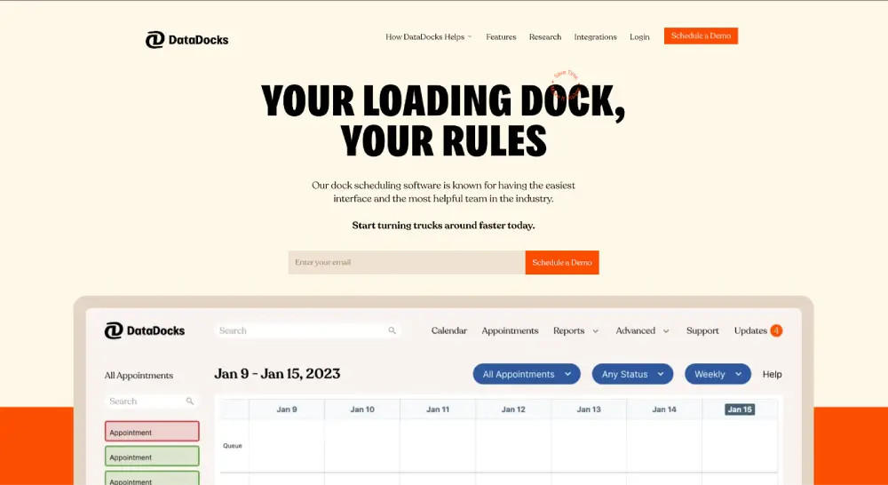
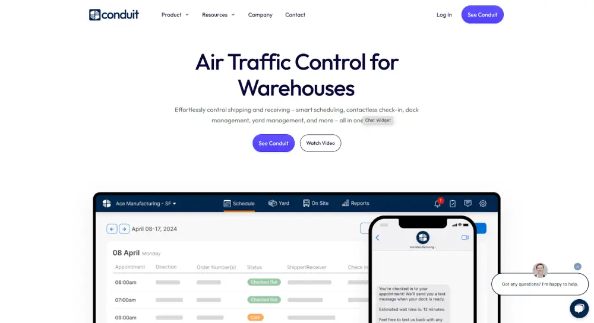
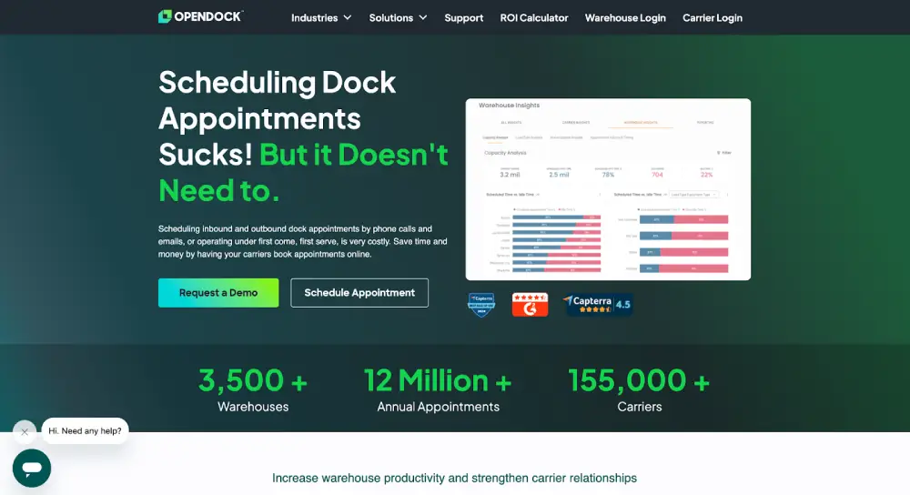
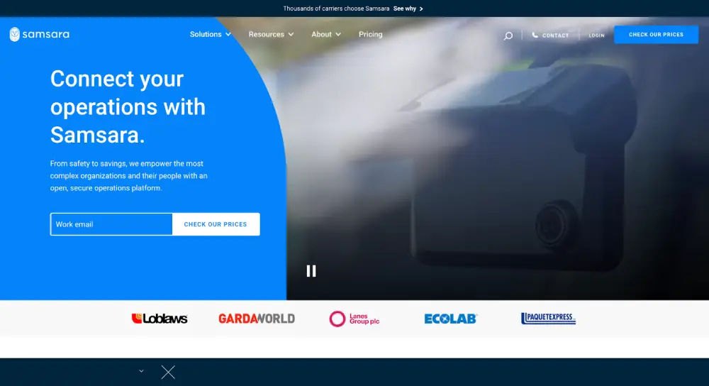
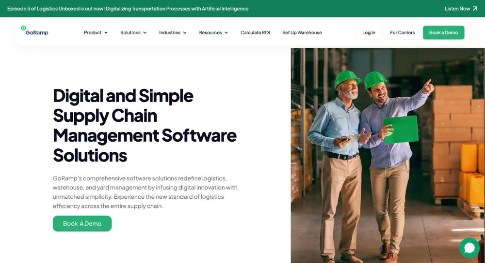
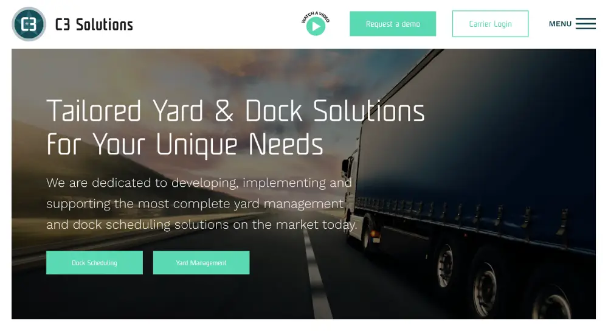
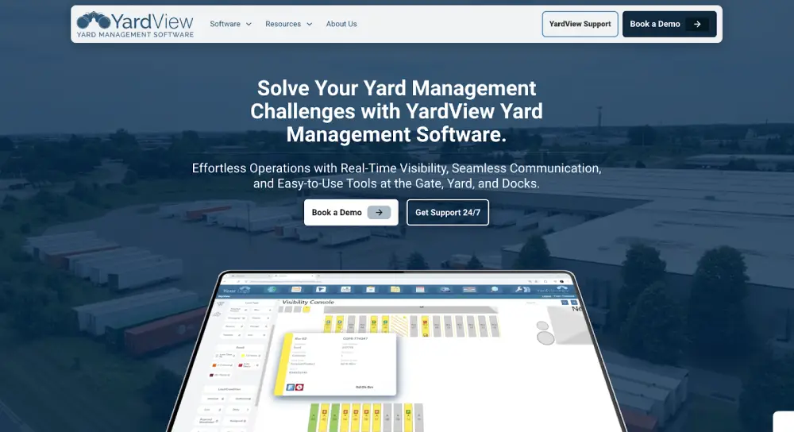
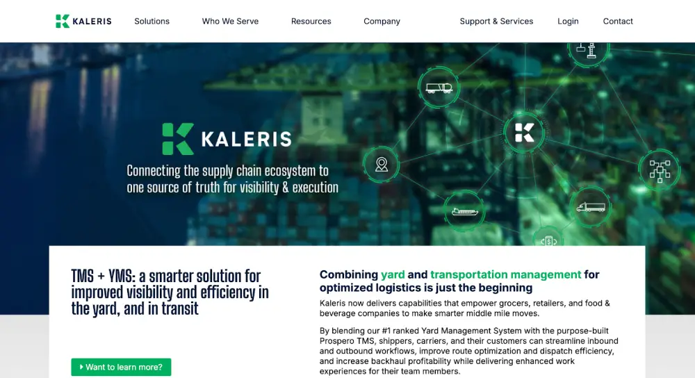

  <strong>Note:</strong> The remainder of this article assumes that your yard deals with freight and logistics operations.

## How Do You Choose the Right Yard Management System?

In a high-velocity warehouse or distribution center, the yard is where operational momentum is either preserved or lost. When trailers sit misplaced in the drop lot, dock doors remain empty while spotters hunt for loads, and receiving teams bottleneck because four unscheduled trucks arrive simultaneously, labor costs spike and dock schedules fall apart.

A Yard Management System (YMS) is designed to give logistics teams control over what happens between the security gate and the dock door. However, "Yard Management" covers a wide spectrum of software:
* Heavy industrial platforms built for maritime ports, container terminals, and rail yards requiring RTLS sensor networks and RFID hardware.
* ERP/WMS suite modules engineered to bridge warehouse automation and global transportation management inside Fortune 500 networks.
* Specialized dock management and yard execution engines built to eliminate dock congestion, automate carrier scheduling, and streamline trailer moves in fast-paced distribution centers and 3PLs.

Finding the right system means matching your facility's operational profile to the platform's core architecture. The table below compares the leading yard management software options for 2026 across primary use cases, operational strengths, and trade-offs.

| Platform | Primary Use Case | Key Strengths | Operational Trade-offs |
| :--- | :--- | :--- | :--- |
| **DataDocks** | High-throughput DCs, warehouses & 3PLs | Advanced dock scheduling, live multi-user calendar, carrier self-service portal, rule-based automation | Focused on warehouse & DC dock flow rather than port/rail RTLS |
| **Conduit** | Single-site facilities wanting quick setup | Clean driver check-in UX, fast rollout, lightweight scheduling | Static layouts, shallow yard task orchestration |
| **Opendock** | Facilities prioritizing broker/carrier network adoption | Pre-connected freight broker network, simple web booking | Rigid workflows, minimal trailer visibility, limited configuration |
| **Yard Management Solutions LLC** | Cold chain, manufacturing plants & regional DCs | Visual yard map ("Eagle View"), OCR gate automation, reefer temperature monitoring | Sales-led pricing, full automation requires dedicated hardware |
| **Peripass** | European manufacturing & industrial logistics | Gate access control, self-service kiosks, 30+ languages, ANPR automation | Requires physical kiosk hardware, long rollout cycles |
| **Blue Yonder YMS** | Large retail & enterprise supply chain networks | Native tie-in to Luminate WMS/TMS, AI scheduling, automated spotter dispatch | 6–18 month rollout, high total cost of ownership, steep learning curve |
| **Manhattan Associates YMS** | Large distribution campuses using Manhattan WMS | Unified Active Platform, dynamic trailer interleaving, putaway optimization | Requires Manhattan software suite, long deployment, heavy overhead |
| **Mecalux Easy WMS Yard** | Warehouses with Mecalux automated racking & AS/RS | Dock door assignment integrated directly with Easy WMS intralogistics | Locked to Mecalux WMS ecosystem, lacks standalone carrier portal |
| **FourKites (Dynamic Yard)** | Multi-site networks prioritizing in-transit tracking | Predictive in-transit ETAs paired with yard status, AI slotting | Complex implementation, requires comprehensive telematics/TMS data |
| **project44** | Global end-to-end supply chain visibility networks | Massive global carrier connectivity, multi-modal tracking | Broad visibility scope rather than specialized dock execution |
| **Samsara** | Fleets running predominantly dedicated private assets | Deep telematics, dash cams, ELD and GPS asset tracking in one portal | Fleet-centric UI, expensive add-on modules, rigid multi-year contracts |
| **GoRamp** | European cross-border freight operations | Multi-language driver portal, quick cloud setup, customs workflows | Minimal drop-and-hook tools, desktop-heavy workflows |
| **C3 Yard** | Multi-building manufacturing campuses with complex compliance | Granular safety rules, hazmat zoning, plant-to-plant shuttles | Steep learning curve, legacy architecture, premium pricing |
| **YardView** | Regional drop-trailer yards moving off spreadsheets | Proven trailer tracking, dwell alerts, responsive support | Legacy Windows client dependency, dated interface |
| **Kaleris** | Maritime ports, rail yards, and bulk industrial terminals | Pinpoint RTLS asset tracking (RFID/GPS/IoT), terminal operating system hooks | Heavy sensor infrastructure, complex configuration, steep learning curve |

<RelatedFeatureCallout id="yard-management" />

## 15 Top Yard Management Software Platforms Compared for 2026

### DataDocks

Launched in 2013, **DataDocks** is engineered specifically for fast-paced warehousing, distribution centers, and 3PL operations. It provides an advanced dock scheduling engine paired with live visual yard coordination, eliminating the daily friction of manual appointment booking, gate check-in delays, and dock congestion.

**Strengths:**
* **Self-serve carrier portal:** Carriers book, reschedule, and manage their own appointment slots according to strict facility rules, eliminating daily phone calls and email chains.
* **Live multi-user dock calendar:** Schedulers, warehouse supervisors, and receiving clerks collaborate simultaneously on a unified live schedule without overwriting data.
* **Real-time yard map & visual timers:** Drag-and-drop trailer moves update across the entire team instantly, with automated color-coded timers alerting dispatchers to aging trailers before detention accrues.
* **Rule-based scheduling automation:** Automatically enforce facility constraints—such as pallet limits, freight types, door assignments, and labor capacity—without manual intervention.
* **Turnkey integrations:** Pre-built connectors for leading WMS/TMS platforms, supported by open webhooks and REST APIs.
* **Mobile operational access:** Native mobile access across iOS and Android allows yard jockeys and floor supervisors to manage appointments and moves anywhere on the facility grounds.

**Limitations:**
* **Focused on warehousing and freight:** Purpose-built for warehouse docks, cross-docks, and distribution centers; not designed for maritime container terminals or heavy rail hump yards.

**Best suited for:**
High-throughput distribution centers, warehouses, and 3PL facilities that need the most advanced dock scheduling and appointment management engine on the market, combined with real-time yard visibility and zero-friction carrier collaboration.

---

### Conduit

Launched in 2022, **Conduit** offers a clean, cloud-native application focused on contactless driver check-in and basic dock scheduling for smaller facilities.

**Strengths:**
* **Driver-friendly check-in:** QR codes and automated SMS notifications streamline gate arrival and driver instructions.
* **Quick rollout:** Straightforward cloud architecture allows single-site facilities to deploy rapidly with minimal staff onboarding.
* **Modern UI:** Clean, intuitive interface for basic appointment viewing.

**Limitations:**
* **Static interface layouts:** Fixed screen layouts and rigid data fields limit customization for complex facility workflows.
* **Shallow yard orchestration:** Tracks trailer positions but lacks dynamic task sequencing, multi-dock rule engines, and advanced dwell analytics.
* **Entry cost:** Annual base pricing (~$7,000/site/year) offers limited flexibility for smaller operations.

**Best suited for:**
Single-site warehouses and regional facilities with straightforward freight flows seeking a clean driver check-in experience.

  
When is DataDocks the better choice?

  

    DataDocks is the better choice when your facility requires advanced dock scheduling automation, customizable operational constraints (such as labor capacity, commodity rules, and door specialization), real-time multi-user editing across large warehouse teams, and active trailer move tracking across multiple dock banks.
  

---

### Opendock

Founded in 2018 and part of Loadsmart, **Opendock** operates primarily as an appointment booking directory connected to a large network of freight brokers and national trucking fleets.

**Strengths:**
* **Carrier network adoption:** Pre-established adoption among freight brokers and commercial carriers makes calendar sharing quick.
* **Fast initial setup:** Warehouses can publish appointment slots online with minimal configuration.

**Limitations:**
* **Shallow yard management:** Add-on yard module provides limited trailer tracking, no automated task queues, and minimal yard visibility.
* **Rigid appointment workflows:** Modifying appointments, updating carrier details, or handling unexpected arrival exceptions can be cumbersome.
* **Customer support & renewal terms:** Users report inflexible commercial renewals and slow customer support turnaround.

**Best suited for:**
Facilities handling standard live unloads where connecting to a pre-existing broker portal is the primary objective.

  
When is DataDocks the better choice?

  

    DataDocks is the superior choice when your warehouse needs a dedicated operational dock management system rather than a generic booking directory. DataDocks provides deep scheduling rule automation, live multi-user collaboration, real-time yard status tracking, and reliable customer support without surprise contract escalations.
  

---

### Yard Management Solutions LLC

Founded in 2012 by logistics operators, **Yard Management Solutions LLC** provides a dedicated, cloud-based yard management system designed to track asset positions, manage spotter moves, and monitor facility gates.

**Strengths:**
* **Visual yard map ("Eagle View"):** Real-time 2D graphical overhead map showing spot-level trailer locations, carrier ownership, and load status.
* **Reefer & cold chain tracking:** "YMS Temp Guard" module monitors setpoints, internal temperatures, and fuel levels for temperature-controlled freight.
* **Automated gate identification:** Integrates with Optical Character Recognition (OCR) and ALPR cameras for automated trailer and container check-in.
* **Spotter dispatch:** Mobile in-cab tablet application for yard jockeys with task prioritization.

**Limitations:**
* **Hardware dependency for automation:** Unlocking full gate automation requires investment in physical OCR cameras, gate arms, and ruggedized vehicle tablets.
* **Custom reporting constraints:** Standard dashboards are effective, but custom reporting and workflow modifications often require vendor assistance.
* **Sales-led procurement:** Pricing and onboarding are strictly custom-quoted with no public tier structure.

**Best suited for:**
Manufacturing plants, cold storage facilities, and high-volume distribution centers with active yard jockey fleets and dedicated drop yards.

  
When is DataDocks the better choice?

  

    DataDocks is the better choice when your core operational priority is loading dock appointment scheduling, carrier collaboration, and warehouse throughput. DataDocks delivers an advanced dock scheduling engine with instant multi-user synchronization and carrier self-service without requiring on-site camera hardware or heavy physical infrastructure.
  

---

### Peripass

Founded in 2016 in Ghent, Belgium, **Peripass** specializes in automated gate access control and yard logistics for industrial manufacturing and multi-lingual European logistics hubs.

**Strengths:**
* **Automated gate check-in:** Integrates self-service kiosks, barrier arms, weighbridges, and Automatic Number Plate Recognition (ANPR) cameras.
* **Multilingual driver self-service:** Kiosks and mobile check-in support 30+ languages, providing automated SMS dispatch instructions directly to drivers.
* **Digital dispatching:** Call-off system routes trucks from parking holding zones to specific loading docks based on real-time readiness.

**Limitations:**
* **Heavy physical footprint:** Deployment typically involves physical outdoor kiosks, traffic lights, and gate hardware, lengthening rollout cycles.
* **Enterprise implementation overhead:** Requires structured professional services, custom WMS/ERP integration, and on-site hardware commissioning.
* **Western European concentration:** Support infrastructure and primary customer base are concentrated in Europe.

**Best suited for:**
Large industrial manufacturing plants, chemical sites, and European distribution hubs requiring strict perimeter access control, multi-language driver self-check-in, and weighbridge integration.

  
When is DataDocks the better choice?

  

    DataDocks is the better choice when your operation needs an agile, software-driven dock scheduling and yard management system that can be deployed across warehouses and DCs in days. DataDocks avoids expensive kiosk hardware and physical civil works while delivering superior dock slotting rules, live multi-user collaboration, and effortless carrier self-service.
  

---

### Blue Yonder YMS

As part of the Blue Yonder Luminate Platform, **Blue Yonder YMS** connects transportation management (TMS) and warehouse management (WMS) across enterprise supply chain networks.

**Strengths:**
* **Unified enterprise platform:** Native data synchronization between Blue Yonder WMS (formerly RedPrairie) and Blue Yonder TMS.
* **Edge device integration:** Works with Panasonic computer vision sensors and OCR cameras for automated asset identification at gates.
* **Spotter task interleaving:** Algorithmic task generation directs yard jockeys to combine inbound moves with empty repositioning to reduce deadhead bobtailing.

**Limitations:**
* **Implementation complexity & duration:** Typical deployments take 6 to 18 months, requiring systems integrators and substantial professional services.
* **High total cost of ownership:** Six-figure annual licensing plus implementation fees make it cost-prohibitive outside Fortune 500 networks.
* **Legacy user interface:** Core operational screens retain legacy RedPrairie/JDA complexity, resulting in a steep learning curve for frontline operators.

**Best suited for:**
Fortune 500 retailers, large CPG manufacturers, and global enterprise 3PLs already heavily invested in the Blue Yonder Luminate software ecosystem.

  
When is DataDocks the better choice?

  

    DataDocks is the better choice when your distribution centers need a modern, high-speed dock scheduling and yard tracking platform that frontline supervisors and carriers can master in minutes. DataDocks eliminates dock congestion and automates carrier booking without the six-figure consulting fees, complex legacy architectures, or multi-month IT rollouts of an enterprise ERP suite.
  

---

### Manhattan Associates YMS

Built on the cloud-native Manhattan Active Supply Chain architecture, **Manhattan Active Yard Management** synchronizes yard movements directly with warehouse execution and transportation planning.

**Strengths:**
* **Unified Active data model:** Shares real-time data with Manhattan Active Warehouse Management (WM) and Transportation Management (TM) with automated quarterly updates.
* **Dynamic trailer interleaving:** Prioritizes dock door assignments and live carrier unloads based on real-time in-transit ETAs and warehouse putaway travel minimization.
* **Automated spotter dispatch:** Algorithmic task queues send prioritized move instructions to mobile RF terminals mounted in yard spotters.

**Limitations:**
* **Ecosystem dependency:** Designed to deliver value primarily when deployed alongside Manhattan Active WM/TM; standalone use is rare and forfeits native intelligence.
* **Heavy consulting footprint:** Requires extensive configuration, workflow re-engineering, and dedicated systems implementation partners.
* **Enterprise pricing:** Multi-year enterprise commitments with substantial upfront deployment and integration costs.

**Best suited for:**
Tier-1 enterprise retailers, high-volume consumer brands, and large logistics campuses running Manhattan Active WM across their network.

  
When is DataDocks the better choice?

  

    DataDocks is the better choice when you want the industry's most effective dock scheduling and appointment management engine without being locked into a monolithic enterprise WMS suite. DataDocks integrates cleanly with any existing WMS or TMS via modern APIs, giving warehouse teams instant dock velocity without a multi-year software overhaul.
  

---

### Mecalux Easy WMS Yard

Developed by industrial racking and intralogistics automation manufacturer Mecalux, **Easy WMS Yard Management** is an add-on module for facilities running Mecalux warehouse systems.

**Strengths:**
* **Direct WMS/AS/RS synchronization:** Dock bay assignments connect directly to Easy WMS warehouse queues, Automated Storage and Retrieval Systems (AS/RS), and conveyor networks.
* **Auxiliary appointment tracking:** Native tracking for non-freight yard traffic such as maintenance contractors, waste management, and facility audits.
* **Unified single-vendor contract:** Single point of accountability for physical storage racking, automated material handling, and warehouse software.

**Limitations:**
* **Not available standalone:** The YMS module cannot be deployed independently alongside third-party WMS platforms like SAP, Manhattan, or Blue Yonder.
* **Dock-centric scope:** Lacks deep yard management features such as spotter GPS tracking, reefer temperature monitoring, and dynamic trailer shuffling.
* **Limited carrier collaboration:** Carrier scheduling relies primarily on ERP data feeds or manual coordination rather than a dedicated carrier self-service portal.

**Best suited for:**
Warehouses and manufacturing plants implementing Mecalux automated storage systems and Easy WMS that need basic dock bay status tracking within their existing stack.

  
When is DataDocks the better choice?

  

    DataDocks is the better choice when your facility needs an advanced carrier self-service booking portal, flexible appointment rule automation, and real-time multi-user dock coordination across standard warehouse operations.
  

---

### FourKites (Dynamic Yard)

FourKites expanded from supply chain visibility into yard management with **Dynamic Yard**, combining real-time in-transit freight tracking with on-site trailer and dock operations.

**Strengths:**
* **Predictive in-transit ETAs:** Uses real-time telematics and machine learning to adjust dock schedules before delayed carriers arrive.
* **Automated slotting:** AI-driven appointment slotting tools help warehouse teams balance dock labor against expected arrival patterns.
* **Gate automation options:** Integrates with computer-vision cameras for automated gate check-in and check-out.

**Limitations:**
* **Enterprise pricing structure:** Custom, sales-led pricing model with significant annual licensing commitments.
* **Requires deep telematics integration:** Full value depends on widespread carrier participation and live ELD/TMS data feeds.
* **Broad scope:** Facilities seeking focused dock and yard execution may find the broader visibility suite unnecessarily complex.

**Best suited for:**
Enterprise shippers and large 3PL networks with high freight volumes who prioritize real-time in-transit visibility connected to dock calendars.

  
When is DataDocks the better choice?

  

    DataDocks is the better choice when your primary operational need is execution on the warehouse floor—scheduling appointments, managing dock door flow, and eliminating gate congestion—with a fast, reliable platform that frontline supervisors and carriers love using daily.
  

---

### project44

**project44** operates a global supply chain visibility platform tracking over 1 billion shipments annually. Its yard capabilities connect in-transit freight tracking with facility arrival events.

**Strengths:**
* **Global carrier network:** Pre-built data connections across thousands of ocean, rail, and road carriers worldwide.
* **End-to-end visibility:** Unifies multi-modal freight tracking from origin to destination inside a single control tower interface.
* **Decision Intelligence AI:** Advanced analytics identify network bottlenecks and supply chain transit exceptions.

**Limitations:**
* **Control tower focus:** Engineered as a high-level tracking and visibility platform rather than a granular dock execution tool for warehouse floor staff.
* **Enterprise procurement:** Multi-tier enterprise pricing models tailored for large corporate supply chains.
* **Requires suite adoption:** Using the platform solely for yard and dock management underutilizes the technology.

**Best suited for:**
Global enterprise supply chain teams requiring macro-level freight visibility across multiple transportation modes and international trade lanes.

  
When is DataDocks the better choice?

  

    DataDocks is the better choice when you need a dedicated, practical dock scheduling and yard management application that warehouse managers, receiving clerks, and carriers actively use to run daily dock operations, rather than a macro tracking dashboard.
  

---

### Samsara

Founded in 2015, **Samsara** expanded from fleet telematics into a Connected Operations Cloud, offering trailer tracking and yard visibility on top of vehicle telematics, AI dash cams, and ELD compliance.

**Strengths:**
* **Fleet-first visibility:** Continuous GPS and sensor data provide precise tractor and trailer tracking across road and yard.
* **Unified safety & compliance:** Integrates dash cams, driver logs, DVIR, and asset maintenance in one central dashboard.
* **Asset utilization tracking:** Monitors trailer dwell, dormant equipment, and battery/temperature sensor data across fleet yards.

**Limitations:**
* **Fleet-centric interface:** The platform is built around fleet dispatch and safety management; warehouse dock scheduling workflows are secondary.
* **Modular add-on costs:** Core yard tracking and sensor features require additional hardware tags and subscription modules.
* **Rigid commercial terms:** Multi-year contracts with limited flexibility to adjust site counts mid-term.

**Best suited for:**
Private fleet operators and dedicated carriers whose own equipment accounts for the vast majority of yard activity.

  
When is DataDocks the better choice?

  

    DataDocks is the better choice when your facility handles third-party carriers, common freight, and diverse logistics partners. DataDocks provides dedicated carrier appointment booking, dock door allocation rules, and live collaborative scheduling built specifically for warehouse operations rather than fleet dispatch.
  

---

### GoRamp

Founded in 2017 in Vilnius, Lithuania, **GoRamp** provides lightweight cloud dock scheduling and time-slot management for European freight operations.

**Strengths:**
* **Quick cloud setup:** Simple architecture allows single-site warehouses to deploy appointment calendars within days.
* **Multi-language carrier interface:** Supports multiple European languages with built-in customs and driver documentation fields.
* **Predictable subscription tiers:** Accessible pricing for smaller, single-building operations.

**Limitations:**
* **Limited workflow customization:** Fixed slotting rules and limited custom fields restrict advanced dock allocation logic.
* **Basic mobile capabilities:** Minimal native mobile support for gatekeepers and spotters on the warehouse floor.
* **Lightweight trailer tracking:** Better suited for live unloads than for facilities managing active trailer pools or drop lots.

**Best suited for:**
Small to mid-sized European warehouses with straightforward live-loading operations and cross-border carrier compliance requirements.

  
When is DataDocks the better choice?

  

    DataDocks is the better choice when your warehouse requires advanced dock automation rules (such as custom freight constraints, door allocations, and load timers), deep multi-user calendar editing, and active trailer pool tracking across high-volume distribution facilities.
  

---

### C3 Yard

Founded in 2000 in Montréal, Canada, **C3 Solutions** provides dedicated dock scheduling and yard management software designed for large-scale industrial and multi-building campus operations.

**Strengths:**
* **Complex industrial workflows:** Robust handling of multi-plant shuttle movements, hazardous material zoning, and temperature-controlled staging.
* **Granular business logic:** Highly configurable safety rules and compliance tracking tailored for complex manufacturing environments.
* **Established track record:** Decades of operational experience across large industrial campuses and chemical sites.

**Limitations:**
* **Performance under load:** High appointment volumes and complex multi-user queries can lead to noticeable interface latency.
* **Steep learning curve:** Configuration and reporting often require vendor consulting assistance.
* **Premium cost structure:** Higher software and maintenance fees compared to modern cloud-native dock management platforms.

**Best suited for:**
Multi-building manufacturing campuses and industrial logistics networks requiring complex regulatory, hazmat, and safety logic.

  
When is DataDocks the better choice?

  

    DataDocks is the better choice when your operations team needs a fast, modern, and agile dock scheduling system with real-time multi-user editing, responsive carrier self-service, and straightforward integrations that supervisors and carriers can master on day one.
  

---

### YardView

Founded in 1998 in Castle Rock, Colorado, **YardView** is a pioneer in dedicated trailer tracking and drop-lot management for distribution and manufacturing facilities.

**Strengths:**
* **Proven trailer tracking:** Reliable drag-and-drop yard mapping, trailer aging timers, and dwell alerts.
* **Fast transition from spreadsheets:** Straightforward onboarding for facilities replacing paper yard checks and whiteboards.
* **Responsive customer support:** Well-regarded for hands-on, practical customer service.

**Limitations:**
* **Desktop client heritage:** Advanced administrative features rely on a legacy Windows client, while the web version covers basic tasks.
* **Maintenance disruptions:** System updates can require user logouts and on-premises connectivity stability.
* **Dated user interface:** Navigation and screen layouts feel dated compared to modern web applications.

**Best suited for:**
Regional distributors and manufacturing drop yards moving away from manual yard checks and spreadsheets.

  
When is DataDocks the better choice?

  

    DataDocks is the better choice when your facility needs a modern, 100% cloud-native platform with advanced dock appointment scheduling, carrier self-service, real-time collaboration, and mobile browser access from any device without legacy desktop software constraints.
  

---

### Kaleris

Formed from the merger of PINC YMS and maritime terminal software brands, **Kaleris** provides a "Digital Yard" platform built for sensor-heavy, asset-intensive industrial environments.

**Strengths:**
* **Pinpoint RTLS tracking:** Combines RFID tags, GPS beacons, and optical sensors to track trailers, railcars, and marine containers in real time.
* **Terminal operations heritage:** Native integrations with marine and rail terminal operating systems (TOS).
* **Comprehensive industrial telemetry:** Deep monitoring for reefer fuel levels, temperature compliance, and gate automation.

**Limitations:**
* **Heavy infrastructure requirements:** Deploying and maintaining RFID readers, drones, and sensor networks involves significant capital expenditure and upkeep.
* **Extended implementation timeline:** Site mapping, hardware calibration, and rule configuration require specialized technical consulting.
* **Steep operational complexity:** The interface is engineered for asset-heavy terminals, creating unnecessary complexity for general warehouse docks.

**Best suited for:**
Maritime container terminals, intermodal rail ramps, and heavy industrial chemical/energy facilities managing complex mixed equipment.

  
When is DataDocks the better choice?

  

    DataDocks is the better choice when you run a high-throughput distribution center, warehouse, or 3PL and need advanced dock scheduling and trailer tracking without the massive capital expenditure, sensor maintenance, and deployment complexity of an RTLS hardware stack.
  

---

## Which Yard Management Software Is Best for Your Facility Type?

| Facility Type | Typical Operational Challenges | Vendors to Shortlist |
| :---- | :---- | :---- |
| **High-throughput distribution centers & 3PLs** | Multi-carrier appointment bottlenecks, tight dock schedules, dwell-time creep, carrier detention claims | **DataDocks** (dedicated dock appointment scheduling & live yard coordination); **Blue Yonder** or **Manhattan** (if already running their enterprise WMS suites) |
| **Cold storage & temperature-controlled facilities** | Strict reefer dwell limits, dock door temperature staging, temperature compliance documentation | **DataDocks** (dock door scheduling with custom temperature-zone rules & aging load timers); **Yard Management Solutions LLC** (for dedicated on-board reefer telematics) |
| **High-volume manufacturing plants & industrial campuses** | Staging raw materials vs finished goods, hazardous material zoning, plant-to-plant shuttles | **C3 Yard** or **Kaleris** (for complex hazmat zoning & multi-building plant shuttles); **DataDocks** (for rapid inbound raw material dock scheduling and trailer staging) |
| **European & cross-border logistics hubs** | Driver language barriers, international carrier communication, customs paperwork timing | **Peripass** (for physical gate kiosks & multilingual driver check-in); **GoRamp** (for basic European customs time-slotting); **DataDocks** (for multi-carrier dock scheduling and live coordination) |
| **Regional warehouses & 1–2 facility operations** | Spreadsheets and manual phone calls creating dock chaos, limited IT staff | **DataDocks** (complete dock scheduling automation, carrier self-service, and live yard tracking without IT overhead); **Conduit** (for basic driver check-in) |
| **Facilities with high drop-and-hook & trailer pools** | Spotter hunt time, lost trailers in the yard, carrier pool imbalances | **DataDocks** (live drag-and-drop yard map, dwell timers, and mobile spotter updates); **YardView** (for legacy drop-lot tracking) |
| **Shippers running dedicated private fleets** | Coordinating private fleet tractor/trailer telematics alongside common carrier dock appointments | **Samsara** (for fleet telematics, dash cams, and ELD); **DataDocks** (for managing the actual dock door schedule and receiving flow across both private and third-party carriers) |
| **Enterprise networks seeking global in-transit tracking** | Visibility into multi-modal freight in transit before it reaches the facility | **FourKites** or **project44** (for global supply chain control towers); **DataDocks** (for execution at the dock door and facility yard) |

---

## What Core Capabilities Should You Look For in a YMS?

| Buying Pillar | What to Look For | **How DataDocks Aligns** |
| --- | --- | --- |
| **Immediate Operational Impact** | Gate and dock minutes saved in week one; new hires can run basics by end of first shift. | Live dock calendar, colour timers, and an interface designed for supervisors mean frontline teams get value without a thick training manual. |
| **Elastic Capacity & Predictable Economics** | Performance and pricing that hold steady as users, moves, and sites scale up. | Cloud-native back end scales automatically during peak, while transparent price bands keep adding yards or trailers free from surprise “enterprise” uplifts. |
| **Partner-Level Support** | Vendors who monitor dwell and bottlenecks with you, not just answer tickets. | Named success managers run quarterly health checks, review KPIs, and channel frontline feedback into each roadmap cycle. |
| **Seamless Connectivity** | Clean data flow into WMS, TMS, ERP, and BI tools, plus sensible fall-backs. | Pre-built connectors and an open API push real-time dock events into inventory, labour, and carrier-performance systems, with CSV/email options when needed. |

### **1\. Immediate Operational Impact**

A yard system should start saving gate minutes and dock labour the very week it is switched on.

*   **60-second supervised check-in.** Guard staff or receiving clerks should be able to scan a BOL, print a pass, and direct the driver without the truck ever idling twice.  
*   **Role-based control panel.** Yard marshals see moves, dock planners see door status, finance sees dwell cost. No one needs a manual to find “their” screen.  
*   **Visual urgency cues.** Timers that turn amber at 45 minutes and red at 60 keep bottlenecks obvious without printing reports.  
*   **Library of ready-made workflows.** Need “cross-dock the mixed-pallet loads, live-load export freight, and quarantine damage claims”? Choose a template and tweak, don’t build from scratch.

Eliminating dock delays and trailer dwell time directly strengthens carrier relationships and protects operating margins. According to the U.S. Department of Transportation Office of Inspector General, a 15-minute increase in average dwell time increases expected crash rates by 6.2%, while detention costs truckload drivers $1.1–$1.3 billion in lost earnings annually and costs carriers hundreds of millions in lost operating income. Facilities that give carriers predictable turn times, clear slot visibility, and automated check-in turn themselves into preferred destinations for freight networks.

If new hires can’t operate the basics by the end of their first shift, the tool is too complicated.

### **2\. Elastic Capacity & Predictable Economics**

Volumes jump before peak season; the software must absorb the shock without a rewrite… or a surprise invoice.

*   **Cloud horsepower that stretches.** Screen refresh times should stay sub-two seconds when appointments double, not crawl to a halt.  
*   **Real-world concurrency.** Ask for proof the system still hums with 25–30 simultaneous users or 1 000 planned moves in a single day - the upper limit for most high-volume DCs.  
*   **Bulk actions.** Upload tomorrow’s 300 pallets or reschedule 40 appointments in one go, instead of click-by-click.  
*   **Transparent price bands.** Make sure adding a second yard or an extra hundred trailers doesn’t trigger a hidden “enterprise” uplift.

### **3\. Partner-Level Support & Continuous Guidance**

A yard never sleeps; neither should your vendor relationship.

*   **24 x 7 live help that actually answers.** Ask current customers how long a critical issue really takes to reach resolution.  
*   **Quarterly health checks.** The best suppliers review your dwell KPIs, spot creeping delays, and recommend tweaks before peak season.  
*   **Road-map access.** Operators’ suggestions should feed into upcoming releases. Otherwise technical debt piles up.  
*   **Proven references.** Speak with two facilities of similar scale; if both highlight prompt, practical support, you’re in safe hands.  

### **4\. Seamless Connectivity to the Rest of the Operation**

A yard application earns its keep when its data flows cleanly into every other system that plans, pays, or reports on freight.

*   **Out-of-the-box links to WMS, TMS, and ERP.** A door assignment in the yard should update inventory, labour, and ASN status automatically.
*   **Hardware readiness.** The platform ought to accept scans from handhelds, pings from telematics, or reads from RFID gates with minimal middleware.  
*   **Low-tech fall-backs.** Clean CSV imports/exports and email notices are still vital when a partner’s system is down or a site is bandwidth-constrained.

Choose a YMS that masters these four fundamentals and it will keep delivering value, whether you’re turning 40 trailers a day at one cross-dock now or orchestrating a multi-site network in two years’ time.

---

## What Are the Operational Stakes of Choosing the Wrong Yard System?

The yard is the critical link between transportation and warehouse fulfillment. Minutes lost at the gate create a domino effect across warehouse labor, dock staging, carrier scorecards, and customer fulfillment promises. Selecting the wrong software adds administrative overhead and creates another screen for operators to ignore.

Facilities that gain operational control over their yard share four concrete results:

1.  **Eliminated dock bottlenecks** – incoming freight is distributed smoothly throughout the shift according to dock door capacity and warehouse labor.
2.  **Zero blind spots** – supervisors and yard spotters know the exact location, contents, and dwell time of every trailer on site.
3.  **Carrier accountability and preferred status** – clear timestamps eliminate detention disputes and make your warehouse a carrier destination of choice.
4.  **Operational agility** – cloud-native workflows adapt instantly to seasonal volume spikes without custom engineering or consulting delays.

### **Where DataDocks Fits In**

DataDocks was built from the ground up to solve dock congestion and trailer visibility for high-throughput logistics facilities. The interface is designed for supervisors and receiving leads, not software engineers, allowing new hires to manage dock schedules and trailer moves on day one.

Unlike monolithic ERP modules that take months to deploy, DataDocks goes live in days with transparent pricing and pre-built integrations for your existing WMS and TMS stack. Every customer works with a dedicated success manager to review dock KPIs, optimize appointment rules, and ensure continuous operational velocity.

### **See the Difference First-Hand**

If you are ready to eliminate dock chaos and turn your yard into a predictable operational advantage, book a 30-minute walkthrough with our team. [Book a demo with DataDocks](https://calendly.com/nick-rakovsky/datadocks-demo?month=2023-05) to see how our live dock calendar and yard coordination engine work in practice.

