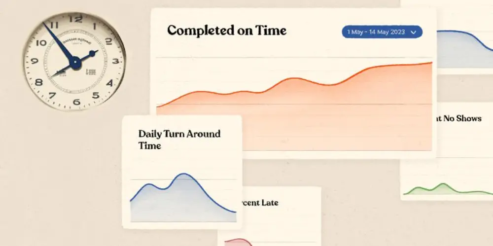

import LeadMagnetForm from '../../components/LeadMagnetForm.astro';

<LeadMagnetForm headline="Spreadsheet Template: Customizable Carrier Scorecard" eventName="$subscribescorecards" redirectUrl="/files/Carrier_Scorecard_Example_DataDocks.pdf" buttonText="Download" />

A carrier scorecard is a structured performance evaluation tool that tracks key metrics — on-time arrival rate, average dwell time, appointment compliance, and safety record — to hold transportation carriers accountable with objective data instead of gut feel. According to the American Transportation Research Institute (ATRI), driver detention costs the U.S. trucking industry $3.6 billion annually, and much of that cost traces back to facilities that lack the data to identify which carriers are creating problems and which are performing well. Automated scorecarding through platforms like DataDocks replaces manual tracking with real-time data capture, giving warehouse managers the leverage they need during rate negotiations and quarterly business reviews.

The performance of third-party carriers often feels like the one link in the supply chain that’s out of your control. 

Whether they’re contracted by your own organization or your suppliers, this unpredictability can disrupt the plans of everyone from warehouse managers to customer service teams. Delays, inconsistencies, and lack of data from carriers can hinder not just operational efficiency but also strategic decisions and stakeholder relationships.

While it’s true that carriers have their own challenges to deal with, some facilities have found ways to exert influence over their performance. Accountability is the foundational principle. That means having open, frank conversations with carriers, grounded in objective facts and mutual benefit. Here, carrier scorecarding emerges as an invaluable tool.

Amidst the demands of daily operations, keeping track of carrier performance might seem like yet another mountain to climb. But with streamlined processes and the right tools, it doesn't have to be a drain on resources. And the benefits of doing it right are much greater than many facilities realize.

## What is a Carrier Scorecard, and why is it valuable? 

A carrier scorecard is a performance evaluation tool that enables companies to systematically assess and monitor the effectiveness of their transportation carriers. 

By tracking key performance indicators (KPIs), businesses can gain valuable insights into their carriers’ reliability and service quality. 

Implementing carrier scorecards offers several advantages. Ultimately, utilizing carrier scorecards leads to a more streamlined supply chain and higher customer satisfaction.

### Manual v.s. Automated Carrier Scorecarding

Manual scorecarding is a time-consuming process that can lead to inaccurate evaluations of carrier performance. Different people may have slightly different methods for recording the information, and during peak times, the data might not be collected at all.

This can lead to disputes with carriers and make it difficult to improve performance.

Automated systems can enable a more objective form of carrier scorecarding. You’re able to give more consistent feedback to service providers, back it up with data, and avoid slowing down your team or diverting them away from the task at hand.

Automation means you can identify trends, anticipate issues, and make strategic adjustments swiftly, all while fostering transparency and trust with your carriers.

## What KPIs Should You Track on a Carrier Scorecard?

  
Key Performance Indicators (KPIs) are specific measures used to assess how well carriers perform. In carrier scorecards, KPIs help businesses see how reliable and effective their carriers are. 

Focusing on relevant KPIs can help companies identify areas for improvement and enhance their supply chains. Let’s explore 10 essential KPIs for carrier scorecards.

### 1\. Transparent Pricing

Providing clear, upfront information on base freight costs, surcharges, fuel adjustments, and any additional fees through itemized billing helps avoid hidden costs, and fosters trust between both parties. 

When carriers proactively disclose when and how fees might fluctuate—such as during seasonal capacity constraints or fuel price spikes—it enables better budgeting and forecasting for your operations.

### 2\. Load Acceptance Rate

The load acceptance rate measures the proportion of shipment offers a carrier accepts within a specific timeframe. 

A high acceptance rate reduces last-minute disruptions and ensures a consistent shipping schedule. By tracking rejection reasons—such as capacity constraints, unsuitable routes, or rate disagreements—businesses can identify areas to better align shipments with carrier capabilities or negotiate more favorable terms.

### 3\. Contract Flexibility

A carrier’s flexibility is a qualitative measure of its willingness to negotiate unique contract terms, accommodate special requests, and adapt to operational changes. 

Carriers that proactively handle urgent or non-standard loads demonstrate a commitment to partnership beyond transactional service. Regular check-ins and a readiness to renegotiate contract clauses, such as volume-based discounts, indicate a carrier’s alignment with your long-term strategic goals.  

### 4\. On-Time Pickup & Delivery

The on-time delivery rate measures the percentage of shipments delivered or picked up within the agreed-upon time frame. 

It’s essential to clearly define what constitutes “on time”—for example, within 30 minutes of the scheduled dock time—to ensure consistency. Regularly tracking this metric can reveal patterns, such as recurring late deliveries on specific routes or times of day, which can be addressed through collaborative scheduling or route optimization.

### 5\. Issue Resolution Speed

A carrier’s issue resolution speed reflects how quickly and effectively a carrier resolves problems or responds to questions—such as load discrepancies, billing questions, or scheduling conflicts.

Establishing service-level agreements (SLAs) with defined response and resolution times sets clear expectations and ensures accountability. Swift resolutions prevent minor issues from escalating into major disruptions, thereby enhancing overall supply chain resilience.

### 6\. Capacity & Scalability

A carrier’s capacity and scalability refer to its ability to handle varying shipment volumes (day-to-day fluctuations or seasonal peaks) without compromising service quality.

Indicators include access to a larger network, specialized equipment, or partnerships that allow them to scale up quickly when your volume surges. A carrier with robust capacity planning can reduce the risk of load rejections or delivery delays during peak demand periods.

### 7\. Scheduling Responsiveness

Scheduling responsiveness evaluates how promptly and cooperatively a carrier engages with your scheduling system, such as a self-service booking portal. 

Carriers who actively participate by promptly confirming or adjusting appointments help reduce dock congestion and minimize dwell times. Measuring average confirmation times and the frequency of proactive communication regarding changes or delays can provide insights into a carrier’s responsiveness. 

This level of cooperation ensures that carriers arrive as expected and notify you promptly if rescheduling is necessary, contributing to a more efficient supply chain. 

### 8\. Error-Free Delivery Rate

The error-free delivery rate measures the proportion of shipments that arrive without issues such as damage, missing items, or documentation errors.

Tracking the type of problems (e.g., damage, incomplete paperwork, temperature breaches) can help identify recurring root causes and address them. A high error-free rate boosts customer satisfaction, minimizes claims, and reduces administrative overhead for both you and the carrier.

### 9\. Technology Readiness

Electronic Data Interchange (EDI), and API connectivity significantly enhance shipment visibility and operational efficiency.

Tech-savvy carriers typically reduce manual paperwork, speed up communication, and provide automated status updates. Strong systems integration, like connecting to your warehouse management or scheduling software, streamlines workflows, prevents errors, and ensures data accuracy.

### 10\. Service Capabilities

When evaluating a carrier’s service capabilities, it’s crucial to assess their range of specialized services and geographical coverage.

This includes their ability to handle oversized loads, sensitive cargo, or international shipments. Aligning carrier capabilities with both current and future needs is essential; for instance, if your business plans to expand internationally, look for carriers with cross-border experience.

Contrarily, excluding capabilities that are unlikely to be needed within the next decade helps keep your carrier evaluations focused and relevant.

## What Does a Carrier Scorecard Template Look Like?

Creating custom carrier scorecards means setting specific performance measures (KPIs) that match your business goals and collecting data to check how well carriers are doing. 

If you want to see a practical example, take a look at the carrier scorecard example below:
<LeadMagnetForm headline="Spreadsheet Template: Customizable Carrier Scorecard" eventName="$subscribescorecards" redirectUrl="/files/Carrier_Scorecard_Example_DataDocks.pdf" buttonText="Download" />

## How to Grade Different Types of Carriers 

The metrics you prioritize in carrier scorecards should reflect the unique characteristics and challenges of different transportation modes. Let's explore how to adapt your scoring approach for various carrier types.

### LTL Carrier Scorecard

Less-than-truckload carriers require special consideration in scorecarding due to their multi-stop nature. Focus on metrics like:

*   Damage rates, as freight is handled multiple times during consolidation
*   Accurate ETAs that account for terminal transit times
*   Claims resolution speed, given the complexity of tracing issues across multiple shipments
*   Loading efficiency at your dock, since LTL drivers often face tight scheduling windows

### Short-haul or Regional Freight Carrier Scorecards

Regional carriers operating within specific geographical boundaries have distinct advantages and challenges that should influence their evaluation:

*   Route optimization capabilities within their service area
*   Flexibility in accommodating same-day schedule changes
*   Local market knowledge and relationships
*   Ability to handle seasonal volume fluctuations in your region

### Specialty Carrier Scorecards

Carriers handling temperature-controlled, hazardous, liquid, or oversized loads require additional performance metrics:

*   Temperature compliance and monitoring
*   Special equipment availability
*   Proper documentation and certification maintenance
*   Specialized loading/unloading procedures adherence
*   Safety protocol compliance

### 3PL and Intermodal Carrier Scorecards

For third-party logistics providers and carriers managing intermodal transportation, consider these broader network factors:

*   Network optimization and modal selection efficiency
*   End-to-end visibility across different transportation modes
*   Subcontractor management and performance
*   Container and equipment availability
*   Cost transparency across the complete movement
*   Integration capabilities with your systems
*   Strategic planning and continuous improvement initiatives

## What Are the Benefits of Using Carrier Scorecards?

### 1\. Carrier Scorecarding Streamlines Internal Operations

Even before you communicate the content of your carrier scorecards to the service providers themselves, they can start driving efficiency.

Armed with a reference sheet as to what they can expect from each carrier, your shipping and receiving coordinator can make more informed scheduling decisions. They’ll leave a little extra margin of error for unreliable partners, and when it comes to peak demand periods, they can make smart bets like lining up successive appointments from the more solid carriers.

The knowledge gained from carrier scorecarding percolates down into shop floor wisdom, too. Loading dock workers will have a better idea of what the day’s deliveries will mean in terms of rhythm and workload, allowing them to plan their breaks and conserve their energy. That can do wonders for morale.

Finally, for the warehouse manager - carrier scorecards make it easier to plan manpower allocations for the loading dock, giving them breathing room for other warehouse operations. As for inventory, knowing what can be expected from carriers is a key piece of the puzzle in striking a balance between lean operations and having a buffer for uncertainties.

Even if carrier scorecarding shaves off a mere 5 minutes from the average [dwell time](/posts/dwell-time-in-trucking) per load, the cumulative effect over weeks, months, and years is transformative. Small operational tweaks can, over time, result in major improvements to throughput and bottom-line savings.

### 2\. Carrier Scorecards Support Strategic Sourcing

Besides being useful for operations, carrier scorecards are a powerful tool for the commercial side of the company.

For procurement teams, knowing how different carriers perform can impact supplier selection, negotiations, and risk planning.

When two or more suppliers seem identical in quality and price, their choice of carrier is a differentiator. With mature carrier scorecards, this can go even further: commercial teams can start factoring in the potential for delays or disruptions into the estimated total cost of goods.

Carrier scorecards can also give buyers leverage in contract negotiations. Consistent lateness could be grounds for penalties or even termination. On a more positive note, they can also strengthen supplier relationships by passing on information about carrier performance or recommending alternatives.

### 3\. Carrier Scorecards Can Benefit Your Carriers

Maintaining harmonious relationships with carriers is sometimes a delicate balancing act. But data can lay the groundwork for better collaboration, replacing blame games with objective problem-solving sessions.

For carriers, knowing how your own performance compares with their peers is invaluable insight. It can help them better understand their position in the marketplace, and troubleshoot issues with client acquisition and retention. 

The important thing is to be clear that it’s not a punitive exercise. Rather, it’s about collaboration and continuous improvement. To help with this, you might try to highlight their strengths along with their weaknesses. For example, a carrier might be poor at sticking to scheduled appointments, but have a flawless record for goods being properly stowed with zero damage.

You might also invite them to share feedback about their own experience with your facility, including checking in with drivers about issues like signage or amenities.

Another thing that’s worth pointing out is that your ability to turn their trucks around quickly will improve alongside their punctuality, as ever greater predictability is achieved. Showing service providers how their performance impacts your own operations and business makes the stakes clearer for them, and makes it more likely they will try to improve.

Accountability and understanding between carriers and facilities can be a competitive advantage for both parties.

### 4\. Carrier Scorecards Help with Supply Chain Predictability

From the point of view of business resilience and continuity, carrier scorecards represent a valuable asset. 

A holistic view of carrier performance helps in developing backup plans, ensuring the supply chain remains robust even in unforeseen circumstances. Knowing the true capabilities of your supply chain empowers business development and logistics teams alike to optimize their plans and manage risk, both commercial and operational.

Salespeople can avoid overpromising and manage customer expectations more effectively. Senior executives can weigh the pros and cons of investing in an owned fleet, or opening up new facilities closer to major transport hubs.

Even your company’s brand management or PR teams stand to benefit from carrier scorecarding, since it empowers them to assess the risk of reputational damage due to delays fulfilling orders.

What’s more, well-maintained scorecards give logistics teams the ability to prepare for peak seasons or growth spurts. By analyzing past performance, it becomes easier to forecast which carriers are likely to face capacity issues during high-demand periods, allowing logisticians to adjust their strategies ahead of time.

## How Do Carrier Scorecards Reduce Shipping Costs?

The value in financial terms of carrier scorecards might not be obvious at first glance. But it becomes clearer when you ask: how much does poor carrier performance cost the business?

The ripple effect of delays can be profound, affecting everything from the cost of holding inventory to customer satisfaction. Tracking carrier performance is an essential tool in any business’s effort to diagnose the root causes of these problems and work towards mitigating them.

While all business relationships are built on trust, contracts exist to protect both parties' interests. When carriers consistently fall short of the mark, having a data-driven scorecard can provide the necessary evidence to renegotiate terms, instate penalties, or indeed shift to more reliable service providers.

## How DataDocks Makes Carrier Scorecarding Easy

DataDocks logs the precise arrival and departure times for every truck coming into your facility. On top of that, it keeps track of no-shows, unscheduled loads, and appointments that have been canceled.

You can then look at that data from many different angles and spot trends. Perhaps your turnaround time is shorter on certain days of the week? Or you can see a comprehensive report for a particular carrier. These scorecards can be customized and exported into a spreadsheet format, or displayed visually and intuitively.

All of this is integrated seamlessly into the daily workflows of your team, including a drag-and-drop calendar for your logistics coordinator and quick access to load information for the loading dock supervisor. What’s more, the data can be synchronized with other systems via [API](/posts/edi-vs-api).

**Related reading:** Learn how to [settle detention disputes](/posts/truck-detention-accessorial-fees) with the same data that powers your scorecards, or dive into the [supply chain KPIs](/posts/supply-chain-kpis-you-need-to-track) every logistics leader should be tracking.

<LeadMagnetForm headline="Spreadsheet Template: Customizable Carrier Scorecard" eventName="$subscribescorecards" redirectUrl="/files/Carrier_Scorecard_Example_DataDocks.pdf" buttonText="Download" />
