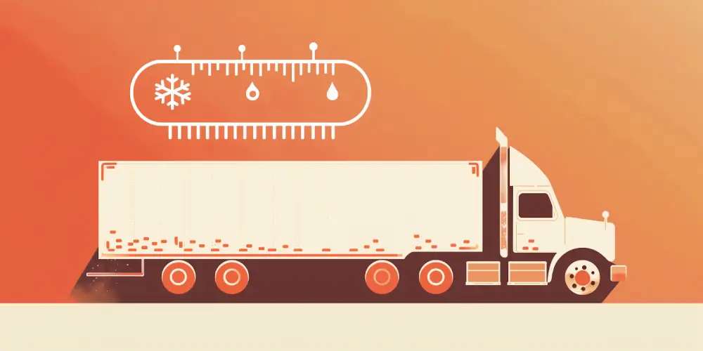
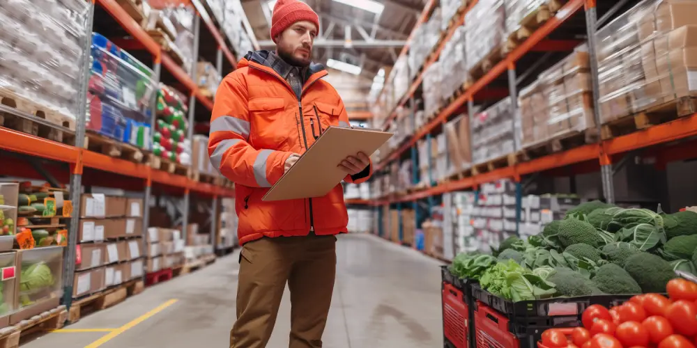
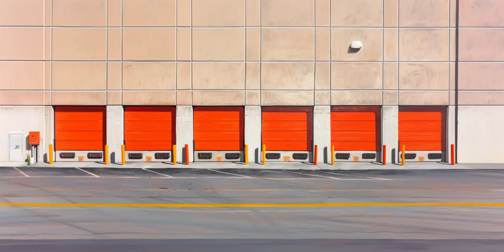

If you're in a business that deals with products needing to stay cool, like medicine or food, you understand the overwhelming amount of steps that go into cold chain compliance.

And obviously, it’s necessary. Because if medicines don't stay cold, people's health could be at risk. And if you're not following the cold chain compliance rules, it could come back to bite you. We're talking about having to throw away products, losing money, and getting fined.

That’s why we wrote this guide — to help you understand how to keep yourself safe from cold storage, to the truck, to the loading dock (a tricky place to stay compliant), all the way to its end destination.

Cold chain compliance is an important piece of the puzzle to keeping your business from getting in trouble. Stick with us, and you'll learn how to ensure that your products stay just the way they should. 

‍

‍

## Understanding the Cold Supply Chain

‍

We depend on the cold supply chain to ensure that so many different kinds of goods stay cold and don’t spoil—fruits, vegetables, meat, medicines, and more. 

Obviously, it takes a lot of work and special equipment to keep everything cold from start to finish.

You deal with all the complexities that come with moving inventory from cold storage, onto cold trucks or into cold containers, and having to keep an eye on the temperature the entire way.

### Sector-Specific Compliance Needs

This becomes even more difficult considering different products need different types of care when being transported. Ice cream and vaccines can't be treated the same way. Food needs to stay fresh, and medicines need to stay strong and safe—which is why regulations have to be strict.

‍

#### For Ice Cream

For ice cream to stay perfectly frozen, it needs to be kept really cold, usually below 0°F. The rules for shipping ice cream make sure it stays in deep freeze all the way from the factory to your freezer.

‍

#### For Vaccines 

Some vaccines need to be kept cool, like between 35°F and 46°F. If they get too warm or too cold, they might not work right. This means doctors and nurses won't be able to use them to help keep people from getting sick. 

‍

#### For Fresh Produce (like fruits and vegetables)

These need to be cool but not freezing, usually around 32°F to 40°F. This keeps them fresh and crunchy until they get to your plate. If they get too cold, they might freeze and get mushy. 

‍

#### For Seafood (like fish and shrimp)

It's often kept just above freezing, around 30°F to 34°F. This stops any bacteria from growing and keeps the seafood safe to eat. 

‍

#### For Flowers 

Keeping flowers cool, around 33°F to 37°F, helps them stay fresh and beautiful longer. This is why you often see flower deliveries in refrigerated trucks. 

‍

### Location-Specific Compliance Needs

Compliance can also get extremely tricky during transition periods, like during loading and unloading inventory. 

At a loading dock, for instance, delays can lead to certain inventory being left in compromising states for too long—which can be a compliance violation.

‍

## Cold Chain Compliance Regulations 

‍

When we talk about keeping things cold from place to place, you need to follow the rules—or else you’re compromising the safety of consumers. Let's look at the regulations:

### Global and Regional Regulations

*   Global regulations are created by organizations like the World Health Organization (WHO). These rules aim to make sure that products that need to stay cold are handled safely and consistently, no matter where they are in the world.
*   Regional regulations are extra rules made by specific countries or areas. These rules can be different because some places have really hot or really cold climates. For example, regions with extreme temperatures might have stricter rules to account for changes in temperature.
*   It's super important for businesses that deal with cold products internationally to follow both global and regional regulations. Not following these rules can lead to problems like spoiled products, fines, or even legal trouble.

### Standards and Certifications

*   Standards organizations, such as ISO (International Organization for Standardization) and HACCP (Hazard Analysis and Critical Control Points), play a big role in making sure companies follow the cold chain rules. ISO makes rules that are recognized all over the world for quality, safety, and efficiency, including those for keeping products cold.
*   Companies that follow these rules and guidelines might get certificates or approval, showing that they are committed to keeping their products cold and safe. 

### Keeping Up-to-Date

*   Cold chain regulations aren't fixed; they can change over time because of new technologies, scientific discoveries, and better ways of doing things. Companies involved in the cold chain have to keep learning about these changes to stay compliant.
*   Staying informed might mean attending conferences, joining workshops where experts talk about the rules, or regularly checking publications and guidelines from authorities. Companies might also invest in training for their employees to ensure they know the latest requirements.

### Impact of Non-Compliance

Not following the cold chain rules can lead to serious consequences for companies, consumers, and public health. When products aren't stored or moved at the right temperatures, a lot of problems can happen:

*   **Financial Consequences:** Companies might lose money because their products get spoiled or have to be thrown away. Replacing these products can be expensive.
*   **Legal Consequences:** Not following the rules can result in legal actions, including fines and penalties, especially if public health is at risk.
*   **Reputation Damage:** Failing to keep products cold and safe can harm a company's reputation. People might lose trust in the brand, causing lower sales and a bad image in the market.
*   **Health Risks:** In the case of medicines or vaccines, not following the rules can be dangerous for patients. These products might not work properly or could even harm people, which is a serious health risk.

In summary, following cold chain compliance regulations is incredibly important to protect the quality and safety of products that need to stay cold. 

Companies should always educate themselves, use the best methods, and invest in the right technologies. 

This will help you avoid the consequences of not following these rules.

‍

## The Loading Dock’s Effect on Cold Chain Compliance

‍

When you have most of the trucks showing up at the same time, and everything gets rushed, that can be a huge problem.

Obviously, products can’t just sit there for hours on end. They have to be kept cold. So when inspections and documentation happen, it’s easy to rush things.

But when your team cuts corners because they were rushed…you don’t end up with enough evidence that you performed a proper inspection.

And when the auditor shows up, you find yourself in huge trouble.

That’s why it’s so incredibly important to make sure the loading dock is as optimized as humanly possible. One of the most effective ways to do that is using [dock scheduling software](https://datadocks.com/benefits/see-everything).

‍

‍

## Best Practices for Ensuring Cold Chain Compliance 

What else can you do to stay compliant?

**To make sure everything stays cold from start to end, here are some smart steps to follow:**

### Staff Training and Awareness

First, teach everyone on your team why it's important to keep things cold and how they can help. 

*   Hold regular training sessions for all employees who handle cold chain products. Stress why it's important to control temperatures and follow safety rules.
*   Give clear guidelines on how to handle and store cold chain items so everyone follows the rules consistently.
*   Set up a certification program to recognize employees who complete cold chain training.

### Look into Emerging Technologies

Using new tech can really help. Tools that track the temperature and where your stuff is can help find problems early. 

*   Invest in devices, like special sensors, that can monitor and report temperature changes while products are being transported.
*   Use GPS systems that can track both location and the condition of cold chain products during their journey.
*   Look into blockchain technology as a way to keep an unchangeable record of temperature data, making the supply chain more transparent.

### Risk Management Strategies

It's good to have a plan for when things don't go as planned. Think about what might go wrong and how you'd fix it. 

*   Create a plan for when things don't go as expected, like if temperatures get too high or too low. This plan might involve changing the route of shipments or informing the right people.
*   Regularly check for potential issues in the cold chain process, such as equipment problems or unexpected weather conditions.
*   Set up a dedicated response team trained to handle emergencies and give them the tools they need to fix temperature-related problems quickly.

### Vendor Compliance

Make sure all the companies you work with follow the cold rules too. 

*   Make sure your suppliers follow the rules for keeping things cold by including clear temperature requirements in your contracts with them.
*   Keep an eye on your suppliers' cold chain processes with regular audits to make sure they're meeting the standards you agreed on.
*   Build open communication with your suppliers. Share best practices and work together to keep the cold chain strong in the supply chain.

### Optimize Your Loading Dock

Most businesses don’t realize how much ROI you can get out of optimizing your loading dock. As everything gets moved in and out of the loading dock, all day long, delays can really hurt your cold chain compliance.

Using a smart schedule, like with DataDocks, helps keep everything moving smoothly so there are no delays, and everything stays cold.

‍

## Make Your Cold Chain Compliance Easier with DataDocks

We’ve talked about how teaching your team, using new tech, planning for problems, and making sure everyone follows the cold chain compliance regulations are all crucial for success.

But let's not forget about the loading dock. It's a huge part of taking control of your cold chain. 

Any delays at the docking stage can disrupt this temperature control, potentially compromising the quality of perishable goods. 

DataDocks helps minimize such delays by optimizing dock scheduling, ensuring that goods are loaded and unloaded efficiently, thus maintaining the required temperature conditions.

It can help you know when your items will arrive and ensure they don't get warm because you waited too long. 

Make your customers happy, your business booming, and your whole process streamlined.

**To learn more about how dock scheduling can help with cold chain compliance at your facility give the DataDocks team a call at (+1) 647 848-8250, or** [**book a demo**](https://calendly.com/nick-rakovsky/datadocks-demo)**.**

‍