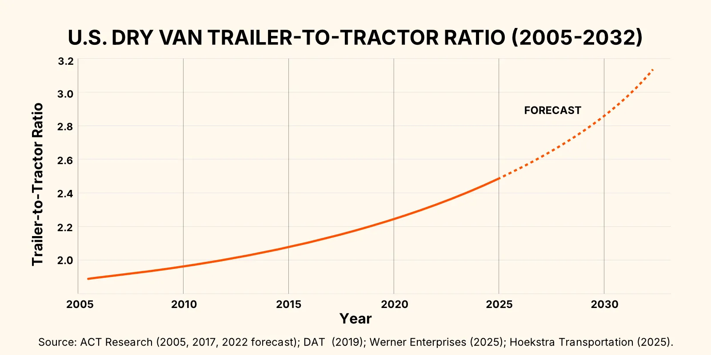
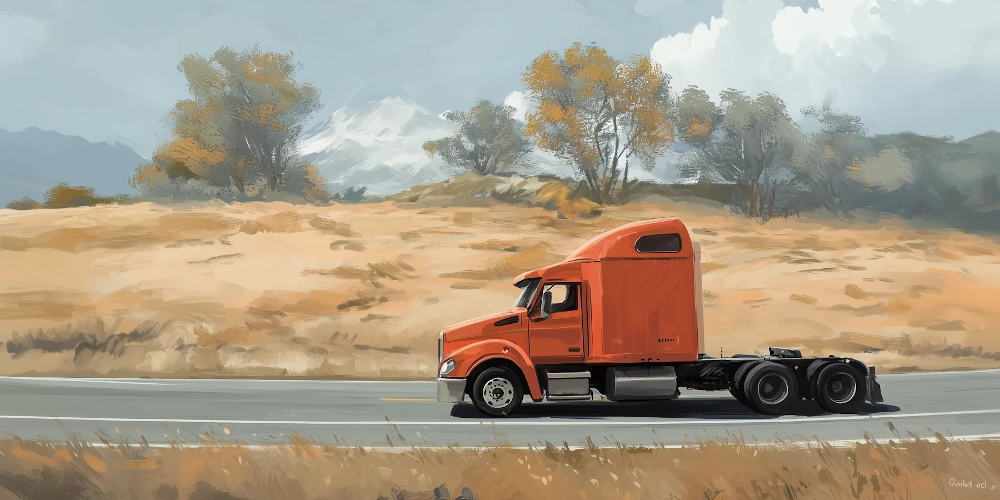
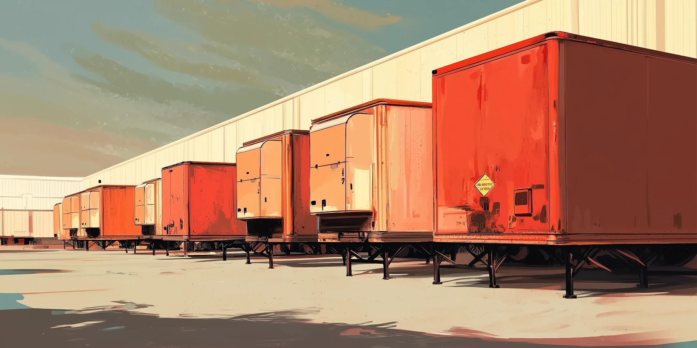
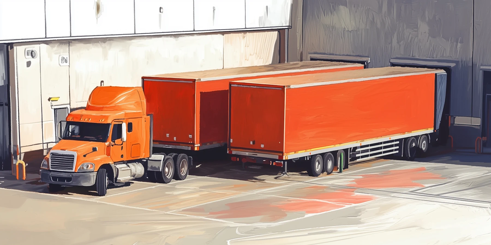
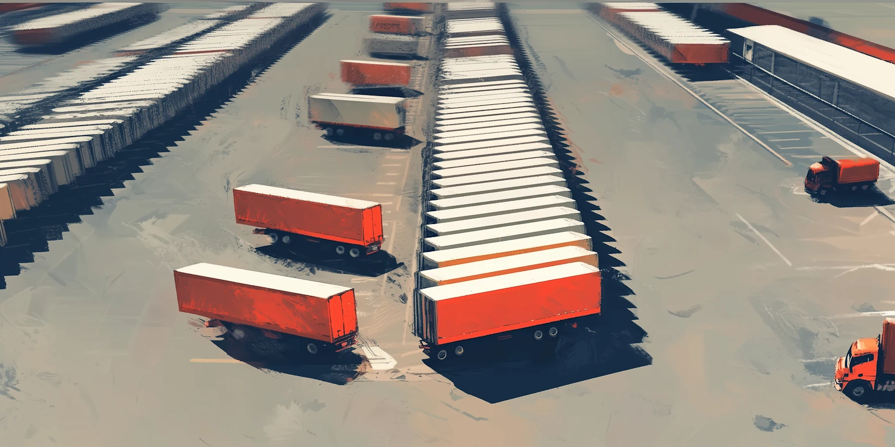
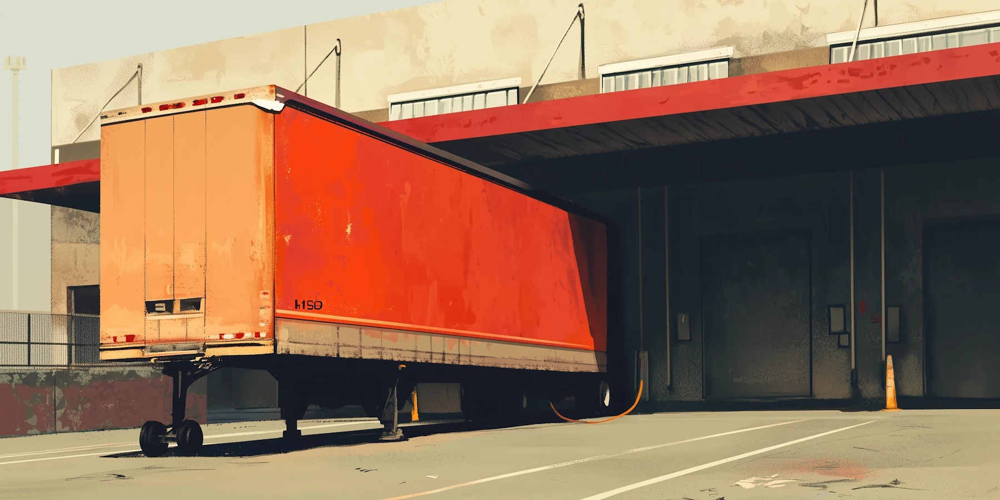

‍

## **Understanding Drop Trailer Operations**

In a typical ‘live load’ scenario, a driver will wait for their trailer to be loaded or unloaded at your facility. But with a drop trailer program, they can simply unhook their trailer, (usually) pick up another, and be on their way.

Looking at it in terms of pure logistics, the concept is simple and the efficiency gains obvious. 

But the business arrangements needed to make it work can be prohibitively complex. To begin with, who owns the trailers - shipper, receiver, or a third party? And does ownership transfer along with custody, or do we have a network of partners borrowing each other's property? You can see how quickly it gets sticky with financial risk and liability, especially if you’re trying to do this at scale.

So there’s a trade-off to consider. Decoupling loading and unloading from driver schedules means that warehouse staff can work at optimal times rather than rushing to deal with unexpected arrivals or a bunch of trucks showing up at once. Done well, drop trailer programs improve overall efficiency and strengthen carrier relationships. And for some operations, that’s a game changer.

Drop trailers transfer operational pressure from the loading dock to the yard. So it can be helpful to think in terms of dock door capacity v.s. yard capacity. If the space outside is underutilized compared to your loading area, a drop trailer program is usually a good fit. 

Next you have to think about your equipment and workforce. Moving trailers around can be labor-intensive, so if your own team is going to be responsible for those movements, you’d better be prepared.

But there are other ways to structure a drop trailer program, each with its own requirements and trade-offs. Let's look at the most common approaches companies are taking to make these programs work.

‍

## **Operational Models to Consider**

### **Power Only Freight**

If you’re in a position where either you or your supply chain partners can own and maintain a pool of trailers or containers, you might consider contracting transportation providers on a ‘power only’ basis.

Under this system, the carrier only provides the tractor and the driver. That leaves you and your customers and/or suppliers to make your own arrangements with the trailers.

The ideal scenario for this would be if you had a dedicated ‘triangle-shaped’ lane, with an upstream partner and a downstream partner located closer to each other than either is to you. Using your own trailers, you could have a carrier drop off at your customer and then pick up at your supplier. You’d have to eat the cost of the empty miles, but that would be a drop in the ocean compared to your overall savings.

But the far more common use case for power only freight is in borrowing containers from a maritime port. This brings some risk in the form of punitive detention fees if you fail to return them to the port on time. 

If your shipping partners propose power-only arrangements, pay special attention to equipment control, maintenance responsibilities, and return logistics in your agreements. While you may get better rates since carriers have less invested, successful execution requires more coordination than carrier-owned equipment.

‍

### **Drop-and-hook with a shared or leased trailer pool**

If you have consistent, high-volume freight movements and close relationships with a few key supply chain partners, you could work out a pretty efficient equipment sharing system.

This can be combined with power-only freight, but some carriers will also let you lease their trailers. Of course, they will want guaranteed volume commitments in exchange for dedicating equipment to your lanes.

In any case, this approach requires careful planning for equipment maintenance and tracking. Success depends on establishing clear protocols for inspections, repairs, and responsibility for damages. You'll need systems to monitor trailer locations and status, plus procedures for handling equipment shortages during peak periods or breakdowns.

‍

### **Double Drop and Pull**

Double drop and pull refers to a specific procedure where drivers perform two drop-and-hook moves during a single visit. For example: dropping a loaded trailer, then repositioning another trailer within your yard before departing with either the original or a different trailer.

This can be a cost-effective alternative to yard hostlers if you have a decent-sized yard but limited dock doors or staff. While not as efficient as dedicated yard equipment, using carrier drivers for occasional repositioning can help manage yard flow without additional infrastructure investment.

The key is clear communication about expectations and compensation for these extra moves. Your appointment scheduling system needs to account for the additional time required, and carrier agreements should specify rates for this service.

‍

### **Third party Drop-and-pick**

Some 3PLs and brokers are developing shared trailer pool networks to serve multiple shippers and receivers. Under this model, carriers can drop and pick up trailers at designated staging areas near clusters of facilities, rather than every facility needing its own large trailer pool.

While still an emerging model, it offers interesting possibilities. Even if your yard is too small for a dedicated trailer pool, you might benefit from drop trailer efficiency by working with partners who maintain equipment nearby. The key is finding programs that align with your lanes and volumes.

This model's success depends on coordination and visibility. Look for partners with robust tracking systems and clear processes for equipment handoffs, maintenance, and issue resolution.

‍

## **Is Drop and Hook Right for Your Operation?**

Some facilities can rule out drop trailer programs. If the goods being loaded are perishable, sensitive or ultra high value, there’s no question of allowing them to sit in a trailer for prolonged periods of time. And with that disappears the main advantage.

But even facilities where this time sensitivity is not such an issue may find that live loads simply work better for them. There’s a few factors to consider:

### **Volume and Space Requirements**

Your freight volume is the first consideration. Drop trailer programs require enough consistent freight to justify dedicated equipment - whether that's carrier-owned trailers, shipper equipment, or access to a shared pool. Most carriers look for at least 5-10 loads per week on a given lane before considering drop trailer arrangements.

Space is equally critical. You'll need yard space for dropped trailers plus maneuvering room. A good rule of thumb is space for 1.5 to 2 times the number of trailers you expect to process daily. Remember that dropped trailers can't be stacked against each other - drivers need clear access for pickup.

Peak seasons add another dimension to planning. You'll need either flexible arrangements with carriers or extra yard space to handle volume spikes.

### **Equipment and Infrastructure Needs**

Beyond yard space, successful drop trailer operations require some basic infrastructure. You'll need well-maintained, level ground for trailer parking and good lighting for safety. Security is important too - dropped trailers mean valuable cargo sitting in your yard.

Most facilities need at least one yard tractor to efficiently move trailers between yard positions and dock doors. While some operations get by with jockey trucks or having drivers reposition trailers, dedicated yard equipment becomes essential as volume grows.

Your dock equipment needs careful consideration. Drop trailer programs often mean older or varying trailer types, so adjustable dock plates and proper restraints are crucial. You'll also need reliable communication systems to coordinate between yard and dock staff.

### **Rates and Cost-Benefit Analysis**

While drop trailer rates are often lower than live load rates, the full cost comparison is more complex. Factor in yard maintenance, potential equipment needs, additional labor for moving trailers, and any changes to your dock operations. If working with power-only arrangements, consider potential detention costs and coordination overhead.

The benefits can be substantial: more predictable loading/unloading schedules, better labor utilization, reduced detention charges, and improved carrier relationships. Many facilities find that drop trailer programs pay for themselves through operating efficiency, even before considering rate differences.

Create your analysis around your specific pain points. If detention fees are killing you, compare them to yard expansion costs. If dock labor scheduling is your challenge, calculate the value of more predictable workloads.

## **Setting Up for Success**

### **Internal procedures**

Getting your team ready for drop trailer operations starts with clear documentation. You'll need procedures for checking in and releasing trailers, recording damage, managing yard positions, and coordinating between gate, yard, and dock staff.

Safety protocols are important - especially if you're adding yard tractor operations. Establish clear rules about trailer inspections, landing gear deployment, and proper chocking. Remember that dropped trailers mean additional responsibility for cargo security while in your custody.

Build visibility into your processes. Every parked trailer should have a clear status - ready to unload, in process, empty, ready for pickup - and this information needs to flow smoothly between your gate, yard, and dock teams. If you're not there yet, read our [guide to improving visibility in your yard](https://datadocks.com/posts/yard-visibility).

### **Agreements & coordination with partners**

Success depends on clear expectations with carriers and shipping partners. Your agreements should specify drop trailer availability windows, notification procedures for pickup, and responsibility for issues like trailer damage or detention charges.

Communication protocols need to cover both routine operations and exceptions. How will carriers notify you about incoming drops? How quickly will you alert them when trailers are ready? What happens if you discover damage, or if a trailer isn't ready within the agreed window?

Consider building performance metrics into your agreements. [Track metrics like turn times and dwell times](https://datadocks.com/posts/dwell-time-in-trucking), and regularly review them with partners to identify improvement opportunities.

### **Software needs**

Some companies have [highly automated yard operations,](https://datadocks.com/posts/automated-yard-operations) or at least see that as the eventual goal.

At minimum, you'll need a system to track trailer status and yard positions. While spreadsheets might work for small operations, dedicated software becomes essential as volume grows. DataDocks has you covered here, giving you real-time visibility of your yard moves and dock assignments. For a broader view of what the market offers, our recent [**comparison of eight leading yard management platforms**](https://datadocks.com/posts/best-yard-management-options) outlines how each balances scheduling ease, visibility, and scalability.

Appointment scheduling takes on new importance with drop trailer operations. Your system needs to handle both live loads and drop appointments, accounting for yard capacity and dock schedules. Integration between [yard management](https://datadocks.com/datadocks-features/yard-management) and scheduling helps prevent bottlenecks and maximize efficiency.

Consider how your software will communicate with partners. While EDI or API integration is ideal, a simple online portal is enough to let carriers schedule appointments without endless phone calls and emails. With DataDocks you can start with a simple configuration and then expand as needed.

## **Key Takeaways**

‍

Drop trailer programs can transform your operations, but success requires careful planning and the right foundation. Start by understanding your volumes and space constraints, then build from there. Many facilities find the best approach is starting small - perhaps with one consistent lane or partner - and expanding as they develop expertise.

Remember that drop trailer operations aren't all-or-nothing. Plenty of facilities maintain a mix of drop and live load capabilities, adapting their approach based on lanes, partners, and operational needs.

Whichever model you choose, visibility is key. Everyone - from gate staff to carriers - needs clear information about trailer status and next steps. Strong [dock scheduling](https://datadocks.com/) and yard management processes form the foundation for success.

‍