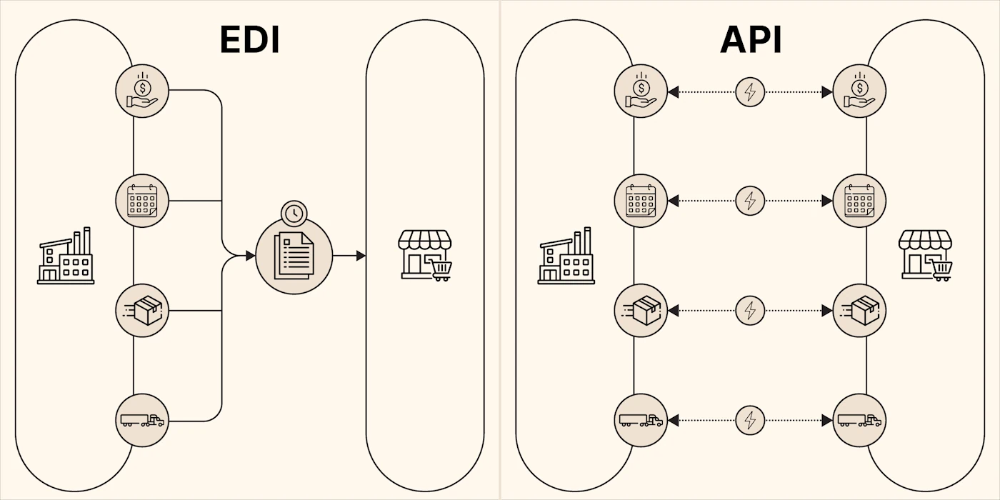
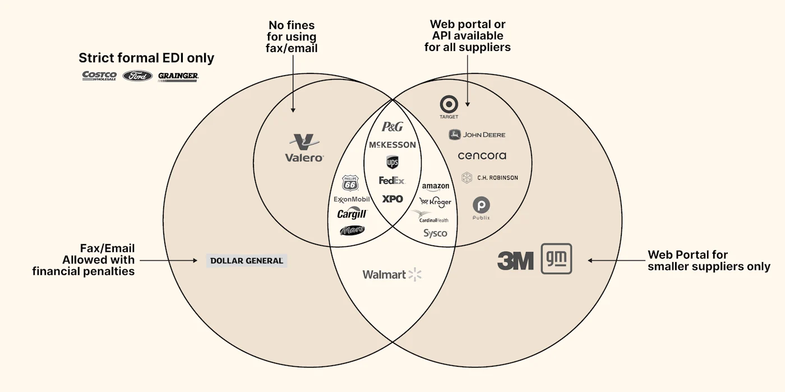
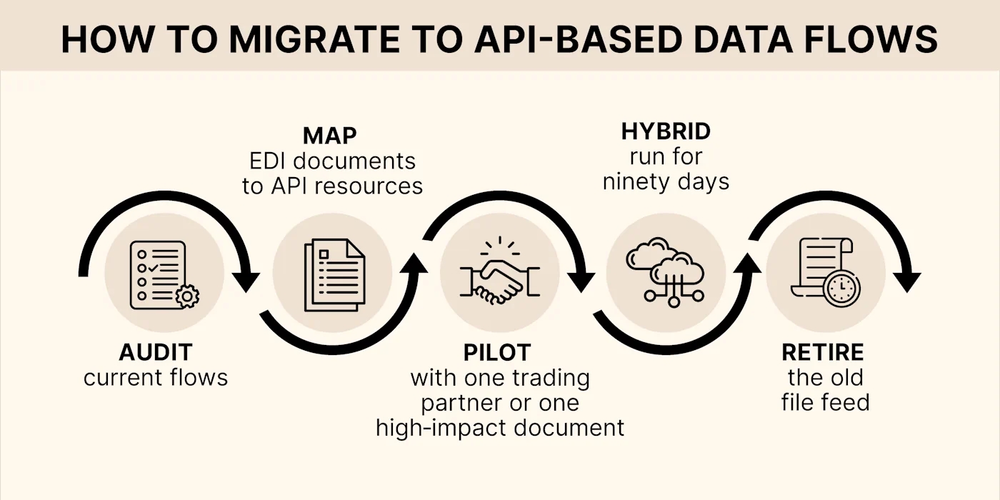

A lot of supply chain data still moves through scheduled batch transmissions via **Electronic Data Interchange (EDI)**. Meanwhile, modern **APIs** can push the same information in real time. The challenge isn’t choosing one over the other — it’s gaining the speed and visibility of APIs **without disrupting the EDI connections that partners already depend on**. EDI may be older technology, but it’s deeply standardized, reliable, and widely trusted across the industry.

‍

EDI bundles orders, invoices, and shipment notices into standard file formats like X12 and UN/EDIFACT. Because the files move on a fixed schedule, updates can take hours to reach the next system.

‍

## **Technical Snapshot**

| Aspect | EDI (file based) | API (real time) | Hybrid |
| --- | --- | --- | --- |
| **How data travels** | Private network / file drop | Secure web link | Either path per partner |
| **Time to update** | Hours | Seconds | Seconds on API side |
| **Error check** | After full file lands | Inline, per record | Mixed |
| **Scaling effort** | Manual capacity planning | Expands with traffic | Expands on API side |
| **Network Fees** | Per‑kB VAN or AS2 service charges | Ordinary web traffic plus usage fees for any added services. | VAN fees only for remaining EDI files. |

‍

## **API vs EDI Advantages**

### **Why Operations Teams Care**

1.  **Speed** – Messages travel in seconds instead of hours, and trigger pick tickets sooner.
2.  **Error handling** – One bad record can be fixed on the spot. No whole‑file resend.
3.  **Visibility** – APIs refresh dashboards in seconds, giving teams time to adjust labor, inventory, or routing before costs mount.
4.  **Skill Set** – APIs can be set up and configured pretty easily by your IT department or any tech-savvy analyst. EDI generally needs expensive, specialized consultants to set up or change anything.

### **Replacing EDI with APIs v.s. “EDI via API”**

Going “API-only” promises real-time updates and cost savings, but the reality is rarely binary. Time‑sensitive events like dock appointments, GPS pings and on‑hand stock benefit from API speed, while invoices and customs forms sit comfortably in EDI’s structured format. 

With partners and core systems scattered on both sides of that divide, full EDI retirement only becomes viable when three hurdles clear: 

1.  **Partner Readiness** - every carrier and customer can send/receive APIs or at least use a self‑service web portal.
2.  **System Limits** - your WMS, TMS, or ERP can send and receive API messages without messy workarounds.
3.  **Compliance Comfort** - finance and quality teams are confident using digital logs in place of traditional EDI control reports. 

Until all three align, a compromise is necessary.

Plenty of shippers use both EDI and API. The simple approach is just to split workloads. Live, decision-driving data travels via API while audit-critical records that make more sense in a document anyway stay on EDI. 

For deeper visibility, some add a middleware gateway. This cloud service takes in an API call and quietly converts it to X12 or EDIFACT (and back again) so every partner sees its preferred format. You gain real‑time speed without asking every carrier or supplier to re‑tool at once, though you do pay a translation fee for the convenience.

‍

‍

## **Why Many Partners Still Push EDI and Resist Change**

Day‑to‑day pressures keep the file feeds alive:

*   **Familiar routines.** Crews and back‑office staff know the X12 or EDIFACT forms by heart.
*   **Predictable line item.** VAN fees appear in every forecast and are easy to sign off.
*   **Peak‑season nerves.** Few managers will touch a link that still moves freight in crunch weeks.

Switching gets harder once you look at the network math. Hundreds of supplier and carrier maps already exist. Re‑mapping each one and retesting both sides costs money and focus.

Big brands police EDI on a sliding scale, from “EDI‑only” with charge‑backs for any slip, through buyers that tolerate fax or email (sometimes with small penalties), to companies that let smaller suppliers use a web portal or API while larger partners stay on files. The diagram below plots a few Fortune 500 names along that spectrum, showing why many shippers end up juggling several compliance rules at once:

Decades of small, practical decisions keep EDI glued in place. First, the money is already spent: partner maps, VAN contracts, and auditor sign‑offs were paid for long ago, so rewriting them feels like paying twice.

Compliance teams like that an X12 can be opened like a PDF during a recall, so they push back on anything new. What’s more, high-volume shippers worry an always-on API might choke during peak season, making batch files feel more reliable.

Finally, every lane has its own quirks, so teaching partners new workflows often looks harder than sticking with the batch files you know.

That mix of operational habit, sunk cost, risk aversion, and technical debt explains why EDI is hard to retire, even when faster, cheaper options exist.

### **Modern Cloud EDI or Real-Time EDI**

Many vendors now host **modern cloud edi** hubs that stream files through permanent sockets. This is sometimes sold as “**real time edi”**, yet those file streams still carry the bulk of an X12 or EDIFACT document. 

Unlike the hybrid gateway services we discussed earlier, cloud EDI keeps you tied to full file batches rather than letting you send single updates on demand.

For high‑volume lanes, direct APIs are still faster and cost less.

‍

## **API‑Based Logistics Integration Challenges**

Rolling out APIs gives you data in seconds, but any mistake shows up just as fast. If a partner’s old system can’t connect, planners end up re‑keying loads; if a security token expires, trucks can’t be booked. Up‑front guardrails keep those surprises off the dock.

‍

**What the operations team needs to line up first:**

*   **Partner readiness** – confirm each carrier or supplier can connect to the new channel or keep sending a backup EDI file.  
      
    
*   **Cut‑over plan** – run a short pilot and keep the old file feed open until loads flow smoothly.

‍  

**What IT must lock down:**

*   **Version control** – keep a change log and stick to numbered releases.  
      
    
*   **Access & security** – give every partner its own secure token; no shared passwords.  
      
    
*   **Data template** – agree the final list of fields in a shared test space before go‑live.  
      
    
*   **Live monitoring & rollback** – trigger alerts on the first failed call and fall back to EDI until success rates stay above 99.9 %.  
      
    

Addressing these points first makes a **Hybrid Approach** far less risky.

‍

## **Hybrid Approach and Five‑Step Migration**

Start with a walkthrough of the current paperwork: trace one high‑volume file from the shipping desk to the ERP and note every manual hand‑off or delay. Turn that route map into a plain‑language list of “shipment status,” “inventory balance,” and similar business objects, so ops, IT, and each trading partner agree what will change.

Pick one partner and run the new API alongside the old file for a short pilot. While both are live, track three things: error rate, manual touch time, and how quickly exceptions reach the planner’s screen. If API errors stay below 0.1 % and staff effort drops, keep the dual feed running for a full quarter, then shut the file off on that lane.

**Example:** Shipping schedules and inventory levels often move first. When these files switch to an API feed, planners see stock swings as they happen, not hours later.

The same playbook works even better for loading‑dock data: appointment bookings, gate check‑ins, and dwell times are born in real time, so moving them to an API feed delivers instant labor and door gains with almost zero audit pressure.

### When to Use EDI vs When to Use API

| Scenario | Recommended Approach | Why |
| --- | --- | --- |
| High-volume recurring transactions (invoices, POs) | **EDI** | Batch documents are efficient + accepted by partners |
| Real-time status updates (dock times, GPS pings, delays) | **API** | Event-driven → fewer delays / fewer manual calls |
| You need both speed + compliance | **Hybrid Gateway** | Keeps partners working in their preferred format |

### ‍**Decision Rule:**

If the data changes **often and matters immediately**, use **API**.  
If the data needs to be **auditable and consistent**, use **EDI**.

## **Dock Scheduling APIs and Warehouse Data Streams**

[Dock scheduling](https://datadocks.com/) is a low-risk beachhead for moving time-sensitive data off 40-year-old EDI rails and onto real-time web services, without disrupting the core documents you and your partners rely on.

### **What a booking portal already knows that EDI never sees**

| Data element captured at booking or check-in | Typical EDI source today | Latency / limitations |
| --- | --- | --- |
| Confirmed dock door & time window | Usually phoned in, or buried in a free‑text note in a 204/943 | Manual; no reliable machine tag |
| Real‑time “arrived / at door / departed” stamps | Optional 214 status messages from the carrier | Often hours late, carrier‑dependent |
| Actual dwell time | Spreadsheet audit of gate logs | After the fact |
| Driver contact, trailer plate, seal, temp reading | May appear in the 856, but only after the truck leaves | Too late for labour or yard planning |

‍

### **API opportunities the portal unlocks**

1.  **Event-driven labour & door planning  
    **_Webhook “appointment-booked” ➞ WMS slotting & wave-release engine  
      
    _  
    *   Pick tasks release only when a slot is secured.  
          
        
    *   Staffing rosters update by the hour instead of by shift.  
          
        
2.  **Yard-time analytics without the 214  
    **_Webhook “check-in / check-out” ➞ BI dashboard  
      
    _  
    *   Live dwell-time clocks and detention alerts.  
          
        
    *   You can drop the carrier-supplied 214 feed for any partner willing to subscribe to the portal instead.  
          
        
3.  **Unified carrier self-service  
    **_Carrier portal screen replaces the 163 appointment request  
      
    _  
    *   Smaller carriers that can’t build a 163 can still book an appointment without a phone call or email.
    *   Large carriers that _do_ use EDI can get hooked up to an automated workflow.  
          
        
4.  **Real-time exception handling  
    **_Webhook “slot cancelled” ➞ TMS auto-re-tender  
      
    _  
    *   When a carrier misses a cut-off, the TMS can instantly re-issue the load without a planner’s phone call.  
          
        
5.  **Automated customer visibility  
    **_Webhook “departed” ➞ Customer tracking URL  
      
    _

Your customer portal shows _actual_ dock departure, not yesterday’s batch ASN time stamp.

‍

### **Why operations leaders should care**

| API-enabled outcome | Tangible benefit |
| --- | --- |
| Minute-accurate labour & door forecasts | 5–15 % reduction in overtime and yard congestion |
| Instant dwell-time alerts | Lower detention fees and better carrier scorecards |
| Fewer niche EDI sets and VAN fees | Direct annual cost savings and less error-handling |
| Faster customer promise-time updates | Higher OTIF / on-time pickup metrics |

‍

### **Key points to remember**

1.  The portal doesn’t kill EDI, it _supplements_ it with data EDI can’t deliver in real time.  
      
    
2.  Moving status-heavy documents (163, 214, appointment notes) to API is optional and partner-by-partner.  
      
    
3.  Inventory-centric documents (943, 856, 945, 846) keep riding EDI until your ERP and trading partners are ready for a broader API leap.  
      
    
4.  Because the portal is already API-first, it’s the easiest, lowest-risk foothold for modernising your wider integration landscape.

In short, dock scheduling software gives you live dock intelligence that EDI never could. By exposing that intelligence through APIs you can _gradually_ shift status and appointment traffic off traditional EDI, unlocking real-time planning and lower overhead, while keeping your inventory documents exactly where they are until the business case says “go.”

‍

## **Deep‑Dive FAQs**

**Without EDI, how can we provide documents for audits?  
**APIs don’t remove the record, they relocate it. Every call is time‑stamped, stored in a message log, and can be exported on demand as a PDF‑style snapshot for auditors. Most cloud hubs even let you schedule regular reports, so finance still sees a familiar file in its folder.

**What are the alternatives to IBM EDIconnect?  
**IBM’s own hybrid solution for supply chains is Sterling B2B Integrator, which moves the maps into a web‑managed platform. Competitors offer two flavors: cloud EDI hubs that lift your existing files unchanged, and hybrid gateways that accept an API on your side and translate it to X12/EDIFACT only for partners that still need one. Compare by pricing model (per‑kB vs. per‑call) and how easily each ties into your ERP or TMS.

**What’s the best solution for manufacturing plants?  
**Manufacturers need tight links between shop-floor systems and external partners. Look for sub-USD 500/month packages that bundle pre-mapped templates for orders (850), inventory (846), and shipments (856), with the option to plug into a cloud hub or gateway.

**What are the biggest challenges in API-based logistics integration?  
**Partner buy-in still tops the list. Schema drift (the way field meanings change over time) runs second, and security hardening rounds out the top three. A shared sandbox and strict version tags shrink these risks before launch.

**Does the API world have competing ‘dialects’ like X12 and Edifact too?**

Not formal dialects, but each API provider names fields its own way. Industry groups (GS1, IATA, NMFTA) publish common JSON models, yet you’ll still see “shipTo” in one feed and “destination” in another. Version tags and a shared schema keep those variations under control.

**How do warehouse management APIs tie into EDI?  
**A WMS can publish shipment updates by API while still sending an EDI 945 to partners that need it. This dual path gives you live visibility without duplicating effort.

**Who holds the master transaction record, my ERP or the API/EDI hub?  
**EDI or an API moves the data, but once it lands the ERP becomes the system of record for audits, inventory, and finance. Keep the hub for transmission logs; store the official numbers in the ERP.

**Where should I look for freight‑status updates, my TMS or EDI stream?  
**A TMS orchestrates moves, routing, and rating, but it relies on 214 status messages (whether delivered by EDI or API) for live freight updates. Pushing status straight into your TMS API cuts delay, though many teams keep the EDI 214 stream running as a backup for legacy carriers.

**What does an EDI transformation project cost?  
**Full transformations range from USD 50k for a single‑lane pilot to USD 500k for a global rollout. More accessible projects‑running an API alongside EDI or starting with dock‑scheduling data‑begin in the low five figures and often pay back inside a year through faster gate turns and fewer charge‑backs.

‍

## **Conclusion: Start With the Loading Dock**

The loading dock is the best first project because it solves the daily pain of door congestion while giving your team a safe playground for APIs.

1.  **Move from first‑come‑first‑served to appointment scheduling.** A SaaS dock‑scheduling tool lets carriers book slots online and instantly cuts yard chaos.
2.  **Stream live arrival and departure updates.** Use the dock tool’s API to feed the WMS and generate webhooks for planners; no manual calls or spreadsheets.
3.  **Mirror one high‑volume EDI message.** Expose the 856 ASN (or your busiest doc) as a REST endpoint. Measure latency gains before scaling to more partners.

Once those three steps are solid, follow the five‑step hybrid roadmap above to retire batch files partner by partner.

Ready to plan your rollout? Download our Logistics Data Modernisation Guide or book a free strategy call to map your dock‑first API journey.

## **Frequently Asked Questions**

### **Is EDI still widely used in 2025?**

**‍**Yes. In fact the EDI software industry gets bigger every year. Programs like Amazon’s Vendor Central rely on it, though many partners now add APIs for faster status calls.

### **Will APIs eventually replace EDI?**

**‍**Maybe one day, but some industries may find it harder than others to make the change. Healthcare and finance may continue to rely on EDI for audit compliance for years. Meanwhile global supply chains will probably make use of both until the last holdouts modernize their systems.

### **What is the key EDI vs API difference?**

**‍**EDI sends big documents on a fixed schedule. An API exchanges small messages in seconds, and you can also ask it questions and get an up-to-date answer. Like the difference between exchanging formal letters and live chat.

### **What’s a VAN? AS2? What are endpoints and webhooks?**

**‍**A VAN is like a third party mailroom that forwards EDI files. AS2 is more like hiring a dedicated courier for each trading partner. An API endpoint is the direct hotline that lets apps ask for one fact instantly instead of waiting for the mail, and a webhook is the auto‑dial that rings you the moment that fact changes.

### **Can you keep EDI and still add APIs?**

**‍**Absolutely. A translator can hide behind an API gateway so each partner keeps its preferred format.

### **What does real‑time EDI mean?**

**‍**Think of it as EDI on a shorter leash; faster than a VAN, still slower than a direct API.

‍