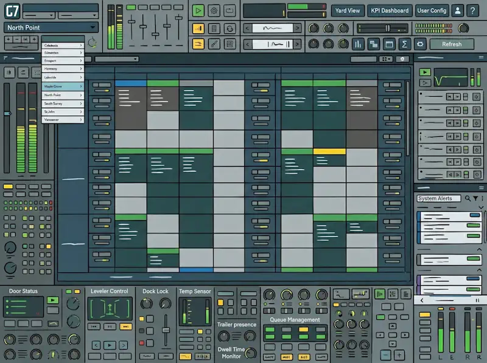
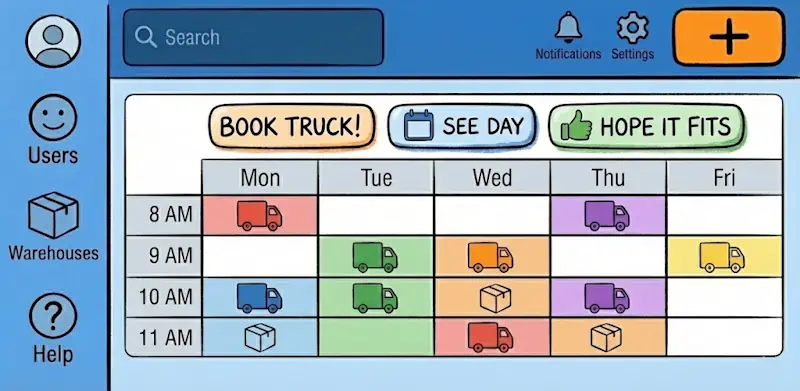
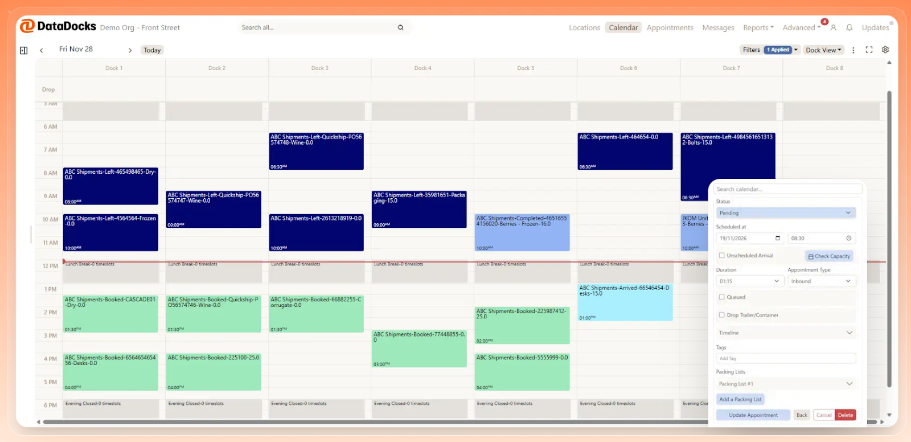
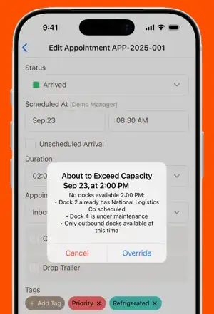
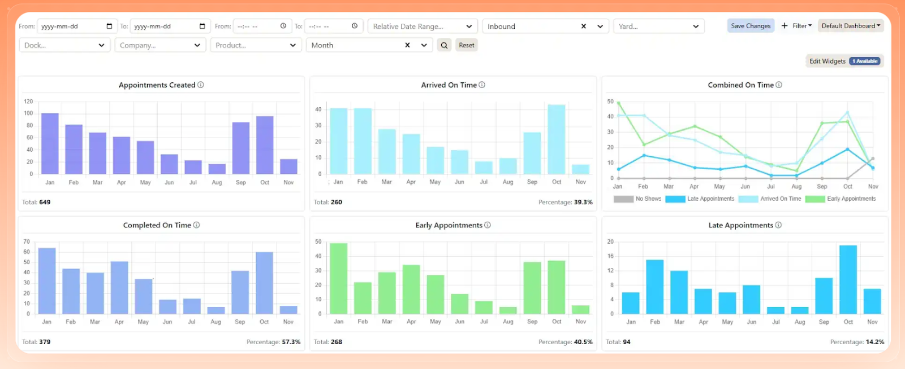
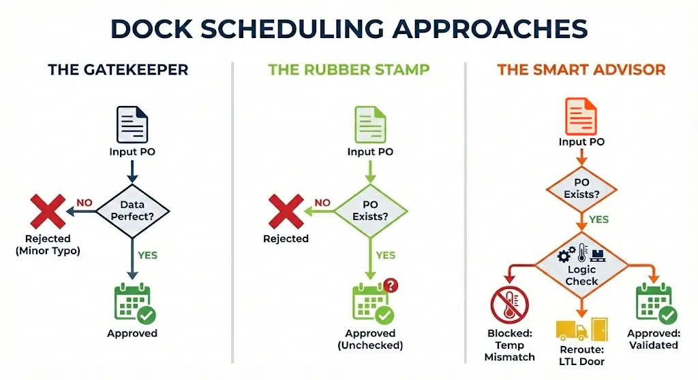
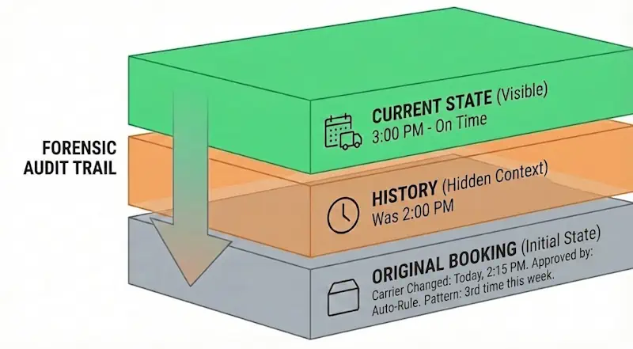
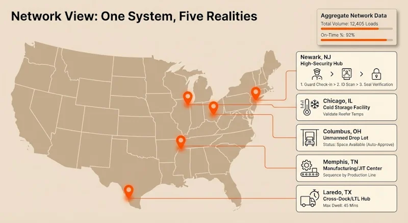
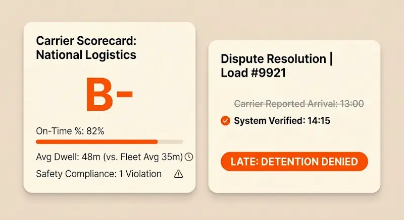
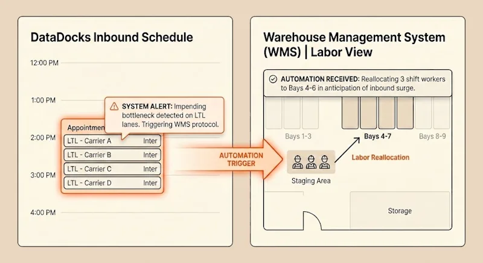

## **1\. You Do Need an "Idiot-Proof" Interface…**

Not because your team are idiots. Just that we all turn into idiots at 5 p.m. on a Friday when three unexpected trucks show up and we want to go home.

Enterprise dock scheduling software needs to be so intuitive that the guy in the guard shack isn’t tempted to bypass it, the new hire can pick it up in ten minutes, and no-one is about to wreck the whole schedule by pressing the wrong button.

For the most part, the market forces you to pick your poison:

*   **The heavy-duty SCM/ERP suites:** Using these tools feels like filing taxes. They make your team work for the software, rather than the software working for your team. The screens are dense with menus, tabs, and obscure buttons that your staff will never touch. The guard eventually just waves the truck through and scribbles the time on a clipboard, rendering your efforts useless.

*   **The lightweight appointment apps:** These tools feel like you’re booking a haircut or a dentist appointment, because that’s the DNA they were built on. They are super easy to use, but they lack operational awareness. They might stop you from double-booking a door, but they’ll happily let you book ten heavy floor-loads back-to-back, not registering the fact that you don't have the staging space or the forklift drivers to handle that volume.

What you really need is a smart tool that’s clean and minimal on the surface, but is backed up by a sophisticated AI-enhanced algorithm. Something that **hides the complexity until it’s needed:**

## **2\. …But You Also Need the Option To Break Glass**

When a hot load shows up unannounced or a VIP customer demands a slot right now, you don't need your system to be a stickler for the rules, you need it to let you bypass them.

Most enterprise platforms fail here because they act like the government. If you try to squeeze a truck into a full schedule, the ERP/TMS just says no. Or forces you to disable the limit entirely. A lot of the time it means getting IT involved.

On the other hand you’ve got the basic schedulers that let you blow past your limits without warning you about the impending bottleneck.

An enterprise dock scheduling system needs to act like a smart advisor. It should allow you to override your own rules but also show you the potential consequences of that decision.

## **3\. You Need To Translate Operational Reality Into Corporate Data**

Head office wants clean reports, but the shipping dock runs on chaos. Bridging that gap is usually a nightmare.

Legacy systems trap your data in complicated formats. Getting a simple customized report, like "average dwell time by carrier," means submitting a request to IT and waiting three weeks. Then you end up with the data they think you want, not the answers you actually need.

The standalone scheduling apps give you pretty graphs, but they’re often shallow. They might tell you a carrier was late, but they can't tell you _why_. Was it the guard shack, the staging area, or the driver? You want the full story.

A good dock scheduling system should capture every event on the floor, from check-ins to door assignments to load completions. And then automatically turn all that into the structured reports your bosses are asking for. It satisfies the corporate hunger for data without you having to spend your Friday afternoon filling out spreadsheets.

## **4\. You Need to Go Live in Weeks, Not Years**

You have trucks backing up onto the street _today_. You can’t afford to wait for the corporate ERP upgrade due for sometime next year to fix your scheduling problem.

The big ERP vendors make you wait. implementing a dock module from a major TMS or WMS suite is typically a 6-to-12-month nightmare involving steering committees, budget approvals, and consultants. By the time the software is actually live, your operational reality has probably changed.

The self-serve cloud apps have the speed problem covered. You can often turn them on in an afternoon. But then they trap you in a permanent silo. Six months later, when you want to connect the schedule to your warehouse management system to automate workflows, you hit a wall. You end up stuck with two systems that don't talk to each other.

You need a platform that starts giving you value in the first few weeks, but also evolves over time. You should be able to layer on smart automation, and you shouldn’t have to beg your IT team to set it up. Your software vendor should be the one doing that heavy lifting, setting up these specific workflows for you to take more manual work off your plate.

“

The positive impact has been felt across multiple areas of our business, and a cherry on top is the fantastic support we receive from the DataDocks team. No question is too small or silly—believe me when I say I’ve tested this out! Our contact is quick to respond with useful solutions.

Marcasa Ahlstrom Transportation Manager, Honeyville, Inc.

“

The transition to your platform has been transformative for our daily operations. What stands out most is the reliability and customizable features. Each time we speak with the support team we are shown new features or improvements. We appreciate how responsive and helpful the team has been.

Operations Manager Verst Logistics

## **5\. You Need to Stop Bad Bookings Before They Happen**

The most expensive mistake in logistics is a truck that drives all the way to your gate, only to be turned away because the appointment never should have been approved in the first place.

Strict, traditional systems try to prevent this, but go too far. They often reject valid bookings because of minor master data mismatches in the ERP. The system acts like a bouncer checking IDs, and you end up spending hours fixing data just to make it work.

The basic booking portal apps go to the other extreme: they are just spellcheckers. They check "Does this PO exist?" If yes, the booking is approved. They rarely handle the necessary logic, like checking if a frozen PO is being booked by a carrier with a dry van, or booking a two hour long appointment for an LTL shipment that only has two pallets.

You need a rules engine, not just a validator. The system needs to have mandatory fields that have to be filled out before someone can book an appointment. For example, "If the SKU is Ice Cream, require the carrier to confirm they have a reefer unit." Then you can layer on rules like "If the load is under 5 pallets, block the main doors and direct them to the LTL lane." You need to be able to set up these rules yourself in plain English, without calling IT.

## **6\. You Need a Time Machine to Settle Disputes**

Whether it's a carrier trying to charge outrageous detention fees on a truck that pulled up 4 hours later than scheduled, or a safety protocol that was mysteriously bypassed, you can't rely on "he said, she said." You need a forensic record.

Standard databases can log this, but they bury it in the basement. Finding out who deleted a specific appointment usually involves submitting a ticket to a database administrator and waiting days for a raw CSV export. It’s too slow to be useful when a driver is arguing at the window or a safety audit is in progress.

Simple web schedulers might show you "Last Modified By: Steve," but they rarely tell you _what_ Steve changed. Did he fix a typo, or did he override a critical weight limit rule? You see the final result, but you lose the story, making it impossible to reconstruct the timeline of an incident.

You need a platform that works like a DVR for your entire operation. It shouldn't just show you the schedule as it looks _now;_ it should let you rewind to last Tuesday at 2:00 PM to see exactly what the schedule looked like _then_.

## **7\. If You’re Responsible For Multiple Facilities, You Need a "General's Map"**

One of the persistent challenges for a regional operations director is balancing the corporate need for standardization with the unique local needs of different facilities.

Centralized systems usually force every facility to operate identically so the data rolls up easily. They try to clone your best facility and stamp it out across the country. But this ignores reality: your site in New Jersey has a full security team, while your site in Ohio is an unmanned drop lot. Try to force a drop lot to follow high-security workflows, everything falls apart.

Standalone scheduling apps tend to lack proper data boundaries, so when a coordinator at your Atlanta facility searches for a carrier or a PO, their screen gets cluttered with results from Seattle and Dallas. It creates a noisy, confusing interface for the staff on the ground. And for you, getting a clear performance view often means logging into disparate accounts or mashing together spreadsheets manually.

You need a platform that grants autonomy to each facility while keeping the network connected.

This means allowing each dock to have its own interface, and their own rules and door types. The software needs to actually fit the reality. But because they are all feeding into one system, you still get the high-level view. You can browse data across the group, run reports to spot systemic issues, and identify which facilities are dragging down your average, without making life harder for the teams on the floor.

## **8\. You Need a Referee, Not a Dictator**

You have to hold carriers accountable to their contracts, but you can’t afford to burn bridges. In the current market, the financial pain usually flows one way: carriers charging you for detention. If you don't have the data to defend yourself, you are writing blank checks.

The big supply chain suites track this data, but they lock it away in a black box. Using a WMS to dispute a detention claim involves pulling complex logs and manually correlating timestamps. It’s too much friction for a $75 dispute, so you often just pay it to keep the freight moving.

Basic slot-booking apps usually have a short memory. They are transactional tools designed to get a truck to a door, not analytical tools designed to measure performance over time. Their reporting is often weak—showing you who came today, but failing to highlight the trend of who has been late five times this month. You lack the aggregate data to negotiate better rates or hold carriers accountable during quarterly business reviews.

You need indisputable performance tracking. You shouldn't have to build a spreadsheet to see which carriers are dragging down your dock efficiency. You need a system that automatically generates a "Report Card" for every carrier—logging their on-time arrival percentage, their average dwell time, and their safety compliance.

And when a carrier tries to hit you with a detention fee, you need to be able to instantly pull the record that proves their driver arrived two hours late.

## **9\. You Need a Foundation for the Future**

Most companies buy software to fix a headache they have today. But in logistics, the goal posts are always moving. You need to build a foundation for the data-driven future.

Legacy systems often promise this future, selling you expensive modules for "AI-Driven Labor Management" and stuff like that. But then a door breaks down, or a priority load gets forced in and the algorithm just breaks.

Loading dock calendar apps might give you a little relief from today’s headaches but they lead you to a dead end. They’re not data platforms that can intelligently connect to enterprise systems down the line

Picture a world where your WMS gets a ping from your dock scheduling system that there’s an impending bottleneck, and automatically reallocates labor to the LTL lane to clear the backlog before the load even hits the dock. You can’t build that on a calendar app.

You can do it right now with DataDocks.

#### 
