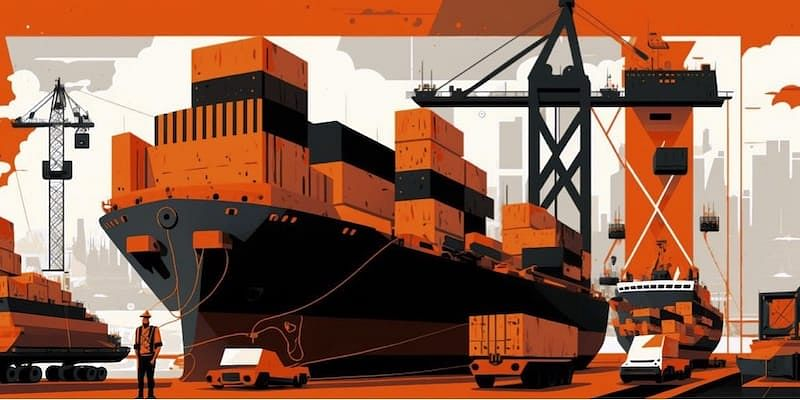
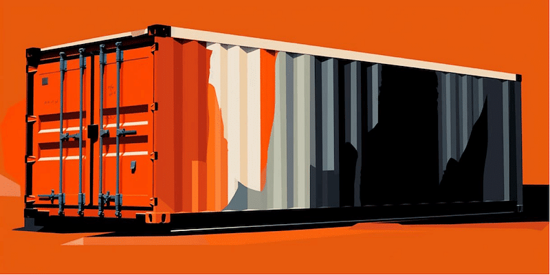

Demurrage and detention fees, along with chargebacks, fines and penalties, can wreak havoc on your logistics budget, not to mention damaging relationships with customers and suppliers.

As global trade expands and logistics grows more complex, businesses must be proactive in [managing their operations](https://datadocks.com/posts/warehouse-audit-checklist) to avoid unplanned costs. This article will offer practical strategies for reducing or eliminating such charges at various stages of the supply chain, helping your organization stay in control.

In today’s competitive marketplace, unforeseen events are all too common, leading to a multitude of potential penalties and financial pitfalls. By understanding the root causes of these costs and implementing mitigation strategies, companies can protect their bottom line and maintain a competitive edge.

We will explore specific approaches for addressing demurrage and detention charges in various areas of the supply chain, including:

*   Sea Ports
*   Air Freight
*   Railroads
*   Customs
*   Outsourced Services
*   Chassis and Container Rentals
*   Loading dock wait time
*   Ad-hoc accessorial services

## Reducing port storage, detention and demurrage costs

In the context of seaports, detention usually refers to charges incurred when a container is held outside the terminal beyond the agreed-upon free time, while demurrage applies to fees resulting from containers remaining inside the terminal past the allowed time. These definitions are reversed in some countries, such as in South America.

Storage fees, on the other hand, are charges for using port facilities to store goods or containers during their stay in the terminal.

One simple, proactive way to reduce these costs is to closely monitor shipment timelines and adjust them as needed. Collaborate with carriers and freight forwarders to ensure a comprehensive understanding of the estimated arrival time, the allocated free time at the port, and any potential delays.

This information allows businesses to make well-informed decisions regarding shipment scheduling and better coordinate container pick-up and drop-off.

Another approach is to optimize container usage by consolidating shipments whenever possible. Sharing container space with other shippers, known as less-than-container-load (LCL) shipping, can help reduce the number of containers that need to be stored or detained, subsequently reducing costs.

## Stopping air freight demurrage charges

Air cargo demurrage can become a significant burden for businesses if not properly managed.

One key aspect of air freight is the relatively short storage free time allowed at airport terminals compared to ocean freight. To tackle this, companies are well-served by investing in real-time shipment tracking, enabling them to closely monitor the progress of their cargo and promptly address any delays or discrepancies.

Air cargo runs on a tight schedule with little room for error. To minimize the risk of unexpected delays, businesses should have contingency plans.

Finally, understanding the specific regulations and requirements for air cargo shipments, such as dangerous goods and perishable items, is vital. Ensuring compliance with these regulations and working with experienced partners can help avoid delays and associated demurrage charges.

## Evading Railroad Demurrage fees

Railroad demurrage charges are incurred to compensate rail carriers when railcars are held either at their serving yard waiting to be ordered for placement or at a loading/unloading facility beyond the agreed-upon free time.

For companies that have direct involvement in rail freight, this is an issue of optimizing loading and unloading processes, which often comes down to effective training and clear instructions to staff.

But when the rail leg of the shipment is out of your control, your only option is to carefully negotiate contracts to ensure responsibility is fairly allocated, and audit and dispute invoices whenever possible.

## Avoiding customs detention penalties

Customs detention penalties occur when shipments are held by customs authorities for inspection, documentation issues, or non-compliance with regulations. To avoid these penalties, businesses are well-advised to:

*   **Ensure accurate documentation** : Properly complete and submit all required customs documents, such as commercial invoices, packing lists, and certificates of origin. Accurate and timely documentation helps prevent delays and associated detention penalties.
*   **Maintain compliance with regulations** : Familiarize yourself with the import and export regulations of the countries you trade with, including product-specific requirements, labeling standards, and licensing. Ensuring compliance reduces the risk of customs detention.
*   **Engage reliable customs brokers** : Partner with experienced and trustworthy customs brokers who can navigate complex customs procedures on your behalf. They can provide valuable guidance and ensure your shipments comply with all relevant regulations.
*   **Communicate with customs authorities** : Maintain a proactive and transparent relationship with customs authorities. Seek their guidance on regulatory compliance and promptly address any queries or concerns they raise about your shipments.

## Managing outsourced services to prevent hidden expenses

When companies with in-house capabilities turn to 3PL providers to handle surges in demand, unexpected costs can arise.

3PL contracts sometimes allow them to charge extra for late cancellations, inaccurate shipment information, repackaging, rush orders, excess inventory, hazardous materials handling, and ad-hoc accessorial services.

The key to avoiding unpredictable bills is to closely manage those 3PL relationships, including making use of:

*   **Comprehensive contracts** : Develop detailed contracts that outline the scope of services, pricing structures, and any additional fees that may be incurred for unexpected scenarios. This helps create transparency and sets boundaries for potential costs.
*   **Invoice reviews** : Closely examine invoices from the 3PL to identify discrepancies or unexpected charges. Promptly address any concerns with the provider to resolve billing issues and prevent future occurrences.
*   **Performance Monitoring** : Continuously track and evaluate the performance of the provider, including their adherence to SLAs and the overall quality of service. Address any issues and collaborate on improvements to prevent cost overruns.
*   **Forecasting and planning** : Accurately forecast demand and share this information with the partner to help them allocate resources efficiently. Proper planning enables the 3PL to meet your needs without incurring additional costs due to last-minute changes or unexpected demands.

## Getting chassis and container rental expenses under control

Although chassis and container rental expenses are closely related to maritime detention, they can also occur in other parts of the supply chain.

For example, for temporary projects, during surges in demand, or in the event of an emergency, it may be necessary to rent additional equipment, not only from a seaport or ocean carrier but from other partners, each of which may have their own rules.

To keep these costs under control, it’s a good idea to accurately forecast your needs and take the time to properly negotiate these rental contracts.

There are a number of innovative alternatives available like collapsable or modular shipping containers. It can also be lucrative to partner with local businesses that hold onto equipment that goes unused for much of the year, like farms.

This is also true in reverse: if it’s difficult to justify the purchase of additional vehicles, you might even consider sharing them or renting them out to non-competing organizations nearby, like driving schools.

## Eliminating downstream customer chargebacks

Chargebacks can be levied by retailers or distributors against their suppliers for a number of reasons.

For late arrival of a shipment, a customer might levy 2-3% of the cost of the order, or in extremely time-sensitive industries it could be as high as 50%. It’s not unheard of for a desperate retailer to falsely claim a 100% chargeback for non-arrival of goods in the hopes of taking some pressure off their finances.

If a shipment arrives with damaged items or the goods don’t meet the agreed-upon specifications, customers might impose fees to recover the cost of resolving the issue. Suppliers may even face chargebacks for incomplete documentation.

All of this is to say, always read the contract.

But what about disagreements that are not covered by the specific terms of the contract? One extreme example is a retailer demanding compensation for unauthorized use of resources by a supplier or carrier.

So once again, contracts are important but it’s also about relationships, visibility, and running efficient operations.

## Dealing with driver detention at the loading dock

Finally, to deal with fees levied by carriers and suppliers for [truck dwell time](https://datadocks.com/posts/dwell-time-in-trucking) at your facility, it’s essential to streamline and optimize your loading and unloading processes.

Collaborate with your partners to ensure efficient scheduling, and communicate clearly with all parties involved. Implement technology solutions, such as [dock scheduling](https://datadocks.com/), to help minimize wait times and improve accountability.

For more in-depth information and tips on dealing with driver detention at the loading dock, take a look at [**The Ultimate Guide to Driver Detention at the Loading Dock**.](https://datadocks.com/posts/ultimate-guide-to-supply-chain-visibility-for-industry-professionals)

