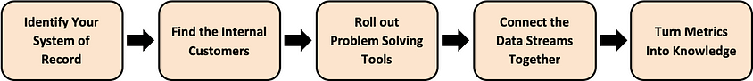

‍

ERP systems and all-in-one supply chain management suites often don’t live up to expectations. Once implemented, they’re also hard to replace.

As a result, operations managers tend to respond to new business challenges by adopting specialized tools. While that can solve short-term pain points, it can also create data silos and undermine supply chain visibility.

The truth is simple: there’s no single silver bullet that will transform operations overnight. Digital maturity is achieved step-by-step, not by a single platform purchase.  
‍

## A New Software Landscape

Legacy vendors can’t keep pace with today’s vibrant SaaS marketplace.

Thousands of companies now build tools that do one thing , and do it well, often founded by logistics professionals who tie their success to their customers’ outcomes.

To stay competitive in a data-driven world, supply chain organizations must embrace this modular approach to technology.

## How to Make Your SCM Tech Stack Work

### 1\. Identify Your System of Record

*   Determine your operational center of gravity.
*   Which system or module handles the most heavy lifting?
*   Treat this as the **brain of your data architecture**. Build around it — and avoid disrupting it unless the benefits are clear.

### 2\. Find the Internal Customers

*   Identify people who are frustrated by inefficient processes and motivated to drive change.
*   These champions will help define needs and explore solutions.

### 3\. Roll Out Problem-Solving Tools

*   Evaluate software that meets your requirements.
*   Talk to vendors about support, stability, and data transferability between their product and your core system.
*   Cast the net wide, modern SaaS vendors vary in flexibility and expertise.

### 4\. Connect the Data Streams

*   Decide what strategic data these tools can generate and how it should flow in and out of your system of record.
*   Engage vendors or API specialists to enable the right integrations.
*   Plan the data flow before connecting: legacy systems use batch based EDI-modern SaaS tools use real-time APIs.
    *   Each has trade-offs in speed, cost, and partner adoption [(see _EDI vs API_ overview)](https://datadocks.com/posts/edi-vs-api).

### 5\. Turn Metrics into Knowledge

*   Use the data from these connections to guide decisions.
*   Make insights accessible and understandable for key stakeholders.
*   Identify visibility gaps and close them gradually, moving toward true end to end insight.

## Rethinking IT and Procurement

Each of the supposed benefits of consolidating software under a single supplier has eroded in recent years:

### **Continuity:**‍

Legacy vendors once felt “safe,” but many now retire old products to push customers into costly new contracts.

### **Licensing & Asset Management:**‍

Working with fewer vendors used to simplify compliance.

Today, modern SaaS contracts are lightweight, self-serve, and easy to cancel, no audits, no red tape.

### **Support:**‍

True partnership and product expertise are now more common among younger, niche vendors who understand logistics operations firsthand.

### **Data Architecture:**‍

APIs have matured so much that it’s often easier to connect tools from different vendors than two legacy systems from the same provider.

| Category | Legacy Vendors | Modern SaaS Vendors |
| --- | --- | --- |
| **Continuity** | Seen as “safe,” but often discontinue old products to push customers into new, expensive contracts. | Offer flexible, product-led models with frequent updates and clear roadmaps. |
| **Licensing & Asset Management** | Complex, audit-heavy, long-term contracts. | Lightweight, self-serve subscriptions that are easy to add, cancel, or scale. |
| **Support** | Generalist account managers, limited operational insight. | Deep practitioner expertise and faster response from smaller, focused teams. |
| **Data Architecture** | Closed systems, difficult integrations—even within same vendor. | Open APIs and interoperability across platforms. |

‍

## Case in point: Loading Dock Operations

DataDocks builds software that helps facilities optimize shipping and receiving processes.

At the heart of this is dock scheduling, having carriers book appointments in advance through a dashboard.

This eliminates long truck lines, spreads loads across the day, and improves timing predictability.

“Do you have a line of trucks outside your facility, going all the way down the road?”  
‍

While many WMS or TMS platforms _claim_ to include dock scheduling, it’s often an afterthought.  
Shipping coordinators still rely on Excel spreadsheets to manage incoming and outgoing loads.

When companies start using DataDocks, they rarely need to change their core architecture.  
Instead, DataDocks becomes a streamlined interface for communicating with carriers and planning dock workflows, later feeding structured data back into systems of record like WMS or TMS.

On paper, many warehouse or transportation management systems include some kind of dock scheduling. But it tends to be an afterthought…

Shipping and receiving coordinators are often left relying on a jumble of excel spreadsheets to track incoming and outgoing loads.

Typically, when a company starts using DataDocks it does not make any immediate changes to its software architecture. Instead, DataDocks acts as a streamlined interface for communicating with carriers and planning workflows in the loading dock. Soon enough it can feed data back into the system of record, be it a WMS, TMS or something else.

**_“The real winner with this browser based service is its simplicity and logical use. I do not mean code logic, I do mean logical user flow… The UI is clean and straightforward.”_**

**Marvin Feige, GSK** - Review of DataDocks

## Closing Thoughts

In the early 2000s, supply chain businesses trusted legacy software vendors to support them and act as innovation partners. Many came to regret it. Companies found themselves unable to escape from punitive contracts, paying for systems that quickly depreciated and ceased to be fit for purpose.

Today, operations leaders are once again under pressure to digitize. Some are hesitant to invest in yet more cumbersome technology, while the most obvious alternative - developing systems in-house - seems absurdly resource-intensive and risky.

There is a third option; one that allows companies to achieve tangible benefits in the short-term, while gradually working towards the longer-term goal of supply chain visibility. But it requires a shift in mindset, particularly with regards to procurement.

As [Norm Pollock writes for TransImpact](https://transimpact.com/data-interoperability-and-the-logistics-technology-stack/):

_"Companies are no longer beholden to a large TMS or other types of technology platforms that try to be everything to everyone. Specialized logistics applications do specific things better, and data interoperability makes more systems more accessible, at a lower cost… both shippers and logistics services providers \[can\] build combinations of logistics applications that do exactly what they need them to do."  
_

## Key Takeaways

*   Build around your system of record, not against it.
*   Identify internal champions to drive adoption.
*   Use APIs or EDI integrations to connect specialized tools.
*   Prefer modular SaaS vendors with strong support and open architecture.
*   Measure success through data visibility and informed decision-making.