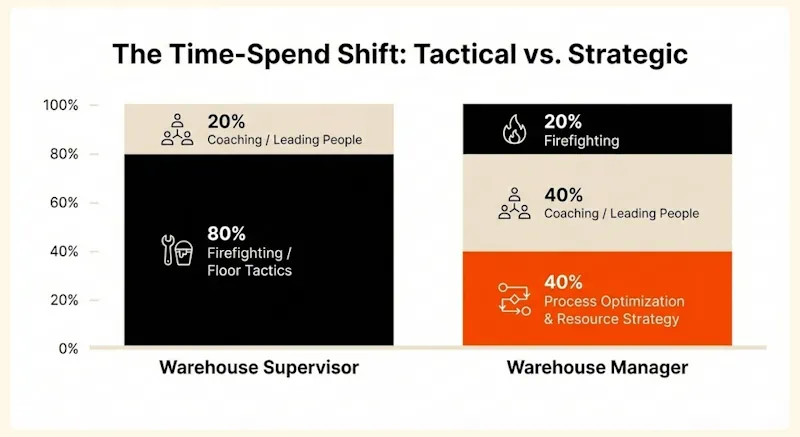
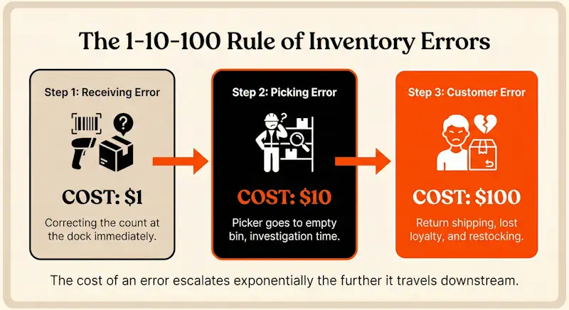
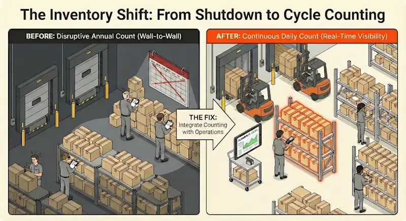
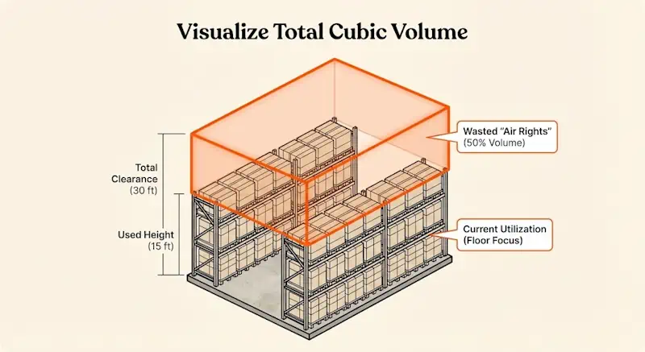
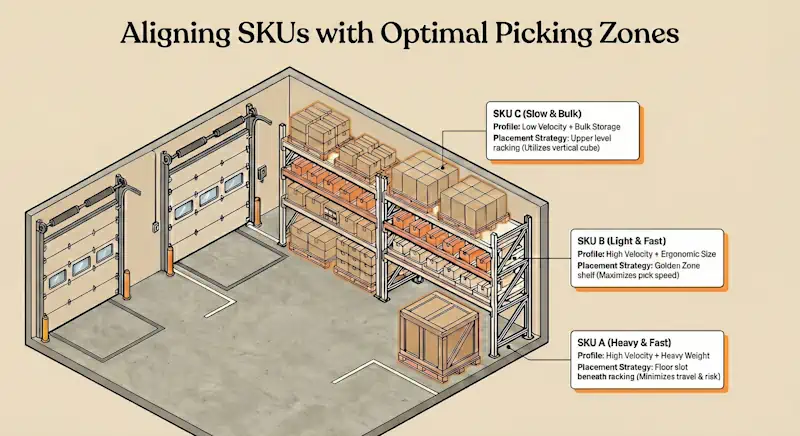
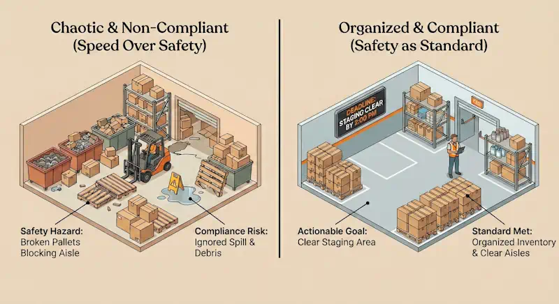

‍

<lite-youtube videoid="EBz5ZOUYNZY" playlabel="Play: How to Solve 5 of the Most Costly Warehouse Management Challenges"></lite-youtube>

A good warehouse manager has to be resilient and adaptive. You must be prepared for the unexpected while pushing for continuous improvement. Running a successful warehouse is rarely straightforward. Managers often face a trial by fire, navigating staffing issues, equipment failures, and upstream disruptions, sometimes all at the same time.

At any moment, you might be surprised by staff shortages, supply chain disruptions, or internal stakeholders with unrealistic expectations. All of this contributes to chaotic warehouse management, where you spend more time fighting fires than optimizing operations.

But chaos is not inevitable. By identifying the root causes of these issues and eliminating bad warehouse practices, you can bring order to the floor. Here is how to overcome the top 9 challenges facing warehouse managers today.

## **1\. Inventory Accuracy & Out-of-Stock Issues**

Poor inventory accuracy results in lost sales, overstocking, and frustration. A Swiss study on retail supply chains found that even an inaccuracy of 2% has a significant business impact. Executives rely on warehouse managers as the first line of defense against these issues.

Even when warehouse processes seem to be working well, manual counts tend to reveal discrepancies from what your systems expect. To get the situation under control, a warehouse manager must conduct a rigorous root cause analysis. Factors often include:

*   The impact of storing the same SKU in multiple locations.
*   Frequent changes to the inventory mix.
*   Tech issues, such as faulty barcode scanners.

### **The Fix: Real-Time Cycle Counting**

Nothing kills profitability faster than solving out-of-stock issues after an order has already been placed. You need proactive visibility.

First, make sure your team knows that counting tasks are not just busywork. Explain to them how much inventory accuracy affects the health of the business so they can understand the importance of their role.

Next, implement systematic cycle counting, isolating sections of the inventory to quickly identify and address specific problem areas. This targeted approach allows for immediate corrections. Finally, start at the loading dock. Unnoticed discrepancies in what is actually received from suppliers will permeate through your system and soon become invisible.

‍

## **2\. Warehouse Losses & Quality Control**

Human error, environmental factors, accidents, inadequate packaging, and even natural disasters can seemingly conspire to keep you from hitting your KPIs. **Warehouse losses** due to damage or theft often stem from poor inspection processes at the very beginning of the flow.

### **The Fix: Standardized Receiving Inspections**

To tackle this, warehouse managers must combine preventive measures with strict **warehouse quality control**.

*   **Preventive measures:** Include proper staff training, sufficient lighting, and improvements to storage equipment. Specific training on proper handling techniques can significantly reduce accidental damage.
*   **Mitigation strategies:** Enforce Standard Operating Procedures (SOPs) for receiving. If the problem starts with goods received, the only solution is to ensure proper packaging and handling before the goods enter your stock.

Establishing a supplier scorecard system can objectively evaluate and communicate performance expectations, leading to better accountability.

## **3\. Warehouse Worker Challenges & Retention**

High levels of labor turnover have become normalized in logistics. As a result, warehouse managers often work with teams that don't operate at peak efficiency due to poor morale and a lack of familiarity with the facility. This creates a vicious cycle where the manager must devote more time to training and less to operational thinking.

### **The Fix: Equitable Workloads & Career Pathing**

**Managing warehouse employees** effectively requires more than just filling shifts; it requires a strategy for retention.

In some cases, there is a tacit understanding that a person will stick around for a few months before moving on. However, getting to know workers, what they hope to get from the job and where they hope to go next, is the most valuable thing a manager can do to combat attrition.

If warehouse managers can find opportunities for these workers, such as tasking them with learning the ins-and-outs of the WMS or coaching them to lead others, the morale boost is worth the effort. By providing clear career pathways, you turn a temporary job into a profession.

## **4\. Equipment Management Challenges**

The repercussions of sudden equipment failure can be dire. Lost productivity, delayed shipments, and the risk of workplace accidents make proactive management essential. Many warehouses today lean towards outsourcing maintenance, but this carries risks such as loss of control over the supplier.

### **The Fix: Preventive Maintenance Plans**

A key strategy is setting up a comprehensive maintenance schedule rather than relying on reactive repairs. Each piece of machinery needs regular check-ups and real-time wear monitoring.

Strategic planning is vital for creating maintenance windows. By aligning with logistics, inventory, and operations teams, maintenance can occur without disrupting productivity. For example, implementing a dynamic scheduling system for the dock can create predictable maintenance opportunities between shipments.

## **5\. Warehouse Space Problems & Utilization**

Rapid business growth can lead to congestion. When sales exceed expectations, warehouses may find themselves struggling to keep up. Inefficiencies appear and quickly get baked into daily operations. Conversely, sudden drops in sales can lead to underutilized resources.

Warehouse clutter, a byproduct of these fluctuations, can lead to unsafe working conditions and a higher risk of stock damage.

### **The Fix: Dynamic Slotting & Vertical Racking**

The fastest way to "expand" your warehouse without signing a new lease is to look up. Many managers fixate on floor square footage, effectively ignoring the "air rights" they are already paying for. To solve warehouse space problems, you must shift your focus from floor area to cube utilization.

If your facility has vertical clearance, utilize it. Implementing high-bay racking or installing a mezzanine floor for slow-moving SKUs (C-items) or value-added service areas can instantly increase your storage density by 30-50%.

Once the vertical space is activated, you must optimize _where_ items live based on their movement. Stop using static bin locations. Instead, implement dynamic slotting based on SKU velocity:

*   **The Golden Zone:** Place your high-velocity "A" items (the 20% of stock causing 80% of movement) in the most accessible locations—typically waist-to-shoulder height and closest to the shipping dock.
*   **The Deep Storage:** Move low-velocity "C" items to the highest racks or furthest aisle positions.

By reorganizing slotting based on velocity, you not only reclaim floor space but also drastically reduce travel time for your pickers, hitting two efficiency KPIs with one initiative.

In addressing the unpredictability of space needs, a warehouse manager's approach needs to be flexible. It implies establishing a system where space is optimized for the velocity of goods, rather than static storage.

## **6\. Supply Chain Visibility & Planning**

Whether it's a supplier going bankrupt overnight, a natural disaster, or an outbreak of poor quality control, warehouse managers often take the fall for upstream issues. This phenomenon is more pronounced in demand-oriented companies where the warehouse is the shock absorber for the rest of the chain.

### **The Fix: Building a Warehouse Contingency Plan**

You cannot control the supply chain, but you can build a **warehouse contingency plan**.

Hard numbers justify your decisions and help you build a more resilient kind of trust with stakeholders. Investing in analytics tools can be a game-changer, providing real-time insights into supply chain activities. This allows you to anticipate problems—like a delayed shipment—before they occur and present data-backed scenarios to stakeholders rather than just apologies.

‍

## **7\. Bad Warehouse Practices & Process Gaps**

Whether or not warehouse managers seize the initiative, warehousing is quickly becoming a data-driven discipline. Most warehouses still struggle with outdated systems and manual processes, leading to inconsistencies and errors. These **bad warehouse practices** create data fragments that make it impossible to see the big picture.

### **The Fix: Moving from Chaos to Automation**

New tech is designed for a world where business data is clean and accurate. Sensors and digital inputs can reduce errors and streamline the data-gathering process.

Warehouse managers can find easy win-wins with carriers and suppliers by automating simple touchpoints. For example, working together to speed up truck turnaround times at the loading dock doesn't require complex data-sharing protocols—it just requires a platform where partners can log in to book appointments. This move from manual spreadsheets to **automation** is often the first step in stabilizing a chaotic operation.

## **8\. Retail Warehousing & Safety Compliance**

Retail warehousing operates under a microscope. With high-velocity consumer goods, the pressure to move product quickly often leads to cutting corners on safety. When supervisors focus solely on throughput, the warehouse environment deteriorates—broken pallets are left in aisles, spillages are ignored, and zones become cluttered. In this sector, where compliance audits regarding expiration dates or hazardous materials are strictly enforced, a messy warehouse isn't just an eyesore; it is a liability that can shut down operations.

### **The Fix: Unambiguous Standards & Time-Bound Goals**

Compliance is not achieved through vague "safety first" slogans; it is achieved through specific, actionable leadership.

*   **Eliminate Ambiguity with Deadlines:** A common mistake is issuing vague directives like "we should really clean up this area." This signals to the team that safety is a secondary priority. Instead, managers must utilize specific deadlines to drive action: "This staging area must be cleared of debris by 2:00 PM today." As noted in management training, attaching a clear time and date to a task transforms it from a suggestion into a priority.
*   **Address Visual Cues Immediately:** Managers must not walk past a broken pallet or a blocked fire exit without addressing it. Ignoring small infractions signals that standards are optional.

**Incentivize Safety:** Use the last few minutes of daily stand-ups to shout out employees who proactively addressed a safety hazard or adhered to a complex protocol. Rewarding compliance is just as important as rewarding picking speed.

## **9\. Warehouse Bottlenecks & Real-Time Problem Solving**

The loading dock is often the biggest bottleneck. No visibility and unplanned arrivals lead to congestion, detention fees, and frustrated carriers. If you want to be methodical about fixing your warehouse, the loading dock is the most logical place to start.

### **The Fix: Digital Dock Management & Scheduling**

Bottlenecks happen fast. You can't rely on end-of-day reports. You need **real-time problem-solving** capabilities.

The only way around this is to implement dock scheduling. Even then, you need a way to incentivize partners to arrive on time. A dock scheduling platform collects data on the timings of loads, so you can get more accountability into the conversation with partners. Over time, carriers improve their performance because they can see how arriving on time gets their loads worked faster.

\## Bibliography

*   Fleisch, Elgar, and Christian Tellkamp. “Inventory Inaccuracy and Supply Chain Performance: A Simulation Study of a Retail Supply Chain.” International Journal of Production Economics. Elsevier BV, March 2005. [https://doi.org/10.1016/j.ijpe.2004.02.003](https://doi.org/10.1016/j.ijpe.2004.02.003).

*   Mangano, Giulio, and Alberto De Marco. “The Role of Maintenance and Facility Management in Logistics: A Literature Review.” Facilities. Emerald, April 1, 2014. [https://doi.org/10.1108/f-08-2012-0065](https://doi.org/10.1108/f-08-2012-0065).