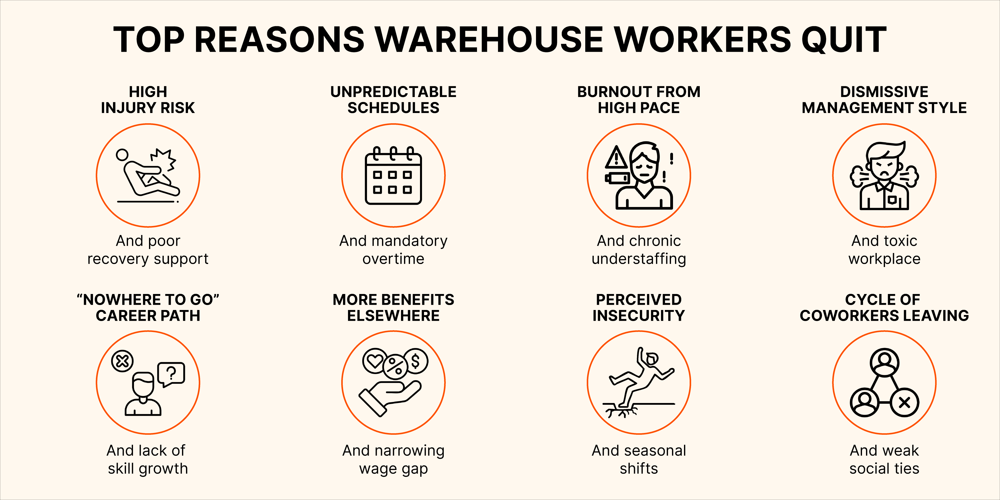

‍

A shortage of experienced warehouse staff exposes your business to hidden risk. What starts as a gradual build-up of congestion can quickly turn into logistics gridlock. Sooner or later you have painful problems to deal with, like incomplete inventory, missing goods and furious customers.

Supply chain companies must become more desirable employers. That means offering better opportunities for advancement. Reinforcing that with superior on-the-job quality of life adds up to a powerful incentive to stay for longer.

Of course there’s also enormous pressure to make logistics more efficient. It may seem like a zero sum game balancing costs with speed and systemization, but there’s a way to tackle all of it at once.

The answer is people-centered change.

## How to Reduce Warehouse Turnover

‍

‍

### 1\. Become more Digitally Mature

What almost all of the most effective warehouses have in common is the use of advanced technology.

But the type of technology and the way it’s deployed varies widely.

For example, some of the world’s biggest retailers address the turnover problem with systems that track the efficiency of each employee, which closes the productivity gap between new and experienced associates. This makes the job more stressful but such companies are also able to pay higher wages, ensuring a constant supply of applicants.

Other companies take the opposite approach. Empowered with the right technology, warehouse associates can do more than move materials. They can generate valuable data, identify process optimizations and pick up the kind of operational knowledge that allows them to take on additional responsibilities and thrive.

But what is the ‘right technology’?

### 2\. Ask Your Warehouse Employees Where to Find the Bottlenecks

With the increasing plurality of software and systems, top-down process transformation is becoming obsolete.

Digital change is more successful when it’s done in consultation with the people affected. The earlier they’re brought in, the better. It’s usually quite straightforward to map the day-to-day workflow frustrations of warehouse associates, supervisors and coordinators to wider business needs. For example:

‍

| **Employee Need** | **Business Need** |
| --- | --- |
| “I wish I could get home on time” | Reduce overtime expenditure and other unpredictable costs. |
| “I’ve been doing the same job for years” | [Recruit supervisors](https://datadocks.com/posts/warehouse-recruiting), managers and technology experts who understand the business. |
| “I go the extra mile and it goes unnoticed” | Improve productivity, establish best practices and predict throughput. |
| “Bursts of intense work are putting a strain on my health” | Avoid corner-cutting that can lead to material loss, equipment damage or OSH violations. |
| “Inspection and putaway procedures are not clear or consistent” | Speed up cycle time, improve inventory accuracy and make data more available. |

‍

With these alignments identified, the next step is to carry out small change projects with both employee and business needs in mind.

‍**‍**

### **3\. Take Working Ergonomics More Seriously**

Clutter is both a cause and a symptom of the kind of underlying warehouse disorder that makes workers unhappy. 

Tasks that are considered low-priority simply never get executed in high-pressure warehouses. Over time this creates an environment that is unpleasant and frustrating to work in, with each process requiring more effort than it reasonably should, but little hope for ironing out those creases.

There’s nothing more demotivating than coming into work every day to fight what seems to be a losing battle. Hard work is rewarding when things seem to be moving in the right direction. Less so when the view from the floor is that operations are breaking down - a view that sometimes goes unnoticed by leadership, whose key metrics may tell a different story.

But ignoring these problems will have consequences, not just in terms of labor but also for innovation and competitive advantage. A disordered warehouse is much harder to change, and especially harder to rationalize with more advanced systems.

The direct solution would be additional labor - but that’s out of the question for any warehouse operating on a tight budget.

‍**‍**

### **4\. Hire the Right People in the First Place**

When it comes to reducing turnover and enhancing warehouse operations, the recruitment process plays a pivotal role.

An [intentional approach to hiring](https://datadocks.com/posts/warehouse-recruiting), which includes thorough interviews and considering candidates for their attitude and potential, not just experience, can lead to a more resilient team. This approach not only reduces turnover but also boosts overall productivity and workplace morale.

It's important to communicate the realities of the job, including its challenges and rewards, in a straightforward manner. This approach sets clear expectations from the outset and respects candidates by not sugarcoating the nature of the work. It also helps in attracting individuals who are genuinely interested and prepared for the job's demands.

‍**‍**

### **5\. Improve Your Onboarding and Incentives**

Effective onboarding in a warehouse goes beyond basic job training. It should clearly establish expectations, and include information about shifts, breaks, and the availability of resources and support. Ensuring new hires understand the workflow can reduce the initial overwhelm and set them up for success.

Onboarding should involve establishing connections with more experienced colleagues who can offer guidance and support. A practical onboarding program should include comprehensive safety training, ergonomic practices, and realistic job previews. This approach ensures that new employees are not only aware of their tasks but also understand how to perform them safely and efficiently, minimizing the risk of injury and burnout.

When it comes to incentives, it's important to recognize what genuinely motivates warehouse staff. Financial bonuses are always appreciated, but incentives can also be tailored to acknowledge the physical nature of the work. For example, offering additional days off, recognition for consistent performance, and opportunities for less physically demanding roles. These incentives show commitment to the well-being of the staff.

Additionally, creating opportunities for skill development, such as training for new technologies or processes, can be a powerful incentive. This not only aids in personal growth but also enhances the overall efficiency of the warehouse operations.

‍

### **6\. Support Your Employees to Find Their Next Opportunity**

For most individuals, warehouse roles are not lifelong careers but stepping stones.

Embracing this reality, companies can offer resources and support to help employees develop skills and qualifications that extend beyond their current roles. This could involve providing access to training programs, workshops, or courses that are not only relevant to warehouse operations but also applicable in broader contexts. 

By investing in the development of transferable skills, such as leadership, problem-solving, and technical proficiency, employers show a commitment to their employees' long-term career prospects. 

Furthermore, creating a culture of open communication about career aspirations is beneficial. Encouraging employees to discuss their future goals and offering guidance on achieving them fosters a positive and supportive work environment. This can also include providing references for future employment.

By supporting your employees in finding their next opportunity, you build a reputation as an employer who cares about their workforce's future. This, in turn, can attract more dedicated and ambitious individuals to your organization, creating a cycle of continuous improvement and positive growth.

‍

‍

## **Will Automation Solve the Warehouse Turnover Problem?**

‍

An argument put forward in some supply chain circles is that labor problems will fade away as industrial robots become more advanced.

This point of view grossly underestimates the complexity of integrating such systems, and the enormous size of the competitive advantage for those that do so strategically instead of rushing in blindly.

When the next generation of automation matures, the winners of the ensuing shake-up will be the companies that can get enthusiastic participation from the workforce.

Even advanced robots need to be trained and supervised. The most useful applications involve a significant degree of collaboration with human operatives, and designing effective workflows requires input from the people who know those processes best.

In other words, ignoring the problem in the hopes it will go away by itself is a doomed approach.

‍

## **Why Do Warehouses Have High Turnover Rates?**

‍

‍

What are the real drivers behind the ‘great resignation’?

Part of the problem may be a lack of confidence in the future. A constant sense of urgency has emerged, where short term concerns regularly take precedence over the long term. Some of the largest employers pay sign-on bonuses, and one-off ‘gig work’ is more immediately lucrative for many workers.

On top of that, the baby boom generation has started to retire, and there are simply not enough people to replace them.

The logistics industry in particular seems to suffer from a vicious cycle, ever more dependent on temporary staffing agencies, with less commitment to developing people over the long term. Many warehouse workers report feeling treated disrespectfully on the job, while others point to a lack of clear feedback.

Retaining warehouse employees requires a vision for the future.

For any supply chain company, hiring and developing young people should be a c-suite concern. This is the most direct route to create a generation of future leaders for the business. Meanwhile, employers need to give their warehouse associates a chance to invest in their own futures. A good starting point for that is more consistent work schedules, so they have energy for their families and their health.

‍

## **The Financial Consequences of High Employee Turnover Rates**

‍

‍

Every time an employee leaves, the company incurs expenses in advertising the position, conducting interviews, and onboarding new hires. Furthermore, the training process involves not just direct costs like training materials and trainers' time, but also the indirect costs of reduced productivity as new employees ramp up to full efficiency.

High turnover leads to a constant state of flux within the workforce, resulting in lost productivity and a sense of instability and uncertainty among the workforce, which can decrease overall employee engagement. 

Experienced workers who leave take with them valuable knowledge and skills, which are not immediately replaceable. The time it takes for new employees to reach the productivity levels of their predecessors can significantly affect operational efficiency and output. This can create a negative cycle where the strain on existing employees leads to further turnover..

New staff may lack the experience or understanding of company standards, leading to errors and a decline in the overall quality of operations. This can have a knock-on effect on customer satisfaction and the company's reputation.

Finally there’s the opportunity cost. Time and resources spent on managing turnover could have been invested in strategic initiatives, such as process improvements or expansion strategies, that contribute to the company’s growth and competitiveness.

‍

## **How Implementing DataDocks Reduces Warehouse Turnover**

‍

‍

Warehouses should look for projects that can advance their level of digital maturity while simultaneously improving quality of life for their workforce.

One low-risk, high-reward example is implementing dock scheduling.

Some form of this is probably available through your WMS, or can be acquired cheaply with basic appointment scheduling software. Unfortunately, these tools tend to barely improve on excel spreadsheets in practice, with clunky user interfaces or poor security. They may even miss essential features like automatic notifications when the schedule is changed.

Getting dock scheduling right requires a phased approach that gets carriers on board. What starts with a vague agreement to make appointments and attempt to meet them gradually becomes an analytical conversation, backed by data: “the closer your trucks arrive to their scheduled time, the faster we can work them.”

Before long, loads are coming in and out at a steady rate, the shipping and receiving team knows what to expect, and everyone working in the loading dock gets home on time. 

A win like that in the most chaotic process of the whole warehouse cycle soon percolates out into other areas of warehouse operations. Efficiency improves, morale improves and retention improves.

‍**For an in-depth discussion of what DataDocks can do for your warehouse,** [**book a demo with our team**](https://calendly.com/nick-rakovsky/datadocks-demo?month=2022-09) **or call us on (+1) 647 848-8250.**

## ‍

<lite-youtube videoid="CGy9deNE7Us" playlabel="Play: 6 Ways Most Warehouse Managers Try to Cut Overtime"></lite-youtube>

\## Bibliography

*   Min, Hokey. "[Examining sources of warehouse employee turnover](https://www.emerald.com/insight/content/doi/10.1108/09600030710758437/full/html)" International Journal of Physical Distribution &amp; Logistics Management. Emerald, June 19, 2007. https://doi.org/10.1108/09600030710758437.
*   Tare, Alec M. "[Thinking Outside The Box: The Potential of Management Training for Reducing Turnover in Warehouse/Distribution Environments.](https://jche.journals.villanova.edu/index.php/concept/article/view/2679)" CONCEPT 45 (2022).
*   Hicks, Simone D. "[The Impact of Servant Leadership on Employee Turnover in a Warehousing Environment](https://scholarworks.waldenu.edu/cgi/viewcontent.cgi?article=14694&context=dissertations#:~:text=Servant%20leadership%20has%20a%20positive,Jang%20%26%20Kandampully%2C%202018\).)." PhD diss., Walden University, 2022.
*   Gutelius, Beth, and Nik Theodore. "[The future of warehouse work: Technological change in the US logistics industry.](https://laborcenter.berkeley.edu/pdf/2019/Future-of-Warehouse-Work.pdf)" (2019).