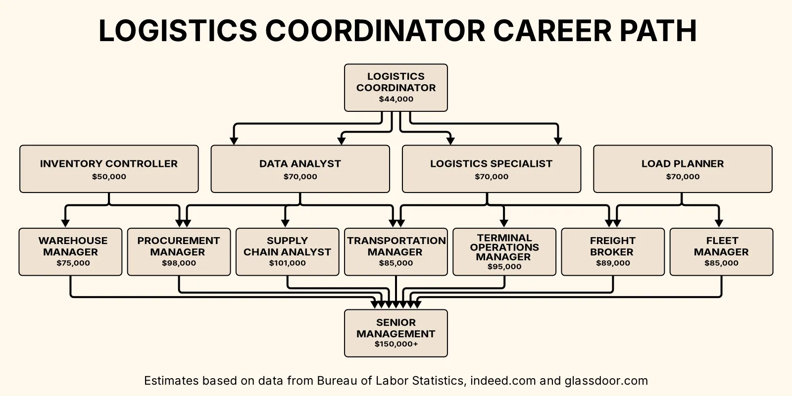

import LeadMagnetForm from '../../components/LeadMagnetForm.astro';

A logistics coordinator plays a central role in keeping modern supply chains running smoothly, which is why logistics has become such a demanding yet rewarding career path. As businesses place increasing importance on operational efficiency, companies with strong logistics coordination can consistently outperform competitors on price, quality, and speed.

It’s also a field where there are lots of ways in: some logisticians go to college for years to learn a lot of theory, others work their way up from manual jobs. The logistics coordinator position is a route for people with some customer service and computer skills, who can learn by doing and find their own ways of solving problems.

It’s not for everyone. The first part of this guide aims to help you save time by ruling this pathway out if it doesn’t seem right. The second part will help you understand how the coordinator role fits into logistics as a whole, and suggest some alternative routes for if you’re more academic, technical or practical.

The third part of the guide will cover earnings potential. It’s a complex topic as pay can be completely different based on industry, location, level of experience, and even subtle nuances of different roles with the same job title. The fourth part will talk about how to actually land one of these jobs.

If you’ve already got interviews lined up, you might want to check out our in-depth guide to that stage:

<LeadMagnetForm headline="Free Guide: Acing Your Logistics Coordinator Interview" eventName="$subscribeLCCP" redirectUrl="/files/Acing-Your-Logistics-Coordinator-Interview.pdf" buttonText="Download" />

A small fraction of entry-level logistics coordinators end up getting promoted to management or highly-paid technical roles, and the fifth and final part of this guide will share some industry secrets to give you the best chance of making that a reality for yourself.

## **Deciding if a Logistics Career Is Right for You**

### **Is logistics a good career for introverts or extroverts?** 

Traditionally, working in logistics is associated with introverted personalities. The Myers-Briggs “logistician” (ISTJ) archetype is said to have a preference for working independently, a methodical approach, and good attention to detail. These are highly-valued qualities in logistics.

But many entry-level roles involve a lot of phone calls with carriers and interactions with other departments. They’re well-suited to confident speakers, whether introverted or extroverted.

Mid-career, there's often a shift back towards independent work, with more focus on data and systems.

And as for management, top executives have historically been expected to have extroverted traits, but there's a growing recognition of the value that introverted leaders can bring.

### **Logistics career paths and progression**

Logistics careers offer a broad range of different advancement opportunities.

High-performers can rise to mid-level management roles within 5-7 years. Senior roles like Global Transportation Director or VP of Supply Chain usually require 10-15 years of experience, depending on performance and company size.

Career trajectories include:

1.  **Operations Management:** Oversee warehouses or distribution networks
2.  **Specialization:** Focus on areas like sustainability or hazardous materials.
3.  **Analytics and Technology:** Use data to drive strategic decisions.
4.  **Procurement:** Deal with vendor management, contract negotiation, and strategic sourcing.
5.  **Consulting or Project Management:** Guide companies through supply chain transformations.

Skills gained from working in logistics, like process optimization and risk management, are also highly transferable across industries. 

### **Are logistics jobs stressful?**

Logistics can be a high-pressure field, with the need to deal with complex problems in short time frames. The difficulty often stems from:

1.  Managing shipment delays or inventory discrepancies
2.  Coordinating multiple stakeholders with conflicting priorities
3.  Adapting to rapid changes in supply chain conditions

But many people find these challenges energizing. Success depends on your ability to stay calm under pressure, prioritize effectively, and make quick, informed decisions.

When considering a logistics career, think about your past experiences with high-pressure situations. Do you tend to thrive or get overwhelmed when faced with the unexpected?

It can be tough, but there are plenty of opportunities for innovation and continuous learning.

## **How to Start a Career in Logistics**

### **Pathways into logistics** 

There are several entry points into the logistics field:

1.  **Theoretical:** A degree in business or engineering, or a logistics certification like CSCP or CLTD, opens the door to analyst jobs.
2.  **Blue-collar:** Starting as a warehouse worker, you can progress to supervisor and then get technical or management training**.** 
3.  **Clerical:** Experience in office work or customer service transfers over into logistics roles dealing with communication and documentation.

The 'logistics coordinator' position often serves as a key stepping stone, especially for those on the clerical route. It can bridge gaps between theoretical knowledge and practical application or provide a transition from operational work to management positions.

### **What level is a logistics coordinator?** 

A coordinator is normally entry-level to mid-level, but it depends on context:

*   In **complex operations** like chemicals, there’s demand for highly-experienced coordinators. They have more responsibilities and higher salaries.
*   In **big distribution centers** you might find a senior clerk with an assistant, or even a larger team.
*   In **smaller companies,** the coordinator’s duties might be broader, extending into procurement or inventory management.

In some facilities, the coordinator might also have the responsibilities of a warehouse supervisor. In general, they exist in the gray area between the operational workforce and management. They might report to an operations manager, the director of transportation, or in a small company even the owner.

### **Related roles and distinctions: logistics support, warehouse, and supply chain coordinators**

Some industries have roles called ‘logistics coordinator’ that actually have little in common with the warehouse-based job we’re talking about here:

*   **In the military,** a logistics coordinator plans the movement of personnel, equipment, and supplies to support operations.
*   **In events management,** a logistics coordinator oversees aspects like venue setup and equipment rental.
*   **In healthcare,** a logistics coordinator may manage the flow of patients, staff, and supplies throughout a hospital.

What’s more, sometimes warehouse logistics coordinators have different job titles, like:
* **Shipping and receiving clerk**
* **Operations assistant**
* **Logistics support specialist**
* **Warehouse administrator**
And finally, there are jobs that may overlap significantly with the logistics coordinator role, sometimes with a different focus:

*   An **assistant warehouse manager** is also responsible for other warehouse processes. We have a seperate [guide on the warehouse management career path](/posts/warehouse-management-career).
*   A **supply chain coordinator** has more procurement or supplier management duties.
*   A **truck dispatcher** deals directly with the company’s owned fleet.

When job searching, it's wise to look beyond the title and examine the responsibilities outlined in the job description.

### **What does a logistics coordinator do? Job duties and responsibilities** 

The logistics coordinator is responsible for goods moving smoothly into and out of a facility. They usually handle:

*   **Scheduling:** Coordinate pickup and delivery times with trucking companies and internal teams to ensure shipments go out and arrive on time.
*   **Problem-Solving:** Act as a go-between for different departments, and quickly address issues like shipment delays, damaged goods, or scheduling conflicts to keep things running smoothly.
*   **Record Keeping:** Keep track of essential documents like bills of lading, and use logistics software or spreadsheets to maintain records of all shipments.

More complex facilities tend to look for experienced coordinators who can also help with:

*   **Inventory Management:** Collaborate with warehouse staff to keep track of inventory levels and ensure everything is accurately recorded.
*   [**Yard Management**](https://datadocks.com/datadocks-features/yard-management): Oversee the movement of trailers in and out of the facility's yard to prevent congestion and delays.
*   **Performance Monitoring:** Track key metrics like delivery times and report on how well shipping and receiving operations are performing.

The specific tasks and their importance vary depending on the company's size and industry.

### **How hard is it to be a logistics coordinator?** 

Becoming a logistics coordinator is accessible with the right skills and attitude, but the job itself can be challenging. The difficulty often lies in:

1.  Managing multiple priorities simultaneously
2.  Adapting to unexpected changes and solving problems quickly
3.  Maintaining accuracy in a fast-paced environment
4.  Communicating effectively with various stakeholders

Technical knowledge can help, but plenty of successful coordinators develop this knowledge on the job.

You have to stay calm under pressure and adapt quickly to changing situations. For a certain type of person, the day flies by.

### **Qualifications and certifications for logistics coordinators**

A high school diploma is usually enough to get started as a logistics coordinator.

Understanding some business or logistics concepts can also be helpful. Additional formal education, or certifications like the Certified Logistics Associate (CLA), CSCP or CLTD, can help you stand out or land a more competitive position. 

But for entry-level roles, relevant work experience in customer service, data entry, or warehouse operations usually counts for more. Skills with Microsoft Office, especially Excel, are also quite important.

Overall, employers prioritize practical skills and the right attitude, often valuing soft skills like effective communication over specific technical knowledge.

## **Salaries: How Much Can You Make as a Logistics Coordinator?**

### **Average earnings and salary ranges** 

Pay varies widely based on experience, location, industry, and company size. Here's a general overview:

*   **Entry-Level:** $32,000 - $40,000 per year
*   **Mid-Career:** $40,000 - $55,000 per year
*   **Experienced:** $55,000 - $70,000 per year

These ranges can shift significantly in major supply chain hubs or high-cost-of-living areas. Industries with complex operations, such as pharmaceuticals or high-tech manufacturing, also tend to offer higher salaries.

### **What is the top salary for a logistics coordinator?** 

Top-earning logistics coordinators can make upwards of $70,000 to $80,000 per year. These higher salaries are typically associated with:

1.  Extensive experience (usually 5+ years)
2.  Specialized skills or knowledge (e.g., hazardous materials handling)
3.  Management responsibilities (e.g., overseeing a team of coordinators)
4.  Employment in industries with complex supply chains or high-value goods
5.  Positions in major logistics hubs or high-cost-of-living areas

For many coordinators, it makes more sense to transition into management at some point. But for others, the technical side is more rewarding.

### **How much do logistics coordinators make at Amazon?** 

Amazon is known for its super-efficient logistics operations, and pays competitively. Coordinators can expect $45,000 to $65,000, with some positions paying even more.

But it's important to consider the context of these salaries:

1.  A fast-paced, metric-driven work environment has some employees reporting feeling overworked and stressed.
2.  Very high digital dexterity is typically required.
3.  Non-standard hours or rotating shifts are common, impacting work-life balance.
4.  Some employees report feeling stuck in their roles with limited opportunities for growth.
5.  Amazon has been known for high employee turnover rates, particularly in logistics.

While the pay is attractive, applicants should weigh the demanding nature of the job against their personal goals and work-life balance. Researching employee reviews and experiences is advisable before applying.

### **Logistics coordinator salaries in different countries** 

Salaries for logistics coordinators vary significantly across countries due to factors like cost of living and industry demand. Here's a comparative table of estimated salary ranges:

                                                                                                                                                                                                                                               

| Country | Entry-Level (USD) | Mid-Range (USD) | Specialist (USD) |
| --- | --- | --- | --- |
| United States | $32,000 - $40,000 | $40,000 - $55,000 | $55,000 - $80,000 |
| United Kingdom | $25,000 - $30,000 | $30,000 - $45,000 | $45,000 - $60,000 |
| Canada | $30,000 - $38,000 | $38,000 - $50,000 | $50,000 - $70,000 |
| Germany | $35,000 - $45,000 | $45,000 - $60,000 | $60,000 - $80,000 |
| Australia | $40,000 - $50,000 | $50,000 - $65,000 | $65,000 - $85,000 |
| Singapore | $25,000 - $35,000 | $35,000 - $50,000 | $50,000 - $70,000 |
| UAE (Dubai) | $25,000 - $35,000 | $35,000 - $55,000 | $55,000 - $80,000 |
| Saudi Arabia | $20,000 - $30,000 | $30,000 - $50,000 | $50,000 - $70,000 |
| Qatar | $30,000 - $40,000 | $40,000 - $60,000 | $60,000 - $90,000 |
| Netherlands | $30,000 - $40,000 | $40,000 - $55,000 | $55,000 - $75,000 |
| Cyprus | $20,000 - $28,000 | $28,000 - $40,000 | $40,000 - $55,000 |

These figures are approximate and can vary based on specific companies, industries, and individual qualifications.

When comparing international opportunities, consider:

1.  Cost of living in each location
2.  Tax rates and structures
3.  Additional benefits (e.g., housing allowances, health insurance)
4.  Career growth opportunities in the local logistics sector
5.  Visa and work permit requirements for expatriates

Countries like the UAE, Saudi Arabia, and Qatar often offer tax-free salaries and additional benefits, which can significantly impact the overall compensation package. However, they may also have specific visa requirements and cultural considerations for expatriate workers.

## **Applying for Logistics Coordinator Positions**

### **What makes you a great candidate for a logistics coordinator job?** 

To stand out, you have to connect your own experience with the demands of the role. If you’ve worked in jobs where you were dealing with a lot of information or had to juggle different priorities, those skills can transfer well. 

Employers are looking for people who are well-organized and have good attention to detail, but you also have to be able to adapt when things don’t go according to plan.

Strong communication is also important. You’ll be working with different teams and external people, and clarifying information from them while also making yourself understood is a big part of keeping things running smoothly. 

Finally, if you know your way around an Excel Spreadsheet or you’re quick to pick up new software, that’s also a huge plus.

### **Crafting an effective logistics coordinator résumé**

A little-known secret about résumés: less is more. The résumé doesn’t get you the job, it gets you the interview. The interview is what gets you the job. And for many positions, hiring managers receive way too many résumés to possibly read them all, certainly not thoroughly.

So the best résumés are almost always just one page long. If you’ve worked lots of different jobs, title the experience section ‘Relevant Experience’ and focus on the one or two roles that are most similar to this one, or had the highest levels of responsibility.  
  
You could briefly summarize the rest in a different section, maybe titled “background and other experience.” For example, you might have a bullet point: “2017-2019, various hospitality and customer service jobs.” This shows that you see a difference between a job and a career, and you see the logistics coordinator position as an important step in your career.

Try this approach: before you think about what goes in the different sections of the document, write a list of everything that you could possibly include, whether it’s a formal job, education, or just skills or projects you’ve worked on outside of work. Then go through the list and mark each item as ‘super relevant’, ‘maybe relevant’ and ‘not very relevant.’ The items you marked as ‘super relevant’ should take up most of the space on the page, while the ‘maybe relevant’ stuff should be given very brief descriptions and condensed into a smaller box, maybe even using a smaller font size.

One final tip: it can be eye-catching to have a short ‘career objective’ just below the title, which should be your name. This should be a simple, but quite specific, statement about how you’re developing, that leaves no doubt about the fact that you’re ready for a challenging role.

### **How to interpret logistics coordinator job descriptions** 

Reading job descriptions carefully can reveal a lot about the role and the organization.

Look for terms like "high-volume,” “multimodal” or “reverse logistics” to gauge the complexity of the operations. Some job descriptions might also mention whether the role reports to a logistics manager, a warehouse manager, or a more senior person.

Note mentions of specific software or systems to get an idea of their digital maturity. References to training suggest growth potential within the company, while phrases like "ability to handle stress" indicate a more intense environment.

Job descriptions tend to imagine an ideal candidate, so don’t be put off if you don’t tick every box.

### **Logistics Coordinator Interview Questions and Answers**

In a logistics coordinator interview, you'll likely face questions about how you handle pressure, prioritize tasks, and communicate effectively.

For a comprehensive guide on acing your logistics coordinator interview, including detailed question breakdowns and sample answers, download our free PDF guide:

<LeadMagnetForm headline="Free Guide: Acing Your Logistics Coordinator Interview" eventName="$subscribeLCCP" redirectUrl="/files/Acing-Your-Logistics-Coordinator-Interview.pdf" buttonText="Download" />

## **Thriving as a Logistics Coordinator**

### **A day in the life of a logistics coordinator** 

The core work of all logistics coordinators is arranging shipments with carriers, which is usually done with a combination of phone calls and emails.

The day might begin with checking the inbox for new appointments or changes to the schedule, followed by talking to security or the supervisor to see if any trucks have already arrived.

Throughout the day, the coordinator has to keep track of everything and make sure the operations team always knows which load is which. That could involve using a spreadsheet, or specialized scheduling software like DataDocks.

Beyond this core workflow, every logistics coordinator job is a little different, usually involving at least one of the following responsibility areas:
**Floor Work:**
*   **Level 1:** Labeling outbound shipments and checking inbound shipments against the paperwork.
*   **Level 2:** Performing light operational duties such as chocking truck wheels, adjusting the dock levelers, or using a barcode gun to verify a load pallet-by-pallet or even case by case.
*   **Level 3:** Engaging in more intensive material handling duties or supervision
**Carrier Management:**
*   **Level 1:** Proactively contacting carriers to get an ETA on late arrivals.
*   **Level 2:** Comparing rates and selecting carriers for cost effectiveness.
*   **Level 3:** Developing strategic relationships with carriers, including contract negotiations and performance reviews.
**Order & Inventory Management:**
*   **Level 1:** Maintaining up-to-date records, entering purchase orders into the system, and ensuring inventory accuracy.
*   **Level 2:** Working with sales or procurement teams to align their expectations with logistics capacity.
*   **Level 3:** Determining optimal inventory levels and reorder points, dealing directly with customers, suppliers, or internal teams to execute orders.
**Company Fleet Dispatch:**
*   **Level 1:** Assigning drivers to loads and managing the dispatch schedule.
*   **Level 2:** Basic route planning, perhaps giving drivers live updates on traffic data and/or giving an ETA to coordinators at partner companies.
*   **Level 3:** Additional responsibilities like coordinating the maintenance schedule or optimizing routes for better fuel efficiency.

### **What is expected of a logistics coordinator?** 

Logistics coordinators are expected to be the central hub of information and action in a fast-paced shipping environment. They must maintain a comprehensive mental map of all ongoing operations, fielding questions and making rapid decisions that keep goods flowing smoothly. 

When trucks arrive unscheduled or shipments are delayed, coordinators must quickly assess the situation, reallocate resources, and adjust the day's plan to minimize disruptions. They're expected to build and maintain strong relationships with carriers, suppliers, and internal teams, often serving as the primary point of contact for critical shipment information. 

Success in this role demands an exceptional ability to stay organized amidst apparent chaos and communicate effectively under pressure.

### **How to be successful: practical tips for becoming a better logistics coordinator** 

There’s a few things that separate decent logistics coordinators from great ones, who end up getting promoted or moving onto more technical or management roles:

1.  Being able to see a situation where things aren’t going to plan, and maybe other people are getting stressed, without seeing it as a disaster or a personal failure. Instead, calmly identify the actions that will have the biggest impact on the situation.
2.  Dealing with confusing or contradictory information by asking follow-up questions, so you have a handle on what’s going on even if others don’t.
3.  One day at a time, mastering your tools. Lots of logistics professionals get into a pattern that just about works for them without ever realizing they could save themselves a lot of time and effort by learning a piece of software better. When it comes to tech, a little bit of curiosity goes a long way.
4.  Thinking like an operations leader. Whenever a process doesn’t seem to be working well, trying to figure out if there’s a way it can be done differently and what the trade-offs might be, and then presenting that to managers, not as a problem but as a potential opportunity.

### **How to move up in logistics** 

The curse of the logistics coordinator is that doing the job well makes it hard to get promoted, because loading dock operations become dependent on you.

The way out is to automate parts of your job so you’re free to take on responsibilities for inventory management, carrier selection, or data analysis. 

When you're ready to move up to a director-level position, you might want to check out our [guide to becoming a warehouse director.](/posts/become-a-warehouse-director) That's just one path amongst many.

If you get lucky with a facility that’s quite well run already, you might find this happens naturally as you settle into the role; you build your excel sheets, you work well with the team, everyone understands the process and gradually takes on more responsibility for checking trucks in and out, while you find yourself working more closely with the operations manager.

But at most facilities, this won’t happen without a push. 

You’ll need to convince people that there’s a better way to run shipping and receiving. That usually means getting carriers to stick more closely to a set schedule. In a lot of places, that will sound like a pipe dream, but it’s absolutely doable with the right software. 

If you can get carriers to agree to book a time slot through an online portal, even making no commitment to actually arrive on time, you can start gathering data. If the team prioritizes trucks that arrive closer to their time slot, carriers will have an incentive to try harder to be on time. 

Before long, your role will have transformed from a clerical position where you’re answering the phone all day, to a specialist position poised for promotion.

## Frequently Asked Questions

### What does a logistics coordinator do day-to-day?

A logistics coordinator schedules shipments, communicates with carriers, updates records, resolves delivery issues, and keeps warehouse and transportation activities aligned. They act as the operational communication hub and ensure the flow of goods stays on track.

### Do you need a degree to become a logistics coordinator?

Not necessarily. Many coordinators start with experience in customer service, warehouse operations, or administrative roles. Strong communication, organization, and computer skills are often more important than formal credentials.

### Is logistics coordinator considered entry-level?

Yes, but it can lead to supervisory, planning, or specialist roles. Some coordinators move into supply chain analytics, transportation management, warehouse supervision, or procurement depending on interests and strengths.

### What skills help coordinators advance?

Skills that accelerate career growth include Excel proficiency, familiarity with logistics software, calm problem-solving under pressure, strong communication, and the ability to redesign workflows rather than just execute them.

### Is logistics a stressful job?

It can be fast-paced and problem-heavy. Coordinators often deal with unexpected delays or volume fluctuations. People who thrive in logistics tend to enjoy troubleshooting, prioritizing rapidly, and working with multiple stakeholders.

### Can logistics coordinators work remotely?

Some responsibilities such as scheduling shipments and working with carriers can be done remotely, but many roles require onsite visibility into warehouse or yard operations. Hybrid work is increasingly common in digitally mature organizations.

<LeadMagnetForm headline="Free Guide: Acing Your Logistics Coordinator Interview" eventName="$subscribeLCCP" redirectUrl="/files/Acing-Your-Logistics-Coordinator-Interview.pdf" buttonText="Download" />
