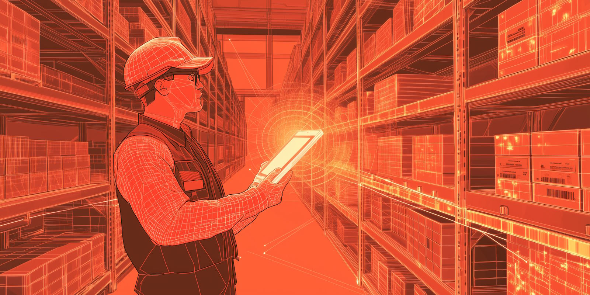
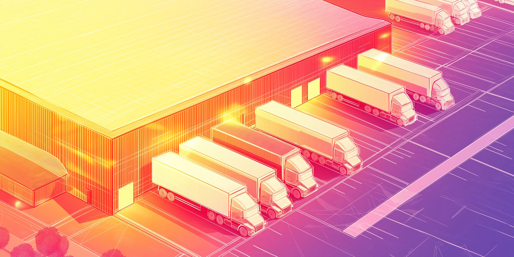
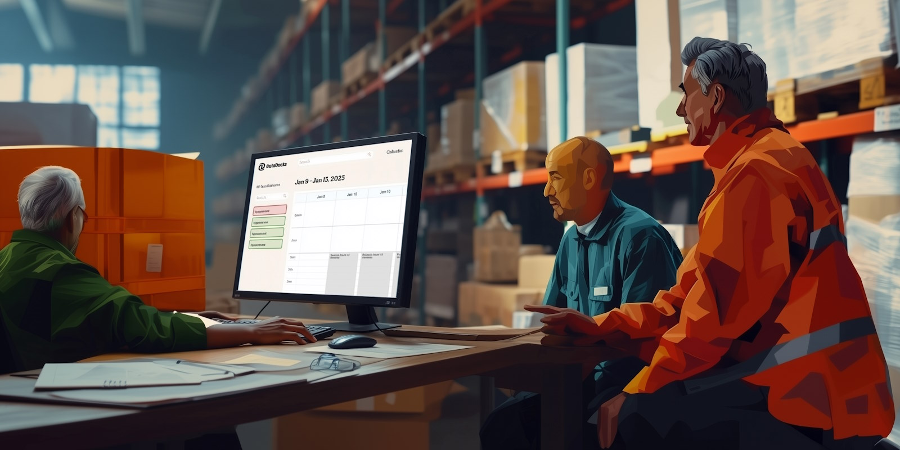

Digital twins in logistics are virtual replicas of physical assets, processes, or entire supply chain systems. While tools like your ERP, WMS, or TMS may resemble a digital model, a true **digital twin in logistics** involves far more sophistication and real-time data integration. Researchers often differentiate the maturity levels like this:

*   **In a digital model**, data must be updated manually whenever real-world conditions change.
*   **A digital ‘shadow’** updates automatically as the real system changes.
*   **A digital twin** not only updates automatically, but can also monitor, simulate, and—in advanced cases—remotely control parts of the logistics system.

Many practical applications of digital twin technology start with predictive modeling: forecasting future states of your logistics network in a detailed, visual way. The more mature version feeds real-time data into the simulation and runs ‘what-if’ scenarios to accelerate decision-making and improve operational performance.

The other distinguishing factor people are hinting at when they talk about digital twins is the modeling of a whole network rather than an individual asset. You might very well have digital twins for each truck in a fleet, reporting GPS locations and maintenance metrics, but that’s not the same as a digital twin for the whole ‘system’ of fleet operations.

Tech companies and management consultants are very excited about the idea of a comprehensive supply chain digital twin. The hope is that by simulating all the connections from raw materials to the end consumer, businesses can better manage future global disruptions and avoid economic shocks. 

But there’s a limit to how far you can optimize production, procurement, and demand chain activities without integrating logistics. And logistics is a domain still in the early stages of digitization. Neither the infrastructure nor the skills are quite there yet.

That’s where applications like [dock scheduling](https://datadocks.com/) come in. Rather than jumping the gun to sensors and automated systems where the value-add is still quite speculative, businesses can start by focusing on practical, attainable steps that bring greater visibility and control over certain processes, and start to introduce data-centric workflows into their operations.

‍

## **Are Digital Twins a Form of AI?**

Not exactly. You could easily have a digital twin without any kind of AI technology at all. But as both concepts evolve, they’re likely to become more and more inseparable. 

Digital twins provide the environment; AI processes and learns from the data within that environment and enhances the twin’s ability to simulate future scenarios.

‍

## **What’s the Relationship between a Digital Twin and IoT?**

‍

In an advanced industry 4.0 environment, Digital Twins and IoT (Internet of Things) will depend on each other to reach their full potential.

IoT devices can produce an enormous amount of data. After exhausting the lowest-hanging-fruit applications, this data will need to be integrated into a broader context. A digital twin provides the context and analytical framework to transform that raw IoT data into actionable intelligence.

At the same time, digital twins rely on IoT devices to keep the virtual model accurate and up-to-date. This symbiotic relationship means that as IoT networks expand and generate more data, digital twins become increasingly powerful tools for analysis and decision-making.

For example, in logistics, sensors on trucks and in warehouses collect data on location, temperature, inventory levels, and equipment status. This data feeds into a digital twin of the logistics network, enabling managers to monitor operations in real-time, simulate the impact of disruptions, and optimize routes and inventory management.

‍

‍

## **Examples of Digital Twin Technology in Other Industries**

Outside of logistics, the digital twin concept is already quite mature.

### **In Construction**

At LAX airport, the architecture firm Corgan uses special 3D cameras to create a detailed model of construction progress, which is especially useful for keeping stakeholders updated.

Construction firms also use digital twins to improve energy efficiency and structural health. Some of the more advanced software in this sector includes realistic physics models that can simulate a variety of scenarios that could take place either during or after the project, thus enabling a more intelligent level of risk management.

### **In Agriculture:**

Farmers can use digital twins to model crop growth under different conditions and maximize their yields. They can also be used to manage resources like water and fertilizer more efficiently.

### **In Healthcare:**

In hospitals, there are two main use case areas of digital twin technology, at very different levels of maturity.

The first is in managing equipment and facilities, sometimes extending into broader hospital operations. Dublin Hospital in Ireland has had some success implementing a simulation of its radiology department, improving its equipment utilization and reducing waiting times for CT scans and MRIs.

The other kind is more aspirational: digital twins for precision medicine. The hope is that doctors can create patient-specific models that allow the development of personalized treatment plans.

Outside the hospital environment, there are countless applications of digital twin technology in areas like pharmaceutical research and epidemiology.

‍

## **Supply Chain Use Cases for Digital Twins**

The manufacturing sector is starting to adopt IoT devices and big data analytics. Retailers are putting smart tags on store shelves to help with demand forecasting. And procurement managers are using marketplace simulations to predict price fluctuations. But none of this adds up to a real supply chain digital twin until logistics catches up.

So far, most of the research done into logistics digital twins has been theoretical. There’s no shortage of ideas, like real-time tracking of goods from origin to destination, simulating disruption scenarios, improving warehouse processes, and even sharing models with partners for better coordination. 

But the real level of digital maturity lags behind the theory.

Operations first need to adopt practical, problem-solving technologies to get their people up to speed with a data-driven way of working. Then they can start connecting the dots.

## **A Digital Twin for the Warehouse?**

‍

Warehouses will probably be the first logistics ‘system’ to achieve a mature digital twin setup. High-end WMS software already has IoT integrations, control systems, and predictive analytics. Some even have visualizations. The main bottleneck is connecting it up to external data sources, like communications with carriers.

Choosing the right interface standard is half the battle; [our overview of EDI versus API for logistics](https://datadocks.com/posts/edi-vs-api) walks through the trade-offs.

The potential of a warehouse digital twin is pretty great. First you’d replicate the warehouse layout in a 3D model, and then you could test out different storage configurations to improve pick times. Evolving from there, you could monitor equipment usage, schedule maintenance, and simulate the impact of automation, potentially preventing bad investments, or enabling good ones. Best of all, it would allow warehouse managers to quickly respond to changing circumstances.

But most warehouses don’t yet have a business case for an advanced WMS. They are focussed on keeping the lights on, and it will stay that way until the most egregious bottlenecks - like inbound/outbound processes - are taken care of.

## **Transportation Digital Twins v.s. Logistics Simulation Software**

Some logistics leaders may be familiar with simulation tools for transport cost optimization. This use case offers a glimpse into what will soon be possible with digital twins, but it falls short of being a dynamic, learning system.

A real logistics digital twin would go beyond historical information, and make use of IoT and big data to update in real-time. Users could simulate buffers, delays, and challenges to create better plans, and in the event of real-world problems they could also simulate a series of possible solutions to help them decide the best course of action.

The path forward here will probably involve collaboration with the public sector. Both municipalities and highway management services are interested in smarter ways to monitor traffic flows, and that data source could turn out to be a goldmine for logistics. 

‍

## **Benefits of Digital Twins for Logistics Management**

Although the full realization of digital twins in logistics is still on the horizon, understanding their potential benefits can help you prepare for the future. 

The technology promises significant improvements in efficiency, flexibility, and resilience:

### **1\. Dynamic Reconfigurability of Supply Networks**

Simulating the entire supply chain opens the door to re-examining service-level agreements with carriers, and building a network that can rapidly adapt to marketplace changes. Over time this adds up to a more resilient and environmentally-friendly supply chain.

### **2\. Accounting for Real-World Uncertainties**

The ability to account for the uncertainties of the real environment and the randomness of human behavior is one of the key advantages of digital twins. They can help logistics leaders better anticipate delays, demand spikes or resource shortages, and make informed choices that balance efficiency and risk.

Best of all, when circumstances change, plans can adapt more quickly based on real-time data.

### **3\. Operational Efficiency and Cost Reduction**

Data enables much better allocation of resources to where they’re most needed. Underutilized facilities, equipment and labor are some of the biggest drivers of waste in supply chains. A digital twin creates opportunities to streamline workflows and achieve significant cost savings.

### **4\. Innovation and Strategic Planning**

Digital twins create a risk-free environment to test out strategies and innovations. You might simulate the impact of adopting new technologies or processes before investing in them. You could also predict future trends and prepare for them proactively, and use insights gained from the digital twin to drive continuous improvement.

### **5\. Improved Collaboration and Communication**

A digital twin can be a single source of truth for partners, carriers and your internal team. It’s a highly visual way to provide insights to all stakeholders, and if it’s being updated in real time it can enable a much deeper level of collaborative planning and execution.

### **6\. Customer Satisfaction and Competitive Advantage**

Ultimately, the benefits of digital twins in logistics translate into better service for customers: faster adaptation to customer needs, higher on-time in-full delivery rates, and superior visibility.

## **Requirements For Building a Logistics Digital Twin**

‍

The benefits are compelling. But the logistics industry is still developing the infrastructure and skills needed to take advantage of this technology. A lot of the processes that would feed into a digital twin are currently black boxes. The path forward is to introduce practical initiatives that improve data collection and visibility.

### **Building Blocks for Digital Maturity**

Dock scheduling exemplifies the kind of practical tool that can advance an organization’s digital maturity:

*   It creates immediate operational improvements in areas like yard congestion and carrier communication.
*   It introduces data-driven workflows without disrupting core operations.
*   It generates concrete evidence of ROI, supporting the case for further investment.

### **Technical Evolution**

As these initial solutions prove their worth, you can systematically strengthen your digital infrastructure:

*   Replace legacy systems with cloud-based platforms that have open APIs.
*   Adapt existing processes to capture data in a methodical way, either manually or with IoT devices.
*   Find opportunities to put the data to work. For example, visualization tools can be a game-changer for KPI tracking.

### **People and Skills**

Success with digital twins demands a workforce that combines logistics expertise with digital fluency. This is best achieved by working with what you’ve already got:

*   Involve existing staff - for example, in the warehouse - in the rollout of new tools, and create opportunities for them to pick up technical skills.
*   Run workshops on data-driven operations, getting everyone clear on the benefits of the new way of working.
*   Once initial projects show returns, build a business case for hiring specialists like data scientists.

By taking this measured approach to digital transformation, logistics leaders can prepare their organizations for the future while solving today's operational challenges. Companies that build these foundations of data-driven operations today will be ready to embrace full digital twin capabilities as they emerge across the industry.

\## Bibliography

*   Haße, Hendrik, Bin Li, Norbert Weißenberg, Jan Cirullies, and Boris Otto. “Digital Twin for Real-Time Data Processing in Logistics.” Epubli, September 26, 2019. https://doi.org/10.15480/882.2462.
*   Abideen, Ahmed Zainul, Veera Pandiyan Kaliani Sundram, Jaafar Pyeman, Abdul Kadir Othman, and Shahryar Sorooshian. “Digital Twin Integrated Reinforced Learning in Supply Chain and Logistics.” Logistics. MDPI AG, November 26, 2021. https://doi.org/10.3390/logistics5040084.
*   Schislyaeva, Elena R. and E. A. Kovalenko. “Innovations in Logistics Networks on the Basis of the Digital Twin.” (2021).
*   Korth, Benjamin, Christian Schwede, and Markus Zajac. “Simulation-Ready Digital Twin for Realtime Management of Logistics Systems.” 2018 IEEE International Conference on Big Data (Big Data). IEEE, December 2018. https://doi.org/10.1109/bigdata.2018.8622160.
*   Coelho, F., S. Relvas, and A.P. Barbosa-Póvoa. “Simulation-Based Decision Support Tool for in-House Logistics: The Basis for a Digital Twin.” Computers &amp; Industrial Engineering. Elsevier BV, March 2021. https://doi.org/10.1016/j.cie.2020.107094.