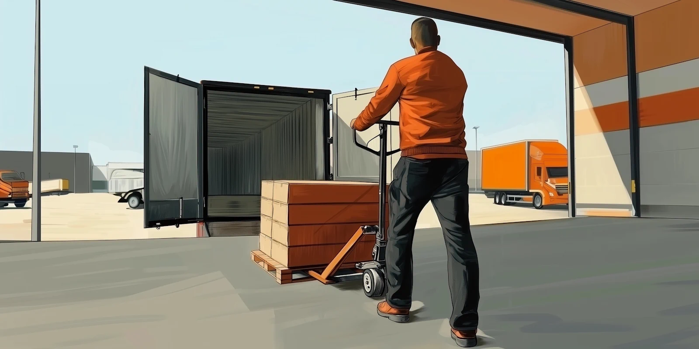
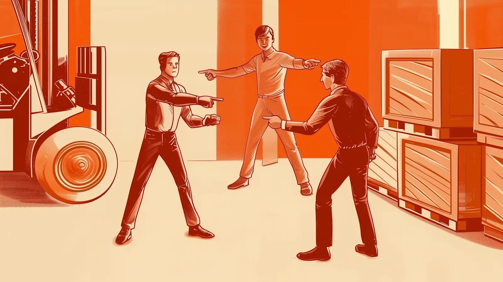
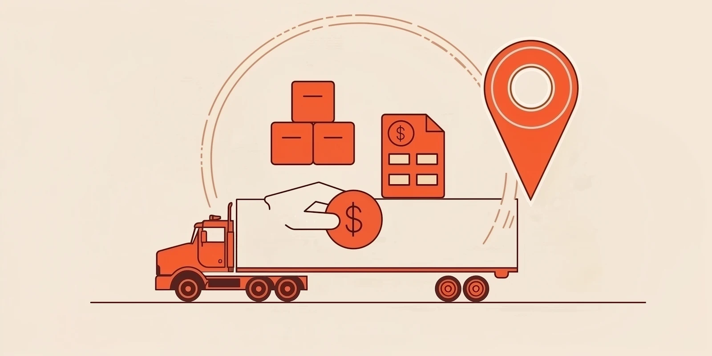
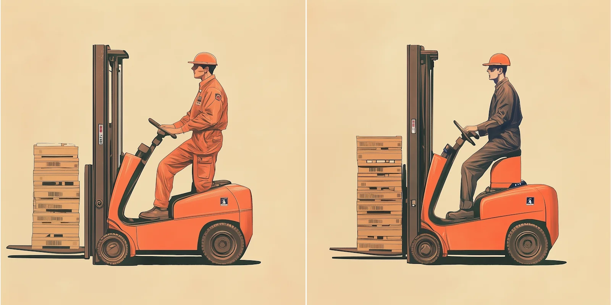

The illustrations in this article are generated by AI, but all the text is human-written

Receiving trucks is awkward. Not only is it more physically laborious than other warehouse processes, it’s unpredictable. The safety risks are higher and the quality of its execution depends on factors outside your control. Trucks arrive late. Or they all show up at once, first thing in the morning, with the wrong paperwork.

For the warehouse director who wants to achieve lean operations, unloading can be quite a headache. So it’s understandable that many prefer to keep it off their plate. Third party lumper services promise to do this, freeing up warehouse staff to focus on the tasks that can be controlled and optimized.

Choosing this path means accepting less control over your receiving operations. Sometimes, that’s a sensible choice. But how do you know if it’s the right one for your own objectives?

‍

## **Understanding Unloading Responsibilities**

Conventionally, OTR freight contracts make the shipper or carrier responsible for unloading, rather than the consignee. But most drivers these days work alone and don’t touch the freight.

That’s where lumpers come in.

The customary practice is for drivers to carry cash, and technically hire workers to unload for them. On paper, the driver should then be reimbursed by the shipper, their employer, or the broker. But unclear contracts can lead to disputes over who is liable, and sometimes drivers end up out of pocket.

### **Are Lumper Fees Even Legal?**

In the US, the Motor Carrier Act of 1980 acknowledges lumpers, while stipulating that drivers must not be coerced into hiring them. This was poorly enforced until 1994, when a paper from Iowa State University found a widespread lack of transparency, and helped to give the OOIDA and other trucker advocacy groups some teeth.

Today, it’s mostly an issue of contract law. When disagreements arise, it’s generally because the various parties have differing interpretations of who is responsible for the freight at each of the steps on its journey.

Legality aside, any arrangement that is painful for your carriers can also hurt your business. Trust is built on transparency, and high-trust relationships are the key to getting control of your operations.

‍

## **The Four Models of Liability in Logistics Contracts**

### **1\. The Old Way: Everyone Wants to Avoid Lumper Fees**

Historically, loading and unloading was part of a truck driver’s job. Lumpers were informal laborers waiting outside docks and factories, offering their services to those drivers.

Over time, the ingredients for a perfect storm came together:

*   Truckers were on the road for longer, hours of service regulations came in and it became common sense that their breaks should coincide with unloading.
*   Facilities didn’t want unknown workers using their equipment or handling their freight.
*   Lumpers realized they had leverage, got organized, started approaching facilities for exclusivity deals, and upped their fees.

The perception that this whole arrangement is criminal still lingers in trucker culture. Poor communication between facilities and carriers certainly doesn’t help. Some owner-operators prefer to unload themselves for extra cash, but report encountering resistance at certain facilities — resistance that may push the boundaries of legality. 

‍

### **2\. The Transparent Reimbursement Model**

These days it’s much more common for drivers to know in advance who is responsible for unloading, and which party is going to reimburse them for any fees they might incur. If they don’t know, someone at the facility is at least going to lay out the policy clearly for them when they arrive.

But drivers increasingly prefer not to have to think about any of this, and instead to have the contracting parties deal with it between them. In this arrangement, there may be a 3rd party lumper company operating at the facility, but they are paid directly by the shipper, broker, or the driver’s employer.

Up until 2019, Walmart charged unloading fees to 3rd party drivers, but the workers were employed by Walmart directly. Amidst various lawsuits from its own drivers, warehouse staff and service providers, Walmart decided to make some changes to improve these relationships. One of these was an arrangement for automated billing of unloading fees to the liable party.

‍

### **3\. A Warehouse-contracted lumping company**

Shippers, receivers, and carriers are starting to pay more attention to freight contract negotiations. One item on the table is having the consignee accept direct responsibility for unloading.

This can be a better arrangement for all parties, but it also adds to warehouse labor pressures. Unloading is higher-risk, more time-sensitive, and harder to integrate into a schedule if you don’t know when trucks will arrive. And for a lot of companies, inbound volume is seasonal.

So why not contract a lumper service directly? Operations can continue as before, except now the consignee owns the relationship, and gets a little more control over how receiving is done at their own facilities, not to mention a bargaining chip with carriers.

It’s a healthy compromise. But it may fall short of giving you the level of control you need for true data-driven operations.

‍

### **4: In-House Freight Handling**

What about having your own warehouse staff handle the freight as it arrives?

In theory this can give you more control. Communication channels are simplified. Any issues or delays can be addressed immediately within your team, reducing misunderstandings and improving efficiency.

But of course this model comes with its own challenges. You'll need to make sure you have enough trained staff available, which may be difficult during peak times or seasons. It’s also not obvious how to compensate workers who do a mix of loading dock and inner warehouse work. Then there’s OSHA to think about.

This path represents a leap of faith and a commitment to build a stronger team. Some warehouse directors might view it as idealistic and naive in today’s labor market. And yet plenty of operations are finding success with a combination of the right tools and the right leadership.

If in-house unloading is the goal, start by mastering the basics of dock-door scheduling so crews aren’t left waiting.

‍

‍

## **How Lumper Charge Reimbursement Works**

The traditional process puts drivers in an awkward position: they pay lumpers directly, then wait to be paid back by their carrier or broker, who then bills the shipper or responsible party per the freight contract. Each step introduces delay and potential for dispute.

As a consignee, your lumping arrangements can make a big difference to quality of life for drivers, not to mention the other parties.

‍

### **How to Pay Lumper Fees**

The ideal setup is automatic billing that keeps drivers out of the payment loop entirely. But if that's not possible, choosing lumpers who accept electronic payments and provide proper documentation will make life easier for your carriers.

The quality of a lumper service is often reflected in how they handle payments. Some are still cash only, while others accept credit and debit cards or EFS/Comchek/T-Chek - electronic payment codes that drivers can get from their dispatch.

Different payment methods also create different paper trails. Cash transactions require manual receipts, while electronic systems can provide some automation. 

### **Every Lumper Receipt Needs Clear Proof of Service Details**

A proper lumper invoice should include:

*   Date and time of service
*   Facility location and dock door number
*   Load/BOL number
*   Itemized charges and total amount
*   Service provider's company information
*   Driver and carrier information

A lumper company that’s on top of their documentation not only helps your carriers, it also helps you keep track of the receiving process and identify bottlenecks. If your contractors aren’t producing data and reports that help you improve turnaround times, it might be time to think about bringing it in-house.

‍

## **Evaluating Lumper Services vs. In-House Unloading**

There are a few things to think about when deciding whether to use a lumper service or your own team.

On the surface, contractors can seem more attractive than fixed labor:

*   **Volume fluctuations** \- When the receiving schedule is unpredictable, you want to be able to scale up and down quickly.
*   **Skills** \- It can be hard to recruit and retain forklift operators.
*   **Morale** \- You want to shield the warehouse team from the stress of the loading dock.
*   **Equipment** \- Lumpers that come with their own gear cut down the maintenance burden and the need for capital expenditures.
*   **Insurance** \- Having a third party responsible for unloading reduces your risk profile.

But there's a hidden factor that a lot of facilities overlook: data quality. Third-party arrangements can create blind spots in your receiving operations.

When you have direct control over unloading, you can capture vital metrics like:

*   Actual unload times versus estimates
*   Patterns in carrier arrival times
*   True detention costs and their causes
*   Loading dock utilization rates
*   Staff productivity and training needs

This data becomes your compass for improvement. You can identify bottlenecks, optimize dock assignments, and make informed decisions about staffing levels.

But success with in-house unloading hinges on your ability to make arrival times predictable. Without that foundation, even the best warehouse team will struggle to maintain efficiency.

‍

## **The Key Is Better Communication with Trucking Companies**

The relationship with your carriers can make or break your receiving operations, regardless of who does the unloading. When they understand how you work, carriers become partners rather than causes of headaches.

Trying to maintain that level of cooperation with phone calls and emails is not sustainable. Information gets lost, misunderstandings arise, and time is wasted in back-and-forth communications. That’s why so many facilities are adopting digital appointment scheduling systems that create a single source of truth for both parties.

When carriers know what to expect at your facility – from unloading arrangements to wait times – they can plan their routes and resources effectively. Even better, you can hold them accountable for their on-time performance, giving you the visibility and control you need to optimize receiving. 

‍