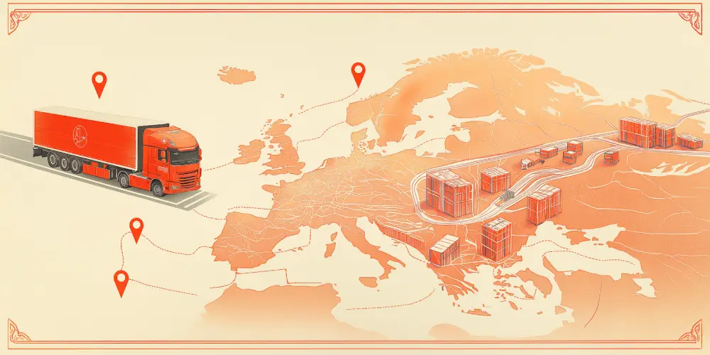
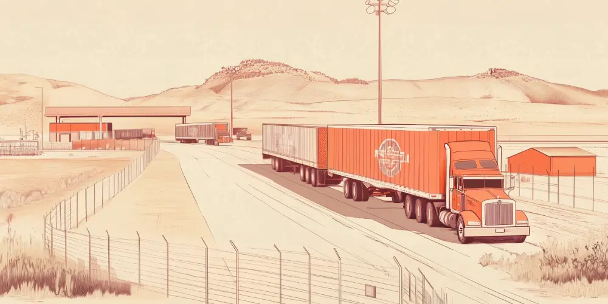

This article will aim to demystify the growing ‘nearshoring’ trend from a transportation management perspective.

We’ll cover:

*   The difference between nearshoring and similar trends.
*   Which companies are pursuing a nearshoring strategy, and its impact on logistics.
*   Five steps for building your own cross-border OTR transportation strategy.
*   The potential gains to be had.
*   The potential challenges.
*   Recent developments and predictions.
*   How nearshoring affects the transportation market as a whole.

## **Definitions: Backshoring, Reshoring, Nearshoring**

Nearshoring is the relocation of operations to a foreign country that is much closer to the company’s customers or headquarters than traditional offshoring destinations.

It can be contrasted with reshoring, which refers to bringing previously off-shored activities to the ‘home country.’

The term ‘backshoring’ is used inconsistently. Some people use it as a synonym for reshoring, others use it to cover both reshoring and nearshoring.

But the trend towards regional supply chains is also happening from the other direction; more and more US companies are going to Mexico for manufacturing without ever going to China.

Part of the reason is politics. Public policy initiatives to encourage ‘friendshoring’ are becoming increasingly popular around the world. Of course, ‘friendly nations’ aren’t necessarily geographically closer, but they offer similar benefits in terms of reduced risk, simplified customs and easier compliance.

And in the midst of all this, consultants talk about ‘rightshoring’ - applying an analytical approach to decide where each segment of the supply chain should be located.

In terms of logistics, nearshoring usually involves cross-border OTR transportation with a handover between carriers. Most of the complexity of maritime shipping is eliminated, but there are still issues to consider like customs, language barriers, and careful scheduling to avoid detention and demurrage fees.

## **Global Examples of Nearshoring**

Our main focus will be on US outsourcing to Mexico, but it’s worth considering the successes and failures of other nearshoring initiatives around the world.

### **Nearshoring In Europe**

The EU blurs the lines between domestic reshoring and foreign nearshoring, because there are no customs and practically no borders to speak of between its members. 

That doesn’t mean that intra-EU supply chains are totally painless. There are still language barriers, and despite the nominally tight regulation and harmonization of standards between countries, plenty of QC and even compliance issues slip through the cracks and need triage. 

But costs also vary much more between countries within the EU than between states in the US. German companies find plenty of opportunities for cost savings by shifting some value chain activities to countries like Slovakia.

[About half of European backshoring projects](https://blog.qima.es/europe/nearshoring-trends-europe-vs-us) aim to bring production within the EU, compared to about 15% of US cases that look for domestic suppliers. 

As for the other half, Turkey is now the EU's 5th largest trading partner, while the Western Balkans and North Africa are both rapidly developing their manufacturing capabilities in anticipation of a possible nearshoring boom.

### **Nearshoring in the APAC Region**

For the likes of Japan, Korea, Australia, and Singapore, transportation risk and geopolitical risk come from opposite directions. There’s some pressure to import less from the US to save on shipping costs, but also concerns about becoming overly reliant on China.

Little by little, these economies are strengthening ties with the ASEAN manufacturing centers: Malaysia, Indonesia and Vietnam. 

The biggest example is Samsung, which now does most of its smartphone making in Vietnam. Other companies have been more stop-and-start, finding it tricky to ramp up production and efficiency in new locations. But the long-term trend is clear, and even Chinese companies are starting to build factories abroad.

## **Which US companies are Nearshoring to Mexico?**

In 2023, Mexico replaced China as the #1 origin of US imports. Walmart, General Motors, and Honeywell are just a few of the big names opening major manufacturing facilities south of the border.

## **Building your Own Cross-Border Transportation Strategy**

While receiving OTR freight from Mexico dramatically reduces the complexity versus ocean transport, it’s still a lot more complex than domestic shipping.

A solid cross-border transportation strategy needs to take into account the degree of unpredictability of operations south of the border, as well as the variability of border crossing times and insurance considerations.

### **Step 1: Determining Responsibilities**

The first thing you need to do is engage with the suppliers and see about their own transportation capabilities. 

If your company has no subsidiary or legal entity in Mexico, the simplest arrangement is going to be for the suppliers to arrange freight up to the border, or better yet - to a transloading station on the US side of the border. If you do have a Mexican entity, it might make more sense to own the whole route yourself.

Until C-TPAT and AEO become mature, most arrangements are going to involve some kind of handover, with at least one change of trailer. It’s important to consider the precise details of how and when liability is transferred, much like you would for ocean freight. Depending on the risk profile, this might benefit from input from your company’s legal counsel.

In some cases, using a 3PL to handle at least one leg of the route, including the border crossing, can be a good fit for de-risking the operation. This can look like an expensive option, but considerably reduces the number of moving parts you have to handle internally.

What you probably want to avoid is the ‘double-handover,’ where the Mexican carrier lacks the license to cross the border, requiring two more carriers to finally get the load moving onto its destination.

### **Step 2: Getting Realistic About Lead Times and Delays**

Let’s assume you already have the framework in place to estimate transport time from transloading stations to your own facilities.

You now need to factor in two more variables: transportation to the border and crossing the border.

Some companies treat these like a black box. The order is placed, there’s a big question mark, and then the goods appear at the transload facility and a delivery date can be estimated. Others look at average times for these two stages and plan around those. In both cases, one of the biggest benefits of nearshoring has been wasted.

OTR transport from Mexico is highly variable, but not random. 

You just have to take a look at a map. What’s the state of the road infrastructure where your suppliers are located? In the event the preferred route to the border is closed, what are the viable alternatives? What’s the history of adverse incidents along those main routes?

Your partners can be very helpful here, but the best questions to ask them are not about durations, but about routes and contingencies. Some Mexican companies can be uncomfortable communicating to US partners about the continual reality of updating routes to avoid robbery or damaged infrastructure, but if you can establish a good working relationship, you’ll be one step closer to accurate predictions.

The other half of the equation is the border crossing itself. A good customs broker will be able to give you advance notification of longer-term disruptions, but day-to-day fluctuations are somewhat unpredictable. You should allow 48 hours in ‘normal’ conditions but absolutely factor in an extra day of potential delays.

### **Step 3: Handling customs, regulations and documentation**

The regulations governing cross-border trade between the U.S. and Mexico can be intricate, and failure to comply can result in delays, fines, or even seizures. Your strategy should ensure that all the necessary documentation is in place and accurate before the freight reaches the border.

Once again, working with a customs broker based near the border is a solid option to nip this potential headache in the bud. It’s also worth checking with your transportation partners on both sides of the border to see if they have in-house customs expertise, or third party relationships they can roll into your contract with them.

If you’re committed to managing this aspect in-house, here’s a quick checklist of things to look into:

*   Standard documentation: BOL, commercial invoice, packing list.
*   Product/Industry-specific forms: e.g. for electronics.
*   Pre-clearance options: C-TPAT, FAST, etc
*   Preferential Tariffs under USMCA, which may require additional documentation like a certificate of origin.
*   Driver and vehicle regulations, particularly for the carrier that crosses the border

### **Step 4: Considering Security, Insurance, and Contingency Plans**

Routes through Mexico can pose challenges, including theft and natural disasters. Insurance is your first and most reliable defense against the financial risk involved.

Transportation providers are not required by Mexican law to have cargo insurance, and carriers are generally limited to a maximum of about $2,000 USD of liability, regardless of the value of the load.

It’s more likely that your suppliers will have insurance arrangements, but you should confirm this with them and offer to contribute in order to get better coverage, as their risk tolerance may be higher than you expect. If you work with a 3PL, ask for a detailed breakdown of liabilities and run it by legal counsel.

In the end, you’re probably going to make compromises. Getting the raw value of the goods covered is one thing, but protecting against the opportunity cost of heavy delays or eventual failure to receive goods won’t come cheap.

Digital tracking can be well worth the investment for both greater predictability and potentially reducing the premiums. These can vary from always-on GPS location sharing to more sophisticated camera and engine lock systems.

For higher-value loads, third party security services come into play. Again, these vary, from remote ‘virtual custody’ options that communicate with local emergency services, to dedicated escorts. In certain cases this can be surprisingly economical if it brings down the insurance.

One final consideration is that your carrier or broker may discover at the last minute that using the agreed border crossing point is going to cause a huge delay. 

If you don’t discuss this with them in advance, they might follow a standard rerouting procedure or proceed with the original crossing. You might find it’s better to develop a strategic contingency plan, including arrangements with an alternative US carrier to collect goods from a different transloading facility.

### **Step 5: Thinking about Knowledge, Data, and Systems**

Finally, you have to train your team and disseminate knowledge about the impact of cross-border freight to key stakeholders.

Naturally, there’s a conversation to have with procurement to make sure you’re on the same page regarding lead times and costs. But you should also speak to warehousing. How is this shift to Mexico going to impact the size and frequency of inbound loads at each facility? Are they ready to handle increased traffic? Are you onboarding new carriers?

You might find that this nearshoring project is the perfect trigger to start getting serious about end-to-end visibility. If your facilities don’t already have dock scheduling, now’s the time to implement it.

Once you’re underway, you need a system to gather feedback from every party involved after each significant shipment. Conduct regular reviews of transportation performance, identify pain points, and use these insights to continuously improve your cross-border operations. 

Many firms roll those insights into a company-wide [Supply Chain Center of Excellence](/posts/what-is-a-supply-chain-center-of-excellence), ensuring that a breakthrough on one border lane quickly becomes standard practice across every site.

## **The Benefits of Nearshoring**

### **Sustainability and Environmental Benefits**

The most obvious benefit of nearshoring is simply reducing the total transportation miles in your supply chain. With rising and unpredictable fuel costs, and increased pressure for sustainable operations, nearshoring is an attractive option for companies looking to reduce both expenses and environmental impact.

What’s more, dealing with partners closer to home makes regulatory alignment more straightforward. As consumers and governments demand more transparency, companies with regional supply chain relationships stand to benefit.

### **Adaptable Supply Chain Model**

Geographical proximity can enable more agile manufacturing practices.

Operating within similar time zones and cultural contexts can simplify collaboration and communication between partners. As market demand fluctuates, the ability to adjust production volumes or even implement design changes and innovations swiftly can add up to an enormous competitive advantage. 

### **Faster and More Responsive Distribution**

Shorter distances also means faster replenishment cycles, which, when managed well, results in reduced inventory holding costs. Customer satisfaction also improves because, even in the event of a stockout, lead times can be minimized, and predicted with greater precision.

Nearshoring can enable better supply chain visibility and control, making it easier to anticipate potential disruptions and adjust logistics strategies accordingly. By being closer to both suppliers and customers, businesses can foster stronger relationships and improve overall service quality.

## **The Drawbacks of Nearshoring**

### **Limited Scalability of Manufacturing**

Despite its benefits, nearshoring can present challenges in scaling operations. Nowhere can yet really compete with China when it comes to scaling up production capacity quickly. Limited infrastructure and shortages of skilled labor can constrain growth. These factors can pose challenges in meeting high-volume demands during peak seasons or periods of rapid growth.

Industries that rely on high-volume, high-precision production generally have a tougher time of it. But trickiest of all is when you have a complex set of SKUs with small variations, each requiring relatively high volume. The kind of mega-facilities that can process such orders in a cost-effective way don’t yet exist in the manufacturing ‘challenger’ countries.

### **Complexity in Supplier Network Management**

Managing a supplier network closer to home can introduce its own complexities. Nearshoring regions may have less developed technological infrastructures compared to established manufacturing hubs, which can hinder the adoption of advanced manufacturing technologies and automation.

Working with smaller, more specialized suppliers often makes coordination more complex due to a fragmented supplier base. Streamlining operations across multiple niche suppliers demands greater oversight and management of relationships. Variations in capabilities among these suppliers can also lead to operational inefficiencies.

### **Potential Financial and Quality Risks**

Nearshoring can also lead to higher labor and operational costs compared to traditional offshore sites. Inconsistencies in product quality can occur due to less established manufacturing standards, necessitating additional investments in training and quality assurance programs. 

Smaller economies of scale and less optimized processes may increase production costs, posing risks to profitability. Companies need to weigh these potential costs against the benefits of proximity and adjust their strategies accordingly.

## **Trends, Statistics and Predictions**

### **Enablers and drivers of nearshoring**

One reason why nearshoring is happening now is that production costs in Asia are starting to rise. There’s always been a cost-benefit analysis, and the big advantage of manufacturing at scale is still there, it’s just starting to shrink, and many supply chain leaders are thinking strategically and systematically about the future.

Another reason is the increasing importance of sustainability goals. In Europe this is already high up the agenda, but many US companies want to get ahead of this now, in anticipation of changes in policy or consumer attitudes.

Next, there’s the digital factor. For companies who have their eye on truly data-driven operations, end-to-end visibility is a must, and yet remains out of reach so long as they continue to be dependent on partners with opaque operations thousands of miles away. The combination of nearshoring and digital transformation promises unprecedented control.

But perhaps the biggest driver of all is the global realignment, hurried along by COVID and the deteriorating relationship between the US and China. ‘Resilience’ is the watchword, and many companies anticipate more and more government incentives to do business with regional partners.

### **The Current State of Nearshoring in Mexico in 2024**

About half of the foreign direct investment Mexico receives is in the manufacturing sector, and 75% is in the form of reinvestment of earnings. In other words, most of the growth is coming from companies that are already operating in Mexico.

The automotive industry makes up the biggest chunk of that, and is the fastest-growing. Ford and Tesla in particular are looking to ramp up production in the country.

However, infrastructure limitations and political uncertainty have dampened Mexico’s ability to fully capitalize on the trend. Industrial spaces in key regions like Nuevo León are nearing capacity, while electricity and water supplies remain a bottleneck for long-term growth.

### **Will there be a nearshoring boom?**

****For many analysts, it’s not a question of ‘if’ but ‘when.’ But the actual timeline is hard to predict.

Global inflationary pressures, high interest rates, and slowing consumer demand in key markets may cause companies to delay major investments. Even as many global firms announce ambitious plans to relocate or expand production in Mexico, actual implementation could take years as companies weigh the risks against rewards.

U.S. policymakers are also concerned that Chinese companies could use Mexico as a “backdoor” to bypass trade restrictions, especially for electric vehicles. Under the USMCA, vehicles made in Mexico can enter the U.S. tariff-free as long as they meet certain requirements. Companies like BYD and Jetour have already announced plans to build EVs in Mexico.

There could be a further renegotiation of the USMCA, and that could go either way in terms of putting barriers up, or making nearshoring more attractive than ever.

## **The Second-Order Effects of Nearshoring**

Even for the companies that don’t do business in Mexico, it’s wise to keep an eye on the trend for its broader impact.

OTR transportation services are becoming more expensive, and demand will be higher than ever under a more regionalized network. Something will have to give - but whether that’s a boom in owned fleets and employed drivers, or a shift towards larger warehouse capacity and ‘just-in-case’ inventory, remains to be seen.

Meanwhile, if demand for ocean freight softens, it could create a buyers’ market in the short term. But financial risk in this industry is high, and providers will start decommissioning vessels if it looks like regionalization is here to stay.

Another thing to consider is the butterfly effect of nearshoring. As more companies invest in Latin America and other middle-income regions, their manufacturing capabilities could start to develop exponentially. That will create a competitive arena for the best mix of price, quality and speed, and logistics will often be the factor that tips the balance and wins deals.

Finally, the possibility of getting end-to-end visibility is going to lead to better business cases for industry 4.0 projects. That’s going to make data-driven logistics a major area of competitive advantage for the companies that move on it.

