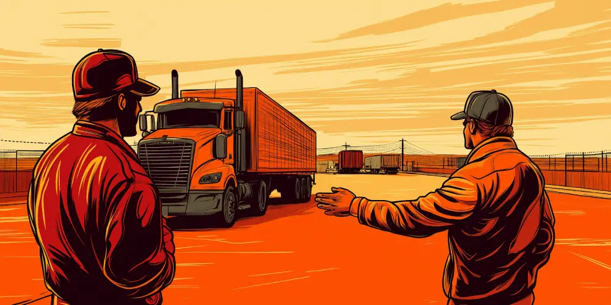
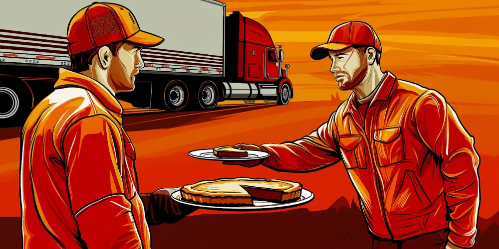
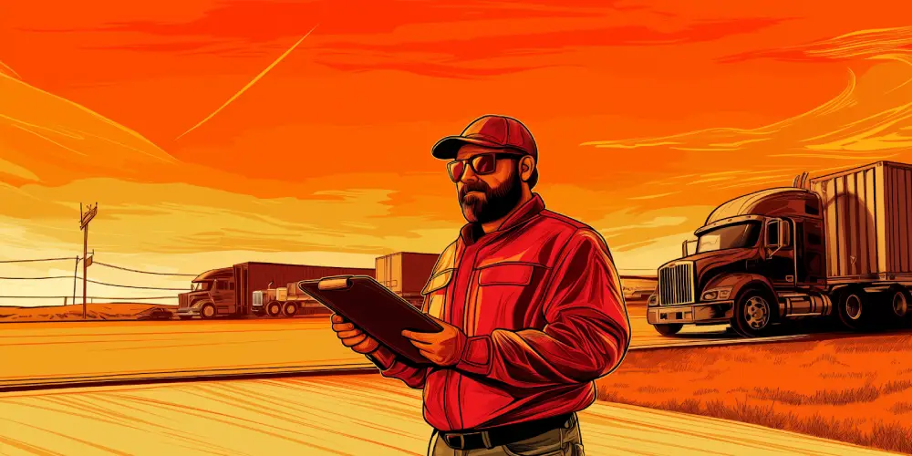

Logistics leaders often approach the freight market with a simple equation in mind: how can I get the best service for the lowest rate?

That way of thinking made plenty of sense in the predictable world of lean operations and stable markets. But today logistics needs to be more strategic, actively creating business value and resilience.

Part of that is rethinking how we engage with carriers. How much value is left untapped by the failure of both carriers and shippers to properly discuss their needs and capabilities? What kind of agreements can be made that better utilize both parties’ assets and knowledge?

Above all, what might be accomplished with partnerships based on mutual accountability?

## **Getting from Transactional to Relational**

‍

‍

‍

The allure of spot freight is undeniable. Load boards increasingly offer the convenience of an uber-like experience and the promise of intelligently pairing loads with trucks, while freight brokers are more sophisticated than ever.

Most shippers shy away from contract freight for anything other than established lanes. And to be fair, carriers aren’t always excited to talk to unfamiliar shippers without guaranteed volumes.

But the bigger problem is when we go into contract freight with the same transactional mindset that rules spot bidding. By rushing the process or making the assumption there’s not much leeway on terms, we end up with inconsistent service, limited leverage during capacity crunches, and higher overall costs due to lack of coordination.

Building long-term relationships with carriers can transform your operations in three ways:

*   **Reliability**: Carriers who understand your business can provide better, more consistent service. And it’s easier to hold them accountable when they know there’s more business coming.
*   **Priority Access**: In tight markets, carriers are more likely to prioritize shippers they know and trust.
*   **Collaborative Problem-Solving**: A strong relationship encourages carriers to work with you on overcoming challenges like seasonal demand fluctuations or unexpected disruptions.

## **Value Capture vs. Value Creation in Freight Procurement**

‍

In commercial strategy, the current fad is ‘value capture.’ Originally used to describe a method of funding public infrastructure projects, the term has been appropriated by management consultants to advocate for a zero-sum game approach to all negotiations.

The value capture mentality is driven by the belief that lower input costs translate to market advantage. For businesses facing financial risk, the promise of boosting short-term profitability makes it all the more attractive.

This absolutely reflects the volatility of markets today, and the more companies buy into it the more opportunities it creates for day traders and hedge funds to make a quick buck. Meanwhile it’s a race to the bottom for operational quality, with:

*   **Strained Relationships**: Aggressive negotiations can erode trust.
*   **Service Quality Risks**: Carriers under financial strain may cut corners, leading to delays or damages.
*   **Missed Opportunities**: Overlooking collaborative efforts that could lead to efficiency gains for both parties.

Shifting to a "value creation" mindset means looking for ways to make the pie bigger rather than just grabbing the largest slice.

The contract terms themselves can work to the benefit of both parties; trust leads to better service and reliability, and collaborating on innovation can reduce costs and improve performance for everyone.

By understanding carriers' challenges and working together to address them, you can create agreements that are more sustainable and beneficial in the long run.

## **Negotiating by Understanding Carriers’ Risks and Constraints**

‍

What keeps carriers up at night? Mostly:

*   **Empty Miles**: Trucks running without cargo (deadheading) eat into profits.
*   **Market Fluctuations**: Uneven freight demand across regions and time periods makes it hard to plan investments and ensure asset utilization.
*   **Cost Allocation**: Joint and common costs, such as fuel, driver wages, and maintenance, are difficult to attribute to specific shipments, complicating pricing strategies.

**The Joint Cost and Common Cost Traceability Problem**

Most OTR carriers don’t make a profit on all of their loads. They make a loss on some and a big profit on others. That’s not by design; it’s not a game of chumps v.s. sharks. It’s the inevitable result of the risk inherent in the business and the complexity in balancing their networks.

What can shippers do about it?

*   **Gather Your Own Requirements**: Understand and communicate the specific ways carriers can add value for you, be it priority service during peak times, or more detailed ASNs.
*   **Realistic Performance Expectations:** Agree to hold each other accountable by tracking truck arrival and departure times, leading to faster turnarounds and more reliable scheduling.
*   **Offer Flexibility and De-Risking:** Find contract terms that share risks in ways that are agreeable to both sides, like market adjustment clauses based on fuel costs or other variables, or guaranteed minimum volumes during slow periods.

## **How to Make It Work**

‍

Coming up with a good contract is just the first step in more collaborative carrier relationships. Next you have to:

1.  **Make sure you’re meeting your own commitments**
2.  **Hold them accountable for theirs**

And most importantly,

3.  **Proactively communicate about what’s working and what’s not working.**

There are a number of ways to facilitate this, and strengthen the relationship over time:

1.  **Regular scheduled check-ins**. Discuss performance, challenges, and upcoming needs, while encouraging carriers to provide honest feedback on your own processes.
2.  **Define and Monitor KPIs**. Use data to troubleshoot and drive improvements, not to penalize. Look at metrics like on-time performance through the lens of continuous improvement.
3.  **Dock Scheduling**. Move from a first-come, first-served approach to appointment-based scheduling and start tracking arrival and departure times. This can help minimize idle time for carriers.
4.  **Other Technology Initiatives:** Connect your systems to your carriers’ to give you both more visibility.

## **Opportunities for Shippers with Strong Carrier Relationships**

‍

When you've built solid partnerships, new avenues for efficiency and cost savings open up:

*   **Optimized Loading Dock Operations.** Data and predictability can help prevent bottlenecks and reduce overtime in the warehouse. 
*   **Freight Collect**. Leveraging your carrier relationships can allow you to take control over your inbound shipments, improving scheduling even further and potentially giving you better terms with suppliers.
*   **Enhanced service:** Carriers may agree to prioritize your loads during capacity crunches, and may even be able to offer you customized solutions when you have specific needs.
*   **Innovation:** Joint efforts with carriers can lead to sustainability improvements, or piloting new technologies like shipment tracking.
*   **Shared Risk Management:** Partners are more likely to support each other during supply chain disruptions.

## **Final Thoughts**

‍

OTR freight contracts can be a strategic asset for your business, unlocking resilience and innovation. But logistics leaders need to put time and effort into negotiating them. The most mutually beneficial terms aren’t always obvious.

In summary:

*   **Stay Balanced**: Use spot market transactions when appropriate but invest in long-term relationships for core needs.
*   **Understand Your Carriers**: Recognize their challenges and constraints to negotiate more effectively.
*   **Foster Open Communication**: Transparency builds trust, which is essential for any successful partnership.
*   **Leverage Technology**: Tools like [dock scheduling software](https://datadocks.com/) can improve efficiency for both parties.

If you’re formalizing these learnings across multiple sites, consider rolling them into a company-wide [Supply Chain Center of Excellence](/posts/what-is-a-supply-chain-center-of-excellence) so every team negotiates and executes against the same high standard.

In logistics, as in life, you get what you give. Invest in your carrier relationships, and they'll invest in you.

‍

\## Bibliography

Prokop, Darren. _Transportation Operations Management_. Elsevier, 2022.