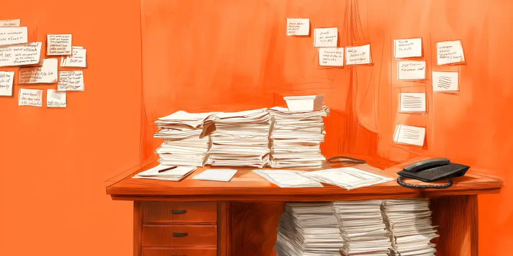
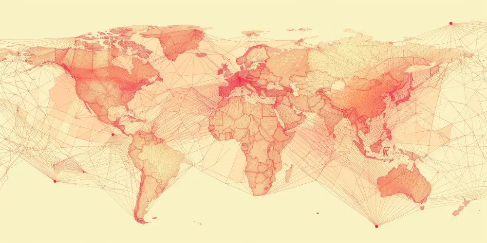
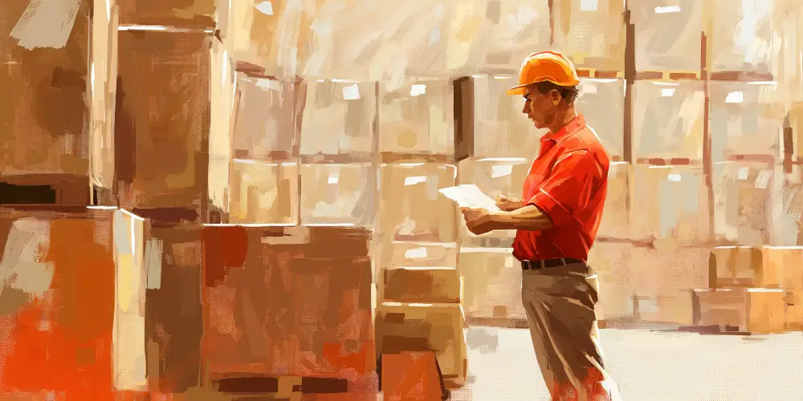

‍

In the past, paper was the only way to record and manage data. It was effective for what was needed right then and there, especially when businesses were operating at a much smaller scale. 

_But times have changed._ 

Paper no longer offers companies what they need to be as efficient and cost-effective as possible, especially when it comes to logistics. 

It’s outdated. It’s limiting. It creates a huge margin for mistakes.

Large businesses rely on paper way less than they did two decades ago, but the 1 - 5 % of processes that still use paper are at risk of causing errors. 

Moving to a paperless supply chain is the best way to make sure your business is running smoothly, without any delays, errors, or miscalculations. 

Some supply chain processes are especially resistant to digitization — for example, documents carried by truckers — and we understand their concerns. But we believe that if you start the digitization process, you’ll see the difference in effectiveness.

## 5 Reasons Why You Should Switch to a Paperless Supply Chain

### 1\. Speed

‍

With digital systems, you’re able to transfer data instantly. This means real-time updates, which allow you to make decisions as things are happening in your business. 

Picture a clerk hunting around in a filing cabinet for a document to figure out what went wrong with a customer’s order. It could take ages, wasting valuable resources and keeping the customer waiting even longer. 

Having an online database means you have all the information you need at your fingertips. 

When it comes to cash flow, Electronic Data Interchange can speed up the order-to-cash process by more than 20%, reducing the time goods spend in transit or warehousing. 

This translates to faster revenue recognition and reduced capital tied up in inventory and receivables. 

If you take digitization one step further with [API technology](https://datadocks.com/posts/edi-vs-api), you’ll have faster processing, which improves delivery times and customer satisfaction. 

Historically, the loading dock is one area companies ignore, but it’s the perfect place to start building momentum. 

‍

### 2\. Reduced Costs & Environmental Sustainability 

‍

Paper is unsustainable. Even with recycling, it’s not environmentally friendly. When you run such a document-heavy business, so much paper goes to waste. 

Automating invoice processing is one example that has been on the radar of finance departments for a while, but here’s a less obvious one: [dock scheduling](https://datadocks.com/). 

It increases effectiveness, improves relationships, and eliminates mistakes. 

Using paper relies on storing the paper somewhere, which costs your business money in rent, utilities, and maintenance. Digitization requires an initial investment but saves you money in the long term. 

And, importantly, it makes a big impact on your company’s sustainability objectives. 

Digitization may seem like an expensive undertaking, but if you start with dock scheduling, you’re already going to see reduced costs and an increase in sustainability without a huge investment. 

‍

### 3\. Traceability & Compliance

‍

Digital traceability systems reduce the time it takes to identify and track faulty products from days to minutes, potentially saving you millions in recall costs and lost sales. 

You can immediately recall and analyze transaction histories, allowing you to track products, batch numbers, and expiration dates — critical for compliance and quality control. 

With increased traceability and improved compliance, you’ll not only be at less risk of fines and legal issues, but you’ll also build trust with your consumers and partners. 

Dock scheduling complements traceability efforts by eliminating the blind spot where goods get handed over from one party to another. DataDocks gives you access to a digital audit trail for each truckload, allowing you to track all relevant data. For example, if you need to know where a bad batch came from, you’ll be able to locate it and recall it without delays. 

‍

### 4\. Third-party Collaboration

‍

Digitization allows you to easily eliminate delays and misunderstandings caused by outdated or inconsistent information. There’s much less room for human error.  

You’ll be able to provide stakeholders with access to the same real-time information you have. Something that’s difficult to do when even 1% of your processes rely on paper. 

Digitization can lead to a 30% reduction in project timelines and a 20% decrease in supply chain costs due to improved alignment and better response times. 

Ultimately, you’ll create stronger relationships with your suppliers and customers with real-time access to accurate information, leading to better negotiation terms and increased loyalty. 

Dock scheduling has proven to help build much stronger relationships between warehouses and carriers based on accountability and mutual continuous improvement. 

‍

### 5\. Better Decision Making

‍

If you want to use advanced analytics and machine learning, you need a level of accuracy where algorithms can process huge amounts of data in real time. 

A digitized, data-driven approach allows you to anticipate market changes, adjust strategies quickly, and optimize routes and inventories to meet demand efficiently. 

This effectively leads to better decision-making. 

When you digitize, barcodes and RFID scanning reduce the amount of human error that you get when you use paper systems. 

Most businesses are becoming more skilled at data collection, but there are still gaps that prevent the data from being structured and rationalized enough to reach its full potential of use. 

Traditionally, the loading dock is a ‘data black hole’ for supply chain visibility. Dock scheduling makes sure that transportation data finally connects with inventory data.

‍

## How to Switch to a Paperless Supply Chain  

### Step 1: Start Small 

Consider starting with dock scheduling software like DataDocks — it’s quick and easy to set up, and you’ll immediately see a difference in the way your business runs. 

Once that’s up and running, you can move on to bigger projects and eventually eliminate paper entirely from your supply chain. 

‍

### Step 2: Communicate

The biggest challenge in going paperless is miscommunication with external organizations. Speak to your partners, explain what you’re trying to do, and find out what they’ve been doing (if they’ve attempted to go paperless). 

Communicate what you’re planning to do and how you’re planning to do it (for example, what software you’ll be using). 

‍

### Step 3: Have a Clear Strategy for Data Processing

If you want to move to a paperless supply chain, you first need to move the data you have on paper into a new system. 

Make use of AI and scanning systems so you don’t have to manually update from paper to digital formats. 

Dedicate a team to this project, give them a time frame, and make sure you cover all areas of concern before you start. 

**And if you’re ready to switch to a paperless supply chain, DataDocks can help you digitize your loading dock operations.** Give us a call at (+1) 647 848-8250, or [book a demo](https://calendly.com/nick-rakovsky/datadocks-demo?month=2024-04). 

‍