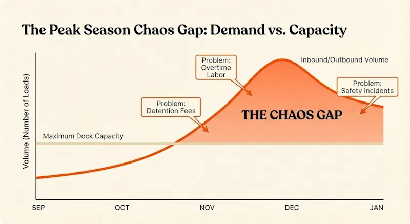
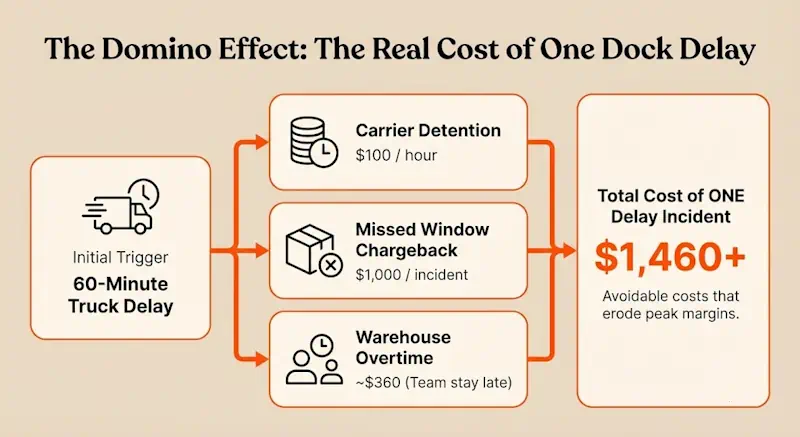
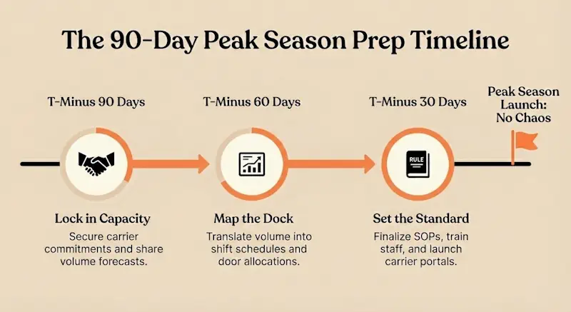
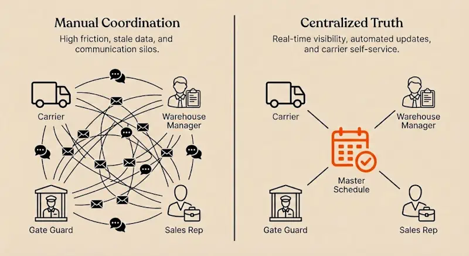

Peak season exposes every weakness in dock operations. That one door that sometimes gets double-booked? During peak, it's double-booked twice a day. The carrier who occasionally shows up late? During peak, half your carriers are running behind. The coordinator who juggles appointments over email and phone calls? During peak, they're drowning.

For most facilities, peak season means 30–50% more volume compressed into the same number of dock doors, the same yard space, and roughly the same labor hours. Retailers tighten delivery windows. Customers expect faster fulfillment. Carriers stretch their networks thin. And warehouse teams work overtime just to stay afloat.

Dock chaos during peak looks like trucks backed up in the yard, coordinators spending entire shifts firefighting instead of planning, detention fees climbing every week, and teams so exhausted by January that turnover spikes. The cost shows up in missed delivery windows, retailer chargebacks, damaged carrier relationships, and managers wondering how they'll survive next year's peak.

This playbook provides a structured approach to running peak season without the chaos. It's built around six steps: forecast and plan capacity, standardize rules and schedules, use software to orchestrate arrivals, execute a daily rhythm, coordinate across teams and carriers, and measure performance to improve for next year.

## Why Peak Season Breaks "Normal" Dock Operations

Peak season isn't just higher volume. It's higher volume under tighter constraints with less margin for error.

### What Changes During Peak Season

**Volume spikes without proportional capacity increases.** Most facilities can't add dock doors for a few months, and even if they could, trained labor is harder to scale than square footage. The result is operating at 85–95% of theoretical capacity for weeks at a time, where even small delays cascade into bottlenecks.

**Delivery windows tighten.** Retailers impose strict cutoff times during peak. Miss the window by 30 minutes and the shipment gets rejected, triggering chargebacks that can run $500 to $1,000 per incident. Customers who accepted three-day delivery in July expect next-day in December.

**More live unloads, fewer drop trailers.** Carriers need their equipment back fast during peak. That means more trucks waiting at docks instead of dropping trailers and leaving. Dwell time matters more, and detention fees accumulate faster.

**Last-minute changes multiply.** Orders get rerouted. Customers change quantities. Carriers miss pickups and need emergency reschedules. The appointment schedule that looked solid at 7 a.m. is chaos by noon unless there's a system to manage changes without breaking the rest of the day's plan.

### The Real Cost of Dock Chaos in Peak

The financial impact of poor dock management compounds during peak:

**Detention fees:** At $50–$100 per hour, a facility that averages 60 minutes of excess dwell per truck during peak season—running 100 trucks per week—pays $7,500 per week or $60,000+ over an eight-week peak period. That's money flowing straight to carriers because the facility couldn't process trucks on schedule.

**Chargebacks:** Retailers don't negotiate during peak. Miss a delivery window and the chargeback is automatic. At two incidents per week over eight weeks, that's $8,000 to $16,000 in avoidable costs.

**Overtime:** When the morning rush overwhelms receiving and the backlog extends into the evening, supervisors authorize overtime to clear it. If peak adds 10 hours of unplanned overtime per week at $30/hour across a team of 15, that's $36,000 over eight weeks.

**Safety incidents:** Rushed operations and congested docks lead to more forklift accidents, slip-and-falls, and loading injuries. OSHA data shows that loading docks already account for roughly 25% of warehouse injuries. Peak season makes it worse.

**Employee burnout:** Teams that spend two months working 55–60 hour weeks burn out. January turnover spikes. Recruiting and training costs follow.

Manual tools—spreadsheets, whiteboards, email threads—collapse under peak pressure because they can't enforce capacity limits, don't provide real-time visibility, and depend entirely on individual coordinators who become overwhelmed.

## Step 1: Forecast and Capacity-Plan Before Peak Hits

Peak season success starts 60–90 days before the first surge. Facilities that wait until November to think about holiday volume lose the opportunity to set terms with carriers and customers.

### **Align with Sales, Carriers, and Customers on Expected Volumes**

Pull historical data for the same period last year. Factor in growth rates, promotional calendars, and any new customers or product lines. Sales teams usually have retailer forecasts months in advance. Procurement knows when inbound material will spike to support outbound demand.

Build a week-by-week volume forecast showing expected inbound and outbound loads. Break it down by day of week if possible, since Mondays and Fridays tend to carry heavier loads than mid-week.

Share that forecast with carriers early. Lock in capacity commitments before the market tightens. Carriers who know they'll get consistent volume during peak are more likely to prioritize your loads and stick to scheduled appointments.

For customers, communicate cutoff times and blackout dates clearly. If you can't accept appointments on December 23 or if Friday afternoon slots are off-limits during peak, say so now, not when trucks start showing up unannounced.

### **Translate Volume Forecasts Into Dock Capacity**

Take your weekly volume forecast and map it onto available dock capacity:

*   **Doors:** How many inbound vs outbound? Are any doors shared or dedicated?
*   **Shifts:** Can you extend operating hours or add weekend coverage instead of relying purely on overtime?
*   **Headcount:** How many receiving and shipping crew members do you need per shift to handle forecasted volume?
*   **Appointment slots:** If each door can handle 8–10 loads per day, and you have 6 doors, that's 48–60 appointments total. Divide those between inbound and outbound based on forecasted mix.

The goal is to identify capacity gaps before peak starts. If forecasted volume exceeds dock capacity by 15%, you need to either extend hours, negotiate staggered deliveries with customers, or accept that some loads will incur detention.

For more on turning capacity constraints into actionable plans, see [increase your shipping and receiving capacity](https://datadocks.com/benefits/increase-capacity/).

### **Set Clear Limits and Rules for Peak**

Capacity planning isn't useful unless it's enforced. Set explicit rules:

*   **Daily trailer caps:** No more than X inbound and Y outbound per day.
*   **Prioritization:** OTIF-critical loads (retailer deliveries with tight windows) get priority slots. Replenishment and non-urgent freight gets pushed to off-peak hours.
*   **Blackout times:** No appointments during shift changes, lunch, or other predictable congestion points.
*   **Live vs drop trailers:** Define which lanes can be drop-and-hook and which must be live unload, then allocate door time accordingly.

Document these rules in writing and share them with carriers, customers, and internal teams. When someone calls asking for an exception, point to the rules instead of making ad-hoc judgment calls that erode consistency.

## Step 2: Standardize Dock Rules, Schedules, and Playbooks

Chaos thrives on ambiguity. Peak season demands clarity: who can book appointments, how far in advance, what happens if a carrier is late, how changes are communicated.

### **Create a Single Source of Truth for Appointments**

Email threads and phone calls don't scale. When 50 carriers are trying to book or change appointments, coordinators can't keep up. Worse, when multiple coordinators work different shifts, there's no continuity. The morning coordinator books an appointment that the evening coordinator doesn't know about.

The solution is a centralized appointment system where every booking, change, and status update flows through one place. Carriers see the same schedule coordinators see. Gate staff see the same schedule warehouse supervisors see. No one is working from stale information.

For facilities still relying on spreadsheets, this is the single biggest change to make before peak. A shared calendar enforced through [dock scheduling best practices](https://datadocks.com/posts/what-is-dock-scheduling/) eliminates 70% of the confusion and double-bookings that cause detention.

### **Standard Operating Procedures for Peak**

Write down the process for:

*   **Booking appointments:** How far in advance can carriers book? What information is required (PO number, trailer number, load type, temperature requirements)?
*   **Rescheduling:** How much notice is required? Is there a limit on changes per load?
*   **Check-in:** What happens when a truck arrives? Who verifies the BOL? How is the trailer directed to the right door or staging area?
*   **Trailer status:** Define statuses clearly—arrived, checked in, spotted at door, unloading, empty, staged for pickup—so everyone uses the same language.
*   **Yard rules:** Where do drop trailers go? Where do empty trailers go? Where should carriers wait if a door isn't ready?

These SOPs should be simple—one page, bullet points, no jargon. Print copies and post them at the gate, at the supervisor's desk, and on the dock floor.

### **Train Teams and Carriers Before the Rush**

Run tabletop walkthroughs with your team. Walk through scenarios: "A carrier shows up 90 minutes early. What do you do?" "Two trucks are booked for the same door. How do you resolve it without causing an hour of detention?"

For carriers, send a pre-peak communication explaining your rules, hours, and appointment requirements. Include a link to your carrier portal if you have one. Make it clear that walk-ins will wait until scheduled traffic is cleared.

Temporary staff need extra training. They don't know the facility layout, the carriers, or the unwritten rules everyone else relies on. Assign an experienced lead to each shift and pair temps with veterans during their first week.

## Step 3: Use Dock Scheduling Software to Orchestrate the Chaos

Manual coordination collapses under peak pressure. Software handles what humans can't: enforcing capacity limits in real time, notifying multiple stakeholders instantly when plans change, and maintaining a shared view of the schedule that doesn't require radio calls or walking across the facility.

### **What Good Peak-Season Dock Software Should Handle**

A dock scheduling system built for peak operations includes:

**Centralized appointment calendar:** One live view showing every inbound and outbound appointment, color-coded by status (scheduled, arrived, at door, completed). Coordinators, gate staff, and supervisors all see the same current state.

**Capacity-aware scheduling:** The system knows how many loads each door can handle per hour and prevents overbooking. Once a time slot fills, it's unavailable. Carriers get directed to the next open slot automatically.

**Carrier self-service portal:** Carriers book, reschedule, and cancel appointments online without phone calls or emails. Confirmations and reminders go out automatically 48 hours, 24 hours, and two hours before scheduled slots.

**Real-time updates and notifications:** When a carrier reschedules, the system updates the calendar instantly and notifies everyone affected—gate staff, warehouse team, spotters. No one is working from stale information.

**Yard and dock visibility:** The system tracks trailer locations and statuses so spotters don't waste time hunting for trailers, and supervisors know exactly what's staged and ready to work. For more on this capability, see [improve yard and dock visibility](https://datadocks.com/posts/yard-visibility/).

### **How Dock Software Prevents Peak-Season Failure Modes**

**No more double-bookings:** The system enforces capacity limits. If Door 3 is booked from 2–3 p.m., no one else can book that slot. Coordinators can't accidentally overcommit.

**Smoothed arrival curves:** Instead of 60% of trucks arriving between 7–9 a.m., the system distributes appointments evenly across the shift. Door utilization stays consistent instead of alternating between chaos and idle time.

**Reduced dwell time:** With advance notice of who's coming and when, warehouse teams can stage equipment and allocate labor efficiently. Trucks get worked faster because the facility is prepared for them.

**Less phone and email traffic:** Carriers handle booking and changes themselves through the portal. Coordinators manage exceptions instead of babysitting every appointment. That time savings matters most during peak when there are 80 appointments to manage instead of 40.

### **Where DataDocks Fits**

DataDocks provides the infrastructure facilities need to run peak season without chaos. The platform combines:

*   A live [dock dashboard](https://datadocks.com/datadocks-features/dock-dashboard/) that shows every appointment, door assignment, and load status in real time.
*   [Capacity limits](https://datadocks.com/datadocks-features/capacity-limits/) that prevent overbooking and enforce peak season rules automatically.
*   A [carrier portal](https://datadocks.com/datadocks-features/carrier-portal/) that gives carriers 24/7 access to book and manage appointments without calling the facility.
*   [Live editing](https://datadocks.com/datadocks-features/live-editing/) so coordinators can adjust the schedule on the fly when carriers run late or emergencies arise, with automatic notifications to everyone affected.
*   Integrations with WMS, TMS, and ERP systems so appointment data flows into labor planning and inventory management automatically.

The result is a facility that operates predictably during peak instead of constantly reacting to surprises.

## Step 4: Execute a Daily Peak Rhythm (War Room Approach)

Peak season requires daily discipline. What worked yesterday might not work today if volume spikes or a carrier network has delays. The best-performing facilities run a tight daily rhythm: morning planning, midday adjustments, evening review.

### **Start-of-Day Checks**

Every morning before the first truck arrives, the operations lead should review:

*   **Today's schedule:** How many inbound and outbound appointments? Any hot loads or tight delivery windows? Are there any known issues with specific carriers?
*   **Capacity hotspots:** Are any time slots overloaded? Are there gaps where doors will sit idle? Can appointments be shifted to balance the load?
*   **Staffing vs volume:** Do you have enough receiving and shipping crew for today's forecasted volume? Do you need to pull staff from other areas or call in extra help?
*   **Yard status:** How many trailers are already staged? Are any blocking access or occupying priority spots?

This 10-minute review prevents most of the chaos that happens when teams discover problems only after trucks start arriving.

### **Midday Micro-Adjustments**

Plans change. A carrier calls to say they're running two hours late. A high-priority customer needs an emergency load picked up. A door gets tied up longer than expected because of damaged freight.

During peak, coordinators need the ability to make real-time adjustments without breaking the rest of the schedule. Drag-and-drop rescheduling, automatic notifications, and live visibility mean these changes happen in minutes instead of requiring 30 minutes of phone calls and radio traffic.

Check in at midday:

*   **Are we on schedule?** Are trucks getting worked within their appointment windows, or is dwell time creeping up?
*   **Do we need to reallocate labor?** Is one shift getting slammed while another has downtime?
*   **Are there bottlenecks forming?** Is one door consistently slower than others? Are inbound trucks stacking up while outbound doors sit empty?

Make small adjustments now to prevent bigger problems later.

### **End-of-Day Review (Fast Feedback Loop)**

At the end of each day, spend 15 minutes reviewing performance:

*   **OTIF:** Did outbound loads leave on time and in full? If not, why?
*   **Dwell time:** What was average truck turnaround? Were there any detention incidents? Which carriers or lanes had problems?
*   **Missed appointments:** Did any carriers no-show or arrive hours late? Do we need to follow up?
*   **Bottlenecks:** What slowed us down today? Was it a process issue, a staffing issue, or a facility constraint?

This daily feedback loop ensures that problems get addressed immediately instead of compounding for weeks until someone finally escalates.
**Daily Peak Operations Checklist**
✓ Review today's schedule and identify priority loads

✓ Confirm staffing matches forecasted volume

✓ Check yard for staged trailers and potential congestion

✓ Mid-shift: monitor dwell time and door utilization

✓ Adjust schedule in real time for late/early arrivals

✓ End-of-day: review OTIF, detention incidents, and bottlenecks

✓ Document any process failures or carrier issues for follow-up

## Step 5: Coordinate with Yard, Carriers, and the Rest of the Network

Dock scheduling only works if it's connected to the rest of the operation. The dock doesn't exist in isolation—it's the interface between carriers, the yard, and the warehouse.

### **Keep Yard and Dock in Sync**

The worst inefficiency during peak is trailers sitting staged in the yard while dock doors sit idle. This happens when yard staff don't know the schedule, or when dock teams don't communicate that a door just freed up.

Solutions include:

*   **Real-time yard visibility:** Track trailer locations and statuses so spotters know which trailers are ready to move, and dock teams know what's staged and available.
*   **Task queues for spotters:** When a door finishes unloading, the system automatically queues the next trailer to be moved, instead of relying on radio calls.
*   **Staging rules:** Define where trailers should be staged based on load priority, customer, or delivery window. High-priority outbound loads should be staged closest to their assigned doors to minimize move time.

For more on connecting yard operations with dock scheduling, see [time slot management during peak season](https://datadocks.com/posts/time-slot-management/).

### **Communicate Expectations with Carriers**

Peak season is when carrier relationships get tested. Facilities that communicate clearly and hold carriers accountable fare better than those that accept chronic lateness as inevitable.

**Appointment adherence:** Let carriers know that on-time arrival matters. Publish arrival statistics by carrier. Recognize carriers who consistently hit their windows, and have escalation conversations with carriers who don't.

**Early/late policies:** Define what happens if a carrier arrives 90 minutes early or three hours late. Do they wait? Do they lose priority? Be consistent so carriers learn that gaming the schedule doesn't work.

**Scorecard visibility:** Share performance data with carriers. When they see that they're running late 40% of the time, it's harder to argue that "traffic" is the problem. For more on using data to drive accountability, see [how to use carrier scorecards during peak season](https://datadocks.com/posts/carrier-scorecards/).

### **Connect Dock Scheduling to WMS, TMS, and ERP**

Manual handoffs between systems create delays and errors. When a truck arrives, someone has to manually enter the arrival time into the WMS. When an order is ready to ship, someone has to manually update the dock schedule. Each handoff introduces friction.

Integrations eliminate this overhead:

*   **WMS integration:** When an inbound appointment is booked, the WMS receives the load details and allocates receiving labor automatically. When a truck is unloaded, the WMS marks the inventory as received and triggers putaway tasks.
*   **TMS integration:** When an order is tendered to a carrier, the dock schedule receives the pickup appointment. When the truck is loaded and departs, the TMS gets the departure timestamp and updates the carrier's delivery ETA.
*   **ERP integration:** Dock performance data—dwell time, detention costs, throughput—flows into financial and operational reporting so leadership can see the impact of dock operations on overall performance.

For guidance on connecting these systems, see [build your logistics tech stack](https://datadocks.com/posts/how-to-build-your-logistics-tech-stack/).

## Step 6: Measure Peak Season Performance and Improve

Peak season generates a massive amount of operational data. Facilities that capture and analyze that data improve year over year. Facilities that don't repeat the same mistakes.

### **Key Metrics to Track During Peak**

**Dwell time:** Average time from gate arrival to gate departure. Track by carrier, load type, and door. A baseline of 90 minutes for live loads and 30 minutes for drop-and-hook is reasonable. Anything higher indicates problems.

**Appointment adherence:** Percentage of trucks that arrive within 30 minutes of their scheduled time. Target 80%+ during peak. Below 70% means carriers aren't taking the schedule seriously.

**OTIF (on-time in-full):** Percentage of outbound loads that leave on schedule with complete freight. This metric directly affects customer satisfaction and retailer scorecards.

**Dock utilization:** Percentage of available dock time actually used for loading or unloading. Target 70–85%. Below 70% suggests poor scheduling or gaps in the plan. Above 90% means the facility is operating too close to maximum capacity and small delays create cascading problems.

**Throughput per hour:** How many loads move through the facility per hour. Track this by shift to identify when productivity drops—often afternoon shifts lag because morning delays compound.

**Overtime hours:** How much unplanned overtime is being worked? If overtime is consistently high, it's a signal that either capacity planning was wrong or the schedule isn't balanced.

**Detention fees:** Track total detention costs by week. If they're climbing, dig into which carriers, doors, or time slots are driving the problem.

For tools to track these metrics in real time, see [efficiency reports that track peak performance](https://datadocks.com/datadocks-features/efficiency-reports/).

### **After-Action Review**

Once peak ends, conduct a structured debrief with the operations team, carriers, and any other key stakeholders:

**What worked:** Which processes held up under pressure? Which carriers consistently performed? What new tools or techniques made a difference?

**What broke:** Where did the plan fail? Which bottlenecks emerged that weren't anticipated? What errors or miscommunications caused the most disruption?

**What to pre-empt next year:** Based on this year's data, what capacity, staffing, or process changes are needed for next peak? Should you add a shift? Change dock allocation? Renegotiate terms with underperforming carriers?

Document these findings and turn them into action items. Peak season planning for next year starts the day this year's peak ends.

### **Building a Long-Term Peak Playbook**

Use this year's data to create templates and standards for future peaks:

*   **Capacity planning worksheets:** Formulas that translate forecasted volume into dock capacity, labor needs, and appointment slots.
*   **Carrier onboarding checklists:** What carriers need to know before peak, how to book appointments, and what performance standards are expected.
*   **Daily operating rhythms:** Checklists for start-of-day, midday, and end-of-day reviews that become muscle memory for the team.
*   **KPI dashboards:** Pre-built reports that track the metrics that matter during peak so leadership has real-time visibility.

The goal is to move from reinventing the wheel every year to executing a proven playbook that gets better each cycle.

## Putting It All Together

Peak season doesn't have to mean chaos. With the right planning, standardized processes, and software to enforce capacity and provide visibility, facilities can handle 40–50% more volume without detention spikes, blown OTIF targets, or burned-out teams.

The playbook is straightforward:

1.  **Forecast and capacity-plan 60–90 days before peak:** Align with carriers and customers, translate volume into dock capacity, set clear limits.
2.  **Standardize rules and schedules:** Create a single source of truth, document SOPs, train teams and carriers before the rush.
3.  **Use dock scheduling software:** Enforce capacity limits, provide real-time visibility, let carriers self-serve, and eliminate manual coordination overhead.
4.  **Execute a daily rhythm:** Morning planning, midday adjustments, evening reviews to catch and fix problems fast.
5.  **Coordinate across yard, carriers, and systems:** Connect dock scheduling to yard operations, hold carriers accountable, integrate with WMS/TMS/ERP.
6.  **Measure performance and improve:** Track KPIs daily, conduct post-peak debriefs, build a long-term playbook for future peaks.

Facilities that execute this playbook report 30–50% reductions in detention fees, 15–25% improvements in OTIF, and operations teams that make it through peak without the exhaustion and burnout that usually follow.

**Ready to prepare your dock for peak season?** See how DataDocks' [capacity limits](https://datadocks.com/datadocks-features/capacity-limits/), carrier portal, and real-time visibility help facilities [scale dock capacity without adding doors](https://datadocks.com/benefits/increase-capacity/)—or call us at (647) 848-8250 to walk through your peak season plan.
