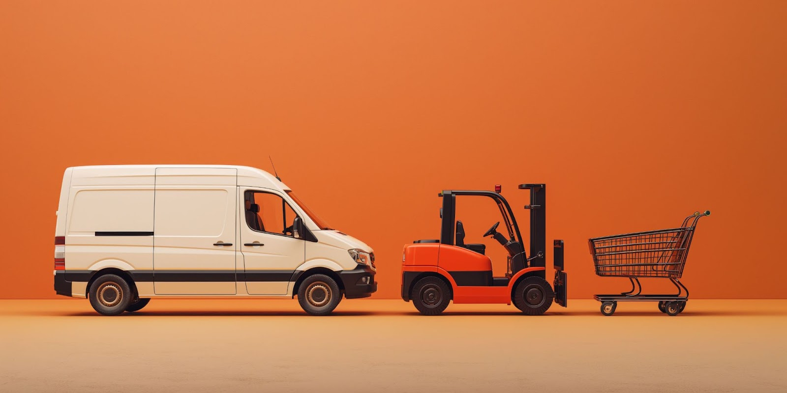
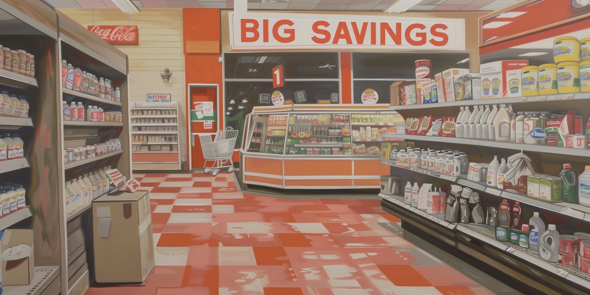
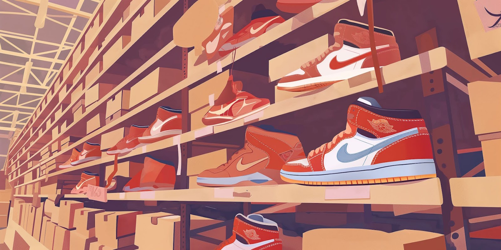
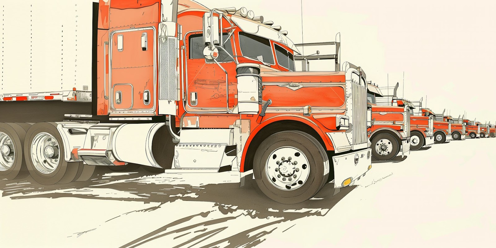
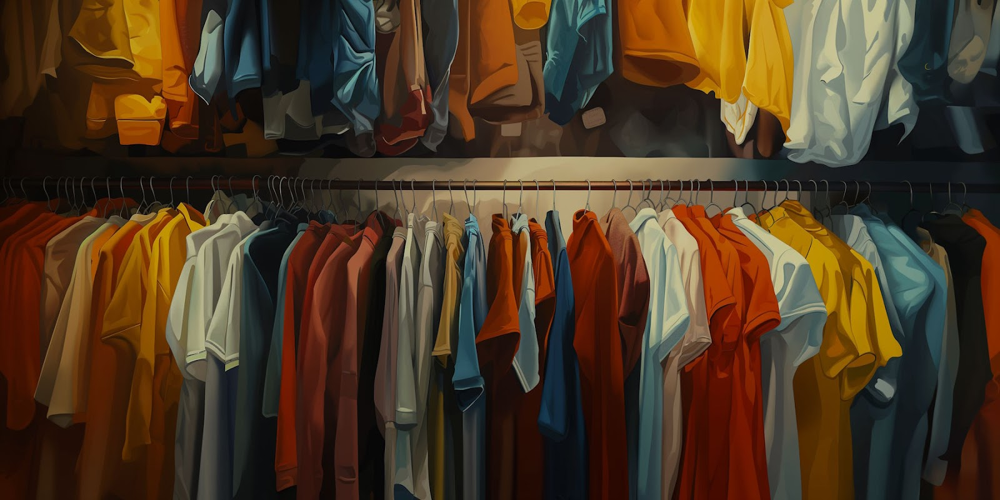
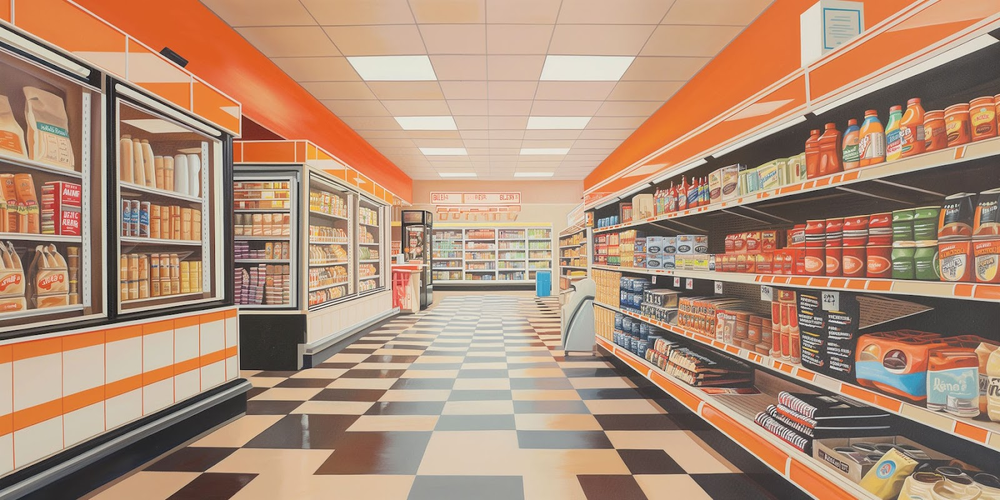

‍

‍

Gone are the days when retailers only had to focus on selling. Today, supply chain mastery is just as critical—and the best way to learn is through real-world retail case studies. The examples in this article show how even top brands can lose control of distribution when their operations fall behind, and how those failures ripple across procurement, transportation, warehousing, and customer experience.

When we look at the shifting fortunes of the biggest retailers, the symptoms of supply chain complacency come up again and again:

*   Dependence on suppliers or transportation providers with no leverage or accountability.
*   Minimal collaboration between procurement and warehousing functions.
*   Lack of preparedness to respond to marketplace changes.
*   A digital strategy that only considers sales, not operations.

In many cases, the story starts with a period of success. This often blinds companies to operational vulnerabilities, which they only notice once the impact on profitability has already become obvious.

In the following five case studies, we’ll see how major US retail businesses grappled with the supply chain challenges of the last few years, what they’ve done to take control of the situation, and what their current plans might be overlooking. And for each company we’ll suggest how [dock scheduling](https://datadocks.com/) could help them become more operationally flexible and resilient.

‍

## **Dollar General: Mishandling of Goods at Overflowing Warehouses**

‍

‍

Dollar General was one of the big covid winners. People were stocking up on everyday household items, and liked to find bargains a short drive away, rather than face the crowds at Walmart.

The company ramped up inventory of non-perishable goods, hoping to minimize stockouts of those more profitable SKUs. But the covid-era mindset wouldn’t last. As life got back to normal, Dollar General was left with a glut of stock it couldn’t move.1 And that’s when everything started falling apart.

First they had a hard time finding temporary warehouse space on acceptable terms.2 In the meantime, distribution centers tried to offload as much as possible to retail storerooms.3 These deliveries would come at unexpected times, often at the end of the day when there was just one employee watching the store, about to lock up for the evening.4

The precarious stacks of heavy crates blocking fire exits and extinguishers soon led to OSHA putting the company on their Severe Violator Enforcement Program.5 It’s a badge shared mostly with heavy-industry engineering and construction companies at high risk of workplace fatalities.

The fines, plus the additional, chaotically-routed transportation, cost Dollar General at least $60 million. But that’s a drop in the ocean compared to the shrinkage. 

The company can lose up to $800 million a year in theft and damage, and may have exceeded this figure in 20236. An estimated $160 million is believed to be theft by customers, prompting the chain to pull its self-checkouts from stores. As for the remaining $640 million, managers have suggested internal theft by retail workers as the main controllable source.7 

But dozens of discussions and images posted by employees on reddit.com show a different problem: mislabeling, missing shipments and egregious mishandling at the DC level. Some posters have speculated that many reefer drivers switch off refrigeration to save fuel8, resulting in products coming into stores warm.

According to procedure, these problems should be reported and recorded in detail; but chronic understaffing naturally leads to shortcuts, and paperwork is usually the first thing to go.

Dollar General is executing a four-pronged strategy to resolve these operational issues:

*   **SKU rationalization**: Reducing the product lineup means not just smoother transportation and warehouse processes, but also faster inventory velocity, fewer suppliers to manage and bigger bulk discounts, and better shelf organization in-store.9

*   **Expanding its owned fleet**: From 2021 to 2024, Dollar General’s tractor count went from 800 to 2,000. The private fleet now handles half of the outbound, and even allows the company to offer FOB collect terms to many of its domestic suppliers.10

*   **Facility consolidation and automation:** The company has been ramping up overall capacity, but also closing smaller DCs in sub-optimal locations, while opening larger ones with high-tech conveyor and pick-to-light systems.11 

*   **Demand forecasting:** By rolling out an automated ordering system based on predictive analytics for its fresh food SKUs, executives hope to dramatically reduce spoilage, stockouts, and labor needs.12

These changes might help Dollar General get their operations under control. But this combination of priorities reveals an underlying assumption being made by senior leaders: that established processes at DCs are already optimally efficient.

Could they be overlooking a critical gap?

Dollar General contracts integrated 3PLs for receiving at all its DCs. It also leverages its buying power to transfer a lot of transportation liability onto its non-FOB domestic suppliers, including chargebacks for late arrivals and other issues, while drivers are asked to bring cash or cheques to pay those unloading teams!13

In this way, the company minimizes direct contact with carriers, effectively washing its hands of most aspects of inbound logistics. The justification is probably that it reduces exposure to volatility from things like fuel prices, detention fees and employee risk factors.

But smooth seas never made a skilled sailor. By trying to avoid headaches, Dollar General may have missed out on:

*   **Building strong carrier relationships based on accountability and trust.**
*   **Cultivating problem-solving warehouse talent that can handle receiving.**
*   **Laying the foundation for end-to-end data collection deep into its supply chain.**

It’s hard to see how those impressive new DCs will reach their full potential without such ingredients. Dollar General can invest further in first-party transportation, consolidate, automate and simplify to its heart’s content, but it won’t completely eliminate the need for warehouse labor or external carriers.

Making matters more difficult, Dollar General relies on a one-size-fits-all supply chain management system for everything from procurement planning to dock scheduling.14 Such systems lack the depth and customization needed to address the unique challenges of each distribution center, and complicate coordination among different stakeholders.

This misalignment between vendors, carrier partners, the outsourced receiving teams, and internal operations, surely leads to scheduling conflicts and inefficiencies, ultimately impacting in-store availability and customer satisfaction. By adopting a dedicated dock scheduling system, Dollar General could begin to relieve the pressure of these issues.

## **Foot Locker: Left Behind by its Key Suppliers**

‍

‍

In 2021, when most retailers faced supply chain headaches, Foot Locker did just fine. Its sales held so strong that it promised investors huge growth by 2026.15

Fast-forward to the end of 2023 and executives had to walk it back: “we expect a two-year delay in achieving that goal and now see reaching that target by 2028.”16 What went wrong?

One problem is shrinkage. Like many of its peers, Foot Locker points the finger at in-store theft. But the Financial Times has observed how “the issue of retail theft can be a handy scapegoat for poor operational decisions.”17 

In reality, it’s more likely that many of these losses occur at the warehouse level. Just one criminal working as a yard spotter for a 3PL managed to steal $300,000 of Foot Locker merchandise.18 

The other problem is demand. Throughout 2023 the company had to rely on heavy discounting to move through its inventory.19 Part of this is poor forecasting, but it wouldn’t have fared much better if it had simply purchased less. It has to sell more.

Traditionally, Foot Locker’s fortunes have been tethered to Nike, and in 2019 about 90% of the company’s inventory came from their five biggest suppliers, up from 77% in 2008.20 These sneaker brands are diversifying their routes to market, with Nike in particular rapidly growing its online channels and its direct-to-consumer business. 

The company knows it needs a better position in e-commerce, but also that it’s not able to compete on price alone, and has to draw people in with in-store experiences and exclusives.

Many footwear brands are prepared to work closely with the company on ‘marketing activation.’ A product may be given a timed launch where it’s only available at Foot Locker stores for a limited window, for example. To comply with the program, they may need to use RFID tagging to prove the products are displayed at the correct time, and according to the brand’s conditions.21

While the brands are becoming increasingly data-driven, Foot Locker is merely reacting. It’s losing leverage in its supply chain and its industry leadership is slipping. KnowTheChain, an NGO project focussed on the risk of forced labor in supply chains, gave Foot Locker one of its worst scores due to the lack of intelligence the company has about its suppliers’ operations.22

Foot Locker knows that it’s ‘digitally behind,’ and is scrambling to remedy that. But with its tech strategy focussed on sales, it could neglect the importance of behind-the-scenes data. 

The company’s future success will depend on its ability to bring new partners on board, and track their performance alongside the existing ones. That means not just brands, but transportation providers as well.

If Foot Locker implemented DataDocks at its distribution centers, it could start to collect operational data, combat shrinkage, and build partnerships based on mutual accountability. That would give it a firm foundation to develop its sustainability practices, demand forecasting, and e-commerce capabilities.

‍

## **Ace Hardware: Owning Distribution, but Exposed to Disruption**

‍

‍

In the 80s and 90s, Ace Hardware had an enviable supply chain, and was one of the original companies associated with the idea of Vendor-Managed Inventory (VMI).23 Ace has since leveraged its position to shift a lot of risk onto its suppliers, even reserving the right to return stock that doesn’t meet sales expectations back to the manufacturer.24

Unlike other retailers, Ace doesn’t use this control to shield itself from logistics: 

*   65% of its inbound is freight collect. 
*   Its large owned truck fleet has won awards.
*   Until a few years ago its warehouse footprint was plenty for its needs. 

But in 2018 the company started to find it couldn’t respond effectively to surges in demand. It set about expanding its distribution network, but had a hard time recruiting enough drivers and warehouse workers.25

Next, Covid affected Ace like many retailers, with poor availability of some products well into 2022. Ace’s brand is built on helpful customer service, and many store owners were advising customers to buy directly from manufacturers so they could get their parts quicker.26

Then in 2023, a cyberattack brought down the warehouse management system and other parts of its IT, causing chaos for months as technicians scrambled to get everything back online.27

How has Ace Hardware weathered these problems? 

First of all, it’s bucking several modern trends in DC development:

*   **Ace is focussing on quality over cost reduction**, opting for premium equipment in new facilities and extensive training for employees.29 This enables Ace to recruit supervisors and specialists from within its own labor pool, and attract new recruits with the real possibility of advancement.

*   It’s resisting the tendency towards building mega-facilities in cheaper locations. While it is consolidating overall, **it’s aiming to put its new RSCs** (Retail Support Centers) **as close to stores as it can**30, trusting its crossdock facilities upstream to keep the merchandise flowing.

Secondly, like many retailers, Ace is also looking to data-driven forecasting integrated with its POS systems in-store as its big high-tech investment. The picture as a whole is of a company confident in its operational excellence, that views external risk as much bigger than internal risk.

If its thesis is right, quality eventually pays for itself. But is Ace missing something?

_Hardware_ is in the name. Ace’s physical operations are a benchmark for the industry. However, the recent cyberattack revealed that its attention to _software_ has not been as rigorous. Ace's conservative approach to IT—choosing established vendors like Manhattan’s WMS and e2open’s TMS—has helped mitigate risks. But it has also fostered complacency. 

Ace has overlooked innovations that could make it more resilient and responsive to change. The company's current method of managing dock scheduling through the TMS is emblematic of this issue. Such configurations typically create loading/unloading delays, consume excessive warehouse labor hours and limit warehouse managers’ ability to plan ahead.

Adopting a specialized dock scheduling solution could be a smart move for Ace. This change would serve as a gateway to richer supply chain data, facilitating more accountable interactions with logistics partners and bridging gaps between information silos. 

Such a transformation would not only shore up current inefficiencies but also catalyze a more data-driven supply chain, enabling Ace to predict disruptions earlier and adapt more quickly.

## ‍**TJX Companies: Positioned to Benefit from Supply Chain Chaos**‍

‍

TJX is the group that owns Marshalls, TJ Maxx, HomeGoods and others in North America, Europe and Australia. 

It operates some of the largest distribution centers in the US, with several over 1 million square feet.31 It also maintains a modest owned fleet in the UK, but in most places it relies heavily on strategic carrier partnerships, such as with DHL in Europe and JB Hunt in the US.32 TJX supplements these with a digital-savvy approach to spot bidding.

The key to its success is in its procurement. In the world of clothing and homewares, wherever there’s excessive inventory, TJX is there to make a deal. Even ostensible competitors accept that selling to the group is sometimes the best way to cut their losses, while many premium designers have given up fighting brand dilution and now produce lines specifically for TJX!

Naturally, the group cleaned up in the late-covid months, and kept beating investors’ expectations into 2024. But TJX has also identified two operational constraints that have prevented it from achieving even greater success: high freight costs33, and shrinkage.34

How has it tried to break free from these limitations? A three-part strategy:

*   **Diesel Hedging**: TJX has started buying the same kind of financial instrument that airlines use to insure them against the cost of fuel.35 By reducing exposure to this uncontrollable factor, the group is free to take more risks in areas where it can win.

*   **Consolidated Ocean Shipping:** The group has solidified its partnership with its preferred ocean carrier, Maersk. In 2019 they accounted for 26% of TJX’s maritime freight, but by 2021 that had increased to 42%.36

*   **Investment in Loss Prevention**: The group has created a raft of new positions in loss prevention, not just security guards but also detectives and analysts37, alongside new tech and a more realistic approach to the sources of shrinkage than most of their peers.

So far it seems to be working. According to Forbes, “the biggest threat to TJX appears to be if strict inventory control by full-price retailers restricts available stock.”38 In other words, as long as other companies in the space struggle with operations, TJX keeps winning.

But for how long can they count on that? 

Almost every major retailer is moving to adopt advanced demand forecasting. Some are even starting to notice that their in-store problems have root causes in upstream operations. If TJX’s competitors leapfrog them in terms of logistics and warehousing capabilities, the group could get left behind.

To guard against that, TJX has to start preparing for the future now. From its current position, and with the right investments, it could become a logistics powerhouse, further compounding its procurement and merchandising leadership to enable faster and smarter rotation of stock.

It could do this without changing its logistics partnerships model: it’s simply a case of putting data at the heart of those carrier relationships.

There are certainly some low-hanging fruit. TJX’s 1.7 million square foot facility in San Antonio, Texas, manages its loading dock operations with [Opendock, an entry-level dock scheduling system](https://datadocks.com/datadocks-vs-opendock). Switching to DataDocks at that facility could serve as a catalyst for high-performance, high-accountability operations throughout the group.

‍

## **Ahold Delhaize: Grappling with Online Grocery Delivery**

‍

Ahold Delhaize is a diverse group that owns a dozen supermarket brands in Europe, plus a handful more in the US, including Food Lion and Stop & Shop.

The margins on fresh produce are delicate, with an enterprise like AD pulling in about 4% profit39. Add to that the risks of managing a cold chain, seasonal variability in supply, limited ability to control quality and the need for careful handling of many products, and you have some idea of just how competitive logistics gets in the grocery business.

The challenges confronted by Ahold Delhaize mostly resemble those of their competitors: 

*   Timely and accurate replenishment of store shelves is key to sales, and hindered by **poor store-level inventory accuracy**.40
*   As an enormous customer of agribusiness, it’s **exposed to regulatory, media, and political risk**, for example from changes to climate policy.
*   It faces stiff **competition from online-only delivery services** that can innovate fast. 
*   Inbound DC operations are hard to optimize because there’s so much **variability in volume**.

Being headquartered in Europe while its biggest growth opportunities are in the US adds another layer of complexity for AD.

This can result in missteps like the acquisition and subsequent sale of FreshDirect at a loss. The group had not anticipated the extent of the differences between on-demand delivery in New York and scheduled grocery delivery in Belgium and the Netherlands, where it dominates the market.41

Meanwhile, proximity to EU centers of power puts AD in the firing line for environmental interest groups. It was recently pressured to revise its climate targets to include 100% fossil-free transport in both Europe and US by 2040, and to count the emissions of its suppliers in its calculations.42

So what’s Ahold Delhaize’s plan?

One part of it hinges on **working more closely with carriers and suppliers**. The group is willing to pay for logistics coaching for its manufacturers so they can improve their own operations,43 and more recently has started exploring fixed purchasing commitments, including a minimum number of weekly full truckloads with some of its transportation providers.44

AD isn’t just being generous. It hopes that this investment will pay off by:

*   **Eliminating the need for spot bidding** on freight, with its associated risk.
*   **Making loading dock operations more predictable** by balancing volumes.
*   Convincing partners to **invest in electric vehicles** and other green tech.
*   Feeding intelligence back to the group so they can **negotiate better rates**.

But AD knows that long-term, it has to be an e-commerce leader across markets, especially in the US. That means delivering faster, within narrower windows, and with more attentive customer service. For that reason it’s shifting to picking online orders in-store and delivering them in small vehicles.45 

This in turn allows it to service those stores with fewer, larger, more automated warehouses, which are increasingly leased-to-own. While the ‘top half’ of the group’s supply chain strategy is focussed on partnerships, for the ‘bottom half’ of fulfillment it’s cutting out third parties as much as possible.

What could go wrong?

AD has said it’s “willing to add complexity in our warehouse operations, to reduce complexity at the stores.” This approach demands excellence in warehousing. Yet one of its new automated facilities has already faced technical difficulties that prevent it from running at full capacity.46

Fixed purchasing agreements are a novel solution, but it does mean less control of inventory. It forces safety stock, which may be the direction other parts of the retail industry are going, but a grocery business like AD will be dependent on superb demand forecasting, or else risk chipping away at already fragile margins.

The overlooked solution is, once again, advanced dock scheduling.

It may seem like a small piece of the logistics puzzle, but the data sharing and accountability it unlocks are key to closer partnerships with carriers and suppliers. Done well, dock scheduling allows for balancing inbound volume in a flexible way, not to mention improving labor utilization in the loading dock.

[Optimizing the receiving process](https://datadocks.com/posts/warehouse-receiving-process) goes a long way to achieving highly efficient warehouse operations. It lays a foundation of data collection that enables rapid innovation and progress towards true end-to-end visibility. That’s just how a group like Ahold Delhaize could unlock the in-store insights it needs for a competitive edge.

Want to talk to us about how dock scheduling could help your business take control of distribution? Give us a call at (647) 848-8250 or [book a demo](https://calendly.com/nick-rakovsky/datadocks-demo?).  
‍

## Frequently Asked Questions

### What is the main problem retailers face when they lose control of distribution?

When retailers lose control of distribution, the issues often stem from a lack of coordination between suppliers, transportation partners, warehouse operations, and store teams. This leads to inconsistent inventory flow, stockouts, overloaded storage areas, and shrinkage from damage or theft. When visibility is low and accountability is unclear, inefficiencies ripple through procurement, transportation, warehousing, and in-store operations, affecting both profitability and customer experience.

### Why did Dollar General struggle with inventory and warehouse congestion?

Dollar General built up too much inventory during the pandemic and did not scale warehouse capacity or optimize receiving processes to match. The result was overstretched storage, rushed deliveries, safety hazards, and product damage. Much of the shrinkage came from poor handling rather than just external theft. The case highlights the importance of warehouse processes, accurate demand planning, and reliable inbound scheduling.

### How did Foot Locker lose leverage in its supply chain?

Foot Locker historically relied heavily on major brands like Nike. As these brands expanded direct-to-consumer channels, Foot Locker became less essential in the distribution chain. Without strong data systems to track supplier performance and inventory movement, the company struggled to negotiate favorable terms, manage shrinkage, and maintain urgency in sales channels.

### What makes Ace Hardware unique in its distribution approach?

Ace Hardware owns much of its distribution network and operates with high warehouse standards. However, the company has placed more emphasis on physical operations than on digital optimization. This leaves openings for delays and lower agility when disruptions occur. Investing in more flexible dock scheduling and operational data visibility could increase resilience.

### Why is TJX positioned to benefit from supply chain instability?

TJX thrives when other retailers have excess stock. Because it has strong procurement flexibility and large distribution capacity, it can purchase surplus products at favorable prices. However, if competitors develop more advanced forecasting and warehouse efficiency, TJX may see those advantages shrink unless it strengthens its own logistics execution.

### What supply chain challenge is Ahold Delhaize focusing on now?

Ahold Delhaize is shifting toward more e-commerce-driven grocery delivery, which requires tight control over warehouse automation and last-mile fulfillment. This makes receiving workflows, dock scheduling, and predictable carrier performance more important than ever, since fresh food logistics demand precision to maintain margins.

\## Bibliography

1.  [**Retail Dive: Dollar General Inventory Strategy**](https://www.retaildive.com/news/dollar-general-inventory-clearing-Q2-Jeff-Owen/693282/)
2.  [**Dollar General Investor Relations: Q2 2023 Performance Update**](https://investor.dollargeneral.com/websites/dollargeneral/English/2120/us-press-release.html?airportNewsID=44c8c5ef-9bd4-4f65-80d8-8b4c1e936db7)
3.  [**Entrepreneur Magazine: Safety Concerns Due to Excess Inventory**](https://www.entrepreneur.com/business-news/dollar-generals-massive-inventory-leads-to-safety/446652)
4.  [**Reddit: User-shared Experience on Early Truck Delivery**](https://www.reddit.com/r/DollarGeneral/comments/1201r0q/100_piece_fresh_truck_630_pm_one_day_early/)
5.  [**New York Times: OSHA Fines for Dollar General**](https://www.nytimes.com/2023/03/28/business/dollar-general-osha-fines.html)
6.  Per **DG employee training video** cited by [**comments on various posts**](https://www.reddit.com/r/DollarGeneral/comments/1916x6m/camera_placement/) **to reddit.com**
7.  Based on COGS of $20 billion for the year ending November 3, 2023 ([**DG Investor Report**](https://investor.dollargeneral.com/websites/dollargeneral/English/2120/us-press-release.html?airportNewsID=6e45bcfc-f067-4bdb-8d4b-bda9534b04c9)) and an estimated shrink rate of 3%, per [**University of Porto**](https://paginas.fe.up.pt/~acbrito/laudon/ch1/endcasestudy.htm)
8.  [**Reddit: User Discussion on Dollar General Practices**](https://www.reddit.com/r/DollarGeneral/comments/1bkyuz7/how_does_dg_get_away_with_this/kw6p6tw/)
9.  [**The Motley Fool: Dollar General Q3 2023 Earnings Call**](https://www.fool.com/earnings/call-transcripts/2023/12/07/dollar-general-dg-q3-2023-earnings-call-transcript/)
10.  [**Trucking Dive: Dollar General Expands Fleet**](https://www.truckingdive.com/news/dollar-general-grows-fleet-to-more-than-2000-tractors/693758/)
11.  [**Warehouse Automation: Dollar General's New Automated DCs.**](https://www.warehouseautomation.ca/news-notes-1/2022/7/27/dollar-general-set-to-build-three-new-state-of-the-art-automated-dcs-jf4ky)
12.  [**Progressive Grocer: Dollar General's AI-Powered Produce Ordering.**](https://progressivegrocer.com/dollar-general-implements-fully-automated-ai-powered-produce-ordering-nationwide)
13.  [**Dollar General Vendor Guide**](https://www.dgpartners.com/content/vendors/partnershipguidemt/Domestic%20Vendor%20Guide.pdf)
14.  ^ ibid
15.  [**Bloomberg: Foot Locker's New CEO and Sales Goals**](https://www.bloomberg.com/news/articles/2023-03-20/foot-locker-s-fl-new-ceo-plots-route-to-9-5-billion-in-sales)
16.  [**‍**](https://www.bloomberg.com/news/articles/2023-03-20/foot-locker-s-fl-new-ceo-plots-route-to-9-5-billion-in-sales)‍[**Foot Locker Investor Relations: Q4 2023 Earnings and 2024 Forecast**](https://investors.footlocker-inc.com/news-releases/news-release-details/foot-locker-inc-reports-fourth-quarter-2023-results-issues-2024)‍
17.  ‍[**Financial Times: Shoplifting, Shrinkage, and a $95bn Problem for US Retailers**](https://www.ft.com/content/2901bd8b-2118-4677-9d01-ad94931cfbb1?shareType=nongift)‍
18.  ‍[**Daily Herald: Major Theft from Carol Stream Distributor**](https://www.dailyherald.com/20240216/crime/couple-pleads-guilty-to-stealing-2-1-million-in-merchandise-from-carol-stream-distributor/)‍
19.  ‍[**Reuters: Foot Locker Cuts Annual Forecast Due to Weak Demand**](https://www.reuters.com/business/retail-consumer/foot-locker-slumps-weak-demand-heavy-discounts-drive-annual-forecast-cut-2023-05-19/)‍
20.  ‍[**Market Realist: Analyzing Foot Locker's Supply Chain COGS**](https://marketrealist.com/2016/06/analyzing-cogs-foot-lockers-supply-chain/)‍
21.  ‍[**Nedap: RFID Extension Project with Foot Locker**](https://nedap.com/nedap-teams-with-foot-locker-to-extend-rfid-project/)‍
22.  ‍[**Know The Chain: Foot Locker Company Profile**](https://knowthechain.org/company/foot-locker-inc-2)‍
23.  ‍[**MHL News: Overview of Vendor Managed Inventory**](https://www.mhlnews.com/global-supply-chain/article/22033398/the-ins-and-outs-of-vmi)‍
24.  ‍[**Ace Hardware Vendor Manual**](https://www.acehardware-vendors.com/Vendors%20Public/Documents/Ace%20Vendor%20Manual.pdf)‍
25.  ‍[**The Hardware Connection: Interview with an Ace Hardware Executive**](https://magazine.thehardwareconnection.com/publication/frame.php?i=720401&p=&pn=&ver=html5&view=articleBrowser&article_id=4110002)‍
26.  ‍[**The Hardware Connection: Special Report on the Supply Chain Crisis**](https://magazine.thehardwareconnection.com/publication/frame.php?i=730783&p=&pn=&ver=html5&view=articleBrowser&article_id=4173058)
27.  [**The Register: Ace Hardware Cyberattack Overview**](https://www.theregister.com/2023/10/31/ace_hardware_cyberattack/)
28.  [**Kelley Dock Solutions: Ace Hardware Retail Support Center Case Study**](https://kelleydocksolutions.com/case-studies/a-perfect-fit-for-new-ace-hardware-retail-support-center/)
29.  [**The Cara Group: Ace Hardware Wins 2023 ATD Excellence in Practice Award**](https://www.thecaragroup.com/cara-client-ace-hardware-wins-2023-atd-excellence-in-practice-award/)
30.  [**Ace Hardware Newsroom: New Distribution Center Plans Near Kansas City, Missouri**](https://newsroom.acehardware.com/ace-hardware-announces-expansion-plans-for-new-distribution-center--near-kansas-city-missouri/)
31.  [**FreightWaves: TJX Companies to Open $150M Distribution Center in El Paso**](https://www.freightwaves.com/news/tjx-cos-to-open-150m-distribution-center-in-el-paso)
32.  [**DC Velocity: RILA Speakers Discuss Importance of Looking Beyond Upfront Costs in Supply Chain**](https://www.dcvelocity.com/articles/60015-best-supply-chain-partners-look-beyond-the-upfront-cost-rila-speakers-say)
33.  [**Reuters: TJX Forecasts Weak Annual Profit as Costs Increase**](https://www.reuters.com/business/retail-consumer/tjx-sees-weak-annual-profit-costs-bite-2023-02-22/)
34.  [**Retail Dive: Impact of Shrinkage on TJX's Margins and Profits**](https://www.retaildive.com/news/shrink-takes-bite-out-tjx-margins-profits/643255/)
35.  [**SEC Filing: TJX Companies**](https://www.sec.gov/Archives/edgar/data/109198/000010919820000027/R15.htm)
36.  [**Sourcing Journal: Walmart, TJX Adjust Freight and Shipping Logistics Amid COVID-19**](https://sourcingjournal.com/topics/retail/walmart-tjx-freight-shipping-logistics-vietnam-china-covid-19-298287/)
37.  [**TJX Careers: Loss Prevention Job Opportunities**](https://jobs.tjx.com/global/en/c/loss-prevention-jobs?s=1)
38.  [**Forbes: TJX Surpasses $50 Billion in Sales**](https://www.forbes.com/sites/markfaithfull/2024/02/28/no-let-up-at-off-price-giant-tjx-as-retailer-tops-50-billion-sales/)
39.  [**Grocery Dive: Interview with Ahold Delhaize CEO Frans Muller**](https://www.grocerydive.com/news/frans-muller-ahold-delhaize-grocery-supermarket/701346/)
40.  [**Forbes: Ahold Delhaize's Supply Chain Transformation**](https://www.forbes.com/sites/stevebanker/2020/08/07/ahold-delhaizes-supply-chain-transformation/)
41.  [**LinkedIn Post: Getir Completes Acquisition of Ahold Delhaize Unit**](https://www.linkedin.com/posts/brittainladd_getir-completes-acquisition-of-ahold-delhaize-activity-7151300290023968768-fE8P/)
42.  [**Ahold Delhaize News: Updated Climate Plan Announcement**](https://www.aholddelhaize.com/en/news/ahold-delhaize-launches-updated-climate-plan/)
43.  ^^ Forbes, **op. cit**.
44.  [**University of Twente: Masters Thesis "Leveling Inbound Flow"**](https://essay.utwente.nl/94957/1/deRooij_MA_BMS.pdf)
45.  [**PYMNTS: Ahold Delhaize USA Expands Direct Fulfillment and Pickup Services**](https://www.pymnts.com/news/delivery/2023/ahold-delhaize-united-states-taps-direct-fulfillment-pickup-third-party-delivery/)
46.  [**CT Insider: Americold and Stop & Shop Plan Warehouse in Plainville, CT**](https://www.ctinsider.com/business/article/plainville-ct-stop-shop-americold-warehouse-18684138.php)