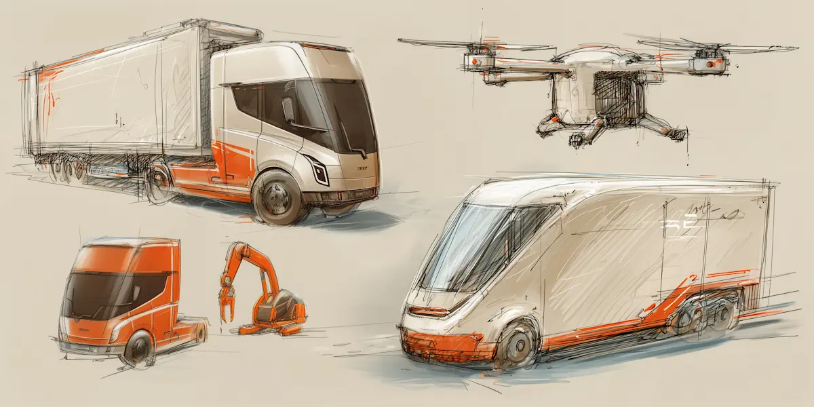
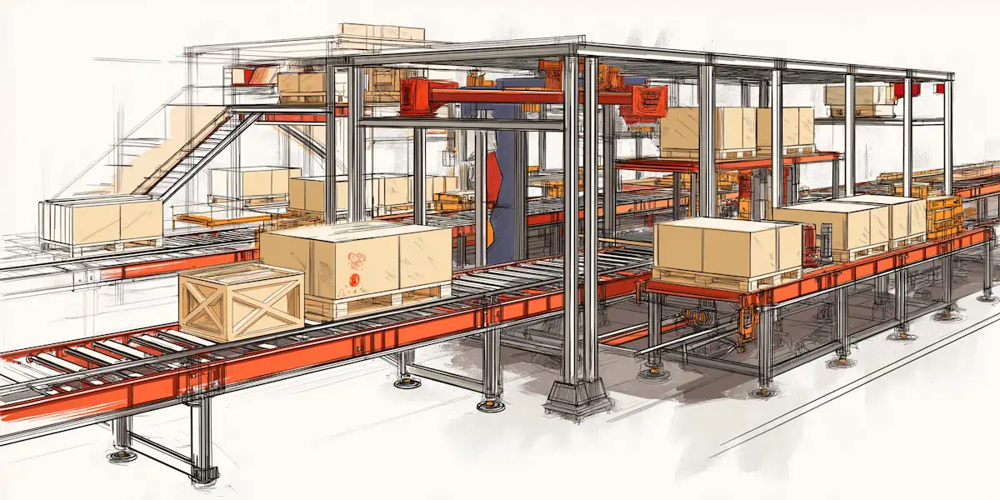
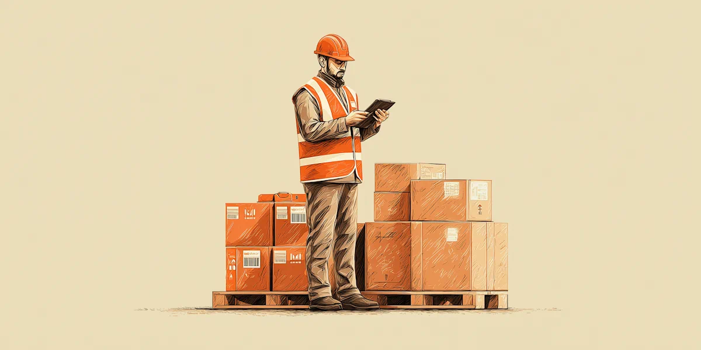
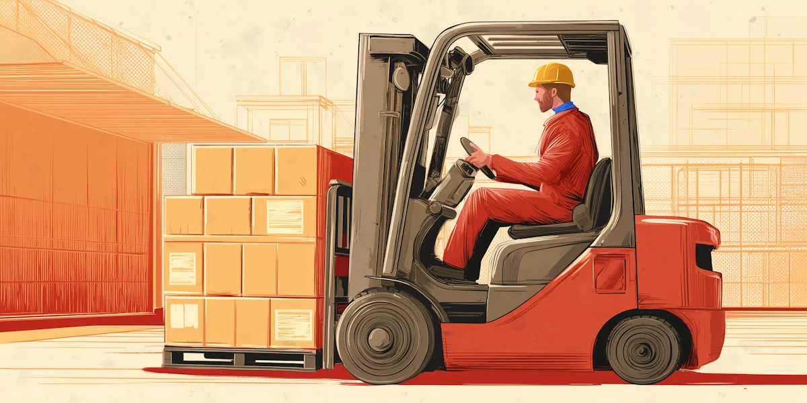

‍

It’s pretty hard these days to find and keep hold of good operations people. Meanwhile, costs are only getting higher, and customers are expecting faster deliveries and perfect accuracy. Sooner or later, automation will be seen as a necessity rather than a luxury.

On the other hand, there’s a lot of cases where advanced tech isn’t really practical for now. In this article we’ll look at four different areas where automation promises big improvements in logistics performance, and give you our no-nonsense take on who they’re for and if they really work.

The bottom line is that going all-in on robots and such only works for massive facilities (1 million square foot and up), and even then it’s not exactly smooth sailing. Whereas a lot of facilities are so behind on tech, they could actually see a big benefit from some quite modest upgrades.

First you have to understand your own operations, and figure out which processes are ripe for automation. Then you’ve got to get buy-in from your people on the changes. Otherwise it’s just not gonna work.

‍

## **Automation Challenges**

### **High upfront costs and ROI concerns**

Most automation needs a lot of upfront investment. We’re talking about new hardware, new software (which nowadays mostly comes as a subscription) and maybe making changes to your facility layout.

Naturally this creates hesitation. You don’t always know if and when you’ll get ROI. 

It can be pretty hard to put a number on productivity improvements or labor savings, and comparing that fairly against the total cost of ownership of new tech. And to make matters worse, it’s not obvious that your shiny new investment doesn’t turn out to be outdated when the next big innovation rolls around.

### **Change management and workforce adoption**

One pitfall a lot of operations managers fall into is the idea that automation can just slot in wherever you’re having problems with your human workforce.

The truth is that the most successful projects are collaborative. Most sophisticated tech needs some human interaction to reach its full potential. So you’ve got to train existing staff on how these systems work, and even more importantly how to troubleshoot issues.

A lot of companies underestimate just how resistant people can be to tech that has a ‘this could take my job’ flavor. You have to understand that massively transforming someone’s job can feel just as threatening as obvious moves to replace them. So you have to get your workforce engaged and enthusiastic first.

### **Integration with existing systems**

Data is the fuel that makes tech run. If the data isn’t flowing, you won’t get very far.

Operations managers sometimes try to roll out new systems in isolation, and then wonder why they don’t see the outcomes they were expecting. Every kind of tech - even a conveyor system - has data inputs and outputs. And if those aren’t connected up to something, you don’t really have automation, just one more machine to take care of.

The ideal future state you want to be working towards is one where your WMS, TMS or ERP can trigger automated workflows that make your operations run like clockwork. So every automation project needs to start with a question of how your systems will talk to each other.

That can be tricky, especially if you’re running older software and have multiple platforms that have been running separately for a while, maybe with a ‘don’t touch it because it might break and no one knows how it works’ kind of situation.

### **Regulatory and safety considerations**

Automation also has to comply with labor and safety regulations. In fact the liability and insurance requirements can be quite complex.

Safety protocols require even more careful consideration if you’re operating a mixed environment where human workers and robots work together in shared spaces. That can add even more complexity to your implementation plan.

A lot of operations managers don’t feel confident tackling these obstacles. So there’s a big question of: do you bring someone in from outside, or is there someone in your organization who specializes in change management?

In any case, you need to have an idea what success looks like before you begin. So what kind of logistics automation solutions are out there these days?

## **Robot Transportation**

Fully autonomous trucks and drone deliveries are the ambitious frontier of logistics automation, promising to address driver shortages and reduce transportation costs. 

But we’re not getting there anytime soon. There are still regulatory hurdles, infrastructure limitations, and of course questions about public acceptance.

On the other hand, if you think about closed-loop environments like ports and private logistics hubs, self-driving vehicles can operate without those problems. That creates a lot of opportunities for testing the tech behind the scenes, and there are a few applications mature enough to be worth considering.

### **Logistics Robots Examples**

**Autonomous Terminal Tractors -** Used in ports and bigger distribution centers to move trailers around the yard. Vendors like **Outrider**, **Kalmar**, and **TICO** are running pilots aimed at eliminating driver bottlenecks, reducing accidents, and keeping things moving around the clock. You need to map your yard properly and hook it up to a [yard management system](https://datadocks.com/datadocks-features/yard-management) to get these working.

**Automated Cranes & Gantries (ASCs, RTGs, ARMGs) -** You’ll see these in more advanced ports worldwide (especially in Asia and Northern Europe). They’re proven to work at scale but need solid infrastructure and a serious IT setup. If you’re looking to upgrade an existing crane operation in a high-volume yard, this is the next step.

**Delivery Drones -** Limited commercial service (e.g., Zipline for medical supplies, Wing for small parcels) in some regions. Growth is slow because of regulatory hurdles, but for critical or remote deliveries, drones can be a game-changer. Broader adoption depends on local flight rules catching up.

**Self-driving vans and sidewalk bots -** Companies like Nuro (vans) and Starship (bots) are operating in controlled city zones and college campuses. Regulations and road-readiness differ widely by region, but pilots are gradually expanding. If you’ve got short routes or a contained environment, this can be a real option now. Citywide usage is still evolving.

**Aerial Photography Drones -** Already becoming pretty common for site surveys, yard inventory checks, and security. Off-the-shelf drone technology is mature, and finding pilot services is easy. It’s a pretty low-barrier option to gain visibility, as long as you stay compliant with your local flight regulations.

‍

## **Automated Warehouse Logistics**

In the warehouse, the lines between mechanization and robotic automation are getting pretty blurry. Smart conveyor systems, automated storage and retrieval (AS/RS) and robot arms can all be implemented with varying degrees of control and coordination. Amazon and Walmart are ahead on this, but other companies running mega-facilities are starting to catch up.

### **Challenges**

The big roadblock is heavy upfront investment in equipment and facility design. Super-optimized automation usually takes a while to implement, which might involve downtime. A lot of companies won’t be able to accept that.

These systems also provide less flexibility when product lines or facility layouts change frequently, potentially creating constraints as business needs evolve.

### **When It Makes Sense**

Facilities that see the same SKUs year after year and have predictable demand stand to gain the most from large-scale automation. In that scenario, you can keep an AS/RS or a conveyor system running close to full capacity, and it won’t just sit there idle. That’s how the bigger players justify the steep upfront costs. They know they’ll get steady returns on the added efficiency and accuracy.

But the big question is how this translates to medium-sized facilities that switch SKUs regularly or see big seasonal swings. In those cases, you might want to hold off on “go big or go home” automation. More flexible solutions, like a few AGVs or a pick-to-light setup, can still improve throughput and cut labor costs without boxing you into something you can’t change down the road.

### **Examples of Warehouse Logistics Automation Equipment**

**Autonomous Guided Vehicles (AGVs)** navigate with magnetic strips or wires, and tend to perform best moving pallets. They’re easy enough to integrate in facilities with stable layouts and repetitive operations.

**Autonomous Mobile Robots (AMRs)** use sensors and mapping software instead of fixed tracks. Ideal when your floor plan or product flow changes often, since you can reconfigure their routes as you go.

**Smart Conveyor & Sortation Systems** can scan and weigh items in real time, automatically routing them to different stations. They’re great at handling large volumes with minimal human intervention, and modern setups are getting better at adjusting on the fly to accommodate rush orders or new product types.

**Automated Storage & Retrieval Systems (AS/RS)** can manage high-density racks with cranes or shuttles, cutting down travel and saving floor space. They can significantly boost throughput if your SKU data is accurate, but careful maintenance planning and wise exception handling processes are necessary to avoid costly downtime.

**Robotic Picking Systems** use vision-equipped robot arms to pick, pack, or palletize items. Great for repetitive tasks in high-volume e-commerce or manufacturing, though they may struggle with irregular product shapes.

**Pick-to-Light / Put-to-Light Systems** guide workers to the right location and quantity. Speeds up manual picking or replenishment, cuts search time, and lowers error rates without a huge IT overhaul.

**Automated Packaging Equipment** can handle carton erecting, sealing, or even custom box sizing. Saves labor on repetitive packing jobs and can reduce packaging waste if you’re dealing with variable item dimensions.

**Print-and-Apply Labeling Systems** help maintain consistent labeling quality and improve traceability at higher volumes than manual labeling can handle.

**Automated Dock Door Systems** use integrated sensors, gates, and sometimes conveyor mechanisms to speed up loading and unloading. Minimizes manual handling near dock doors and helps keep processes moving safely and efficiently.

‍

## **Logistics Process Automation**

Outside of physical operations, “robotic process automation” (RPA) refers to software ‘bots’ that handle repetitive tasks like data entry and documentation. Because it’s software-based, you don’t need a facility redesign, and the upfront costs are usually much lower than hardware automation.

The key is identifying where data flows are most prone to manual errors or bottlenecks. Many tools can trim hours off routine tasks, letting your team focus on more pressing issues. But it’s not a silver bullet: if your underlying data and processes are messy, simply layering on RPA won’t fix deeper problems.

One of the most practical ways to start with process automation is by tackling documentation. Digitizing tasks like proof of delivery, bills of lading, and other routine paperwork slashes manual data entry and errors while laying a solid groundwork for more advanced initiatives down the road.

## **Automated Logistics Documentation**

### **Why Start Here?**

Digitizing everyday processes like proof of delivery (POD) and bills of lading (BOL) removes paper bottlenecks, cuts down on errors, and ensures smoother compliance. Because it involves software rather than physical reconfiguration, the upfront costs and operational disruptions are minimal—making it an easy win for teams new to automation.

### **Common Documentation Automations**

**Electronic Proof of Delivery (ePOD)** can replace paper-based signatures and delivery forms with digital capture, usually with a mobile app. Drivers can log photos, signatures, and notes, syncing everything to your system in real time. That means fewer lost documents, fewer manual-entry mistakes, and faster updates.

Some software can handle **digital Bills of Lading (BOL),** Automatically updating and sharing BOL information among shippers, carriers, and receivers. Beyond reducing paperwork, it helps keep compliance records organized and ensures everyone is on the same page.

**Barcode/QR Code Integration** adds scanning at key touchpoints for automated data collection. Every item, pallet, or package is logged as it moves in or out, cutting down on manual input and improving traceability. This is especially useful for tracking high-value or sensitive goods that need a clear audit trail.

### **Building a Data-Driven Operation**

Automation depends on predictability. That starts with clean, structured data—something most facilities won’t get from paper forms and spreadsheets.

Digitizing documentation like BOLs and PODs gives you accurate, real-time records of what’s arriving and when. Once that information feeds into your dock scheduling system, you can assign doors more efficiently, reduce wait times, and keep your floor clear.

This structure is what makes mechanical automation viable. Systems like AS/RS, conveyors, and autonomous vehicles rely on steady, coordinated flows. If trucks arrive unscheduled or paperwork is missing, those systems can’t function properly. But when your docks are scheduled and your data is clean, automation can run at full speed with fewer interruptions.

## **The Benefits of Logistics Automation**

### **Predictability First, Efficiency Follows**

Automation doesn’t create predictability, it depends on it. The biggest benefits come when your processes are already tight. When your loading dock operations are scheduled and your documentation is digital, you have the kind of controlled environment where automation can actually thrive. Robots don’t improvise well. They need a steady, clean workflow. So you need to start by getting the basics right.

### **Better Use of Labor**

When the routine work is automated, your team can focus on higher value tasks like resolving exceptions, improving processes, or taking care of customers. Not only does that improve efficiency, it makes the job better for the people doing it. It also means you can do more with the team you’ve already got, which is critical when hiring is tough.

### **Scalability Without the Growing Pains**

Automation gives you the ability to scale without the usual spikes in labor, overtime, or chaos. But only if it’s built on good data and predictable operations. The good news is you don’t need to automate everything at once. Start small, prove it works, and build from there.

### **Fewer Surprises, Smarter Decisions**

Digitized workflows generate reliable, real-time data. That means fewer fire drills and better visibility into what’s really happening across your operation. Whether it's spotting slowdowns, planning shifts, or forecasting capacity, good data turns gut feelings into decisions you can trust.

### **Final Takeaway**

If you’re thinking about automation, start with the stuff that brings structure: digitized documentation, clear dock schedules, and connected systems. Get those right, and you’ll be in a strong position to scale up, whether that means adding robots, automating storage, or just running a tighter, leaner operation with the team you have.

‍