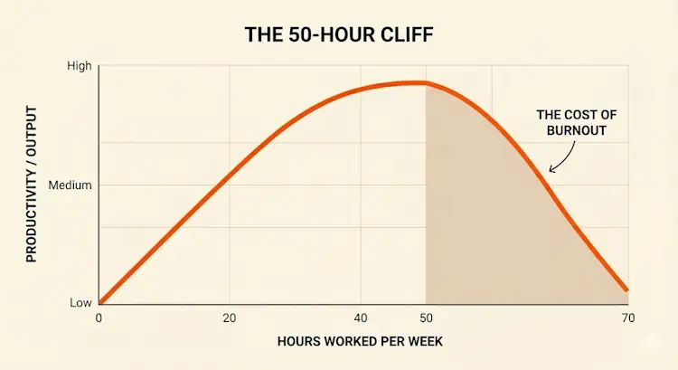
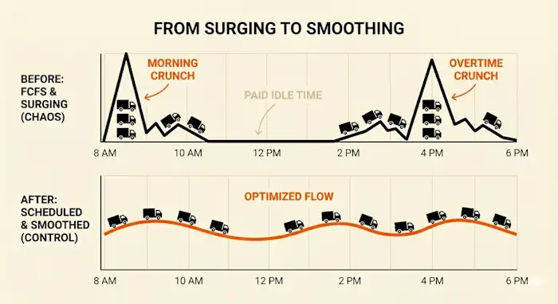

A lot of logistics leaders think about overtime like it's the unavoidable cost of doing business. The price you pay for high volume. But looking at overtime like a staffing lever rather than a symptom of inefficiency is what we'd call the "Capacity Fallacy."

In this video, DataDocks CEO Nick Rakovsky explains why standard responses to surges, like mandatory overtime or hiring temps, tends to accelerate burnout without actually doing much to clear the backlog.

‍

<lite-youtube videoid="CGy9deNE7Us" playlabel="Play: 6 Ways Most Warehouse Managers Try to Cut Overtime"></lite-youtube>

‍

## When Productivity Nosedives: The 50-Hour Cliff

We usually assume labor productivity is linear: 10 hours of pay equals 10 hours of output. The reality is the "Zombie Hour" phenomenon. Research from Stanford shows that employee output falls sharply after a 50-hour work week. The drop is so steep that someone working 70 hours produces almost nothing more than someone working 55 hours.**\[1\]** What's more, error rates in picking and safety incidents rise sharply as well.

You essentially start paying premium rates (1.5x) for sub-par output (0.8x).

It's not just a financial inefficiency, but a management failure that erodes your core team's resilience. As Nick puts it:

> As you put more and more pressure on those key members to deliver... it’s just going to push them further and further into that burnout mode.

‍

‍

When you push staff past the peak of this curve, you're also paying for the eventual turnover. As Nick says, the hard cost of replacing a burnt-out employee is **$18,000**. That is the hidden bill that comes due weeks after the overtime shift is finished.

‍

## Incentives and Temps Treat the Symptoms, Not the Disease

When the dock is congested at 3:00 PM on a Friday, the instinctive reaction is to find a quick fix. Nick identifies six common strategies managers use, ranging from pay incentives to shifting loads to 3PLs. While these might clear the lineup that's waiting outside right now, they function as expensive band-aids because they address the _symptom_ (the pile-up) rather than the _cause_ (the arrival pattern).

Here is the breakdown of the hidden taxes these "solutions" levy on your operation:

‍

| The Tactic | The Intended Goal | The Hidden "Tax" |
| --- | --- | --- |
| **Hiring Temp Labor** | Plug gaps in the schedule instantly. | **Efficiency Loss:** Training lag time & lower cases-per-hour means you pay more for less work. |
| **Pay Incentives** | Motivate staff to work faster during surges. | **Safety Risk:** Incentivizing speed often leads to shortcuts, damaged product, or injury. |
| **Resource Capping** | Stop the bleeding by banning overtime. | **Management Friction:** Arbitrary caps create a pressure cooker environment where work is simply left undone. |

‍

## The Structural Shift: From "Surging" to "Smoothing"

The Friday 4 PM panic isn't necessarily a labor problem at all. It might make sense to think of it as a truck scheduling problem.

In a First-Come, First-Served (FCFS) model, you are effectively letting external carriers dictate your internal labor schedule. You are forced to staff for the peaks (maximum capacity), which leaves you paying for idle time during the valleys (morning and mid-day lulls).

That's why you have to start smoothing the demand. By mandating appointments, you flatten the arrival curve.

‍

‍

So you can see how a predictable flow of 10 trucks per hour is much cheaper to manage than a random flow of zero trucks and then 20 trucks. The goal is to match the work to your existing staff, rather than frantically trying to finesse your staff to match the work.

‍

## Measuring The Impact of Dock Scheduling

Changing your intake model from reactive to proactive reduces stress for you and your team, but it also fundamentally changes the unit economics of the facility.

Based on data from facilities that have implemented the scheduling strategies Nick outlines in the video (Steps 1-5), the ROI is measurable across four key metrics:

### **1\. Paid Overtime Drop (18% → 5%)**

**‍**By eliminating the "catch-up" game at the end of shifts, overtime is reserved for true emergencies, not daily operations.

### **2\. Truck Dwell Time (98 min → 48 min)**

**‍**Drivers spend less time waiting in the yard, which reduces detention charges and improves carrier relationships.

### **3\. Labor Cost Per Order ($2.25 → $1.85)**

**‍**A smoother flow allows for consistent picking rates without the fatigue-induced slowdowns of "crunch time."

### **4\. Retention (32% → 22% Turnover)**‍

A predictable schedule protects your staff from burnout, saving that critical $18k replacement cost.

## Ready to flatten the curve?

Stop paying for chaos. [See for yourself how DataDocks helps facilities reclaim control of their gate and eliminate the Friday Crunch.](https://calendly.com/nick-rakovsky/datadocks-demo)

‍