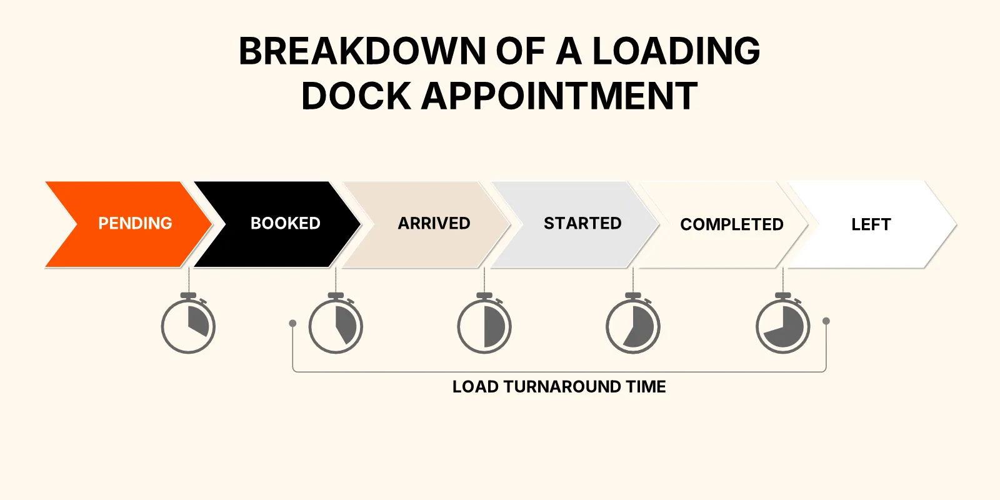

‍

Time slot management is one of the most overlooked tools for fixing broken supply chains. Without a smart system in place, your trucks show up late, your warehouse staff stands idle, and detention fees pile up.

In this guide, we’ll walk through everything you need to know about time slot management in 2025, how it works, why it matters, and how to implement it effectively for faster, more predictable operations.

A supply chain without proper planning can be a real headache.

If your trucks and warehouse staff aren’t where they need to be, you’re losing time and money—not to mention getting charged all sorts of detention and demurrage fees. 

It also causes suppliers and carriers to miss their assigned time slots, leading to late deliveries, inventory imbalances, and **unhappy customers.**

As a manager striving to improve your supply chain, you need a good time slot management system. 

But implementing time slot management can be expensive and daunting. 

You’re looking at charges for software, training, and other related costs. **Do the returns justify the costs?**

In this guide, we’ll explore a data-driven approach to time slot management, its advantages and disadvantages, and how to implement it the right way to maximize the benefits.

‍

## What Is Time Slot Management? 

Time slot management is about mandating specific time frames for deliveries and pickups in your supply chain. 

How nice would it be if your trucks were always on time, your suppliers weren’t late, and customer orders were delivered without delays?

This is the goal of time slot management—**to ensure your supply chain is as efficient as possible.**

Why Time Slot Management Beats the Status Quo

| Status Quo | With DataDocks |
| --- | --- |
| Predictable arrival windows | ✓ Yes |
| Real-time dock visibility | ✓ Yes |
| Reduced detention fees | ✓ Yes |
| Carrier self-service scheduling | ✓ Yes |
| Right-sized labor planning | ✓ Yes |
| Fewer surprise bottlenecks | ✓ Yes |

## 5 Logistical Benefits of Time Slot Management to Consider

All right, let's talk about the good stuff—the benefits it brings to the table

‍

**Here are five key advantages:**

‍

### Benefit #1: Efficient Resource Usage

Time slot management makes it easier to optimize the allocation of resources like trucks and warehouse staff. 

This means less downtime and lower operational costs, as everything is planned and utilized effectively.

The real benefit is in the phrase "less downtime." When your resources fit your supply chain schedule, you'll notice a drop in unnecessary expenses.

Your budget will thank you as expenses become more predictable and manageable.

‍

### Benefit #2: Streamlined Supply Chain Coordination

Effective time slot management results in your suppliers and carriers adhering to your schedule.

**The real value here is consistency.** Time slot management ensures that deliveries and pickups occur as planned. 

This coordination is the backbone of a well-functioning supply chain. It dramatically increases the probability that your products arrive when expected, allowing you to meet your commitments to customers. 

‍

### Benefit #3: Enhanced Customer Satisfaction

A well-organized supply chain means happier customers. 

Timely deliveries and smoothly coordinated orders increase customer satisfaction, generating loyalty and elevating the company’s reputation..

‍

### Benefit #4: Improved Inventory Management

Managing inventory can be a challenge.

You don't want too much stock gathering dust, nor too little that you run out when customers need it. Time slot management simplifies this challenge.

When you know precisely when goods will be in your hands, you can adjust your inventory levels accordingly—no more last-minute rushes to restock or holding excessive stock that ties up your resources. 

‍

### Benefit #5: Cost Efficiency

Every dollar counts. And efficiency equals more dollars saved for your business. 

**What else could you be spending money on besides inefficiencies?**

If you implement time slot management, you're not just enhancing efficiency—you're also protecting your budget for the future. 

These practical benefits make a strong case for considering time slot management in your supply chain. 

‍

## Time Slot Management Could Be Right for You If… 

‍

‍

‍

Let's explore five common challenges that managers often face and how a time slot management system could be the solution:

### Problem #1: Resource Allocation Problems

If you're struggling with effectively allocating resources like trucks and warehouse staff, time slot management can help streamline this process.

‍

### Problem #2: Supply Chain Disruptions

Are there consistent disruptions in your supply chain due to suppliers or carriers missing their assigned slots? 

Time slot management can make sure deliveries and pickups happen on schedule, maintaining the flow of your operations.

‍

### Problem #3: Customer Satisfaction Concerns

Are customer complaints piling up due to late deliveries or order mix-ups? 

A good time slot management system can improve customer satisfaction by safeguarding timely and coordinated services.

‍

### Problem #4: Inventory Headaches

Managing inventory can be tricky when you're uncertain about delivery times. 

Time slot management gives you clarity for better inventory planning and reducing stock outs or overstock situations.

‍

### Problem #5: Balancing the Budget

Struggling to justify the costs associated with implementing a time slot management system? 

While there's an initial investment, the long-term savings in operational efficiency can outweigh the upfront expenses.

‍

**If you relate to these problems, it's worth considering data-driven time slot management as a solution to your challenges.** 

‍

## How to Integrate a Time Slot System Into Your Supply Chain  

### Step #1: Assess Your Needs

Begin by assessing your supply chain's unique needs. 

Identify the pain points, bottlenecks, and areas where time slot management can make the most impact.

Where are the hold-ups? Are there consistent delays in deliveries? Is resource allocation causing problems?

Investigate these questions thoroughly. It's about finding the places where time slot management can be a game-changer. This step lays the foundation for a successful implementation.

For example, you may discover that deliveries from a particular supplier are frequently delayed by two days or more, causing operational disruptions. This data highlights that time slot management can help match that supplier’s schedules with your requirements.

‍

### Step #2: Choose the Right Software

Choosing the right time slot management software is crucial. 

Because having a bunch of times on 4 different white boards just isn’t gonna cut it these days.

You need something that not only solves your problems in theory, but also something that your employees will actually buy into.

Look for user-friendly solutions that align with your needs. After all, the goal is to simplify processes, not complicate them.

Make sure the software offers essential features like:

*   **Rescheduling:** The ability to easily modify appointments after you’ve made them.
*   **Reporting:** Tools to track and analyze performance and spot trends.
*   **User Support:** Access to reliable customer support for troubleshooting.
*   **Self-service: An easy way for carriers and partners to request appointments on their side.**

Research and compare software options to find one that suits your needs and budget.

Take the time to explore and compare different software options. Consider factors like scalability, compatibility with your existing systems, and the vendor's reputation in the industry.

When two or more solutions seem to offer similar benefits, get demos from both. Speaking to them personally is also an opportunity to gauge whether supporting their users is a high priority for them.

‍

### Step #3: Supplier and Carrier Collaboration (Yes, It’s Possible)

This is the part that most people worry about. “Do we really think we can enforce all these new rules on everyone? Will they accept it?”

Implementing a new system means removing the old ways and learning new ways—not everyone wants to go through that. 

That is… unless it helps them.

The goal is to collaborate with your suppliers and carriers. Communicate the changes and expectations regarding time slots. And make this a value-add for them, instead of an added headache.

The main goal is to establish a clear line of communication to:

*   **Coordinate Schedules**: Align delivery and pickup times with your time slots.
*   **Address Concerns:** Listen to any concerns or challenges your partners may face and work together to find solutions.

In order to do that effectively, you’ll need to know exactly how you can make the suppliers’ and carriers’ lives easier. You’ll also need to sell it to them. Try these strategies:

*   **Highlight the Benefits for Carriers:** Emphasize how time slot management can lead to more predictable schedules and reduced waiting times for carriers. This can help them plan their routes more efficiently. Point out potential cost savings for carriers, such as [reduced detention fees](https://datadocks.com/posts/how-to-avoid-demurrage-and-detention-charges-throughout-the-supply-chain) and more consistent work schedules.
*   **Gradual Implementation:** Consider a phased approach to implementation, gradually increasing expectations on carriers over time. This allows carriers to adapt gradually and reduces the initial shock of change.
*   **Incentives and Rewards:** Introduce [incentives or rewards for carriers](https://datadocks.com/posts/warehouse-motivation) who consistently adhere to the time slot schedule. Recognize and appreciate their cooperation and punctuality.

Smooth collaboration ensures that everyone is on the same page and committed to the new system's success.

‍

### Step #4: Staff Training

Invest in training your team to use the new system effectively. Make sure that everyone understands how to schedule slots, manage appointments, and troubleshoot issues.

Training should cover:

*   **Bulk Uploading P.O.s:**
*   **Managing Appointments**
*   **Setting up Capacity Limits and Custom Rules**
*   **Troubleshooting**

Effective training empowers your staff to make the most of the new system.

Consider holding training sessions that are interactive and hands-on. Encourage questions and provide practical examples to illustrate concepts. It's not just about imparting knowledge but also about building confidence in your team.

If possible, find a way to incentivize their use of the new system. This can help with buy-in.

Make sure to support them along the way. Your team should know where to seek help if they need it. 

A good support system can resolve issues quickly, minimizing disruptions to your operations.

‍

### Step #5: Define Clear Processes

Establish well-defined processes for various aspects of time slot management, such as:

*   **Load Scheduling:** Outline how and when slots should be scheduled.
*   **Changes and Cancellations:** Define procedures for modifying or canceling appointments.
*   **Conflict Resolution:** Develop a process for handling scheduling conflicts or issues.

When everyone involved knows exactly how these processes work, it clears up potential confusion. 

‍

### Step #6: Monitor and Adjust

Create a monitoring system to track the performance of your time slot management system. 

Regularly review key metrics such as on-time deliveries, resource utilization, and partner satisfaction. 

Identify areas for improvement and be prepared to make adjustments.

‍

### Step #7: Customer Communication

Keep your customers informed about the changes in your scheduling processes. Emphasize the benefits they can expect from the improved system, such as:

*   **Reliability:** More predictable delivery and pickup times.
*   **Faster Service:** Reduced waiting times and quicker order fulfillment.

Effective communication guarantees that your customers know the positive changes and can appreciate the improved service.

By following these seven steps, you can smoothly integrate a time slot management system into your supply chain.

‍

## A Time Slot Management System Can Boost Your Supply Chain Efficiency

‍

If you're facing resource allocation issues, supply chain disruptions, customer satisfaction concerns, inventory headaches, or budget balancing struggles, then data-driven time slot management could be your answer. 

And the good news? We’ve made it extremely simple and effective.

Explore how it can work for your business by booking a demo with the DataDocks team.

In a world where efficiency is necessary, time slot management can be your winning strategy. 

Don't miss out on the opportunity to satisfy your customers and boost your supply chain efficiency. 

[**Book a demo with us today**](https://calendly.com/nick-rakovsky/datadocks-demo?month=2023-10) **and enhance your operations! You can also give us a call at (+1) 647 848-8250**