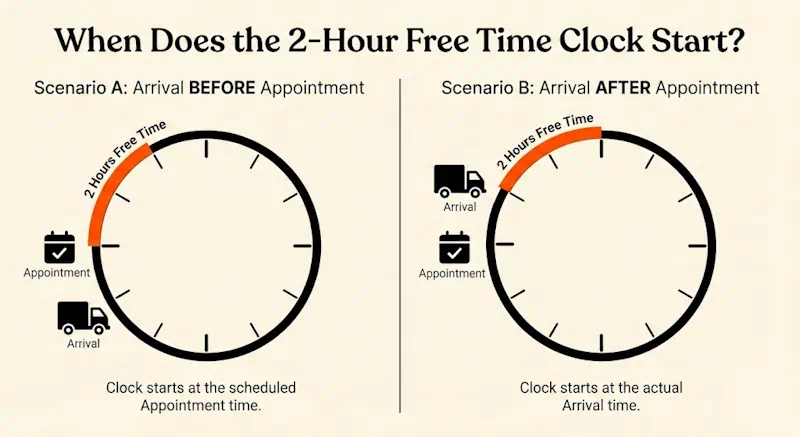
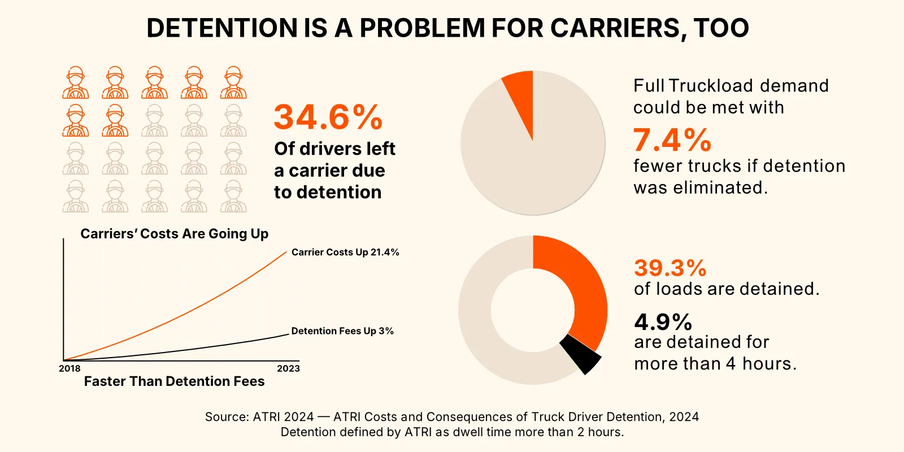
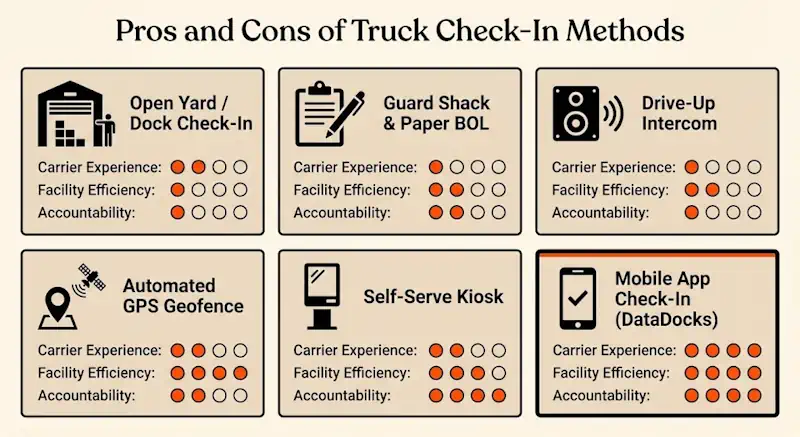
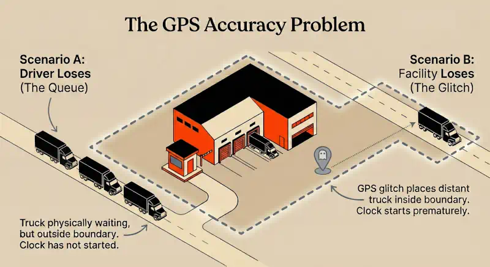
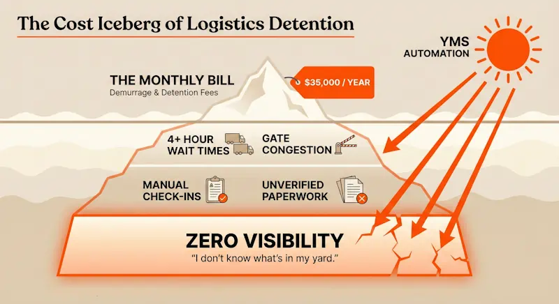

Driver detention disputes bleed tens of thousands of dollars from warehouse budgets every year, creating a constant cycle of friction between facilities, brokers, and carriers.

‍

<lite-youtube videoid="zuzG9GArpic" playlabel="Play: How to Avoid Detention & Demurrage: 5 Steps to Save THOUSANDS"></lite-youtube>

‍

As Nick explains, relying on reactive, end-of-the-month arguments over massive invoices is a losing battle. To truly eliminate these costs, you need to understand the underlying mechanics of carrier and third-party negotiations. Here is your definitive, operational guide to settling driver detention disputes once and for all.

## **Truck Driver Detention Time: What Actually Qualifies as "Late"?**

At mega-retailers like Walmart, the policy is that if a truck turns up at 9:01 for a 9:00 a.m. appointment, that driver is late and they’re not getting any detention. Walmart can do this because they’ve got all the leverage.

But that’s not how the schedule works for most facilities. Generally, 8:30 to 10:00 is “on time” and you only start to challenge detention claims when trucks are an hour or more late. 

However, you don’t want carriers who show up early to think the clock starts the moment they enter the property. The policy should be clear: **the appointment clock begins at the scheduled time, OR when they arrive, whichever is later.** Agree on this upfront, write it explicitly into the contract, and trigger automated reminders when an appointment is booked.

‍

**The FCFS Problem: Transitioning from "Whenever" to Scheduled Appointments**

First Come, First Served (FCFS) is a breeding ground for disputes because there is no baseline for when to start the clock. Carriers used to FCFS expect detention pay if they sit for more than two hours, regardless of their arrival time.

You cannot simply flip a switch to strict appointments. You must communicate the transition and update contracts, often using a carrot-and-stick approach: _“If you show up without an appointment, we’ll work you in, but don’t expect detention. If you book an appointment and arrive within an hour, we’ll turn you around in two hours or pay up without question.”_ 

That deal is a no-brainer for most carriers, but you can fine-tune it for each one of your partners.

Think of it this way: getting them to agree to a theoretical appointment time is phase 1. Getting them to show up on time is phase 2.

## **How to Track Detention Times for Carriers Fairly**

Even with an appointment policy in place, you have to define exactly when a truck has “arrived.” Is it when they queue outside, when they cross the gate, or when they bump the dock? Misaligned expectations here cause the most bitter “he said, she said” disputes.

‍

‍

### **Setting Strict Detention Trucking Requirements to Prevent Exploitation**

Being fair means paying a driver if your dock genuinely holds them up. Their profit vanishes when their wheels stop moving, and holding an independent owner-operator for 8 hours without pay will quickly destroy your facility’s reputation.

‍

But you also have to protect yourself against carriers or brokers who fail to communicate delays, only to blindside you with invoices weeks later.

You balance this by instituting clear, written policies paired with a “fair play” attitude, especially when your own operations are running behind.

### **The Guard Shack Bottleneck vs. The GPS Geofence**

Brokers and large fleets sometimes use tracking tools like MacroPoint to generate a GPS ping and timestamp of arrival. They do this to protect drivers from sitting unpaid in a massive queue only to be marked “late.” However, this can be unfair to facilities if the automated clock starts ticking while the truck is still down the street.

Conversely, drivers rarely trust the guard shack. If your policy relies on a unilateral scribbling of arrival times on the Bill of Lading (BOL), expect disputes. Drivers will anxiously take photos of the BOL or demand signatures to protect themselves.

The happy middle ground is partial driver self-check-in via a mobile app. This creates a shared digital timestamp, helps your dock team quickly identify the load, and provides critical visibility. See a consistent discrepancy between driver check-in timestamps and seal-broken timestamps? Sounds like something’s going wrong in the yard.

### **Is Truck Detention Time Regulated By US Federal Law?**

Since the Motor Carrier Act of 1980 deregulated the trucking industry, the federal government does not dictate commercial billing terms. There are no statutory detention rules or minimum rates.

If rules are not contracted and a dispute escalates to litigation, courts typically award the "reasonable market value" of the carrier's time. This means a court might order you to pay $100+ per hour rather than a cheaper rate you could have negotiated upfront.

One law you should be aware of is the Hours of Service (HOS) regulations. Drivers are limited to a 14-hour on-duty window (with a maximum of 11 hours of driving) each day. Once that clock starts, it cannot be paused while a driver waits to be unloaded at your dock. Delays eat directly into their legal operating capacity. If your facility routinely drains their HOS without compensation, they will simply refuse your freight.

‍

‍

## **Managing Detention for Truckload Stop-Offs and LTL fees**

Multi-stop freight is a powder keg of accessorial fees. Trying to force these loads into standard FTL time slots causes massive friction, because LTLs and multi-stop FTLs operate under completely different physical constraints.

### **15-Minute Increments and LTL "Failure" Penalties**

Free time for a standard hub-and-spoke LTL carrier is brutally short, often 15 to 30 minutes, dictated by their rigid "100-rules" tariffs. If your dock isn't ready, the driver won't sit around and miss their nightly terminal cross-dock. They just leave.

When this happens, you aren't billed hourly detention. You get hit with punitive, flat accessorials like a TONU (Truck Order Not Used) or a Redelivery fee. These protect the carrier’s strict linehaul schedule. Don’t argue with the driver on the dock; their hands are tied by dispatch.

This may sound familiar if you’ve ever dealt with drayage drivers racing against port gate closures, or dedicated milk-run FTLs protecting an assembly line. These guys also walk away rather than wait.

### **What's a Stop-Off Fee? And "PTL" Freight?**

Operationally, you must distinguish between hub-and-spoke LTLs and Partial Truckloads (PTLs). A **PTL** means you are still sharing trailer space, but the freight generally stays on that exact same truck from origin to destination without going through a terminal cross-dock.

Similarly, a **stop-off fee** pays a dedicated FTL carrier to add multiple deliveries to a single route.

Unlike hub-and-spoke LTLs, these drivers rarely abandon a route, and you might still get your standard two hours of free time. The tradeoff is extreme unpredictability. If you are Stop 4 on the BOL, you inherit the compounding delays of Stops 1, 2, and 3.

To manage this, push brokers and carriers for real-time ETA updates, ideally through digital tracking. If you find out early that a truck is delayed by 12 hours at a previous stop, you can adjust your dock labor or slot other freight into that door, rather than scrambling when the driver inevitably misses their original appointment.

### **Shipping to Grocery Giants: Chargebacks, "Preferred Carriers," and Consolidation**

Shipping outbound to grocery distribution centers presents another detention trap.

Gambling with discount LTLs on strict grocery deliveries skyrockets your risk of failure fees and third-party lumper extortion. You cannot dispute these fees with your massive customer, They will simply deduct the cost from your product invoice via a chargeback.

The best approach is to use one of your customer’s "preferred carriers,” or a 3PL retail consolidator. These providers combine multiple vendor LTL shipments into one FTL delivery for the customer. 

And if your own facility is overwhelmed by unpredictable inbound LTLs, take a leaf out of the grocery playbook and transition your inbound terms to "collect." You can then hire a single regional carrier or 3PL to sweep your vendors and deliver tightly managed, consolidated FTLs to your dock.

‍

## **Dealing with Brokers, Dispatchers and Other Middlemen**

When a truck pulls up at your dock, the financial strings are often pulled by middlemen: brokers, dispatchers, or automated platforms. Understanding their motives is the best way to prevent disputes.

### **The Broker's Playbook: Policies and Commercial Obligations**

When a broker is involved, the legal agreement for detention (the rate confirmation) is strictly between the broker and the carrier. Because the broker is on the hook, most will fight your facility tooth and nail to cover the cost.

But a good broker will call your shipping office before free time expires. If your facility absolutely refuses to pay for a delay, some brokers will actually pay the carrier out of pocket just to preserve their carrier relationship and keep the freight moving.

The best way to deal with brokers is to keep strict paper trails. Better yet, ditch the paper for a digital system. If you have a verifiable "Time In" and "Time Out", you can avoid hostile disputes.

‍

### **Owner-Operators vs. Dispatchers vs. Giants**

Who you delay dictates the operational fallout:

*   **Owner-Operators:** They often lack the back-office leverage to fight a facility over an invoice. However, they talk. Word gets out on trucking forums and soon enough you start seeing “headache premiums” on your spot rates.  
      
    
*   **Fleet Dispatchers:** When you delay a mid-sized regional fleet, you are fighting their dispatch officer. Dispatchers are constantly calculating Hours of Service (HOS) and transit times. Your delay directly threatens their ability to make their next scheduled pickup, so they will aggressively pursue detention to offset that threatened revenue.  
      
    
*   **Giant Carriers:** Mega-carriers don’t argue with your dock staff. They use automated billing integrations to slap the charge directly onto your corporate invoice.

### **Fighting the Algorithm: Automated TMS Platforms and Loadboards**

When freight is booked through digital freight matching apps or automated TMS boards, detention tracking is handed over to the software. As mentioned earlier, GPS pings and geofences can be imprecise, which can leave either party holding the bag.

But the deeper implication is the loss of human negotiation. You cannot call an app to explain that a forklift broke and ask for a 30-minute grace period. If the platform auto-denies a driver's claim due to its own policy, the driver’s frustration inevitably spills onto your dock, forcing your floor team to manage the physical fallout of a digital middleman.

‍

## **The Finger-Pointing Game of Truckload Accessorial Charges: Who Actually Pays?**

There is no universal rule for who pays wait-time fees. It depends on the collision between the commercial contract and the transportation contract.

### **Vendor Compliance Chargebacks on FOB Origin / Freight Collect loads**

If your customer hired the truck (FOB Origin / Freight Collect) and your dock delays the driver, the carrier doesn't invoice you. They invoice your customer. Because you aren't the contracting party, the carrier will ignore your dock logs and your side of the story. You are locked out of the dispute process.

However, you aren't off the hook. Your customer will simply penalize you for the service failure and deduct the cost from your product invoice via a vendor compliance chargeback.

### **Surprise Accessorial Fees for Carriers: Handling After-the-Fact Invoices**

Spot-market carriers will sometimes blindside you, demanding an exorbitant hourly rate days after a load delivers. If the carrier failed to alert you _before_ free time expired, play hardball. Refuse payment based on their failure to mitigate damages.

But if the delay was undeniably your dock's fault, or if the carrier relationship is critical, burning the bridge is a bad strategic move. Instead, negotiate a partial settlement to cover their operating costs, strictly contingent on them signing formal, upfront accessorial terms for all future loads.

‍

### **When Bad Scheduling Turns Into a Layover Fee in Trucking**

A standard dispute involves hourly rates, but extreme delays can bleed overnight, triggering a much larger layover fee. This happens when a driver runs out of Hours of Service (HOS) while sitting at your dock, or when a facility blindly pushes a missed appointment to the next day.

These catastrophic fees happen when upfront communication totally breaks down. To prevent them, operations managers must establish a hard cut-off protocol: know exactly when to tell a driver to drop the trailer or return tomorrow, and always explicitly cap your layover liability in your facility's carrier contracts.

‍

## **Here’s a Driver Detention Management System That Actually Works**

The typical facility wastes between $15,000 and $35,000 a year on detention costs. Operationally, that is the equivalent of taking one of your forklifts and setting it on fire just because a truck waited longer than it should have.

You cannot win the finger-pointing game against brokers, giant fleets, or algorithmic middlemen if you are relying on reactive, end-of-month arguments. To protect your budget and your carrier relationships, you must get proactive.

### **Why You Need Dedicated Trucking Detention Software**

The root cause of almost every accessorial dispute is ambiguity. When nobody agrees on exactly when the clock started, everyone defaults to pointing fingers to protect their own margins.

Using dock scheduling software creates a single, undeniable source of truth. Visibility is step one. If you are still running FCFS or relying on drivers to scribble "Time In" on a paper BOL, you are flying blind. A digital system forces visibility onto every inbound shipment, allowing you to organize your QC process, prep paperwork, and actively lower the volume of idle trucks congesting your yard.

When your timestamps are digitized and shared instantly between the driver's mobile check-in and your warehouse dashboard, brokers and spot-market carriers can no longer blindside you with retroactive invoices weeks later.

### **Automating Alerts**

Visibility is the baseline. The real savings come from exception monitoring.

Think about how quickly a standard delay can spiral into a catastrophic layover fee. You cannot rely on an overworked dock coordinator to constantly check their watch while managing a chaotic floor.

A purpose-built scheduling tool like DataDocks watches the clock for you. You can build custom rules around every specific carrier contract or appointment type. As a truck gets dangerously close to its free-time limit, the software triggers automated warnings. It pushes visual notifications to your dashboard and sends direct alerts to the specific floor workers who need to intervene.

This gives your team the power to react to a bottleneck, triage the dock, and get the truck loaded or unloaded _before_ the detention meter actually starts running or a dispatcher tells their driver to leave. Stop waiting for the end of the month to answer for idle trucks. Implement the right software, digitize your dock, and put an end to detention once and for all.

‍