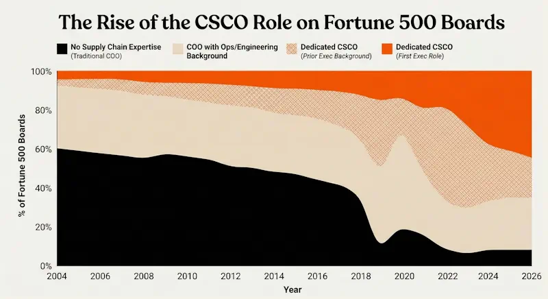
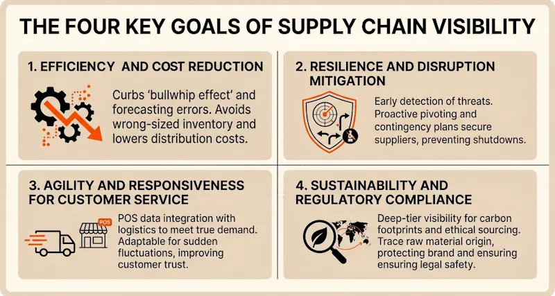
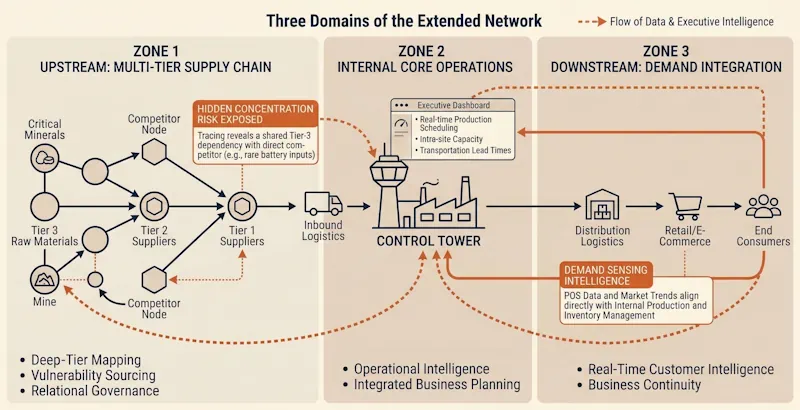
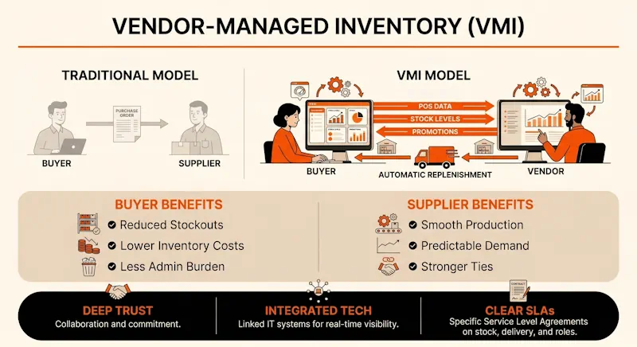

Supply chain management has gone from being a back-office cost center to a major driver of business value and risk mitigation.

Operations leaders who can transform opaque, siloed networks into transparent, data-driven ecosystems are increasingly getting promoted all the way up to the exec team as the Chief Supply Chain Officer (CSCO).

Source: Interpolated from Spencer Stuart’s 2024 Fortune 500 C-Suite Snapshot, Heidrick & Struggles 2025 Supply Chain Officer Focus, and Indago's 2020 CSCO Survey

If you want to escape the warehouse and drive corporate strategy one day, here are the unvarnished facts about what SCV actually means to the boardroom, the technology required to get there, and how to execute it in your organization.

## **The Business Value: Why Companies Need SCV**

As far as executive leadership teams think of it, supply chain visibility means the intelligence that allows a company to pivot its commercial strategy before a physical bottleneck inflicts serious damage to the business.

Modern operations are under pressure from the "Amazon effect" of faster delivery expectations, volatile economic conditions and global events, and growing demands for CSR/ESG transparency.

Organizations that can’t establish adequate visibility risk falling behind their competitors and suffering severe financial and reputational consequences.

## **Production and Logistics Visibility (PLV) and Executive Intelligence**

Historically, operations leaders were treated as process engineers who managed a black box: the company put money and orders in, and operations got products out as quickly and cheaply as possible.

Today, boards realize that supply chain disruptions are existential threats, and compliance mandates (like Scope 3 emissions tracking) are tied directly to their fiduciary duties. Operations is now a core part of business strategy.

The transition from operations manager to Chief Supply Chain Officer (CSCO) requires a shift in perspective. To secure and hold a seat in the boardroom, an operations leader must bridge the gap between physical mechanics and "executive intelligence." To do this, you have to clear two specific hurdles:

### 1\. Speaking the Board's Language

Ops people chase efficiency by nature. But in the boardroom, metrics like dwell times and fill rates mean nothing if they don’t translate to working capital, EBITDA, and the cash conversion cycle. A perfectly engineered logistics network is a failure if it ties up cash for six months. 

The CSCO must act like a translator, using operational intelligence to brief the board on geopolitical risks, capacity constraints, and tariff impacts in purely financial and strategic terms.

### 2\. Surviving the Political Reality

Beautifully orchestrated operations become useless if the sales department routinely over-promises on delivery capability to close deals. The CSCO must possess the political savvy to force cross-functional alignment.

Furthermore, no matter how aggressively you invest in tracking infrastructure, systems process data, human beings still control it. Technology alone cannot force a protective tier-2 supplier or a siloed internal team to hand over sensitive information.

### The Operations Leader’s Secret Weapon: Relational Intelligence

The primary engine of true visibility is relationship management. Consider Apple’s operational maneuvering throughout the breakdown in U.S.-China trade relations. Apple did not just rely on ERP metrics; its leaders leveraged deep relational capital with partners like Foxconn and TSMC. 

By empathetically navigating their suppliers' political constraints, Apple ensured information sharing didn't break down when pressure spiked. This trust-based visibility allowed them to map alternative production capacities without fracturing their global network.

## **From Over-Optimization to Resilience**

Before COVID, COOs favored aggressive just-in-time manufacturing and single-sourcing, using leverage to keep costs low.

But it turns out that strategy is pretty fragile and prone to disastrous failures.

So now boards talk about **_supply chain resilience_,** and the major driver of that is visibility. True resilience doesn't mean simply hoarding "just-in-case" inventory. It means building configurable supply chains, using levers like nearshoring, supplier-managed inventory and demand forecasting, that enable the business to respond gracefully to circumstances as they evolve.

None of these strategies are possible without deep intelligence about your suppliers and customers. For that reason, the remit of supply chain management continues to get wider.

### **The Expanding Window of Supply Chain Management**

To provide true executive intelligence, a CSCO must shatter traditional information silos and extend visibility across the entire value chain. Managing just your own four walls, or even just your Tier-1 partners, is an illusion of control.

True supply chain visibility bridges three distinct environments. It connects the **Internal Core** with deep, hidden vulnerabilities in the **Upstream Supply Chain,** while feeding **Downstream Integration** from the end consumer.

By mastering all three domains, the CSCO can transform operations from a reactive fulfillment engine into a strategic hub, finally aligning commercial demand generation directly with physical supply reality.

## **Supplier Visibility, Transparency & Information Flows**

For decades, supplier relationship management was defined by transactional, cost-battering buyer-seller dynamics. 

But when you deal with suppliers this way, they will inevitably hide their operational vulnerabilities from you to protect their contracts. True supplier visibility relies on "relational governance": enforcing accountability through mutual trust, and transitioning the relationship from reactive penalization to proactive business continuity planning.

### Strategic Information Sharing & Supplier Relationship Management (SRM)

Visibility cannot be a one-way street where a company just extracts data from its network. The ultimate goal of upstream transparency is the establishment of collaborative, bidirectional information flows.

This is where emotional intelligence and relational governance come in.

Instead of starting from scratch with untested local partners, Apple convinced their trusted, long-term suppliers (like Foxconn and Pegatron) to move **_with_** them to India and Vietnam, instantly transferring decades of established operational shorthand.

Rather than micromanaging the entire local ecosystem, Apple relied on the established trust with its Tier-1 assemblers, empowering _them_ to vet and manage the smaller, local Tier-2 and Tier-3 component suppliers.

When new suppliers inevitably stumbled on compliance or quality, Apple sent its own engineers to collaboratively fix the root causes alongside the supplier, rather than strictly terminating contracts. This built immense long-term loyalty and capability.

### Multi-tier Supplier Mapping (“N-Tier Visibility”)

Once that foundation of trust is established, a CSCO can safely look deeper into the network. 

Managing only your direct, Tier-1 suppliers leaves you exposed to hidden concentration risks further into your supply chain. True visibility requires deep-tier mapping (Tier 2, Tier 3, all the way back to primary raw material inputs) to expose critical vulnerabilities before they impact your output.

**Real life example:** Deep-mapping their supply network showed Audi that their Tier-1 battery supplier (LG Chem) relied on the same Tier-3 lithium mine as direct competitors like Ford and Chrysler. 

If a raw material shortage hits, the CSCO with N-Tier visibility knows to secure alternative sourcing weeks before the rest of the market realizes there's a problem.

Deep-tier transparency is also increasingly a regulatory necessity. It allows companies to verify ethical compliance, prove safe working conditions, and accurately calculate Scope 3 environmental footprints, shielding the brand from legal and reputational damage.

### Vendor-Managed Inventory (VMI)

With a fully mapped network and bidirectional data flows in place, you can build single-source-of-truth portals for collaborative capacity planning and scorecarding. This is the prerequisite for Vendor-Managed Inventory (VMI).

VMI lowers inventory carrying costs across the board by aligning supplier production directly with your real-time consumption data. Suppliers can autonomously optimize stock replenishment, making the relationship mutually profitable and deeply sticky.

### Inbound Logistics Visibility

You can have a perfectly mapped multi-tier network and highly collaborative VMI agreements, but all of that high-level executive intelligence instantly loses its value if you go blind the moment a supplier puts the product on a truck.

Effective inbound management requires taking that upstream data and continuously integrating it with physical shipping schedules.

That means moving beyond basic, batch-processed EDI to track Purchase Orders (POs), Advance Shipping Notices (ASNs), and multimodal transit milestones in real-time, and using this data to proactively manage the yard, smoothing out inbound peaks and reducing facility congestion.

## **Downstream Integration and Advanced Technologies**

### Using Predictive Analytics for Demand Forecasting

Downstream demand forecasting is currently one of the most high-ROI applications of supply chain technology. This is the stuff that captures the imagination of the board.

It also requires some deep collaboration with sales and marketing, which means the CSCO must step outside their comfort zone and actively shape commercial strategy, aligning S&OP (Sales and Operations Planning) dynamically with real-time consumer behavior shifts.

Traditional demand planning is like driving by looking in the rearview mirror. It relies on analyzing lagging historical sales data.

True predictive analytics means feeding real-time Point-of-Sale (POS) data into machine learning models alongside external variables, like shifting weather patterns, local events, and social media sentiment. You can proactively pre-position inventory exactly where it will be needed before the demand surge actually hits.

Bridging this physical-digital divide is critical. Technologies like RFID provide item-level tracking, ensuring the predictive models have flawless baseline data to work with, and enabling companies like GAP and Lululemon to achieve 98%+ inventory accuracy and near-perfect on-shelf availability.

### LLMs, Knowledge Graphs and AI Agents

Advanced Large Language Models (LLMs) and Knowledge Graphs (KGs) are fundamentally changing how organizations map their extended networks. If you have suppliers who refuse to share data, these tools are how you map them anyway.

Traditional supply chain models are linear and struggle to track more than direct buyer-supplier links. KGs use interconnected nodes to build multi-relational structures, capturing complex dimensions simultaneously (e.g., who supplies whom, shared ownership, and geographical overlaps).

The historical barrier to KGs has been the sheer cost of manual data entry. Supply chain data is massive, decentralized, and buried in unstructured formats like financial reports and news articles across the web. Today, LLMs solve this by acting as automated reasoning engines.

**Real-World Example:** This technology is exactly how the N-Tier mapping in the Audi/LG Chem battery case was achieved. Audi didn't rely on their Tier-1 suppliers to voluntarily disclose vulnerabilities. Instead, an LLM-driven KG crawled unstructured public web data to trace the lithium back to specific Tier-3 mines, exposing the shared dependencies among competing EV brands.

Mapping upstream vulnerabilities protects the business, but the boardroom is ultimately focused on revenue and margin. The true CSCO move is pivoting this same analytical engine downstream. By feeding unstructured market signals, like early indicators of competitor supply constraints, shifting regulatory landscapes, or regional economic triggers, into your Knowledge Graph, you can bridge the gap between physical supply and commercial strategy.

### IOT, Blockchain and Edge Computing for Immutable ledgers and Digital Twins

There is a hard reality to the current AI hype: LLMs are reasoning engines that will hallucinate without clean, structured, and real-time operational data. To build a true **Digital Twin** (a virtual mirror of your physical network where you can stress-test bottleneck scenarios without risking physical operations), you need an infrastructure that bridges the physical-digital divide.

The convergence of three technologies provides this foundational ground truth:

| Technology | Strategic Function | Real-World Application |
| --- | --- | --- |
| IoT Sensors | Captures physical ground truth. | Active trackers for cold-chain integrity and shock monitoring. _Example: A global pharma company used IoT to track blood plasma temperatures for FDA compliance, yielding a 50x ROI._ |
| Edge Computing | Processes massive sensor data locally (factory floor, trucks). | Reduces latency and bandwidth costs, enabling the split-second automated decisions required for robotics and Automated Guided Vehicles (AGVs). |
| Blockchain | Secures multi-party ecosystems via decentralized, immutable ledgers. | Guarantees data provenance across rival entities, secures ethically sourced goods, and allows smart contracts to trigger automatic payments upon verified proof-of-delivery. |

LLMs won’t make these foundational tools obsolete; rather, they will sit on top of them, acting as the cognitive interface for your digital twin, ingesting verified data streams from the ledger and edge networks to output natural language insights, proactive alerts, and autonomous routing decisions.\`

## **Data Collection and Examples of Configurable Systems**

### Get Your Own House in Order First

The fastest way to fail as an aspiring CSCO is to fall for the fallacy of buying advanced tech before fixing fragmented internal data silos and broken physical processes. 

Extracting high-quality information requires navigating highly fragmented formats, tools and protocols across distinct regions.

You must take an iterative, people-first approach. As you build supply chain visibility incrementally, the strategic impact of your projects will scale… and your executive profile will scale right along with them.

### Configurability and User Adoption

Supply chain history is littered with rigid, top-down software implementations that looked phenomenal in a vendor demo but died immediately on the warehouse floor. To successfully capture the data, you need to:

1.  **Prioritize UI/UX for the Frontline:** If a system is difficult to use, operational teams will find workarounds. When they do, data degrades, and the insights reaching the boardroom become pure fiction. Deploying user-friendly, highly configurable systems empowers your teams to actually input the high-quality data your models rely on.  
      
    
2.  **Design for Exception Management:** The goal isn't to blast frontline managers with a million real-time data points. A good system should filter the noise and only escalate true exceptions, like a delayed inbound container that will starve a production line in 48 hours. If the software can't automatically triage data based on your specific business rules, it's an expensive distraction.  
      
    
3.  **Bridge the Partner Skills Gap:** Internal user adoption is only half the battle. Your network visibility completely fails if external suppliers won’t even log in. If you want upstream data, you have to make the supplier interface frictionless.

### Dock Scheduling: The Ultimate SCV Catalyst?

To find the highest-leverage starting point for digital transformation, think about looking to your own loading docks.

The dock door is the literal bottleneck where labor allocation, freight planning and inventory management collide.

Digitizing this specific process is the ultimate high-ROI wedge issue. It creates immediate, localized cultural change. By moving off whiteboards and spreadsheets, you get hard operational accountability. 

You also strip out the chaotic, reactive workload that causes clerical burnout, helping to retain and upskill your frontline personnel, not to mention the potential for dramatic improvement in your carrier relationships.

Win the dock, and you take the first step towards enterprise-wide supply chain visibility… and your seat at the senior leadership table.

## Bibliography

**Baycik, N. Orkun. "A quantitative approach for evaluating the impact of increased supply chain visibility."** _Supply Chain Analytics_ 6 (2024): 100065.

**AlMahri, Sara, Liming Xu, and Alexandra Brintrup. "Enhancing supply chain visibility with knowledge graphs and large language models."** _International Journal of Production Research_ (2025).

**Swink, Morgan, Igor Sant’Ana Gallo, Cliff Defee, and Andrea Lago da Silva. "Supply chain visibility types and contextual characteristics: A literature-based synthesis."** _Journal of Business Logistics_ 45 (2024): e12366.

**Al Tera, Abdelwahab, Ahmad Alzubi, and Kolawole Iyiola. "Supply chain digitalization and performance: A moderated mediation of supply chain visibility and supply chain survivability."** _Heliyon_ 10 (2024): e25584.
**Agrawal, Tarun Kumar, Ravi Kalaiarasan, Jan Olhager, and Magnus Wiktorsson. "Supply chain visibility: A Delphi study on managerial perspectives and priorities."** _International Journal of Production Research_ 62, no. 8 (2024): 2927-2942**.**
**Khan, Tahsina, Md Mehedi Hasan Emon, and Md Adnan Rahman. "A Systematic Review on Exploring the Influence of Industry 4.0 Technologies to Enhance Supply Chain Visibility and Operational Efficiency."** _Review of Business and Economics Studies_ 12, no. 3 (2024): 6-27.

**Ali, Liaqut, Muhammad Zia Ul Haq, Muhammad Ali Asadullah, and Ghulam Haider. "Leveraging emotional intelligence to enhance supply chain visibility and risk management: Evidence from empirical research."** _International Journal of Engineering Business Management_ 17 (2025): 1-18.

**Delgado, Fernanda, Susana Garrido, and Barbara Stolte Bezerra. "Barriers to Visibility in Supply Chains: Challenges and Opportunities of Artificial Intelligence Driven by Industry 4.0 Technologies."** _Sustainability_ 17, no. 7 (2025): 2998.

