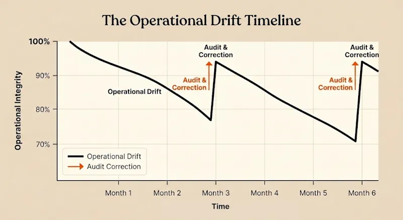
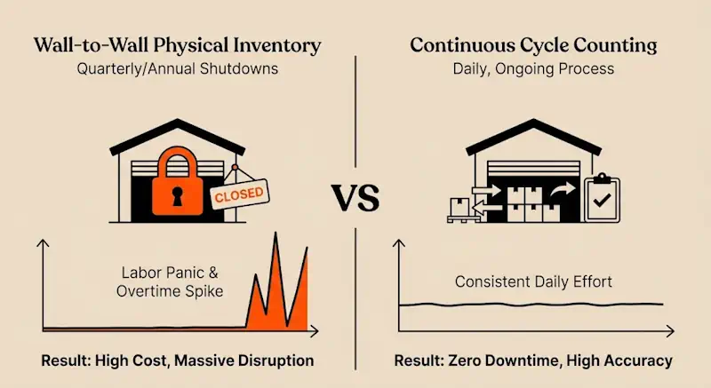
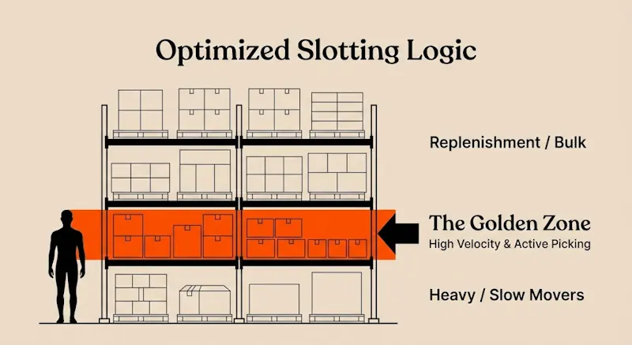
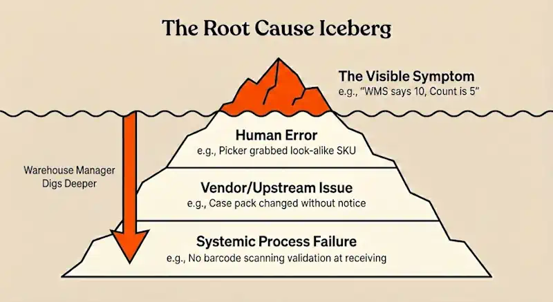
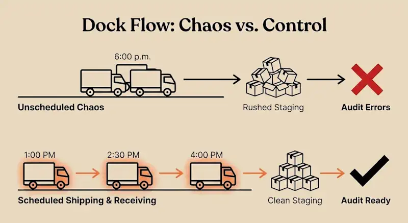

Operating a warehouse requires managing the constant tension between speed, safety, and accuracy. Over time, even the best-run facilities experience "operational drift." Inventory counts skew, safety protocols loosen, and theoretical workflows diverge from floor reality.

A structured warehouse audit is the most reliable way to fix this drift. Don't think of it as a box-ticking exercise. It's a critical diagnostic tool for validating inventory, being OSHA compliant, and finding bottlenecks.

This guide covers the essential components of a proper warehouse audit, so you can ensure your facility is compliant and profitable.

‍

## What is a Warehouse Audit?

A warehouse audit is a systematic review of your facility's physical state and operational processes compared to your established standards. It answers two fundamental questions:

1.  **Inventory Accuracy:** Does the physical stock match the data in your WMS (Warehouse Management System)?
2.  **Process Compliance:** Are safety, maintenance, and handling procedures being executed as designed?

While financial auditors focus on the value of the inventory, an operational audit focuses on the _integrity of the system_ that manages it.

‍

## The Business Case: Why Audits Matter

Beyond simple compliance, regular audits directly impact the P&L through three key levers:

### 1\. Reducing Shrinkage and Improving Fill Rates

Inventory discrepancies lead to stockouts, backorders, and "ghost inventory" (items the system thinks you have, but you don't). Regular auditing detects shrinkage (theft, damage, or administrative error) early.

*   **The Reality:** High inventory accuracy correlates directly with higher First-Pass Fill Rates and lower expedite costs.

### 2\. Risk Mitigation and Safety

Warehousing involves high-consequence risks. Neglected safety protocols do not just result in fines; they lead to downtime and injury.

*   **The Reality:** An audit validates that legal requirements like fire suppression access, rack load capacity labeling, and PPE usage are strictly followed, reducing liability and insurance premiums.

### 3\. Process Optimization

Processes evolve on the floor. An audit reveals the kinds of unauthorized shortcuts staff take to save time.

*   **The Reality:** Identifying these workarounds often highlights where your official process is broken or outdated, allowing you to re-engineer workflows for legitimate efficiency gains.

‍

## Frequency: Cycle Counting vs. Wall-to-Wall Audits

‍

The outdated standard of shutting down operations for a "Quarterly Physical Inventory" is costly and disruptive. Modern high-volume facilities typically adopt a hybrid approach:

### 1\. Cycle Counting (Continuous)

Instead of counting everything at once, count a small subset of inventory daily.

*   **ABC Analysis:** High-value/high-velocity items ("A" items) are counted frequently (e.g., monthly), while slower "C" items are counted quarterly or annually.
*   **Benefit:** Operations never stop, and inventory accuracy remains high year-round.

### 2\. The Operational Audit (Periodic)

While inventory requires continuous counting, _processes_ and _infrastructure_ should be audited on a set schedule (Monthly or Quarterly).

*   **Scope:** Rack integrity checks, safety walkthroughs, and workflow observations.
*   **Benefit:** Ensures physical assets and employee behaviors remain aligned with company standards.

‍

## The Practical Warehouse Audit Checklist

You can’t fix what you don’t look at. This checklist covers the four pillars of any solid warehouse operation: Inventory, Equipment, Layout, and Safety.

Don’t just sit in the office and tick these off. Grab a clipboard, get out on the floor, and look with your own eyes.

### 1\. Inventory Accuracy & Storage

Your WMS is only as good as the data you feed it. If the computer says an item is in Bin A-01, but the bin is empty, you’ve got a problem that’s going to cost you time and money later.

*   **Count vs. System:** Do physical counts in sample bins match the WMS records exactly? (Watch out for "ghost inventory." Stuff the system thinks you have but you don't).
*   **Bin Labeling:** Are location labels clean, scanned, and actually attached to the rack? No handwritten notes or peeling stickers.
*   **SKU Clarity:** Is the product clearly marked? Can a picker tell the difference between similar SKUs without guessing?
*   **Damage Control:** Is damaged stock segregated immediately? It shouldn't be sitting in pickable inventory collecting dust.
*   **Receiving & Staging:** Is the receiving dock clear? Freight shouldn't be sitting in the staging lane for more than a shift without being put away.

### 2\. Equipment & Machinery

Your crew relies on this iron to do their jobs. If a lift goes down, production stops. If a rack fails, people get hurt.

*   **Racking Integrity:** Walk your aisles. Are there dents in the uprights? Are the beams bowing? Are the anchor bolts tight to the concrete? **Rule of thumb:** If a rack leg is bent more than a quarter-inch, it needs an engineer’s look.
*   **Forklifts & MHE:** Check the daily inspection logs ("red books"). Are operators actually doing them, or just pencil-whipping the forms? Check tires, horns, and hydraulic lines yourself.
*   **Dock Doors & Levelers:** Do the plates drop smooth? Are the door tracks greased and free of debris? A stuck dock door is a bay you can’t use.
*   **Charging/Fueling Stations:** Are cables organized or lying on the floor to get run over? Are eye-wash stations right there and accessible, not blocked by pallets?

### 3\. Warehouse Layout & Flow

A warehouse is a living thing. Over time, pallets start creeping into walkways and high-volume items end up in the hardest-to-reach corners.

*   **Aisle Clearance:** Can two lifts pass each other? Are products jutting out into the travel path?
*   **Slotting Logic:** Are your "high-runners" (fastest moving items) stored in the "golden zone" (waist to shoulder height) to save your pickers’ backs and time?
*   **Dead Ends:** Have temporary pallets blocked off cross-aisles? Your pick path should be a loop, not a maze.
*   **Lighting:** Is it bright enough to read a label on the bottom shelf? Replace burnt-out bulbs immediately. Shadows hide mistakes and safety hazards.

### 4\. Safety & Compliance

This is non-negotiable. The goal of every shift is that everyone punches out with the same number of fingers and toes they punched in with.

*   **PPE:** Is everyone wearing their vests and steel toes? No exceptions for "just running in for a minute."
*   **Fire Safety:** Are extinguishers hung, charged, and tagged? Is the path to the fire exit clear? (Never park a pallet in front of a fire door, not even for five minutes).
*   **Chemicals (HazMat):** If you store chemicals, are the SDS (Safety Data Sheets) in a yellow binder where anyone can find them? Is there a spill kit nearby that’s actually stocked?
*   **Pedestrian Safety:** Are walk lanes clearly painted? Do your drivers honk at intersections?
*   **Load Limits:** Are rack load capacities posted on the end of every row? Don't guess how much weight a beam can hold.

## ‍

## Executing the Audit: Don’t Boil the Ocean

Planning an audit is one thing; getting it done without shutting down your whole operation is another. You don't need to check every nut and bolt in a single shift. Here’s how to run a smooth audit that actually yields good data.

### 1\. Prep the Floor First

Don’t start counting a messy warehouse. If you send auditors into a chaotic aisle, you’ll get chaotic data.

*   **Clear the staging lanes.** Get everything put away before the count starts.
*   **Isolate "Frozen" Inventory.** If you’re doing a wall-to-wall count, nothing moves in or out of the zone being counted. If a forklift moves a pallet while you’re counting it, your numbers are wrong before you even finish the row.

### 2\. Trust, But Verify (Blind Counts)

Don’t give your counters the "expected quantity" on their sheet. If the sheet says "Expected: 10," a tired employee will see 10 whether there are 10, 9, or 11.

*   **The Fix:** Use "Blind Counts." The system asks: "How many?" The user enters the number. If it matches the WMS, great. If not, the system flags it for a recount by a supervisor.

### 3\. Dig for the Root Cause

Finding an error is only half the job. If you find a variance, don’t just adjust the count and walk away. Ask _why_ it happened.

*   **Ask the question:** Did the receiver key it in wrong? Did a picker grab the wrong SKU because the labels look identical? Did the case pack change from 12 to 24?
*   **The Rule:** Adjusting inventory fixes the _symptom_. Fixing the process prevents the _disease_.

## How Technology Should Help

You hear a lot of buzzwords about "AI" and "Digital Transformation." Let’s be real, you just need tools that work. Here is the tech that actually matters for an audit.

### 1\. Barcode Scanners & WMS

If you are still auditing with pen and paper, you’re fighting with one hand tied behind your back. Handwriting is hard to read, and data entry takes forever.

*   **The Standard:** Use RF guns or tablets that feed directly into your WMS. You scan the location, scan the item, enter the count. Done. Real-time data means no data entry errors later in the office.

### 2\. Dock Scheduling Software

A lot of inventory errors start at the dock. If three trucks show up at once and your receivers are rushing, mistakes happen. Pallets get mixed up, counts get missed.

*   **The Fix:** **DataDocks** helps you smooth out the schedule. By booking appointment times, you ensure your receiving crew has the time to check every load properly. A calm dock is an accurate dock.

### 3\. Photographic Proof

Whether you use a digital device or a clipboard, your most valuable tool is the camera in your pocket.

*   **The Reality:** If you write "Rack Damaged" on a form, two weeks later nobody remembers if it was a scratch or a structural failure.
*   **The Fix:** Snap a photo of every issue you find. Visual proof ends the debate instantly and gives your maintenance team exactly what they need to prep for the repair.

## The Bottom Line

A warehouse audit isn’t about catching your crew doing something wrong. It’s about making sure the system supports the work they do.

If you treat the audit as a tool to help your team, by fixing broken racks, clearing cluttered aisles, and truing up inventory so they stop looking for ghost parts, they’ll get on board. But if you use it just to point fingers, you’re wasting your time.

Keep your eyes open, keep your process simple, and keep your people safe. That’s the job.

## ‍