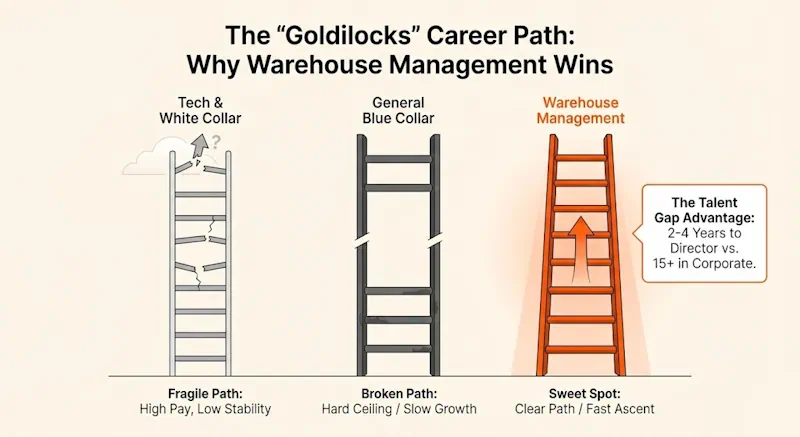
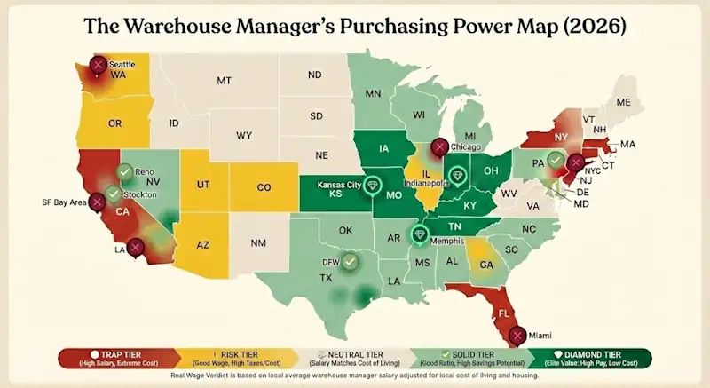
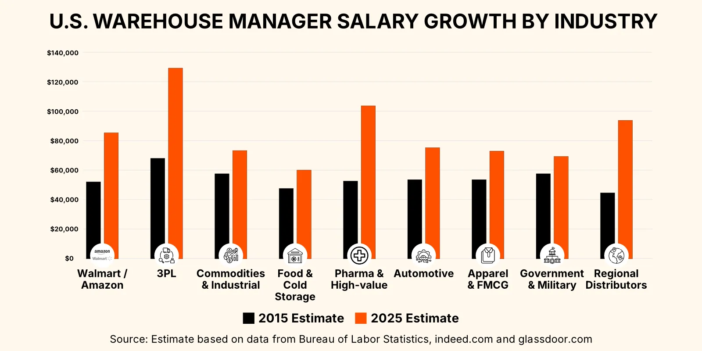
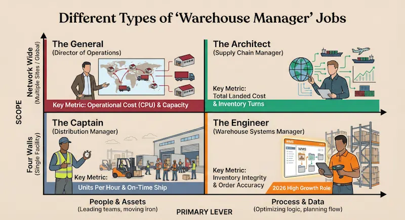
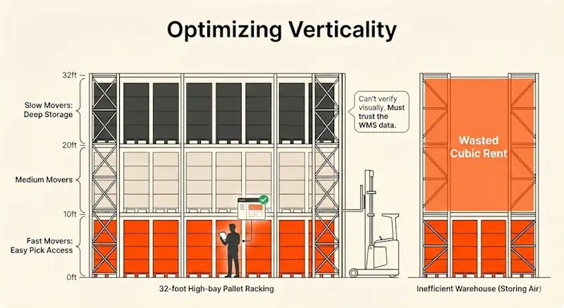
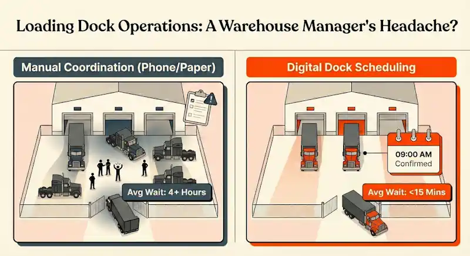

## **Despite AI, is Warehouse Management Still a Good Career in 2026?**

Let’s be direct: warehouse management is exposed to AI. Predictive algorithms are already better at forecasting stock than humans, and autonomous mobile robots (AMRs) are taking over the "walking" parts of the job. But this shift is gradual. We are in a transitional decade where the job is changing fast.

### **Is the "Blue-Collar Boom" Real?**

Headlines claim office jobs are dying while physical work remains safe, yet we also read about "lights-out" warehouses run by robots. The truth lies in the middle.

"Lights-out" facilities are still rare outside of Asia because they’re too expensive and rigid for 99% of businesses. Most supply chains in 2026 run on a mix of legacy software, specific automation tools, and human labor. The "boom" isn't for manual laborers; it is for managers who can orchestrate this chaotic symphony of machines and people.

Smart professionals are quitting tech to run warehouses, chasing a faster path to leadership. In the corporate world, reaching "Director" can take fifteen years. In logistics, the talent gap is so big that competent people are often given the keys to massive facilities in 2 or 3 years. Results are quick and measurable, allowing high performers to bypass politics and get promoted based on numbers.

### **Will AI Replace Warehouse Managers?**

AI excels at optimization, performing known tasks faster and cheaper than humans. But warehouse operations can break in unpredictable ways.

AI is fragile. It cannot de-escalate a conflict when a shift handover goes wrong, improvise when a supplier delivers unlabelled stock, or negotiate rates with carriers.

Managers who position themselves as strategic architects can expect strong job stability. Regardless of economic recessions, populations always need food, medicine, and goods moving through the supply chain.

### **Job Stability and Outlook for 2026**

The surge in open jobs isn't just "growth"; it’s a change in strategy. For twenty years, companies tried to save money by holding close to zero inventory ("Just-in-Time"). When supply chains broke in the early 2020s, businesses realized that running out of stock costs more than storing it.

Now, companies are hoarding inventory locally in mega-warehouses ("Just-in-Case") or expanding their footprint with smaller facilities closer to customers.

This means more square footage, more buildings, and more managers.

But don't mistake "job security" for "easy work." Logistics doesn't stop for a recession. Your paycheck is safer than a tech worker's, but the work is relentless. The high vacancy rate is partly because managers wash out.

### **The Pros and Cons of a Warehouse Career**

Warehouse careers offer tangible satisfaction. Unlike digital professions where work vanishes into the cloud, you see physical results daily: pallets moved, trucks loaded, chaos organized.

For many, the draw is executive pay without corporate politics. Results are binary: the truck left on time, or it didn't. You don't need a suit or endless meetings to prove your value. If you clear the dock and keep the team safe, you are a hero.

However, the "24/7" nature of logistics is the primary drawback. Managers are often on call for emergencies at 2 AM. The environment can be harsh. Sweltering in summer, freezing in winter, and loud. The pressure peaks during Q4, where work-life balance often disappears.

You must also survive the "Middle Manager Squeeze." You are the shock absorber between the execs (cutting costs) and the floor staff (demanding better pay).

## **How Much Do Warehouse Managers Make?**

### **Average Warehouse Manager Salary in the US**

The median salary for a warehouse manager in the US is approximately $61,000, based on aggregated data from Indeed, Glassdoor, and Payscale.

This figure can be misleading. Managers of large, complex facilities in high-demand regions often command upwards of $90,000. Meanwhile, positions that are primarily inventory management with light supervisory duties, often open to candidates with only a high school diploma, may pay as little as $44,000.

### **Highest Paying States and Industries**

Unlike many jobs, warehouse salaries do not always go up closer to urban centers. Instead, they follow logistics hubs.

Salaries are disproportionately high in states like Nevada, Kentucky, Indiana, and Iowa due to the density of distribution centers and competition for talent. Conversely, managers in Utah, Minnesota, and Alaska are comparatively underpaid.

Industry matters. Earnings are higher in life sciences and pharmaceutical warehouses due to the complexity of cold-chain and compliance requirements.

### **Salary Growth: From Entry-Level to Director**

Experience and education drive pay. Over a decade, a professional might see their salary rise from $49,000 to $68,000. Education creates a ceiling effect: managers with high school diplomas average $55,000, while those with a Master's degree average $92,000.

However, a degree alone is rarely enough. The highest earners typically combine advanced education with significant floor experience.

### **How much can you make owning a warehouse business?**

Ownership offers a different financial trajectory. But there is also a distinction between owning industrial real estate and running a 3PL (Third-Party Logistics) operation with leased assets.

Owning the building itself puts you in the landlord seat. It is a stable, lower-stress existence, but the barrier to entry is massive. Most logistics pros can’t afford to buy the warehouse on day one; they lease the shell and focus on running the business inside.

Operating a 3PL is a high-volume, thin-margin game. Successful boutique 3PL owners can clear $200,000+ annually, but this requires capital for racking, WMS licenses, and labor. A growing trend in 2026 is "Micro-Warehousing," leasing underutilized space to run hyper-local nodes. While earning potential is uncapped, the risk is total: one lost contract can bankrupt the operation.

## **How to Become a Warehouse Manager**

### **Essential Technical Skills and Competencies**

Modern management requires tech literacy. You must be an "Excel Power User" to analyze flow and throughput. Additionally, familiarity with Warehouse Management Systems (WMS) and regulatory compliance (OSHA) is non-negotiable.

### **Degrees v.s. Diplomas v.s. Free Certification Courses**

A bachelor's degree in supply chain management helps, but few companies demand it. A certificate you can study for at your own pace often suffices. The Lean Six Sigma Certification is the industry standard, though institutions like ASCM offer strong alternatives.

If on a budget, you can "audit" supply chain courses on platforms like Coursera or edX. Universities like MIT publish excellent curriculums for free. While you won't get the official certificate, you gain the technical vocabulary, like "EOQ" (Economic Order Quantity) or "Six Sigma DMAIC," that helps you ace the interview.

### **The Value of Hands-On Experience**

Direct exposure is critical. Working as an inventory clerk or material handler is valuable, but 1-2 years of direct supervision (even outside logistics) is the gold standard. It demonstrates the leadership skills necessary to manage a floor.

### **Getting Promoted v.s. Applying Directly**

There are three main routes:

1.  **Internal Promotion:** The most common path. You know the product and culture. It requires patience, but many top managers started as pickers.
2.  **External Management Experience:** Retail or production managers often transition well. If you can manage people and chaos, you can manage a dock.
3.  **Lateral Supply Chain Moves:** Logistics coordinators or analysts bring data skills and supplier insights that provide a solid groundwork for management.

## **Warehouse Management Structure and Career Paths**

### **Warehouse Supervisor vs. Warehouse Manager: What’s the Difference?**

The distinction is tactical vs. strategic. A **Supervisor** focuses on the floor-level mechanics of running a smooth shift. A **Manager** focuses on the **management of warehouse processes,** facilitating cross-departmental collaboration to optimize workflows.

The Manager transitions from personal intervention to **resource management,** defining success by developing talent and setting clear, time-bound objectives rather than putting out daily fires.

### **Organizational Structure and the Management of Warehouse Personnel**

In the warehouse, respect often overrides rank. A new supervisor might technically be in charge, but the veteran operator with ten years of tenure is often the one the team actually listens to. A smart manager needs to be able to navigate this dynamic. You also need to manage the gap between shifts. Unless you enforce a structured handover where supervisors walk the floor together, teams tend to isolate themselves and leave a mess for the incoming crew to clean up.

Beyond the daily grind, your role is to protect your people from bad corporate decisions. Headquarters often views support roles like loading dock coordinators as "non-productive" costs to be cut, but you know these are the people who keep the building running. You have to fight to keep them. At the same time, you must build a ladder for your best people. If they don't see a path from stacking boxes to becoming a trainer or a lead, they will leave, and you will be stuck permanently managing a team of rookies.

### **The Career Ladder: From Manager to Director of Operations**

The leap to **Director of Operations** involves moving from "four walls" responsibility to "network" responsibility. Directors oversee multiple facilities, shifting focus to commercial strategy. They negotiate contracts with carriers, decide where to open new nodes, and set the long-term vision for the supply chain's footprint.

## **The Scope of the Role: Daily Operations**

What happens in the warehouse impacts the bottom line. Efficient operations ensure product availability and cost control, enabling more resilient business practices.

### **Differentiating "Distribution" vs. "Supply Chain" Environments**

The job title “warehouse manager” is notoriously broad. In a small business, you might inhabit the entire spectrum of logistics: negotiating carrier rates in the morning, troubleshooting the WMS at lunch, and driving a forklift in the afternoon.

In larger organizations, however, these functions usually split into distinct career paths.

When evaluating a position, look past the title. Determine if the role asks you to manage **physical assets** (people and pallets) or **process logic** (data and flow), and whether your scope is a single site or the wider network.

### **Balancing Strategic Goals with Daily Firefighting**

Managers must refine processes to reduce waste while adapting to future needs.

You must master **Workflow Coordination,** orchestrating the receipt, storage, and dispatch of goods to align with demand forecasts. 

Second, you need rigorous **Budget Management,** looking for opportunities to improve profitability. That sometimes means cutting costs, and other times means spending now to unlock long-term efficiency.

### **Optimizing the Floor: Management of Warehouse Space and Resources**

After labor, the physical facility is usually the largest line item on the P&L. Smart managers understand they are managing **cubic volume,** not just square footage.

"Storing air" is a cardinal sin. If your building has 32-foot clear heights but you only use floor positions, you are wasting money. Getting product up high extends the life of a facility, but this requires precise inventory control. You must have a system you can trust, because quick visual checks are impossible at 30 feet.

## **What Makes a Good Warehouse Manager?**

### **Streamlining Workflow: Management of Warehouse Activities and Processes**

Great managers adapt to their environment rather than seeking one "perfect" system. They understand trade-offs:

*   **Wave vs. Zone Picking:** Wave picking maximizes scheduling for tight departure windows; Zone picking minimizes walking distance.
*   **SOP vs. KPI:** SOPs reduce risk; KPIs encourage innovation. Know when to enforce the rulebook and when to reward the outcome.
*   **Rotation vs. Specialization:** Rotation prevents burnout; specialization drives efficiency.
*   **Just-in-Time vs. Just-in-Case:** JIT saves money; safety stock saves the business during disruptions.
*   **Dedicated vs. Flexible Docks:** Dedicated docks reduce error; flexible docks handle peak season surges.

### **Leadership Style: Assessing Your "Soft Skills"**

While metrics drive the business, your ability to manage people drives the metrics.

This starts with **Performance Management:** monitoring staff, providing coaching to improve efficiency, and addressing hazards immediately to prevent accidents. Equally important is **Stakeholder Collaboration:** the ability to negotiate terms and share goals with suppliers, transportation providers, and internal commercial teams to ensure the operation isn't isolated from the broader business.

## **Future-Proofing: The Rise of the "Warehouse Systems Manager"**

### **Why "WMS Experience" is Non-Negotiable in 2026**

Paper-based warehouse management is dead. In a modern facility, the WMS dictates every move. If you cannot navigate it, you cannot lead.

When a scanner freezes at 5 AM, you cannot wait four hours for corporate IT. You need the skills to unjam a printer or reset a handheld to keep the dock running. Furthermore, you cannot manage what you cannot measure. You don't count boxes by walking aisles anymore; you track them via software. If you cannot pull those reports yourself, you are leading blind.

### **Specializing as a Warehouse Systems Manager**

This emerging role is a hybrid between Operations and IT. A **Warehouse Systems Manager** owns the configuration of the software. They know how to map XML data, configure picking logic, and troubleshoot API integrations. Because they bridge the gap between "packing a box" and "coding the logic," they often command a **15-20% salary premium** and high job security.

### **Bridging the Gap Between Operations and Tech**

The most valuable skill is bridging the physical reality of the yard (trucks, drivers) with the digital reality of the company (ERP, WMS). IT rarely understands the dock, and floor teams rarely have the time to deal with complicated software. You must connect them.

For a manager proving their value, implementing **Dock Scheduling** software is a perfect "quick win." It brings order to the most unpredictable part of the building (shipping and receiving) without a risky WMS overhaul. By forcing carriers to book digital appointments, you modernize operations without stalling the business.

