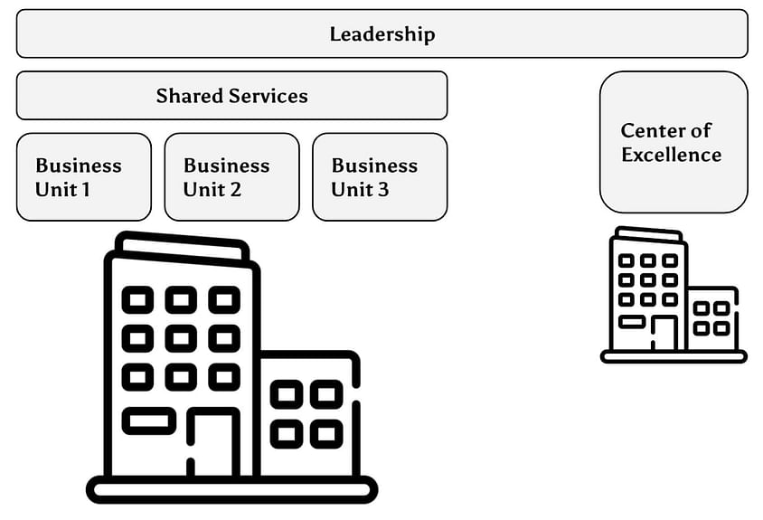
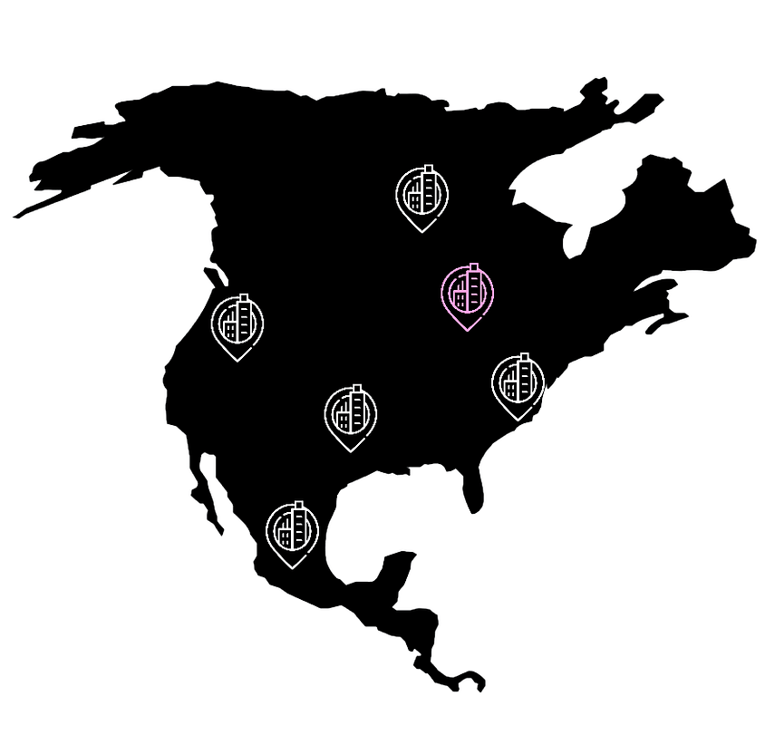
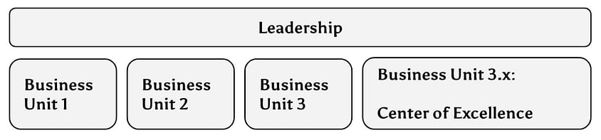
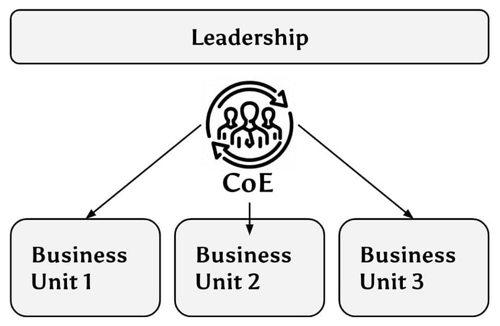
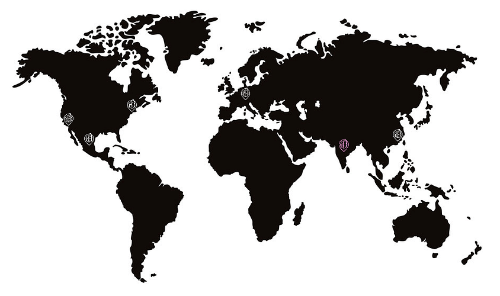
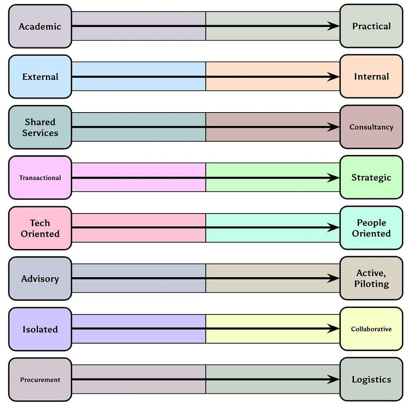
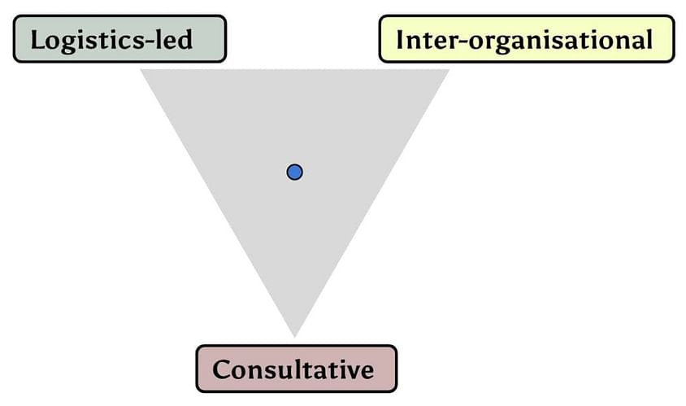
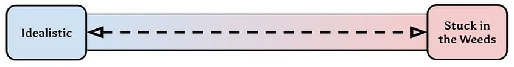
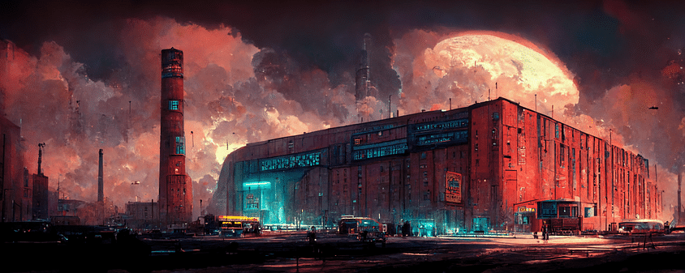
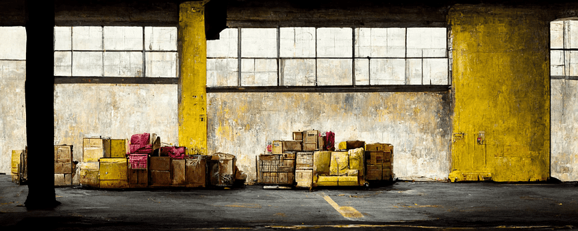

## Where did ‘Centers of Excellence’ come from originally?

*   The expression has been used informally since the 19th century. But in the 1960s the U.S. government was concerned that a small number of universities were being awarded almost all of the research contracts from the Department of Defense, resulting in many of the country’s best scientists flocking to a few coastal cities.
*   To remedy this, Project Themis sought to establish centers of excellence at colleges throughout the country. These would bring together interdisciplinary teams of researchers to do highly specialized work that could be of value to the D.O.D.
*   The concept has evolved since then. It’s still used extensively in academia, healthcare, and by the military, but is now increasingly common in business. The modern business practice has inherited the idea of cross-functional teams.

## What’s the Purpose of a CoE in Business?

Today, the meaning of the term varies significantly between organizations. A CoE can be:

*   A ‘company within a company’ - with its own marketing, operations and technology teams, running on a different reporting structure to preserve its independence and agility.

*   A particular physical site notable for its outstanding performance, where managers or other staff can be sent for short periods to learn best practice, or vice-versa, with CoE staff visiting other locations to act as coaches.

*   A duplicate of an existing line of business, but with ordinary performance metrics replaced with experimental goals in order to pilot new ways of working.

*   A temporary or permanent change team, reinforced with high-performing experts or managers, tasked with measuring performance, driving continuous improvement, or defining best practice for the entire company.

*   A business unit in a new market, often a developing region, positioned to help local customers or suppliers expand their capabilities and harmonize business practices. Regional CoEs like this pair naturally with today’s push toward [nearshoring logistics](/posts/nearshoring-logistics), where shorter lanes make feedback loops even faster.

What all of these models have in common is that they are intended to promote innovation and improvement while minimizing interruption to ordinary business operations.

‍

## Timeline of Supply Chain Centers of Excellence

*   2003: MIT launches its [Global SCALE Network](https://scale.mit.edu/), partnering with academic institutions around the world to conduct deep research on international supply chains.
*   2006: [Lenovo establishes a CoE in Asia](https://news.lenovo.com/pressroom/press-releases/lenovo-launches-center-of-excellence-names-david-schmoock-to-lead-initiative/), a cross-functional team working on supply/demand forecasting, pricing, sales and product mix strategies, inventory management, and performance measurement. Other computer hardware companies quickly follow suit.
*   2008: [Pfizer reconfigures its supply chain](https://www.pharmtech.com/view/manufacturing-insights-pfizer) to outsource more manufacturing, and establishes a center of excellence in Singapore to manage the transition.
*   2009: Then-editorial director of Supply Chain Brain Jean V. Murphy [coins the term ‘Supply Chain Center of Excellence’](https://www.supplychainbrain.com/articles/6369-supply-chain-centers-of-excellence-drive-better-business-results), tracing the phenomenon to Procter & Gamble’s “horizontal process networks” and Dow Chemical’s specialized teams of material handling experts.
*   2010: KRAFT creates a ‘[supply chain SWAT team](https://www.supplychainquarterly.com/articles/316-does-your-company-need-a-supply-chain-swat-team)’ with the goal of freeing up capital by reducing inventory. Each business unit is allowed to maintain management of its own supply chains, but has access to the advice of this internal consultancy.
*   2012: [Gartner begins championing Supply Chain Centers of Excellence](https://www.rankingthebrands.com/PDF/The%20Gartner%20Supply%20Chain%20Top%2025%202012,%20Gartner.pdf) - highlighting Johnson & Johnson in its Supply Chain Top 25 for the year. The emphasis is still on procurement and supplier management rather than logistics.
*   2013: A survey by Lora Cecere finds that [37% of manufacturers have a supply chain CoE](https://www.kinaxis.com/en/resources/content/c/supply-chain-insight-1?x=g02oad), but half of those are disconnected from business realities and fail to deliver real value.
*   2015: “Supply Chain Center of Excellence” has now become synonymous with a [logistics data analytics consultancy](https://assets.kpmg/content/dam/kpmg/pdf/2015/06/Case-study-From-Supply-Chain-Insights-to-Value.pdf), internal or external. This model is championed by software companies like IBM and professional services firms including KPMG.
*   2017: Food manufacturer Lamb Weston Meijer reveals that its Supply Chain CoE team [considers possible global marketplace changes over the next 8 years in order to spot potential threats and opportunities](https://www.supplychainmovement.com/inside-outside-perspective/).
*   2021: Gartner says that “[most supply chain CoEs are focused on IT systems design and technology enablement](https://www.gartner.com/en/newsroom/press-releases/2021-10-26-gartner-says-chief-supply-chain-officers-must-balance-investments-in-nascent-evolving-and-mature-capabilities),” advocating that they should instead specialize in change management or talent development.

## A Maturity Model for Supply Chain CoEs

From their origins in education, supply chain CoEs have evolved significantly. We can identify eight features that have changed as CoEs have been tasked with delivering more business value:

In short, the general trend over the last 20 years has been for supply chain CoEs to become:

*   Led by experienced practitioners rather than researchers, and evaluated on business results.
*   Recruited from inside the organization and less dependent on external consultants.
*   More clearly distinct from shared services pools, sometimes leaving business units in charge of execution while the CoE focuses on analysis.
*   Oriented toward long-term strategic risks and opportunities rather than immediate cost savings or efficiency gains.
*   Specialized in change management and stakeholder engagement rather than systems architecture.
*   Willing to be hands-on in piloting new ways of working, running experimental business units or facilities to test out new processes or technologies.
*   Enabled to cooperate with customers and suppliers, understand their systems and processes, and work towards harmonization of best practice.
*   Conscious of logistics as a complex system and a source of competitive advantage in its own right rather than an aspect of procurement or fulfillment.

However, progress towards a theoretical highly-mature supply chain CoE is not necessarily linear. These eight features are not independent of each other:

For example:

*   A CoE specialized in logistics but engaging directly with suppliers or customers probably becomes the centralized ‘supply chain owner’ for the organization.
*   If individual business units do maintain control of their supply chains, but the CoE is external-facing, there’s little room for complex logistics planning.
*   An internal analytics consultancy may be able to discover valuable insights, but might struggle to harmonize the data with external partners.

Furthermore, evaluating the performance of a supply chain CoE must strike a balance between short-term and long-term business value:

Businesses must make a call about how _urgent_ supply chain transformation is for them. An organization that can afford to maintain a highly experimental, visionary supply chain center of excellence may acquire a profound competitive advantage in a matter of years.

## Towards Localized Centers of Excellence

As supply chain management has become a more pressing concern for many companies, it has become standard to retain a chief supply chain officer.

An unfortunate side-effect of this executive purview of logistics is that many centers of excellence have been transformed into centralized teams. Some of the experimental potential and flexibility of CoEs has been lost.

The earlier understanding of a CoE as a ‘company within a company’ or a particular facility is now vanishingly rare. When it does exist it tends to be focussed on automation technology, or occasionally tactical IIoT applications, not supply chain visibility, talent or management practice.

A CoE team can be much more effective when it’s on-site. This can be a manufacturing facility or even a warehouse, as it quickly becomes apparent what data is missing and what kind of technology will help the people working in the facility. The team’s stay can be long-term, or it can lead a change project, measure the results and then move on to a new location.

Working like this does not prevent the CoE from seeing the big picture and analyzing the entire supply chain network. On the contrary, it can observe firsthand the transfer of materials between the company and its suppliers, customers or carriers. If cross-organizational cooperation is the key to supply chain visibility, this bottom-up approach is an overlooked way to strengthen those relationships.

## How DataDocks Enables Facility-Based CoEs

When change teams focus their attention on loading dock operations - often a bottleneck and a source of unpredictable demurrage costs as well as staff turnover - the challenge they face is getting external carriers and suppliers on board. For a deeper dive into the tactical side of that conversation, see our guide on [how to negotiate with carriers](/posts/negotiate-with-carriers).

Shipping and receiving processes cannot produce useful data or undergo continuous improvement without effective dock scheduling. But throughout North America, drivers often have no choice but to arrive at facilities whenever they can. Loading dock staff face intense crunches in workload first thing in the morning and again in the evening, especially on Mondays and Fridays. In theory this is difficult to change.

DataDocks remedies this by [giving carriers access to a bookings portal](https://datadocks.com/datadocks-features/carrier-portal), while internal coordinators can drag and drop appointments around the calendar, between individual dock doors or the yard outside. Any change to the schedule automatically triggers notifications to the relevant parties. It then tracks real timings against the plan, improving the team’s ability to anticipate the flow of loads throughout the day.

That tighter cadence shows up on the scoreboard as better [OTIF performance](/posts/otif-supply-chain) across inbound and outbound lanes.

This radically changes the way logistics coordinators communicate with partners. By putting real data in the center of the conversation, it makes quick turnarounds a collaborative effort. The coordinator becomes empowered to say “when your trucks arrive on time, they get worked and are out the door within an hour.”

From that localized starting point, the benefits soon percolate through transportation and warehouse management. The facility itself becomes a center of excellence, where best practices can be tested and established, before being implemented throughout the organization.**‍**

‍