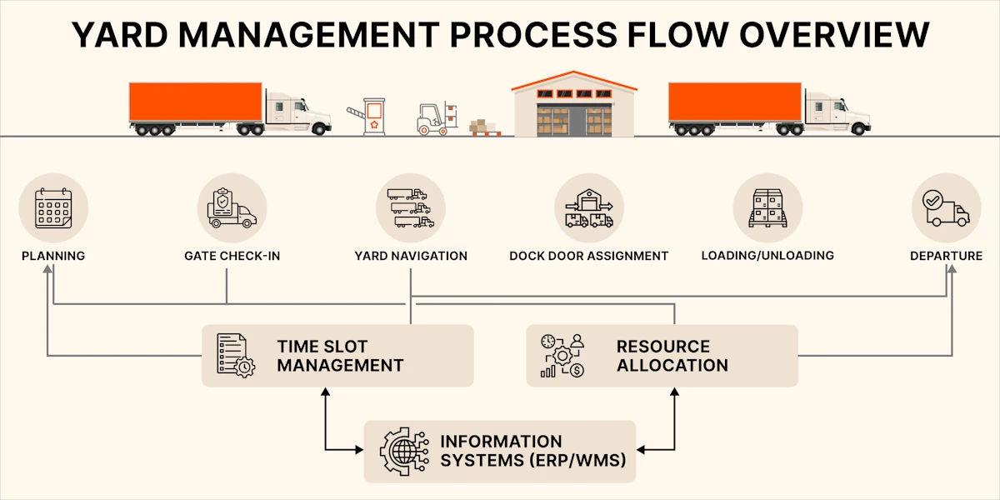

‍

Managing a warehouse yard is ultimately about **controlling the flow of trucks, trailers, and people** so that inbound and outbound shipments move on schedule. When the yard isn’t running smoothly, detention fees increase, docks sit idle, and warehouse throughput slows down. A clear **yard management process flow** ensures drivers know where to go, teams know what to do next, and every trailer is visible and accounted for in real time.

In this guide, we break down the [yard management](https://datadocks.com/datadocks-features/yard-management) process step-by-step, explain who is responsible for each part of the workflow, and share practical tactics to prevent congestion, delays, and miscommunication.

| Step | What Happens | Who Owns It | Key Tools / Systems |
| --- | --- | --- | --- |
| **1\. Pre-Arrival Scheduling** | Carriers request or receive assigned time slots | Dispatch / Appointment Scheduling Team | Dock Scheduling System (like DataDocks) |
| **2\. Gate Check-In** | Driver identity + trailer details verified, load status captured | Gate Security / Yard Admin | RFID / License Plate Scan / Tablet Check-In |
| **3\. Trailer & Yard Assignment** | Driver or spotter directed to specific drop zone or dock | Yard Manager / Yard Jockey | Yard Map + Real-Time Location Tracking |
| **4\. Dock Coordination** | Warehouse team unloads/loads based on priority & schedule | Warehouse Supervisor | WMS + Dock Scheduling Interface |
| **5\. Yard Moves** | Spotters reposition trailers to reduce congestion | Yard Jockey Team | Radio / Mobile App / GPS Tags |
| **6\. Gate Check-Out** | Documentation verified + driver released | Gate Security | RFID / e-POD / Departure Tracking |
| **7\. Post-Shift Review** | Dwell time, wait time & bottlenecks analyzed | Ops / Logistics Lead | Weekly KPI Dashboard |

## What Is Warehouse Yard Management? 

Yard management is simply making effective use of the space outside of your facility.

When your facility is a warehouse that probably means we’re looking at a mix of:

*   Maximum throughput (trucks in and out fast)
*   Resource optimization (not tying up people or equipment dealing with yard problems)
*   Safety and security (no one in the yard who shouldn’t be)
*   Visibility (always being able to identify what’s in the yard and where exactly)

But the actual methods of yard management depend on whether your facility is a distribution center, transit hub, maintenance depot, processing plant, or something else entirely.

It also varies a lot according to the size of the yard.

Facilities used to get by with manually tracking yard operations. Even doing it with an Excel spreadsheet probably still beats the “yard management” module in your WMS or ERP system. But, shipping and receiving are getting more complex, and yard operations demand more attention. **You need a proper system.  
  
‍**

## **Common Yard Management Challenges (and Why They Happen)**

The first step to better yard management in logistics is problem awareness, especially since yard management is more complicated with today’s logistics demands. 

Here are the seven most significant challenges you’re likely facing.

### 1\. Lack of Real-Time Visibility and Tracking 

You’ve got a yard full of trailers, some loaded, some empty, some just dropped. And things are moving fast. 

Without real-time visibility, you’re probably guessing where tomorrow’s shipment is parked or if an empty container still uses a prime spot. 

Now, you have to spend 20 minutes hunting down the trailer because your last update was a scribble from two hours ago. 

That’s time wasted. Spread that across a busy day, and you’re looking at lost hours (plus frustrated carriers who might not return). 

Worse, if a high-priority load gets buried, you’re explaining delays to a customer who doesn’t want to hear it. 

### 2\. Manual and Inefficient Processes 

Maybe you’re still using clipboards at the gate or an Excel spreadsheet that’s a mess by noon. It worked when you had five trucks a day, but not with today’s volume.

Checking in a truck by hand takes 10 minutes or more. Multiply that by 20 trucks, and you’ve spent over three hours just on gate duty. With manual processes, errors can creep in easily too - wrong trailer numbers, missed ETAs, and suddenly, you’re double-checking everything. Your team’s stretched thin, and drivers are fuming in line. 

A [Supply Chain 24/7 survey](https://www.supplychain247.com/article/top_challenges_in_yard_management_and_how_to_solve_them) found that 41% of managers say manual processes are their top pain point, and you’ve probably felt it too. 

Those extra labor costs, detention fees, and unhappy customers pile up when shipments lag. It’s a slow bleed that’s tough to stop without a better system.

### 3\. Congestion and Unpredictable Traffic 

If your layout’s a mess (tight lanes, no clear drop zones), you’ll have trucks blocking each other, waiting 30 minutes just to park. As a result, your peak times are never organized. 

For example, e-commerce has carriers showing up whenever they want, so your yard is always overloaded. One minute it’s quiet, the next you’ve got 15 trucks competing for space.

Detention fees add up because a truck stuck for an extra hour can cost $50-$100. Stack that up throughout a week, and your budget suffers.

### 4\. Staff Shortages and Inexperience 

You’re lucky if you have a fully experienced yard crew these days.

With fewer staff, a 5-minute gate check per truck can turn into 15 minutes. 

And the new hires? They’re still learning while you’re paying them more to keep up with demand. 

As a result, you resort to overtime, pushing labor costs up 20-30% on bad weeks. 

### 5\. Communication and Coordination Issues 

Without solid communication, every handoff is a gamble.

Let’s say a carrier drops a trailer but doesn’t tell you. The warehouse staff doesn’t know about it, so it sits for hours. Or, perhaps your yard crew sends a truck to Door 3, but the warehouse crew’s preparing Door 5. That’s 30 minutes wasted, a missed deadline, and a frustrated carrier.

The worst part is that you’re in the middle as the yard manager. You’re juggling carriers, your yard team, and the warehouse. 

Poor communication can have a horrible domino effect and waste hours of precious time and money. 

### 6\. Security and Safety Risks 

Your yard is a target for theft and a hazard if security is not tight. A loaded stolen trailer could cost $50,000 or more. 

Safety is also a big consideration. Poor signage or cluttered lanes can mean a jockey clips a corner, injuring someone or damaging gear. One accident, and you’re down a worker and facing a fine.

[OSHA penalties](https://www.osha.gov/penalties) are around $15,000 per violation. So, accumulated theft and safety issues can shut you down.

### 7\. Rising Costs (e.g., Detention Fees) 

Every unpredictable traffic, slow gate checks, lost trailers, keeps trucks past their free window, and carriers charge you for it.

A truck waiting an extra two hours? That’s $100-$200 per incident. If it’s five trucks a day, you’re out $500-$1,000 before lunch. Add in fuel costs from jockeys circling a packed yard or overtime for staff fixing mix-ups, and your margins shrink fast. 

Without a system, you could lose $5,000-$10,000 a week on detention alone.

These challenges drag your yard’s efficiency down and your warehouse’s bottom line. But becoming aware of it is the first step to solving it.

‍

## The 7 Main Components of Yard Management (And How to Optimize Each)  

Now that the challenges are clear, the next step is building the system.

‍

There are 7 main components of great yard management. Here’s how to optimize each.

### 1\. Pre-Arrival Planning

The core component of avoiding yard problems is having a good strategy before trucks arrive. 

‍

That’s why we recommend using an online appointment system like DataDocks or something similar. With this software, carriers can book specific 30-minute slots ahead of time, and everything will be much more organized.

‍

Once the slots are booked, here are some strategies you can include in your pre-arrival planning:

‍

*   Start by coordinating with carriers to get exact arrival times and have clear expectations.
*   Immediately reserve a dock space for the carrier. 
*   Ensure you organize a team that is ready to handle the loads. 
*   Call or text carriers 24 hours ahead to confirm their slot and avoid no-shows.
*   Track trucks with GPS apps to confirm ETAs within a 15-minute window.
*   Review your schedule every Monday, shift slots if last week showed a bottleneck at a particular time.

### 2\. Gate Check-in & Security

Verifying every truck that enters your yard ensures only authorized vehicles get past the gate and keeps your inventory secure.

‍

However, you can’t do this for too long as it will result in congestion. Ideally, you have to verify every truck in under 5 minutes or verify 10 trucks per hour during peak times.

‍

Verifying usually takes too long because some companies still use paper logs that take 10 minutes per truck to fill out and verify. Or, they only have one guard when 15 trucks roll in at peak hours.

‍

To avoid these problems, reduce the manual work and use these strategies:

‍

*   Install Radio Frequency Identification (RFID) readers or license plate cameras. Scans take 30 seconds, not 5 minutes.
*   Train guards to check IDs and documents in under 2 minutes and practice during slow shifts.
*   Use software to monitor the gate queue. Add more staff when waiting times hit 10 minutes.
*   Schedule two guards for peak hours, like between 7-9 a.m. and 3-5 p.m.

### 3\. Trailer & Asset Tracking

You wouldn’t want your staff scrambling for 20 minutes just because they couldn’t find the container they’re looking for.

‍

The solution is to have eyes on every trailer and container. 

‍

You need to know if they’re loaded, empty, or waiting. Ideally, you want to find any trailer in under 5 minutes and move it with 95% accuracy so you don’t waste trips. 

‍

To make it work, here’s what we recommend:

‍

*   Put GPS trackers or RFID tags on every trailer that pinpoint them within 10 feet.
*   Check tags every Friday and replace any that are dead or missing.
*   Train jockeys to update trailer moves in the system. It takes 10 seconds on a tablet.
*   Test your tracking system monthly to make sure it’s not dropping signals.

### 4\. Dock & Warehouse Coordination

There are situations where yard crews don’t communicate the truck’s status.

‍

As a result, some forklifts sit idle.

‍

If you want to maximize efficiency, you want everyone to coordinate and make full use of the tools. For example, if you have 10 dock doors, keep all 10 dock doors busy, not just the same 4.

‍

Make sure that information like that is communicated and that your teams coordinate with these things.

‍

Here are some streamlining tips:

‍

*   Use dock scheduling software to assign a dock based on size and time.
*   Set up a group chat or radio link where, for example, when the yard staff says ‘Truck at Door 2’, the warehouse staff grabs a forklift immediately.
*   Check dock use weekly, if Door 9’s always empty, shift some loads there.
*   Flag urgent shipments in the system. Door 1 opens up for that rush order first.

### 5\. Yard Movement & Organization

Yard movement and organization is about directing the traffic.

‍

For example, guiding a driver to drop at Spot C-8 or shifting a container from Row D to Dock 6 while keeping the yard unclogged. 

‍

If you don’t have a proper plan for yard movement, you’ll experience situations like two trucks meeting and having a 15-minute standoff. Or if there are no proper signs in your yard, drivers might circle for 10 minutes looking for a specific row.

Here’s how to keep it tight:

‍

*   Map your yard. Create 12-foot lanes and separate drop zones for empties and loads.
*   Put up signs. Big ones saying “Docks 1-5 Left” or “Parking C Right.”
*   Use software to assign spots, Spot B-3 for that inbound flatbed, no guesswork.
*   Walk the yard monthly and fix tight spots or add markings where drivers get lost.

### 6\. Gate Check-Out & Departures

 Imagine a driver leaving and forgetting a form, and you realize it late. Now you’ll have to chase them for 15 minutes and waste precious time.

That's why you must check the trucks’ paperwork and get a signed proof of delivery and get them out the gate fast.

‍

For example, you can do “gate check-in and security” in under 5 minutes.

To do that, here are some strategies you can use:

‍

*   Use RFID or barcode scanners. This checks documents in 20 seconds at the gate.
*   Prep paperwork early and have it signed and ready when the truck’s loaded.
*   Train gate staff on spotting a missing Proof of Delivery (POD) and fixing it fast.
*   Track departures live, add a guard if the line’s over 5 trucks long.

### 7\. Post-Departure Analysis & Reporting

Look at your yard’s stats after trucks leave, how long they waited, how fast docks turned over, and what went wrong so you can fix it for next time.

‍

*   Use software to log stats: wait times, dock use, all auto-tracked.
*   Pull a report every Monday. See if gate delays spiked at 3 p.m.
*   Dig into it. Do you see situations of 15-minute waits? Add a guard or tweak slots.
*   Update your plan and shift staff or slots based on what the data reveals to you.

Get these seven components locked down, and you’ll shave hours off your day, dodge detention fees, and keep your team from pulling their hair out. 

‍

‍

## When to Use Dedicated Yard Management Software

There are a lot of products calling themselves Yard Management Systems, but they’re each designed to solve a different set of problems for different types of facilities.

‍

**Large Fleet Owners:**

‍

*   Under pressure from environmental regulations and the fluctuating cost of fuel
*   Want to do more proactive maintenance on their vehicles.
*   A YMS lets them keep track of the location and status of all their equipment. It can transform their yard from a parking lot into a maintenance hub. 

‍

**Very Large Yards (e.g. Container Freight Stations):**

‍

*   Operations are more varied than ever, with consolidation, palletization, LTL, and containers all handled in the same place.
*   What’s in the yard and where is constantly changing, so they need to keep track of that.
*   This type of YMS specializes in sending movement instructions to workers, and might use GPS or RFID technology to automatically update the position of assets.

‍

**Ports and Terminals:**

‍

*   Always been complex, has always needed advanced systems.
*   Increased demands of customs and security have made the job even harder.
*   Cutting-edge software for ports usually includes 3D visualizations of containers and their positions.

‍

‍

**Warehouses Dealing With External Carriers:**

‍

*   Facing a higher volume of traffic, arriving at unpredictable times. A shortage of staff. Detention fees are adding up.
*   They need visibility of drop trailers, trucks waiting to be unloaded, etc.
*   YMS goes hand-in-hand with dock scheduling, giving them accountability from carriers and faster turnaround times.

‍

**Sensitive Industries (e.g., aerospace, pharma) and Industrial Parks:**

‍

*   The gate to the property can be a logistics bottleneck.
*   Need to balance security with speed.
*   The YMS provides features that allow security teams to expedite check-ins, like vehicle identification etc.

‍

**Construction and Primary Sector Sites:**

‍

*   The risk of both injury to personnel and material loss is high.
*   Need to avoid vehicle-related accidents, while also tracking a complex inventory where some materials are only countable by weight or volume, not by unit.
*   YMS might handle specialized inventory or on-site asset tracking.

‍

## Combining Solutions for Maximum Yard Efficiency

If you have very complex yard management needs, you might want to integrate multiple types of software, or design a bespoke yard operations dashboard.

There are a few ways you can go about this:

‍

*   Work with vendors like DataDocks, which provide an [API](https://datadocks.com/posts/edi-vs-api) and will be happy to help you integrate their software with other providers.
*   Contract specialized custom solution providers to develop a solution.
*   Build a product internally with your own IT team.
*   A combination of the above.

‍

Why not give the DataDocks team a call? We’ll be more than happy to help you figure out what kind of software you need to get your yard under control, even if it’s not dock scheduling. You can reach us at (+1) 647 848-8250 or [book a demo](https://calendly.com/nick-rakovsky/datadocks-demo?month=2022-09).

##   
**Frequently Asked Questions**

### **What is a yard management process flow?**

A yard management process flow defines the sequence of steps that trucks and trailers follow when moving through your facility. It starts with pre-arrival scheduling and continues through gate check-in, trailer staging, dock loading or unloading, yard moves, and final gate departure. A clear process flow helps reduce confusion, prevent congestion, and ensure that every trailer is accounted for. Without it, delays stack up, detention fees rise, and warehouse throughput drops. A structured yard process gives each team clarity on roles and timing, helping keep the yard predictable and running smoothly.

### **How do you reduce congestion in a warehouse yard?**

Congestion usually happens when too many trucks arrive at once or when trailer locations aren’t tracked accurately. Reducing congestion starts with controlling arrivals using scheduled appointment windows. Clear signage, dedicated zones for loaded and empty trailers, and real-time trailer visibility also help. When drivers know exactly where to go and spotters know where every trailer is, the yard stays fluid instead of jammed. The key is eliminating guesswork at every step.

### **What KPIs matter most for yard management?**

The most useful yard management KPIs measure speed, utilization, and predictability. Common examples include gate check-in time, trailer dwell time, dock door utilization, and the number of yard moves per shift. Tracking on-time carrier departures is also critical because it reflects both yard flow and warehouse coordination. These metrics highlight where operational friction occurs, whether during check-in, staging, or loading. When measured consistently, they reveal whether your yard is getting faster and more predictable, or slowing down and costing more to operate.

### **Do you need YMS software if you already use a WMS or TMS?**

Most facilities do. A WMS controls what happens inside the warehouse, and a TMS manages routing and transportation across networks. Yard operations sit between those systems, where trucks wait, move, and stage. Without a YMS, communication gaps form, leading to lost trailers, long wait times, and detention fees. A YMS provides real-time visibility into trailer status and helps coordinate dock schedules, so trucks turn faster and docks stay active. It connects what’s happening outside to decisions made inside.

### **How can warehouse and yard teams improve communication?**

Communication improves when every team sees the same real-time status for each trailer and dock door. Shared scheduling, shared load priorities, and shared timestamps are key. Replacing radio call-ins and handwritten logs with a centralized yard dashboard keeps jockeys, warehouse leads, gate staff, and carriers aligned. When handoffs are visible instead of verbal, delays drop and accountability increases.

### **What causes detention fees and how can they be prevented?**

Detention fees occur when trucks wait too long to be loaded or unloaded. The root causes are usually unpredictable arrivals, slow gate processing, unclear dock priorities, or difficulty locating trailers. Preventing detention comes down to controlling arrival times, reducing gate check-in delays, and ensuring trailers are easy to find and move. When the yard runs predictably, drivers get in and out on time — and detention fees disappear.

‍