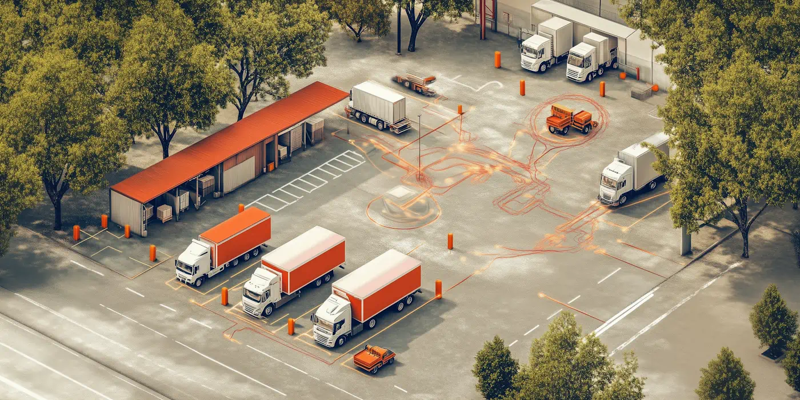

Yard visibility failures can get expensive fast. Earlier this year, a warehouse manager discovered a container that had gone unnoticed for 12 days—racking up $6,000 in detention fees. At another facility, a trailer of premium electronics was shipped to the wrong distribution center, a $380,000 mistake that took weeks to unwind.

Industry surveys show that the average facility experiences 3-4 significant yard management errors per month, with each mistake potentially costing thousands of dollars depending on the cargo involved. 

During peak season, the impact of these errors goes up. One missing trailer could halt a production line or empty a store's shelves. And when coordinators can't see real-time dock status, they have to guess at availability, leading to situations where three trailers are scheduled for two doors, while other doors sit empty. 

We’ve seen that on average, poor visibility leads to 2.3 unnecessary trailer moves per day. A single unnecessary trailer move costs $67 in labor and equipment. More importantly, it creates a delay that cascades through your schedule, affecting driver wait times, warehouse labor utilization, and load throughput.

It gets worse if you’re in the food industry. FDA compliance requires showing a complete chain of custody. Manual yard logs almost always leave gaps that create audit risks, whereas digital records provide automated, timestamped documentation of every trailer movement.

What to do about this? Almost everyone will tell you to switch to some kind of digital system. But what does that look like in practice? Do you need RFID? Or is it a case of just making better use of the software you already have in place?

## **Do High Tech Solutions Live Up to the Hype?**

The promise of IoT sensors and other advanced tech is impressive. But you have to be honest about your current level of digital maturity. Based on an informal survey of our own network, 73% of warehouses still rely on paper, whiteboards or spreadsheets for at least one core process.

Jumping straight from that state to advanced tech often creates more problems than it solves. We've seen facilities invest hundreds of thousands in RFID systems, only to abandon them six months later because their basic processes weren't ready.

Before considering high-tech solutions, ask yourself: Can your team consistently record basic arrival and departure times? Do you have standard procedures for trailer placement? Can different shifts reliably hand off yard status information? If these fundamentals aren't solid, adding complex technology might just increase the chaos.

## **The 3 Easiest Actions Any Facility Can Do Right Now**

### **1\. Color-coded zones and a magnet board map**

The simplest solution is sometimes the most effective. By dividing your yard into color-coded zones (e.g. red for palletized loads, blue for unpalletized, and a dedicated yellow lane for loads without an appointment) and maintaining a magnetic board with trailer icons, you get immediate visual clarity. 

This low-tech approach has a hidden benefit: it gets your team thinking spatially about the yard. When Frank from shipping can glance at the board and say 'the Johnson Freight trailer is in Blue-7,' you've already won half the visibility battle.

One of our clients implemented this change and ran with it for a month before going live with our software, and reported back to us that they felt prepared on day 1 thanks to already thinking in color-coded terms.

### **2\. Assign a dedicated 'yard traffic controller' for every shift**

By designating one person per shift as the yard controller, you create a single source of truth. This person becomes responsible for maintaining the magnet board, coordinating moves, and managing dock assignments. It's not a new hire - it's giving explicit responsibility to someone who's probably already doing parts of this job informally.

We did a back-of-a-napkin analysis of how different facilities were doing just before they went live with us, and found that those with a dedicated controller spent 72% fewer labor hours ‘searching for the right trailer.’ The key is empowerment - this person needs the authority to say 'no' to random trailer moves and maintain yard discipline.

It takes our clients anywhere from two weeks to three months to start seeing results with our system. Those that have a designated ‘champion’ get there much quicker on average.****

### **3\. Implement DataDocks**

DataDocks provides the digital backbone to scale these improvements. Think of it as digitizing your magnet board - but now everyone can see it on their phone or computer, updates happen in real-time, and you get actionable data about your yard operations.

You can get started with the basics right away, and adopt more advanced features as you get used to the system.

We have a reputation for being pretty hands-on with support and training. It’s quite typical for us to jump in 3 or 4 months down the line to help our clients take their [yard management](https://datadocks.com/datadocks-features/yard-management) one step further, or even roll out custom functionality. Some of our most popular features today started out as ‘special requests!’

## **Data Collection is the First Step on the Path to Yard Asset Management**

Bigger facilities generally want to go further with yard visibility. The goal is true ‘yard asset management’ - tracking not just loads, but resources like equipment and labor. The more you progress along this path, the more benefit you get from consolidating information in one place.

The question of [whether you would benefit from a drop trailer program](/posts/drop-trailer-vs-live-unload) is also much easier to answer when you have clear data.

Here’s what a fully-streamlined setup looks like:

### **The check-in process is largely automated**

Instead of guards juggling paperwork they simply verify the driver's digital appointment and tap a button. Our customers report average check-in times dropping from 12 minutes to less than 2 minutes, while capturing more accurate information than their old paper processes ever did.

It seems like a small improvement, but if your guard shack is a bottleneck it pays to optimize it, not to mention preventing traffic from backing up onto public roads during peak hours.

Our system automatically flags issues like missing paperwork or early/late arrivals, letting your team proactively manage exceptions rather than discovering problems after the fact. One 3PL client who implemented this process eliminated 90% of their documentation errors in the first month.

### **Drivers get their orientation in advance**

Every minute a confused driver spends circling your yard costs time and money. DataDocks sends drivers customized instructions and safety protocols before they arrive. This simple step eliminates an average of 8 minutes of orientation time per driver at our customer sites, while significantly reducing the risk of accidents.

### **The team can see yard and dock status at a glance**

The status of every dock, the location of every trailer, dwell times, and scheduled moves - all visible on a single screen. When one distributor had been using our system for a couple of months, they discovered they had 40% more usable capacity than they thought, simply because they could now optimize the space.

Historical yard data reveals patterns you'd never spot otherwise. One facility discovered they were consistently understaffed on Fridays due to a surge in vendor deliveries – a pattern that was invisible in their paper logs.

### **You can easily see where delays or congestion are happening**

DataDocks alerts you to bottlenecks you never knew existed. One facility discovered that 70% of their detention charges were happening on Thursdays due to a scheduling pattern they couldn't see in their manual systems. By adjusting their scheduling rules, they saved $1,300 per month in detention fees.

### **A digital 'yard map' updates in real time**

No more calls asking 'Where's that Target trailer?' When a yard jockey moves a trailer, everyone sees the update instantly - from the guard shack to the warehouse office to the shipping supervisor's phone. This real-time synchronization eliminates the 'tribal knowledge' problem where critical information lives in someone’s head.

### **In-software chat is more effective than phone calls**

The average coordinator spends 3.5 hours per day on the phone resolving confusion. DataDocks' integrated chat frees them to focus on more valuable tasks,  while creating a searchable record of all decisions and updates. Quick questions get quick answers, and everyone stays in the loop automatically.

## **The Road to Advanced Trailer Tracking**

Once you've mastered digital yard management fundamentals through DataDocks, your facility will be ready to evaluate more advanced technologies:

### **GPS**

For large yards, GPS tracking can provide an extra layer of certainty. But you need solid data-driven processes first. Facilities that implement GPS after establishing basic digital workflows report 3x better ROI than those trying to implement everything at once.

### **RFID**

RFID gates and tags automate trailer identification and tracking, eliminating manual checks. Again, success depends on having trained staff and consistent processes already in place.

### **IIoT and Vision Systems**

Smart cameras and IoT sensors can automatically detect trailer positions and monitor yard conditions. These systems integrate smoothly with existing digital workflows but can't fix broken processes.

### **Drones**

None of our current clients use automated drone surveillance - yet. But some experts think it might just be the future of yard management. 

The promise of this tech is comprehensive yard visibility and inventory tracking, building upon the digital yard maps and processes you've already established.

## **Why Start Now?**

When your most experienced yard jockey retires, they take 15 years of yard knowledge with them. Digital systems capture that expertise in standardized processes, ensuring consistent performance across all shifts and personnel.

Start with the three straightforward steps we've outlined: zone your yard, assign dedicated controllers, and implement DataDocks. Master these fundamentals, and you'll be ready for whatever technology comes next.

